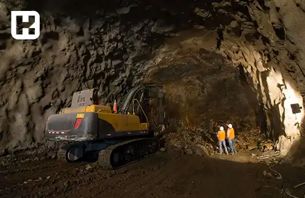

<blockquote class="faq-block">

  
آنچه در این مطلب خواهید خواند:

  <ul>
    <li>تعریف سختی کار</li>
    <li>لیست مشاغل سخت و زیان‌آور</li>
    <li>قوانین مربوط به مشاغل سخت</li>
    <ul>
     <li>ساعت کاری</li>
     <li>اضافه‌کاری</li>
     <li>حق بیمه برای کارگران</li>
     <li>مرخصی</li>
    </ul>
    <li>فرمول محاسبه سختی کار</li>
    <li>سؤالات متداول</li>
    <li>جمع‌بندی</li>
  </ul>

</blockquote> 

گاهی بعضی شغل‌ها فقط «کار» نیستند، بلکه آزمونی برای استقامت و ایمنی هستند. از کار در معادن گرفته تا جوشکاری در فضای بسته یا حضور کنار کوره‌های داغ، همه‌ی این مشاغل در دسته «سخت و زیان‌آور» قرار می‌گیرند.  
قانون برای این گروه از کارگران حمایت‌های ویژه‌ای در نظر گرفته است؛ از بازنشستگی زودتر گرفته تا مزایای بیمه‌ای خاص. در این مقاله به زبان ساده بررسی می‌کنیم که **سختی کار چیست، چه کسانی شامل آن می‌شوند و چطور محاسبه می‌شود.**

برای محاسبه دقیق حقوق و مزایای کارکنان در مشاغل سخت و زیان‌آور، می‌توانید از <a href="https://www.hooshkar.com/Software/Sayan/Module/Payroll" target="_blank">نرم افزار حقوق و دستمزد سایان</a> استفاده کنید که تمام این فرایندها را به‌صورت خودکار و مطابق قانون انجام می‌دهد.

## تعریف سختی کار

سختی کار به مشاغلی گفته می‌شود که شرایط کاری آن‌ها از حد استاندارد فراتر رفته و احتمال بروز آسیب‌های جسمی یا روانی در آن‌ها بیشتر است.  
این شرایط معمولاً شامل عوامل فیزیکی، شیمیایی، بیولوژیکی و محیطی خطرناک می‌شود. در چنین محیط‌هایی، کارکنان در معرض ریسک بالا قرار دارند و قانون برای جبران این خطرها مزایایی مانند **افزایش سابقه بیمه، ساعات کاری کمتر و بازنشستگی زودتر** در نظر گرفته است.

برخی مشاغل به‌طور ذاتی دشوار هستند، اما اگر کارفرما استانداردهای ایمنی و بهداشتی را رعایت کند، ممکن است دیگر «زیان‌آور» تلقی نشوند. تشخیص نهایی در این زمینه بر عهده **کمیته تخصصی مشاغل سخت و زیان‌آور** است.

## لیست مشاغل سخت و زیان‌آور

**گروه الف:** مشاغلی که با اجرای اقدامات ایمنی و بهداشتی، سختی آن‌ها قابل کاهش یا حذف است.  
**گروه ب:** مشاغلی که حتی با رعایت کامل اصول ایمنی، همچنان زیان‌آور باقی می‌مانند.

برخی از رایج‌ترین نمونه‌ها عبارت‌اند از:

- فعالیت در معادن
- کار در مخازن بسته (مانند جوشکاری)
- کار در نزدیکی کوره‌های ذوب فلزات
- فعالیت در ارتفاعات یا روی دکل‌های برق
- کار با مواد رادیواکتیو
- کار در محیط‌های دارای آلودگی اسیدی یا شیمیایی (مانند آبکاری یا رنگ خودروسازی)
- آتش‌نشانی
- مشاغل بیمارستانی مانند هوشبری یا اورژانس
- فعالیت در محیط‌های پرتنش مانند زندان‌ها یا مراکز روان‌درمانی
- خبرنگاری میدانی
- کار در محیط‌های با آلودگی صوتی بالا

تشخیص اینکه یک شغل سخت و زیان‌آور است یا خیر، بر اساس درخواست کارگر و بررسی کارشناسان اداره کار در کمیته‌های بدوی و تجدیدنظر انجام می‌شود.

### قوانین مربوط به مشاغل سخت

قانون کار و تأمین اجتماعی برای کارکنان مشاغل سخت، امتیازات ویژه‌ای قائل است.  
مطابق **ماده 76 قانون تأمین اجتماعی**، افرادی که در این مشاغل حداقل 20 سال سابقه کار متوالی یا 25 سال غیرمتوالی دارند، می‌توانند بدون شرط سنی بازنشسته شوند.

همچنین چنانچه فرد پیش از این مدت، به دلیل فشارهای شغلی دچار آسیب جسمی یا روانی شود، می‌تواند با تأیید کمیسیون پزشکی، از مزایای بازنشستگی زودتر بهره‌مند شود.

#### 1. مقررات ساعت کاری
ساعات کار در مشاغل سخت نباید از **6 ساعت در روز** و **36 ساعت در هفته** بیشتر باشد.  
افزایش ساعات کاری در این مشاغل خلاف قانون است و به عنوان تخلف کارفرما محسوب می‌شود.

#### 2. مقررات اضافه‌کاری
بر اساس **ماده 61 قانون کار**، اضافه‌کاری در مشاغل سخت و زیان‌آور به‌طور کامل **ممنوع** است.  
هدف از این قانون، پیشگیری از فشار بیش از حد بر کارگر و حفظ سلامت جسمی و روانی اوست.

#### 3. مقررات حق بیمه برای کارگران
در این مشاغل، هر **یک سال سابقه کار، معادل یک و نیم سال سابقه بیمه‌ای** محاسبه می‌شود.  
به عنوان مثال، اگر کارگری ۱۰ سال در محیطی سخت کار کند، سوابق بیمه‌ای او ۱۵ سال در نظر گرفته می‌شود.

#### 4. مقررات مرخصی
مطابق **ماده 65 قانون کار**، کارکنان مشاغل سخت و زیان‌آور در هر سال، از **پنج هفته مرخصی استحقاقی** برخوردار هستند که معمولاً در دو دوره شش‌ماهه استفاده می‌شود.

برای آشنایی بیشتر با جزئیات مرخصی در مشاغل مختلف، پیشنهاد می‌شود مطلب <a href="https://www.hooshkar.com/Wiki/Payroll/TypesOfLeaves" target="_blank">جدول مرخصی کارگران و انواع آن</a> را مطالعه کنید.

---

### سختی کار چگونه محاسبه می‌شود؟ 

محاسبه سختی کار بر اساس میزان حق بیمه و سوابق کاری در محیط‌های زیان‌آور انجام می‌شود.  
برای تعیین میزان مزایا، از فرمول زیر استفاده می‌شود:

### فرمول محاسبه سختی کار

 <blockquote style="padding:0.8rem; border-right:4px solid #7066f1;">
(۴٪ از مبلغ حق بیمه آخرین دستمزد مشمول حق بیمه × تعداد ماه‌ها)  
+  
(۴٪ از مستمری محاسبه شده × مدت سابقه در مشاغل سخت و زیان‌آور تا تاریخ ۱۴/۰۷/۱۳۸۰)
</blockquote> 

---

### سوالات متداول

<blockquote class="faq-block">
  

    
چه تفاوتی بین شغل سخت و شغل زیان‌آور وجود دارد؟
 
    شغل سخت ممکن است صرفاً از نظر جسمی دشوار باشد، اما در شغل زیان‌آور فرد در معرض خطرات جانی یا بیماری‌های شغلی نیز قرار دارد. در نتیجه مزایای بیمه‌ای و حمایتی شغل زیان‌آور بیشتر است.
  

</blockquote>

<blockquote class="faq-block">
  

    
آیا همه کارگران معدن مشمول سختی کار هستند؟
 
    بله. فعالیت در معادن زیرزمینی به‌صورت پیش‌فرض در فهرست مشاغل سخت و زیان‌آور قرار دارد و نیازی به بررسی مجدد کمیته ندارد.
  

</blockquote>

<blockquote class="faq-block">
  

    
آیا بانوان هم می‌توانند بازنشستگی سختی کار دریافت کنند؟
 
    بله. قانون برای همه بیمه‌شدگان، فارغ از جنسیت، شرایط یکسانی در نظر گرفته است. بانوان شاغل در مشاغل سخت نیز می‌توانند با ۲۰ سال سابقه بازنشسته شوند.
  

</blockquote>

<blockquote class="faq-block">
  

    
اگر کارفرما شغل من را سخت محسوب نکند، چه کنم؟
 
    شما می‌توانید به اداره تعاون، کار و رفاه اجتماعی محل کار خود مراجعه کرده و درخواست بررسی شغل را به کمیته استانی ارائه دهید. پس از بازدید و بررسی کارشناسی، نتیجه نهایی اعلام می‌شود.
  

</blockquote>

---

### جمع‌بندی

سختی کار مفهومی حمایتی است که با هدف حفظ سلامت و جبران زحمات کارکنانی ایجاد شده که در محیط‌های پرخطر فعالیت دارند.  
شناخت دقیق قوانین، ساعت کاری، مرخصی، محاسبه بیمه و بازنشستگی در این مشاغل برای هر کارگر و کارفرما ضروری است.  
اگر در واحد منابع انسانی فعالیت می‌کنید، استفاده از ابزارهایی مانند **نرم‌افزار حقوق و دستمزد سایان** می‌تواند تمام این محاسبات را به شکل هوشمند و دقیق انجام دهد و از بروز خطاهای قانونی جلوگیری کند.