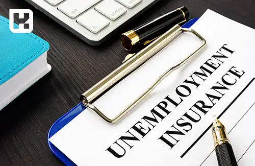
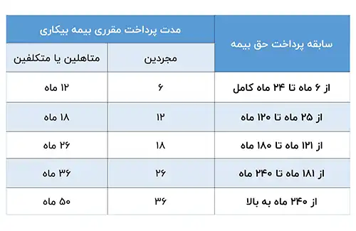

<blockquote class="faq-block">

  
آنچه در این مطلب خواهید خواند:

  <ul>
    <li>بیمه بیکاری چیست و چه کسانی مشمول آن هستند؟</li>
    <li>شرایط دریافت بیمه بیکاری در زمان جنگ و حوادث غیرمترقبه</li>
    <li>مراحل ثبت‌نام و دریافت بیمه بیکاری</li>
    <li>مهلت قانونی ثبت درخواست بیمه بیکاری</li>
    <li>مدارک لازم برای دریافت بیمه بیکاری</li>
    <li>مبلغ مستمری و نحوه محاسبه مقرری بیمه بیکاری</li>
    <li>مدت زمان دریافت بیمه بیکاری</li>
    <li>آیا دوره دریافت بیمه بیکاری جزو سابقه کار است؟</li>
    <li>موارد قطع مقرری بیمه بیکاری</li>
   <li>سؤالات متداول</li>
   <li>جمع‌بندی</li>
  </ul>

</blockquote> 

بیکاری یکی از نگرانی‌های مهم در زندگی شغلی افراد است که می‌تواند زندگی اقتصادی آن‌ها را تحت تأثیر قرار دهد. برای حمایت از نیروی کار در مواقعی که به‌صورت **غیرارادی بیکار می‌شوند**، **بیمه بیکاری** به‌عنوان یک ابزار حمایتی در قانون کار و تأمین اجتماعی در نظر گرفته شده است. این حمایت در شرایط خاصی مانند **جنگ، سیل، زلزله و حوادث غیرمترقبه** از اهمیت دوچندان برخوردار است.

در این مقاله، به‌صورت جامع به بررسی **شرایط دریافت بیمه بیکاری در زمان جنگ** و سایر بحران‌ها، نحوه ثبت درخواست، مدارک لازم، مبلغ پرداختی، مدت زمان دریافت و خواهیم پرداخت.

## بیمه بیکاری چیست و چه کسانی مشمول آن هستند؟

بر اساس قانون بیمه بیکاری مصوب ۱۳۶۹، این بیمه به افرادی تعلق می‌گیرد که بدون خواست و اراده خود شغلشان را از دست داده‌اند و دارای شرایط زیر هستند:

### شرایط کلی دریافت بیمه بیکاری:

* تحت پوشش **بیمه تأمین اجتماعی** باشند؛
* **بیکاری آن‌ها غیرارادی** تشخیص داده شود؛
* **حداقل ۶یکسال سابقه بیمه** قبل از بیکاری داشته باشند؛
* **بازنشسته، مستمری‌بگیر یا از کارافتاده کلی نباشند؛**
* **تابعیت ایران** داشته باشند.

## شرایط ویژه دریافت بیمه بیکاری در زمان جنگ، سیل و حوادث غیرمترقبه
 
> ماده ۶- بیمه شدگانی که به علت بروز حوادث قهریه و غیرمترقبه از قبیل سیل، زلزله، جنگ، آتش سوزی و … بیکار می شوند، در صورتی که سابقه پرداخت حق بیمه آنان کمتر از ۶ ماه باشد، مطابق با مشمولینی که دارای ۶ ماه سابقه پرداخت حق بیمه می باشند از مقرری بیمه بیکاری استفاده خواهند نمود.

**نکته مهم:** بر اساس بررسی حضوری و گفت‌وگو با مدیریت واحد بیمه بیکاری، مشخص شد که در شرایط عادی و غیرمترقبه تفاوتی وجود ندارد و کارگر قراردادی برای دریافت بیمه بیکاری باید حداقل یک سال سابقه بیمه از آخرین محل اشتغال خود داشته باشد.

### مراحل ثبت‌نام و دریافت بیمه بیکاری

#### ۱. ثبت اولیه در سامانه جامع روابط کار

متقاضی باید به [سامانه جامع روابط کار](https://prkar.mcls.gov.ir) مراجعه کرده و درخواست خود را ثبت کند.

#### ۲. مراجعه حضوری به اداره کار

جهت بررسی مدارک و احراز غیرارادی بودن بیکاری، حضور در اداره کار الزامی است.

#### ۳. بررسی و تأیید توسط کمیته تخصصی

کمیته‌ای متشکل از نمایندگان اداره کار، تأمین اجتماعی و تعاون، بیکاری را بررسی می‌کند.

#### ۴. ارسال پرونده به سازمان تأمین اجتماعی

پس از تأیید، پرداخت مستمری آغاز می‌شود.

### مهلت اقدام برای دریافت بیمه بیکاری

> ماده ۷- بیمه شده بیکار موظف است ظرف ۳۰ روز از تاریخ بیکاری فرم تقاضای استفاده از مقرری بیمه بیکاری را تکمیل و به واحد کار و امور اجتماعی محل ارائه نماید.
تبصره ۱- چنانچه بیمه شده بیکار در فاصله زمانی ۳۰ روز بعد از بیکاری امکان مراجعه و یا اعلام بیکاری به واحد کار و امور اجتماعی و ارائه یا ارسال تقاضای استفاده از مقرری بیمه بیکاری را پیدا نکند تا ۳ ماه از تاریخ وقوع بیکاری فرصت دارد مدارک خود را مبنی بر عذر موجه، همراه با تقاضای کتبی به واحد کار و امور اجتماعی محل به منظور طرح در هیات حل اختلاف ارائه نماید. در صورتی که هیات حل اختلاف استان مربوط عذر متقاضی را موجه تشخیص دهد مراتب را اعلام خواهد نمود.
تبصره ۲- بیمه شده بیکار از تاریخ ارائه تقاضای استفاده از مقرری بیمه بیکاری آمادگی خود را برای اشتغال بکار تخصصی و یا مشابه آن اعلام نموده است و موظف است در فاصله زمان های معینی که توسط واحد کار و امور اجتماعی تعیین می گردد در اداره کار و امور اجتماعی محل حضور یافته و دفاتر مربوط را امضا نماید.

### مدارک لازم برای دریافت بیمه بیکاری

* اصل و کپی شناسنامه و کارت ملی
* نامه پایان کار یا اظهارنامه کارفرما
* شماره بیمه
* قرارداد کار یا حکم استخدامی
* مدرک پایان خدمت برای آقایان
* عکس پرسنلی (برای تکمیل پرونده حضوری)

### مبلغ مستمری بیمه بیکاری چقدر است؟

**میزان مقرری:**

* ۵۵٪ از متوسط حقوق سه ماه آخر کار
* برای **سرپرستان خانوار**: به ازای هر نفر تحت تکفل **۱۰٪ اضافه** (تا سقف ۴ نفر)

پایه حقوق سال 1404 طبق مصوبه وزارت کار رو از <a href="https://www.hooshkar.com/Wiki/Payroll/Payroll1404" target="_blank">اینجا</a> ببینید.

**حداقل مبلغ قابل پرداخت:**
مقرری نباید **کمتر از حداقل دستمزد مصوب سالانه** باشد.

**مثال:** اگر حداقل حقوق در سال ۱۴۰۴ برابر ۱۰۳,۹۰۹,۶۸۰ میلیون ریال باشد، فرد بیکار حتی اگر ۵۵٪ حقوقش کمتر از این عدد باشد، حداقل همان ۱۰۳,۹۰۹,۶۸۰ میلیون ریال را دریافت می‌کند.

پرداخت حق بیمه بیکاری (۳٪) بر عهده کارفرماست، نه کارگر.

### مدت زمان دریافت بیمه بیکاری چقدر است؟

### آیا مدت بیمه بیکاری جزو سابقه کار محسوب می‌شود؟

بله. **تمام دوره‌ای که مستمری بیکاری دریافت می‌کنید، جزو سوابق بیمه‌ای شما ثبت می‌شود** و در محاسبه بازنشستگی، سنوات و از کارافتادگی لحاظ خواهد شد.

### موارد قطع بیمه بیکاری

پرداخت بیمه بیکاری در موارد زیر قطع می‌شود:

* اشتغال مجدد به کار
* خودداری از پذیرش شغل متناسب
* دریافت حقوق بازنشستگی یا از کارافتادگی کامل
* پایان دوره قانونی دریافت مستمری
* فوت بیمه‌شده

برای اطلاع از جزئیات کامل این مقررات، می‌تونید <a href="https://rc.majlis.ir/fa/law/show/112580" target="_blank">آیین‌نامه اجرایی قانون بیمه بیکاری</a> رو مطالعه کنید.

---

### سوالات متداول

<blockquote class="faq-block">
  

    
آیا در زمان جنگ هم بیمه بیکاری پرداخت می‌شود؟
 
    بله. اگر بیکاری ناشی از جنگ یا شرایط اضطراری باشد، مطابق 
    <a href="https://rc.majlis.ir/fa/law/show/112580" target="_blank">ماده ۶ آیین‌نامه اجرایی قانون بیمه بیکاری</a>، 
    مقرری بیمه بیکاری پرداخت می‌شود. حتی در صورت داشتن سابقه کمتر از شش ماه نیز مشمول دریافت مستمری خواهید بود.
  

</blockquote>

<blockquote class="faq-block">
  

    
اگر محل کارم بر اثر سیل یا زلزله از بین برود، آیا می‌توانم بیمه بیکاری بگیرم؟
 
    بله. در صورت تخریب یا تعطیلی کارگاه به دلیل حوادث غیرمترقبه (مثل سیل یا زلزله)، 
    کارگران بیمه‌شده می‌توانند پس از تأیید اداره کار و سازمان تأمین اجتماعی از مقرری بیمه بیکاری استفاده کنند.
  

</blockquote>

<blockquote class="faq-block">
  

    
برای ثبت درخواست بیمه بیکاری چه مدت فرصت دارم؟
 
    طبق 
    <a href="https://rc.majlis.ir/fa/law/show/112580" target="_blank">ماده ۷ آیین‌نامه اجرایی</a>، 
    بیمه‌شده باید حداکثر تا ۳۰ روز پس از تاریخ بیکاری، درخواست خود را به اداره کار ارائه دهد. 
    در صورت داشتن عذر موجه، این مهلت تا ۳ ماه نیز قابل تمدید است.
  

</blockquote>

<blockquote class="faq-block">
  

    
آیا مدت دریافت بیمه بیکاری جزو سابقه کار محسوب می‌شود؟
 
    بله. تمام دوره‌ای که مقرری بیمه بیکاری دریافت می‌کنید، 
    به‌عنوان سابقه پرداخت حق بیمه برای بازنشستگی، ازکارافتادگی و سنوات خدمت شما محسوب می‌شود.
  

</blockquote>

<blockquote class="faq-block">
  

    
اگر در زمان دریافت بیمه بیکاری به خدمت سربازی اعزام شوم، تکلیف مستمری چیست؟
 
    طبق ماده ۱۱ آیین‌نامه، در صورت اعزام به خدمت وظیفه عمومی، پرداخت مقرری بیمه بیکاری متوقف می‌شود. 
    اما پس از پایان خدمت و در صورت عدم اشتغال مجدد، با معرفی از سوی اداره کار می‌توانید ادامه مدت استحقاقی خود را دریافت کنید.
  

</blockquote>

<blockquote class="faq-block">
  

    
اگر در دوره دریافت بیمه بیکاری بازداشت یا زندانی شوم، آیا مقرری ادامه دارد؟
 
    خیر. بر اساس ماده ۱۲ آیین‌نامه، در صورت صدور حکم قطعی مجرمیت، پرداخت مقرری متوقف می‌شود. 
    اما پس از پایان دوره محکومیت، اگر همچنان بیکار باشید و با تأیید اداره کار اقدام کنید، 
    مابقی مدت مقرری قابل پرداخت خواهد بود.
  

</blockquote>

---

### جمع‌بندی

بیمه بیکاری، به‌ویژه در شرایط بحرانی مانند جنگ، یکی از مهم‌ترین ابزارهای حمایتی برای نیروی کار است. اگر بیکار شده‌اید یا واحد کاری‌تان به دلیل شرایط اضطراری تعطیل شده، حتماً در مهلت قانونی اقدام کنید.

**این حمایت قانونی، حق شماست.**