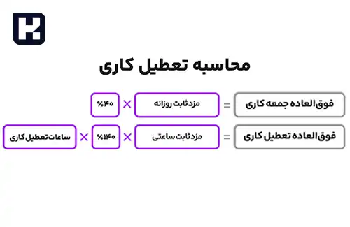

<blockquote style="background-color:#eeeefc; padding:0.5rem">

  
آنچه در این مطلب خواهید خواند:

  <ul>
   <li>تعطیل کاری چیست؟</li>
   <li>نحوه محاسبه تعطیل کاری</li>
   <li>تفاوت بین تعطیل کاری و اضافه کاری چیست؟</li>
  </ul>

</blockquote>

**مقدمه**

تعطیل کاری یکی از مفاهیم اساسی و مهم در حوزه حقوق کار برای کارگران و کارفرمایان است. این مفهوم به نوعی حقوق و مزایایی است که در روزهای تعطیل رسمی برای کارگران تعیین می‌شود. در این مقاله، قصد داریم به تحلیل مفهوم تعطیل کاری پرداخته و فرمول محاسبه آن را بررسی کنیم. 

همچنین، تفاوت بین تعطیل کاری، اضافه کاری و جمعه کاری را نیز بررسی خواهیم کرد. این بررسی به کارفرمایان و کارگران کمک می‌کند تا حقوق و وظایف خود را در قبال روزهای تعطیل بهتر درک کنند و از آن استفاده کنند. در ادامه، به طور دقیق به مفاهیم و روش‌های محاسبه تعطیل کاری و تفاوت آن با سایر مفاهیم می‌پردازیم.

<blockquote style="background-color:#f5f5f5; padding:0.5rem">

<strong>آشنایی با <a href="https://www.hooshkar.com/Software/Sayan/Module/Payroll" target="_blank">نرم افزار حقوق و دستمزد</a> سایان</strong>
</blockquote>

## تعطیل کاری چیست؟

کار در روزهای تعطیل نوعی اضافه کاری محسوب می‌شود که به آن تعطیل کاری می گویند. بنابراین، نرخ پرداختی برای ساعات کاری در روزهای تعطیل معادل نرخ اضافه‌کاری و 40 درصد بیشتر از دستمزد هر ساعت کار عادی است.

### نحوه محاسبه تعطیل کاری

برای محاسبه تعطیل کاری، ضریب تعطیل کاری به حقوق اضافه می‌شود. بنابراین، حقوق یک روز تعطیل کاری معمولاً ۴۰ درصد بیشتر از دستمزد روزهای دیگر است.

به عنوان نمونه، اگر دستمزد روزانه کارمند ۳۰۰ هزار تومان باشد، در یک روز تعطیل کاری حقوق او به ۴۴۰ هزار تومان ارتقا خواهد یافت.

### تفاوت بین تعطیل کاری و اضافه کاری چیست؟

طبق قانون کار، کارگران باید در روزهای تعطیل رسمی استراحت کنند و حقوق و دستمزد کامل خود را دریافت نمایند. اگر نیاز به کار در روز تعطیل باشد، کارگر موظف به انجام کار است که به آن تعطیل کاری می گویند. در اینصورت حقوق آن روز طبق فرمول بالا محاسبه می گردد.

درباره اضافه‌کاری باید به تعداد ساعات کار در هفته و ماه توجه شود. اگر کارگر در یک روز بیشتر از هشت ساعت کار کند، به این معنی نیست که اضافه‌کاری به او تعلق می گیرد. بلکه باید کارکرد کارگر در بازه ماهانه بررسی و محاسبه شود و در صورت وجود اضافه کاری طبق فرمول قانون کار محاسبه گردد.

<blockquote style="background-color:#f5f5f5; padding:0.5rem">

<strong>بیشتر بخوانید: <a href="https://www.hooshkar.com/Wiki/Payroll/PayrollFormula" target="_blank">فرمول اضافه کار
</a>
</strong></blockquote>