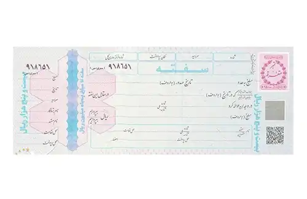

<blockquote class="faq-block">

  
آنچه در این مطلب خواهید خواند:

  <ul>
      <li>سفته چیست؟</li>
      <li>انواع سفته و کاربردهای متنوع آن‌ها</li>
      <li>قوانین مهم سفته</li>
      <li>چگونه سفته بخریم؟</li>
      <li>نحوه تنظیم سفته چگونه است؟</li>
      <li>حداکثر مبلغ سفته چقدر است؟</li>
      <li>تفاوت‌های اصلی چک و سفته</li>
      <li>نکات حقوقی و مسئولیت‌ها</li>
      <li>سؤالات متداول</li>
  </ul>

</blockquote> 

سفته یکی از اسناد مالی پرکاربرد در معاملات است که به‌طور مستقیم تعهد به پرداخت مبلغی مشخص را از سوی صادرکننده به ذی‌نفع نشان می‌دهد. این سند با کاربردهای متنوعی همچون تضمین پرداخت و اجرای تعهدات در زمینه‌های مختلف، از جمله وام، خرید کالا و استخدام، جایگاه ویژه‌ای در دنیای تجارت دارد.  

<blockquote class="faq-block">
برای مثال، تصور کنید شرکتی می‌خواهد کالایی را خریداری کند و نگران است که فروشنده وجه را دریافت نکند؛ در این شرایط، سفته می‌تواند به عنوان تضمین پرداخت عمل کند و امنیت معامله را افزایش دهد.
</blockquote> 

شناخت دقیق قوانین و اصول مربوط به تنظیم سفته می‌تواند از بروز مشکلات حقوقی جلوگیری کرده و به بهبود امنیت معاملات کمک کند. در ادامه، به بررسی جزئیات، قوانین مهم و تفاوت‌های سفته با سایر اسناد مالی مانند چک می‌پردازیم تا بتوانید با اطمینان از آن استفاده کنید.

## سفته چیست؟

سفته یک سند مالی است که در آن امضاکننده متعهد می‌شود مبلغ مشخص‌شده را در تاریخ معین یا به‌محض درخواست ذی‌نفع پرداخت کند. در این سند دو طرف اصلی وجود دارند: متعهد (امضاکننده سفته) و ذی‌نفع که دریافت‌کننده مبلغ است.

سَفته یا سُفته که گاهی به‌اشتباه به شکل‌های صفته، سفده یا صفتع نوشته می‌شود، در معاملات تجاری و بازرگانی کاربرد گسترده‌ای دارد. این سند به‌عنوان یک تعهد مالی عمل می‌کند و صادرکننده آن موظف است مبلغ درج‌شده را پرداخت کند. امروزه سفته بیشتر به‌عنوان ضمانت استفاده می‌شود و در معاملات، معمولاً چک جایگزین آن شده است.

---

### انواع سفته و کاربردهای متنوع آن‌ها

- **پرداخت کالا در معاملات**  
  مثال: شرکت الف کالایی به ارزش ۵۰ میلیون تومان از شرکت ب خریداری می‌کند و سفته‌ای به همان مبلغ صادر می‌کند.

- **تضمین اجرای تعهدات**  
  مثال: در قراردادهای پیمانکاری، پیمانکار سفته ارائه می‌دهد تا حسن انجام کار تضمین شود.

- **تضمین پرداخت اقساط وام**  
  مثال: بانک‌ها معمولاً از وام‌گیرندگان سفته دریافت می‌کنند تا در صورت عدم پرداخت، مبلغ سفته قابل وصول باشد.

- **استخدام و تضمین حسن انجام کار**  
  مثال: شرکت‌ها از کارمند جدید سفته دریافت می‌کنند تا تعهدات کاری به‌صورت کامل انجام شود.

---

### قوانین مهم سفته 

- **ذکر مشخصات گیرنده:** سفته باید در وجه شخص معین صادر شود و نه حامل، با درج مشخصات کامل گیرنده.  
- **ثبت تاریخ پرداخت:** تاریخ وصول سفته باید شامل روز، ماه و سال به حروف و عدد باشد.  
- **نوشتن مبلغ:** مبلغ پرداختی روی سفته به‌صورت دقیق و به حروف و عدد قید شود.  
- **امضا:** سفته باید با امضا یا مهر صادرکننده همراه باشد؛ در غیر این صورت ادعای طلب رد می‌شود.  
- **امضای ضامن:** اگر شخصی به‌عنوان ضامن پشت سفته را امضا کند، مسئولیت قانونی برابر با صادرکننده دارد.  
- **سفته در وجه حامل:** اگر سفته در وجه حامل صادر شود، باید عبارت «حامل» درج شود تا قابلیت انتقال داشته باشد.  

---

### چگونه سفته بخریم؟ 

برای دریافت سفته می‌توانید به شعب بانک ملی یا دکه‌های روزنامه‌فروشی مراجعه کنید، اما توصیه می‌شود تا حد امکان از شعب بانکی تهیه شود تا از خرید سفته تقلبی جلوگیری شود.

---

### نحوه تنظیم سفته

بخش‌های مهم سفته عبارتند از:

- محتویات  
- مبلغ  
- گیرنده  
- تاریخ صدور  
- تاریخ پرداخت  
- امضای صادرکننده  

عدم رعایت این موارد موجب از دست رفتن اعتبار سفته می‌شود.

---

### حداکثر مبلغ سفته چقدر است؟

سفته‌ها دارای سقف مشخصی هستند، مثلاً تا ۳۰۰.۰۰۰.۰۰۰ ریال. مبلغ درج‌شده باید معادل یا کمتر از این سقف باشد و به حروف نیز نوشته شود.

---

### تفاوت‌های اصلی چک و سفته

<blockquote class="faq-block">
<table>
<thead>
<tr>
<th>ویژگی</th>
<th>سفته</th>
<th>چک</th>
</tr>
</thead>
<tbody>
<tr>
<td>صدور</td>
<td>توسط شخص متعهد</td>
<td>از حساب بانکی صادر می‌شود</td>
</tr>
<tr>
<td>هدف</td>
<td>تضمین یا تعهد</td>
<td>پرداخت مستقیم پول</td>
</tr>
<tr>
<td>امکان انتقال</td>
<td>در وجه حامل ممکن است</td>
<td>بستگی به نوع چک دارد</td>
</tr>
<tr>
<td>مسئولیت ضامن</td>
<td>مسئولیت برابر با صادرکننده</td>
<td>معمولاً ندارد</td>
</tr>
<tr>
<td>جنبه قانونی</td>
<td>حقوقی</td>
<td>حقوقی و کیفری</td>
</tr>
</tbody>
</table>
</blockquote>

---

### نکات حقوقی و مسئولیت‌ها

- ضامن سفته مسئول پرداخت است.  
- صادرکننده موظف به رعایت دقیق تاریخ و مبلغ است.  
- برای جلوگیری از سوءاستفاده و مشکلات مالیاتی، مطالعه مقاله <a href="https://www.hooshkar.com/Wiki/Financial/WhatIsTaxEvasion">فرار مالیاتی</a> توصیه می‌شود.  

---

### سؤالات متداول

<blockquote class="faq-block">

آیا سفته بدون تاریخ معتبر است؟

خیر، تاریخ پرداخت یکی از عناصر اصلی اعتبار سفته است.

</blockquote>

<blockquote class="faq-block">

اگر ضامن سفته را امضا کند و صادرکننده پرداخت نکند، چه می‌شود؟

ضامن موظف به پرداخت همان مبلغ است و می‌تواند از صادرکننده مطالبه بازپرداخت نماید.

</blockquote>

<blockquote class="faq-block">

آیا امکان اصلاح سفته بعد از صدور وجود دارد؟

تنها در صورت توافق طرفین و با رعایت قوانین مربوط به تغییرات، امکان اصلاح وجود دارد.

</blockquote>

---

### جمع‌بندی

سفته سندی مالی است که برای تضمین پرداخت یا اجرای تعهدات مورد استفاده قرار می‌گیرد و رعایت دقیق قوانین صدور و تنظیم آن، اعتبار حقوقی و قانونی برای معاملات ایجاد می‌کند. ضامن سفته مسئول پرداخت است و بر اساس قانون، در صورت قصور، مسئولیت قانونی دارد. استفاده صحیح و آگاهانه از سفته می‌تواند ریسک معاملات را کاهش دهد و از بروز مشکلات حقوقی و مالیاتی جلوگیری کند. با رعایت مثال‌های عملی، دقت در نوشتن مبلغ، تاریخ و مشخصات طرفین و توجه به قوانین مربوطه، افراد و شرکت‌ها می‌توانند از سفته به‌عنوان یک ابزار امن و مطمئن در معاملات خود بهره‌مند شوند.