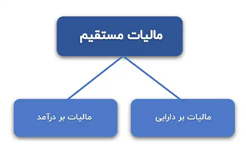
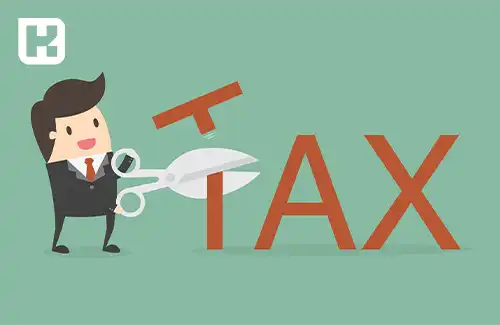

<blockquote class="faq-block">

   
آنچه در این مطلب خواهید خواند:

  <ul>
    <li>مالیات چیست؟</li>
    <li>انواع مالیات‌</li>
    <ul>
    <li>انواع مالیات مستقیم</li>
    <li>انواع مالیات غیر مستقیم</li>
    </ul>
    <li>پیامدهای عدم انجام تعهدات مالیاتی</li>
    <li>کدام کشورها بیشترین درآمد مالیاتی را دارند؟</li>
    <li>جمع بندی</li>
  </ul>

</blockquote> 

مالیات، به عنوان یکی از مهم‌ترین مسائل اقتصادی هر کشور، نقش بسیار حیاتی در تعیین سیاست‌ها و توسعه اجتماعی دارد.
در این مقاله، به توضیح مفهوم مالیات، انواع و پیامدهای عدم پرداخت آن می‌پردازیم.

برای مدیریت دقیق مالیات‌ها و محاسبه سریع مالیات، می‌توانید از <a href="https://www.hooshkar.com/Software/Sayan/Module/TpTaxGov" target="_blank">نرم‌افزار سامانه مودیان سایان</a> استفاده کنید.

## مالیات چیست؟

مالیات یک نوع هزینه اجتماعی است که افراد یا شرکت‌ها باید به دولت پرداخت کنند، به طوری که دولت از این پول برای هزینه‌های عمومی استفاده می‌کند. در هر کشور، مالیات یکی از مهم‌ترین مباحث اقتصادی است و قوانین دقیقی برای آن وجود دارد. 

به عنوان مثال، قانون اساسی کشورها به موضوع مالیات اشاره و مقرراتی را برای مالیات‌های مختلف تعیین می‌کند. در واقع قوانین مالیاتی مشخص می‌کنند که چه کسانی باید اظهارنامه مالیاتی خود را ارسال نمایند و هر فرد یا شرکت چه مقدار مالیات باید پرداخت کند.

## انواع مالیات‌

1.	مالیات مستقیم 
2.	مالیات غیر مستقیم 

اگر مودی مالیاتی و پرداخت کننده مالیات یک شخص باشد، آن مالیات به عنوان **مالیات مستقیم** شناخته می‌شود؛ در غیر این صورت، مالیات به عنوان **مالیات غیرمستقیم** تلقی می گردد. 
همچنین، شخصی که مالیات به او تعلق گرفته، به عنوان مودی مالیاتی شناخته می‌شود.

### انواع مالیات مستقیم

**الف) مالیات بر دارایی:** مالیات بر دارایی بر اساس ثروتی که فرد یا شرکت دارد، اعمال می‌شود. این نوع مالیات دو بخش زیر را شامل می‌شود:

- مالیات بر ارث: مهم‌ترین نوع مالیات بر دارایی که از اموال و دارایی‌های فرد پس از فوت او دریافت می‌شود.

- مالیات حق تمبر: این نوع مالیات از طریق الصاق و ابطال تمبر بر اسناد و مدارک جهت رسمیت بخشیدن یا انجام لازم الاجرای آنها، از مودی (شخصی که مالیات را می‌پردازد) دریافت می‌شود.

**ب) مالیات بر درآمد:** در این نوع مالیات، درآمد افراد و شرکت‌ها (نه ثروت آنها) مبنای مالیات است. مالیات بر درآمد به دسته‌بندی‌های زیر تقسیم می‌شود:

- مالیات بر درآمد املاک
- مالیات بر درآمد حقوق

- مالیات بر درآمد مشاغل

-	مالیات بر درآمد کشاورزی

-	مالیات بر درآمد اشخاص حقوقی

-	مالیات بر درآمدهای اتفاقی

### انواع مالیات غیرمستقیم

**الف) مالیات بر واردات:**

این نوع از مالیات‌ها معمولاً به عنوان یکی از ابزارهای سیاست‌های بازرگانی و در شرایط اقتصادی مختلف کشورها به کار گرفته می‌شوند. علاوه بر تأمین درآمد دولت‌ها، معمولاً برای حمایت از صنایع داخلی نیز به کار می‌رود. این نوع از مالیات‌ها ممکن است بر اساس قیمت و ارزش کالاها یا بر اساس ویژگی‌ها و مشخصات آنها (مانند حجم، وزن و...) تعیین و دریافت شوند. این نوع از مالیات به سه شکل زیر از مودیان 
واردکننده دریافت می‌گردد:

-	مالیات گمرکی و انواع آن
-	مالیات بر سود بازرگانی
-	مالیات بر واردات اتومبیل و انواع آن

**ب) مالیات بر مصرف و فروش محصولات و خدمات**

این نوع از مالیات به مصرف‌کنندگان کالاها و خدمات خاص در زمان خرید آن کالاها (همراه با قیمت کالا) تحمیل می‌شود. این مالیات در واقع به عهده تولیدکنندگان و فروشندگان است، اما نهایتاً توسط مصرف‌کننده نهایی پرداخت می‌شود. مالیات بر مصرف انواع متعددی دارد که به صورت زیر دریافت می‌شود:

- مالیات و انواع آن بر نوشابه‌های غیرالکلی
-	مالیات و انواع آن بر الکل طبی و صنعتی
-	مالیات و انواع آن بر فروش سیگار
-	مالیات و انواع آن بر فروش اتومبیل
-	مالیات و انواع آن بر فرآورده‌های نفتی و پتروشیمی
-	مالیات و انواع آن بر فروش خاویار
-	مالیات و انواع آن بر نوارهای ضبط صوتی و تصویری
-	مالیات و انواع آن بر اشتراک تلفن‌های خودکار و خدمات مخابرات بین‌المللی

### پیامدهای عدم انجام تعهدات مالیاتی

طبق قوانین مالیاتی، افراد حقیقی و حقوقی موظفند تکالیف مالیاتی خود را به موقع و طبق مقررات انجام دهند. در صورت عدم رعایت این تکالیف، ممکن است مورد جریمه مالیاتی قرار گیرند.

مواد 199 و 200 قانون مالیات مستقیم به موضوع فرار مالیاتی و جرایم مرتبط اشاره دارند. این شامل پرداخت جریمه معادل 20 درصد مالیات پرداخت نشده و سایر موارد مرتبط است.

#### کدام کشورها بیشترین درآمد مالیاتی را دارند؟

مردم بسیاری از کشورها به پرداخت مالیات ملزم هستند، اما میزان این مالیات بر اساس فعالیت‌های اقتصادی در هر کشور متفاوت است. 

به عنوان مثال، فهرست زیر کشورهایی را نشان می‌دهد که در سال ۲۰۲۲ بیشترین مقدار مالیات را از شهروندانشان دریافت کرده‌اند.
1.	ساحل عاج
2.	فنلاند 
3.	ژاپن 
4.	دانمارک 
5.	اتریش 

### جمع بندی

با توجه به توضیحات ارائه شده در این مقاله، می‌توان نتیجه گرفت که مالیات به عنوان یکی از اصلی‌ترین منابع تأمین مالی دولت‌ها، نقشی بسیار مهم در تعادل اقتصادی و توسعه اجتماعی دارد.