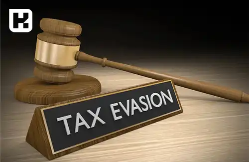

<blockquote style="background-color:#eeeefc; padding:0.5rem">

   
آنچه در این مطلب خواهید خواند:

  <ul>
    <li>عواقب مختلف فرار مالیاتی</li>
    <li>انواع فرار مالیاتی</li>
    <ul>
      <li>مجازات‌های فرار مالیاتی برای اشخاص حقیقی</li>
      <li>مجازات‌های فرار مالیاتی برای حسابدار</li>
      <li>دلایل فرار مالیاتی برای افراد و شرکت‌ها</li>
    </ul>
    <li>تأثیرات فرار مالیاتی بر رشد اقتصادی</li>
  </ul>
  

</blockquote>

به هر گونه اقدام قانونی یا غیرقانونی برای کاهش میزان مالیات پرداختی یا اجتناب از پرداخت آن، اصطلاحاً فرار مالیاتی گفته می‌شود. معمولاً سازمان‌ها یا کسب‌وکارها با هدف کاهش هزینه‌ها و دور زدن مقررات مالیاتی، به این اقدامات روی می‌آورند.

 به طور کلی، این مفهوم شامل مجموعه‌ای از فعالیت‌هاست که مودی به منظور کاهش یا جلوگیری از پرداخت مالیات انجام می‌دهد.

<blockquote style="background-color:#f5f5f5; padding:0.5rem">

<strong>آشنایی با <a href="https://www.hooshkar.com/Software/Sayan/Module/TpTaxGov" target="_blank">نرم افزار واسط سامانه مودیان
</a> سایان</strong>
</blockquote>

## عواقب مختلف فرار مالیاتی

عواقب فرار مالیاتی برای هر فرد یا شرکت متفاوت است که به نوع و شدت جرم انجام شده بستگی دارد. 

در ایران، اشخاص حقیقی که ملزم به پرداخت مالیات هستند، در صورت عدم پرداخت، ممکن است با مجازات حبس از 6 تا 24 ماه مواجه شوند. علاوه بر حبس، این افراد باید جزای نقدی نیز پرداخت کنند. همچنین، این افراد از حقوق اجتماعی به مدت 6 ماه تا 5 سال محروم خواهند شد. در نهایت، آن‌ها باید مالیات معوقه به همراه جریمه‌های مربوطه را پرداخت کنند.

در مورد شرکت‌ها و موسسات، اگر مرتکب فرار مالیاتی شوند، به مدت 6 تا 24 ماه از انجام برخی فعالیت‌های شغلی محروم خواهند شد و نمی‌توانند اسناد تجاری مانند چک یا سفته صادر کنند. این عواقب زمانی سخت‌تر می‌شود که یکی از کارکنان یا مدیران شرکت در جعل مدارک یا دیگر تخلفات دخیل باشد؛ در این صورت، مجازات‌ها به طور جداگانه برای آن فرد اعمال خواهد شد.

لازم به ذکر است اگر حسابداران، حسابرسان یا مدیران بانک‌ها و شرکت‌ها از وقوع فرار مالیاتی مطلع باشند و آن را گزارش ندهند، به مجازات حبس از 6 تا 24 ماه محکوم خواهند شد، به شرطی که اثبات شود آن‌ها از جرم آگاه بوده و گزارش نکرده‌اند. بر اساس نوع فرار مالیاتی، ممکن است علاوه بر حبس، مجازات‌هایی مانند شلاق یا جریمه نقدی نیز به آن‌ها تعلق گیرد.

## انواع فرار مالیاتی

1.  پنهان‌کاری درآمد و فعالیت‌های اقتصادی
2.  استفاده از کارت بازرگانی دیگران برای اجتناب از مالیات
3.  عدم ارائه اظهارنامه مالیاتی و ترازنامه برای سه سال پیاپی
4.  محدودیت دسترسی بازرسان و کارشناسان مالیاتی به اسناد و مدارک
5.  تنظیم قراردادهای اقتصادی به نام دیگران
6.  ارائه اطلاعات نادرست مالی در اظهارنامه و ترازنامه شرکت
7.  ظاهر سازی در نوع کسب و کار به منظور بهره‌برداری از معافیت‌های مالیاتی

### مجازات‌های فرار مالیاتی برای اشخاص حقیقی

-   جزای نقدی
-   سلب حقوق اجتماعی تا ۵ سال
-   انتشار حکم قطعی در رسانه‌ها
- حکم حبس؛ حداقل ۶ ماه، حداکثر ۲ سال

### جرایم فرار مالیاتی اشخاص حقوقی

-   ممنوعیت از صدور برخی اسناد تجاری تا ۲ سال
-   ممنوعیت از یک یا چند حرفه یا فعالیت شغلی تا ۲ سال

### مجازات‌های فرار مالیاتی برای حسابدار
-   انتشار حکم قطعی در رسانه‌ها
-   جزای نقدی
-   ۶ ماه محرومیت از حقوق اجتماعی
-   ۶ ماه حبس

<blockquote style="background-color:#f5f5f5; padding:0.5rem">

<strong>بیشتر بخوانید: <a href="https://www.hooshkar.com/Wiki/Financial/ModianContractorSystem" target="_blank">سامانه مودیان شرکتهای پیمانکاری</a>
</strong></blockquote>

## دلایل فرار مالیاتی برای افراد و شرکت‌ها

تحقیقات زیادی درباره فرار مالیاتی و دلایل آن در ایران صورت گرفته است. یکی از عوامل اصلی، عدم تنوع پایه‌های مالیاتی و ترکیب نامناسب درآمدهای مالیاتی است. معافیت‌های مالیاتی گسترده و متنوع نیز به نوبه خود، فرصت‌هایی برای سوءاستفاده فراهم می‌آورد. علاوه بر این، پیچیدگی و ابهام در قوانین و فرآیندهای مالیاتی نیز باعث فرار مالیاتی می‌شود.

همچنین، بسیاری از مشاغل و افراد به عملکرد دولت و استفاده صحیح از مالیات اعتماد ندارند. فرهنگ مالیاتی در کشور هنوز ضعیف است و این مسئله باعث می‌شود افراد به فرار مالیاتی روی آورند. 

نظام جامع اطلاعات مالیاتی نیز به درستی شکل نگرفته و مشکلات ساختاری در اقتصاد ایران مزید بر علت است. این عوامل مجتمعی باعث شده که فرار مالیاتی در ایران به یک معضل جدی تبدیل گردد.

## تأثیرات فرار مالیاتی بر رشد اقتصادی

1.  ضربه به اعتماد عمومی
2.  تأثیرات منفی بر سرمایه‌گذاری
3.  تبعیض اقتصادی
4.  آسیب به رقابت عادلانه
5.  کاهش منابع مالی دولت
6.  افزایش بدهی‌های دولتی
7.  ناتوانی در ارائه خدمات دولتی