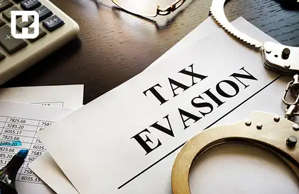

---

title: فرار مالیاتی چیست؟
author: تیم تحریریه هوشکار
description: فرار مالیاتی، اقدامی است برای کاهش یا اجتناب از پرداخت مالیات که پیامدهای جدی قانونی و اقتصادی دارد. این پدیده شامل روش‌های متنوعی از پنهان‌کاری درآمد تا سوءاستفاده از معافیت‌ها می‌شود و می‌تواند منجر به مجازات‌هایی چون حبس، جریمه و محرومیت از حقوق اجتماعی گردد.
dateModified: 2025/11/16
datePublished: 2024/08/11
uid: Financial/WhatIsTaxEvasion
---

<blockquote class="faq-block">

   
آنچه در این مطلب خواهید خواند:

  <ul>
    <li>عواقب مختلف فرار مالیاتی</li>
    <li>انواع فرار مالیاتی</li>
    <ul>
      <li>مجازات‌های فرار مالیاتی برای اشخاص حقیقی</li>
      <li>جرایم فرار مالیاتی اشخاص حقوقی</li>
      <li>مجازات‌های فرار مالیاتی برای حسابداران</li>
      <li>نمونه‌های واقعی از فرار مالیاتی</li>
    </ul>
    <li>تفاوت فرار مالیاتی و اجتناب مالیاتی</li>
    <li>دلایل فرار مالیاتی برای افراد و شرکت‌ها</li>
    <li>چگونه از اتهام فرار مالیاتی پیشگیری کنیم</li>
    <li>تأثیرات فرار مالیاتی بر رشد اقتصادی</li>
    <li>سؤالات متداول</li>
    <li>جمع‌بندی </li>
  </ul>

</blockquote> 

به هر گونه اقدام قانونی یا غیرقانونی برای کاهش میزان مالیات پرداختی یا اجتناب از پرداخت آن، اصطلاحاً فرار مالیاتی گفته می‌شود. معمولاً سازمان‌ها یا کسب‌وکارها با هدف کاهش هزینه‌ها و دور زدن مقررات مالیاتی، به این اقدامات روی می‌آورند.
به طور کلی، این مفهوم شامل مجموعه‌ای از فعالیت‌هاست که مودی به منظور کاهش یا جلوگیری از پرداخت مالیات انجام می‌دهد.

برای کاهش احتمال خطا یا تخلف در ارسال اطلاعات مالیاتی، بسیاری از شرکت‌ها از ابزارهایی مانند [نرم افزار واسط سامانه مودیان](https://www.hooshkar.com/Software/Sayan/Module/TpTaxGov) استفاده می‌کنند که فرآیند ثبت، ارسال و کنترل داده‌های مالی را به‌صورت خودکار انجام می‌دهد.

## عواقب مختلف فرار مالیاتی

عواقب فرار مالیاتی برای هر فرد یا شرکت متفاوت است که به نوع و شدت جرم انجام شده بستگی دارد. 

در ایران، اشخاص حقیقی که ملزم به پرداخت مالیات هستند، در صورت عدم پرداخت، ممکن است با مجازات حبس از 6 تا 24 ماه مواجه شوند. علاوه بر حبس، این افراد باید جزای نقدی نیز پرداخت کنند. همچنین، این افراد از حقوق اجتماعی به مدت 6 ماه تا 5 سال محروم خواهند شد. در نهایت، آن‌ها باید مالیات معوقه به همراه جریمه‌های مربوطه را پرداخت کنند.

در مورد شرکت‌ها و موسسات، اگر مرتکب فرار مالیاتی شوند، به مدت 6 تا 24 ماه از انجام برخی فعالیت‌های شغلی محروم خواهند شد و نمی‌توانند اسناد تجاری مانند چک یا سفته صادر کنند. این عواقب زمانی سخت‌تر می‌شود که یکی از کارکنان یا مدیران شرکت در جعل مدارک یا دیگر تخلفات دخیل باشد؛ در این صورت، مجازات‌ها به طور جداگانه برای آن فرد اعمال خواهد شد.

لازم به ذکر است اگر حسابداران، حسابرسان یا مدیران بانک‌ها و شرکت‌ها از وقوع فرار مالیاتی مطلع باشند و آن را گزارش ندهند، به مجازات حبس از 6 تا 24 ماه محکوم خواهند شد، به شرطی که اثبات شود آن‌ها از جرم آگاه بوده و گزارش نکرده‌اند. بر اساس نوع فرار مالیاتی، ممکن است علاوه بر حبس، مجازات‌هایی مانند شلاق یا جریمه نقدی نیز به آن‌ها تعلق گیرد.

## انواع فرار مالیاتی

1. پنهان‌کاری درآمد و فعالیت‌های اقتصادی  
2. استفاده از کارت بازرگانی دیگران برای اجتناب از مالیات  
3. عدم ارائه اظهارنامه مالیاتی و ترازنامه برای سه سال پیاپی  
4. محدودیت دسترسی بازرسان و کارشناسان مالیاتی به اسناد و مدارک  
5. تنظیم قراردادهای اقتصادی به نام دیگران  
6. ارائه اطلاعات نادرست مالی در اظهارنامه و ترازنامه شرکت  
7. ظاهر سازی در نوع کسب و کار به منظور بهره‌برداری از معافیت‌های مالیاتی  

---

### مجازات‌های فرار مالیاتی برای اشخاص حقیقی

- جزای نقدی  
- سلب حقوق اجتماعی تا ۵ سال  
- انتشار حکم قطعی در رسانه‌ها  
- حکم حبس؛ حداقل ۶ ماه، حداکثر ۲ سال  

---

### جرایم فرار مالیاتی اشخاص حقوقی

- ممنوعیت از صدور برخی اسناد تجاری تا ۲ سال  
- ممنوعیت از یک یا چند حرفه یا فعالیت شغلی تا ۲ سال  

---

### مجازات‌های فرار مالیاتی برای حسابدار

- انتشار حکم قطعی در رسانه‌ها  
- جزای نقدی  
- ۶ ماه محرومیت از حقوق اجتماعی  
- ۶ ماه حبس  

برای اطلاعات بیشتر درباره نحوه مدیریت اطلاعات مالیاتی شرکت‌های پیمانکاری، می‌توانید راهنمای <a href="https://www.hooshkar.com/Wiki/Financial/ModianContractorSystem" target="_blank">سامانه مودیان شرکت‌های پیمانکاری</a> را مطالعه کنید.

---

### نمونه‌های واقعی از فرار مالیاتی

<blockquote class="faq-block">

<strong>نمونه داخلی:</strong> در سال‌های اخیر، برخی شرکت‌ها با ثبت فاکتورهای صوری و استفاده از کارت بازرگانی افراد بی‌اطلاع، از پرداخت مالیات بر ارزش افزوده فرار کردند. این موضوع باعث شد سازمان امور مالیاتی طرح «سامانه مؤدیان» را برای شفافیت تراکنش‌ها راه‌اندازی کند.

<strong>نمونه بین‌المللی:</strong> شرکت اپل در ایرلند متهم به فرار مالیاتی از طریق انتقال سود به شرکت‌های تابعه با مالیات پایین شد. کمیسیون اروپا حکم به بازگرداندن میلیاردها یورو مالیات داد.

</blockquote>

---

### تفاوت فرار مالیاتی و اجتناب مالیاتی

<blockquote class="faq-block">
  <table>
    <thead>
      <tr>
        <th>موضوع</th>
        <th>فرار مالیاتی</th>
        <th>اجتناب مالیاتی</th>
      </tr>
    </thead>
    <tbody>
      <tr>
        <td>ماهیت</td>
        <td>غیرقانونی و جرم محسوب می‌شود</td>
        <td>قانونی اما با استفاده از خلأهای قانون</td>
      </tr>
      <tr>
        <td>روش انجام</td>
        <td>پنهان‌کاری، جعل اسناد، گزارش دروغ</td>
        <td>برنامه‌ریزی مالی هوشمندانه</td>
      </tr>
      <tr>
        <td>پیامد</td>
        <td>مجازات، حبس و جریمه نقدی</td>
        <td>بدون مجازات، در چارچوب قانون</td>
      </tr>
      <tr>
        <td>نمونه</td>
        <td>پنهان‌کردن درآمد واقعی</td>
        <td>سرمایه‌گذاری در مناطق دارای معافیت مالیاتی</td>
      </tr>
    </tbody>
  </table>
</blockquote>

---

### دلایل فرار مالیاتی برای افراد و شرکت‌ها

تحقیقات زیادی درباره فرار مالیاتی و دلایل آن در ایران صورت گرفته است. یکی از عوامل اصلی، عدم تنوع پایه‌های مالیاتی و ترکیب نامناسب درآمدهای مالیاتی است. معافیت‌های مالیاتی گسترده و متنوع نیز به نوبه خود، فرصت‌هایی برای سوءاستفاده فراهم می‌آورد. علاوه بر این، پیچیدگی و ابهام در قوانین و فرآیندهای مالیاتی نیز باعث فرار مالیاتی می‌شود.

همچنین، بسیاری از مشاغل و افراد به عملکرد دولت و استفاده صحیح از مالیات اعتماد ندارند. فرهنگ مالیاتی در کشور هنوز ضعیف است و این مسئله باعث می‌شود افراد به فرار مالیاتی روی آورند. 

نظام جامع اطلاعات مالیاتی نیز به درستی شکل نگرفته و مشکلات ساختاری در اقتصاد ایران مزید بر علت است. این عوامل مجتمعی باعث شده که فرار مالیاتی در ایران به یک معضل جدی تبدیل گردد.

---

### چگونه از اتهام فرار مالیاتی پیشگیری کنیم؟

1. ثبت دقیق تمام تراکنش‌ها در نرم‌افزار حسابداری معتبر  
2. ارسال منظم اظهارنامه مالیاتی و نگهداری سوابق حداقل تا ۵ سال  
3. استفاده از **سامانه مؤدیان و پایانه‌های فروشگاهی**  
4. مشورت با حسابداران رسمی یا مشاوران مالیاتی پیش از تصمیم‌های مالی بزرگ  
5. بررسی اعتبار فاکتورها و پرهیز از فاکتورهای صوری  

---

### تأثیرات فرار مالیاتی بر رشد اقتصادی

1. ضربه به اعتماد عمومی  
2. تأثیرات منفی بر سرمایه‌گذاری  
3. تبعیض اقتصادی  
4. آسیب به رقابت عادلانه  
5. کاهش منابع مالی دولت  
6. افزایش بدهی‌های دولتی  
7. ناتوانی در ارائه خدمات دولتی  

---

### سؤالات متداول

<blockquote class="faq-block">
  

    
آیا همه موارد تخلف مالیاتی، فرار مالیاتی محسوب می‌شود؟
 
    خیر. برخی تخلفات ناشی از اشتباه در ثبت یا تأخیر در ارسال اظهارنامه است و در صورت اثبات نیت سوء، فرار مالیاتی تلقی می‌شود.
  

</blockquote>

<blockquote class="faq-block">
  

    
آیا فرار مالیاتی فقط مربوط به شرکت‌های بزرگ است؟
 
    خیر. حتی کسب‌وکارهای کوچک یا آزادکاران نیز در صورت عدم شفافیت مالی مشمول جرایم فرار مالیاتی می‌شوند.
  

</blockquote>

<blockquote class="faq-block">
  

    
آیا پرداخت دیرهنگام مالیات فرار مالیاتی محسوب می‌شود؟
 
    خیر. تأخیر در پرداخت معمولاً مشمول جریمه تأخیر است، نه مجازات کیفری فرار مالیاتی.
  

</blockquote>

---

### جمع‌بندی

فرار مالیاتی یکی از مهم‌ترین چالش‌های اقتصادی کشور است که علاوه بر کاهش درآمدهای دولت، رقابت سالم را نیز از بین می‌برد. آگاهی از قوانین و استفاده از ابزارهای رسمی مانند **نرم‌افزار واسط سامانه مؤدیان سایان** می‌تواند نقش مهمی در پیشگیری از آن داشته باشد.