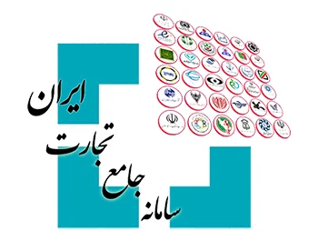

در این مقاله هدف از اجرای سامانه جامع تجارت، اجزای موثر و مزایای آن مورد بررسی قرار می گیرد.

یکی از وظایف دولتها، ایجاد زیرساخت های لازم در جهت انجام بهینه امور و فعالیت‌ های اقتصادی است. چنین زیرساختی علاوه بر تسهیل کسب و کار برای سرمایه گذاران و فعالان اقتصادی، باید کالا و محصولات را به قیمت و کیفیت مناسب به دست مردم و مصرف کنندگان برساند. در واقع حفظ تعادل در نظام عرضه و تقاضا، تنظیم و حفظ تعادل بازار، جز ماموریت ها و اهداف ضروری تمام دولتها است. از دیگر وظایف دولتها، ایجاد شفافیت در فعالیت های اقتصادی و تسهیل امر تجارت می باشد. اما در کنار تمام این موارد گفته شده، شناسایی دقیق فعالیت های اقتصادی و تجاری اشخاص به جهت مشخص نمودن میزان درآمد آنها و در نهایت وصول مالیات نیز از اهداف و وظایف دولتها به شمار می آید.

راه‌اندازی و توسعه [سامانه جامع تجارت](https://www.ntsw.ir) و استفاده صحیح از آن می تواند امیدبخش رونق و شفافیت اقتصادی بیشتر برای کشور باشد.

## هدف سامانه جامع تجارت
هدف از اجرای سامانه جامع تجارت جهت ایجاد دولت الکترونیک، کاهش فساد اقتصادی در کسب و کارها، یکپارچه سازی فرآیند تجارت در کشور، شفافیت سازی تجاری، نظارت بر زنجیره صادرات و واردات کشور، جلوگیری از قاچاق و احتکار کالا می باشد.

### اجزای موثر در این سامانه
وزارت اقتصاد، صنعت معدن، تجارت، وزارت راه و شهرسازی اجزای موثر در سامانه جامع تجارت محسوب می شوند.

#### زیر مجموعه های سامانه جامع تجارت:
* سامانه جامع تجارت
* سیستم جامع انبارها و مراکز نگهداری کالا
* سامانه‌ شناسه کالا
* سامانه‌ اعتبارسنجی و رتبه‌ بندی اعتباری
* درگاه ارزی یا نظام یکپارچه‌ معاملات ارزی نیما
* سامانه جامع حمل‌ و نقل سامانه‌ جامع امور گمرکی

سامانه های فوق که به عنوان زیر مجموعه های سامانه جامع تجارت فعال می باشند، به طور کلی باعث تسریع در انجام مکاتبات مبادله اسناد و اطلاعات و کاهش مدت زمان تشریفات اداری می شود.

#### مزایای سامانه جامع تجارت
افزایش سرعت انجام امور کسب و کارها که موجب توسعه بازاریابی بین المللی می شود.

> طبق ماده ۸ قانون بهبود مستمر فضای کسب و کار مصوب سال ۱۳۹۰ و بند الف ماده ۶ قانون مبارزه با قاچاق کالا و ارز، مصوب سال ۱۳۹۲ مجلس شورای اسلامی تهيه، اجرا و بهره برداری از سامانه¬ جامع تجارت بر عهده مرکز توسعه تجارت الکترونيکی به عنوان يکی از سازمان¬ های تابعه وزارت صنعت، معدن و تجارت قرار گرفته است.

در واقع این سامانه به عنوان درگاهی یکپارچه، ارتباط فعالان اقتصادی را اعم از وارد کنندگان و تولید کنندگان با سازمان ها و دستگاه ‌های ذیربط در امر تجارت، کنترل می‌ کند.

اطلاعات مربوط به هویت، فعالیت های اقتصادی و تجاری تولید کنندگان، وارد کنندگان، انبارداران، دارندگان کارت بازرگانی و... در ["سامانه جامع تجارت"](https://www.ntsw.ir) ثبت می شود.

بنابراین فرایند تولید، واردات کالا و ورود آن به چرخه توزیع و فروش در «سامانه جامع تجارت» ثبت و بوسیله وزارت صنعت و معدن و دیگر دستگاه ها و سازمان‌ های ناظر، مورد بررسی و نظارت قرار می گیرد.

جهت اطلاعات بیشتر می توانید راهنمای کامل سامانه جامع تجارت را از طریق لینک زیر مطالعه نمایید:

[راهنمای کامل سامانه جامع تجارت](https://www.ecommerce.gov.ir/uploads/%D8%B1%D8%A7%D9%87%D9%86%D9%85%D8%A7%DB%8C_%D8%B3%D8%A7%D9%85%D8%A7%D9%86%D9%87_%D8%AC%D8%A7%D9%85%D8%B9_%D8%AA%D8%AC%D8%A7%D8%B1%D8%AA139604__357.pdf)