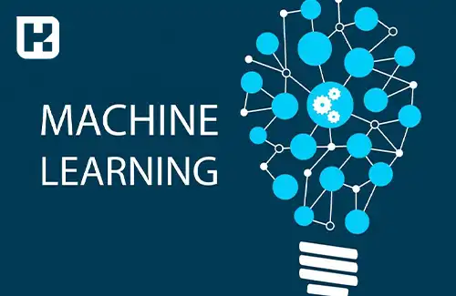

<blockquote style="background-color:#eeeefc; padding:0.5rem">

  
آنچه در این مطلب خواهید خواند

  <ul>
   <li>هوش مصنوعی چیست؟</li>
   <li>ویژگی‌های سیستم‌های هوشمند</li>
   <li>انواع هوش مصنوعی</li>
   <li>رایج‌ترین نمونه‌های هوش مصنوعی</li>
   <li>کاربردهای هوش مصنوعی</li>
   <li>یادگیری ماشین (Machine Learning) چیست؟</li>
   <li>روش‌های مختلف یادگیری ماشین</li>
  </ul>

</blockquote>

هوش مصنوعی (AI) یکی از فناوری‌های پیشرفته و تحول‌آفرین در عصر دیجیتال است که توانایی‌های شبیه‌سازی تفکر و یادگیری انسان را در نرم‌افزارها و سیستم‌های کامپیوتری ایجاد می‌کند. این فناوری قابلیت انجام وظایف پیچیده‌ای مانند تصمیم‌گیری، تحلیل داده‌ها و پردازش زبان طبیعی را دارد و به طور گسترده در صنایع مختلف برای بهبود عملکرد و تسهیل فرآیندها استفاده می‌شود. در این مقاله به بررسی ویژگی‌ها، انواع، کاربردها و روش‌های یادگیری ماشین خواهیم پرداخت تا درک بهتری از هوش مصنوعی پیدا کنیم.

### 1. هوش مصنوعی (AI) چیست؟
هوش مصنوعی به نرم‌افزارهایی اطلاق می‌شود که قابلیت‌هایی مانند تصمیم‌گیری، تحلیل داده‌ها و ترجمه زبان را شبیه‌سازی می‌کنند. برخلاف برنامه‌های معمولی که تنها از دستورالعمل‌های ثابت پیروی می‌کنند، سیستم‌های هوش مصنوعی می‌توانند با دریافت ورودی‌های جدید، یاد بگیرند و عملکرد خود را بهبود دهند. این سیستم‌ها از داده‌ها برای گسترش دانش خود استفاده می‌کنند و در طول زمان هوشمندتر و دقیق‌تر می‌شوند.

### 2. ویژگی‌های سیستم‌های هوشمند
سیستم‌های هوشمند باید ویژگی‌های خاصی داشته باشند تا بتوانند به‌طور مؤثر به حل مسائل بپردازند. برخی از ویژگی‌های کلیدی این سیستم‌ها عبارتند از:

- **توانایی حل مسئله:** توانایی ارائه راه‌حل‌های عملی برای مسائل مختلف.
- **توانایی استدلال:** تحلیل و ارزیابی مسائل با استفاده از منطق.
- **توانایی برنامه‌ریزی:** ایجاد برنامه‌های مؤثر برای دستیابی به اهداف.
- **توانایی تصمیم‌گیری:** انتخاب بهترین راه‌حل در فرآیند حل مسئله.
- **توانایی استنتاج:** نتیجه‌گیری منطقی بر اساس مشاهدات و داده‌ها.
- **توانایی یادگیری:** بهبود عملکرد با استفاده از تجربیات گذشته و داده‌های جدید.

### 3. انواع هوش مصنوعی
هوش مصنوعی بر اساس میزان هوشمندی و شباهت به رفتار انسان‌ها می‌تواند در دسته‌های مختلف قرار گیرد:

- **ماشین‌های واکنشی (Reactive Machines):** سیستم‌هایی که فقط به ورودی‌ها واکنش نشان می‌دهند.
- **ماشین‌های با حافظه محدود (Limited Memory Machines):** سیستم‌هایی که می‌توانند به اطلاعات گذشته توجه کنند.
- **ماشین‌های هوشمند با قابلیت نظریه ذهن (Theory of Mind):** سیستم‌هایی که قادر به درک احساسات و افکار دیگران هستند.
- **ماشین‌های خودآگاه (Self-Aware):** سیستم‌هایی که خودآگاهی دارند و از وضعیت خود آگاهند.

### 4. رایج‌ترین نمونه‌های هوش مصنوعی
هوش مصنوعی در بسیاری از ابزارها و سیستم‌ها به‌کار می‌رود. برخی از نمونه‌های رایج آن عبارتند از:

- **بازی‌های ویدیویی و شخصیت‌های مجازی**
- **ابزارهای طراحی تصویر مانند میدجرنی و Dall_E**
- **دستیارهای هوشمند مانند Siri، Alexa، و Google Assistant**
- **سیستم‌های هوش مصنوعی مانند ChatGPT، گوگل ترنسلیت، و موتور جستجوی بینگ**

### 5. کاربردهای هوش مصنوعی
هوش مصنوعی در بسیاری از حوزه‌ها کاربرد دارد و توانسته فرآیندهای پیچیده را ساده‌سازی کند. از جمله کاربردهای آن می‌توان به موارد زیر اشاره کرد:

- **رباتیک (Robotics):** طراحی و ساخت ربات‌های خودکار.
- **پردازش زبان طبیعی (NLP):** تجزیه و تحلیل و تولید زبان انسانی.
- **منطق فازی (Fuzzy Logic):** حل مسائل غیرقطعی با استفاده از منطق فازی.
- **شبکه‌های عصبی (Neural Networks):** مدل‌سازی مغز انسان برای شبیه‌سازی فرآیندهای شناختی.
- **اتوماسیون فرآیندهای تکراری:** استفاده از نرم‌افزارها و ربات‌ها برای خودکارسازی فرآیندهای تکراری.
- **یادگیری ماشین (Machine Learning) و پیش‌بینی پاسخ‌ها:** استفاده از داده‌ها برای پیش‌بینی نتایج آینده.

### 6. یادگیری ماشین (Machine Learning) چیست؟
یادگیری ماشین یکی از شاخه‌های هوش مصنوعی است که به سیستم‌ها این امکان را می‌دهد تا بدون برنامه‌ریزی مستقیم، از داده‌ها یاد بگیرند و نتایج خروجی دقیق‌تری را پیش‌بینی کنند. این فناوری به‌طور گسترده در تحلیل داده‌ها، پیش‌بینی‌ها و بهینه‌سازی فرآیندها به کار می‌رود.

### 7. روش‌های مختلف یادگیری ماشین
یادگیری ماشین می‌تواند با استفاده از روش‌های مختلفی انجام شود که عبارتند از:

- **یادگیری نظارت‌شده (Supervised Learning):** آموزش مدل‌ها با استفاده از داده‌های برچسب‌خورده.
- **یادگیری بدون نظارت (Unsupervised Learning):** کشف الگوها و ساختارهای پنهان در داده‌های بدون برچسب.
- **یادگیری نیمه‌نظارت‌شده (Semi-supervised Learning):** ترکیب داده‌های برچسب‌خورده و بدون برچسب برای آموزش مدل.
- **یادگیری تقویتی (Reinforcement Learning):** آموزش مدل‌ها از طریق تجربیات و بازخوردهای محیطی.

### جمع‌بندی
هوش مصنوعی به سرعت در حال تغییر و تحول است و توانسته است در بسیاری از زمینه‌ها کاربردهای ارزشمندی پیدا کند. از ماشین‌های واکنشی ساده تا سیستم‌های پیشرفته با قابلیت‌های خودآگاهی، هوش مصنوعی توانسته است تحولی بزرگ در زمینه‌های مختلف مانند رباتیک، پردازش زبان طبیعی و یادگیری ماشین ایجاد کند. با استفاده از الگوریتم‌های یادگیری ماشین، سیستم‌های هوش مصنوعی می‌توانند به طور مداوم یاد بگیرند و عملکرد خود را بهبود بخشند، به طوری که امروزه شاهد استفاده گسترده این فناوری در صنایع مختلف هستیم.