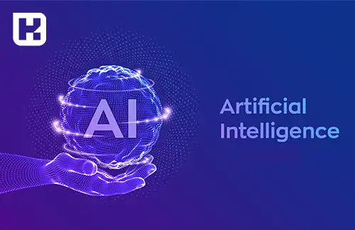

## تعریف هوش مصنوعی
هوش مصنوعی (AI) مفهومی است که در دهه‌های اخیر به طور فزاینده‌ای در حوزه‌های مختلف فناوری و علوم کامپیوتر توجه بیشتری به آن شده است. هوش مصنوعی به ایجاد کامپیوترها یا سیستم‌هایی اطلاق می‌شود که قادر به تمامیت یا برخی ویژگی‌های هوش طبیعی انسان‌ها می‌باشند. هدف اصلی هوش مصنوعی، ایجاد ماشین‌ها و برنامه‌های کامپیوتری است که قادر به انجام فعالیت‌های هوشمندانه، یادگیری و حل مسائل باشند.

یکی از مفاهیم پایه در هوش مصنوعی، یادگیری ماشینی است. این فرایند به ماشین‌ها امکان می‌دهد تا براساس داده‌های ورودی، آموزش دیده و اطلاعات مفید را استخراج کنند. الگوریتم‌های یادگیری ماشینی، با تحلیل داده‌های بزرگ و الگوهای موجود در آن‌ها، قادر به پیش‌بینی و تصمیم‌گیری در موقعیت‌های جدید می‌شوند.

یکی از بخش‌های مهم هوش مصنوعی، شبکه‌های عصبی مصنوعی هستند. این شبکه‌ها به تقلید ساختار مغز انسان طراحی شده‌اند و قادرند الگوها و روابط پیچیده را تشخیص داده و درک کنند. شبکه‌های عصبی مصنوعی برای تشخیص الگو، تصویربرداری، ترجمه ماشینی و بسیاری از کاربردهای دیگر استفاده می‌شوند.

هوش مصنوعی در زمینه‌های مختلفی از جمله پزشکی، صنعت، حمل و نقل، ارتباطات، رباتیک و بازی‌های رایانه‌ای استفاده می‌شود.

<blockquote style="background-color:#f5f5f5; padding:0.5rem">

<strong>بیشتر بخوانید: <a href="https://www.hooshkar.com/Wiki/Github/Intro" target="_blank"> آموزش گیت هاب (github)
</a>
<strong></blockquote>
