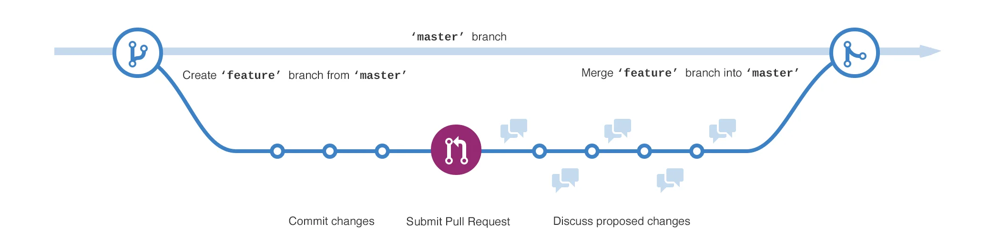

**Branching** یک روش بسیار مؤثر برای کار روی نسخه‌های مختلف یک **Repository** به صورت همزمان است. به طور پیش‌فرض، هر Repository یک **Branch** به نام **Master** دارد که به عنوان **Branch** اصلی در نظر گرفته می‌شود. **Branch**‌ها ابزارهایی برای آزمایش، ایجاد تغییرات و اطمینان از صحت آن تغییرات هستند، قبل از آنکه روی **Master Branch** اعمال شوند.

---

### **نحوه عملکرد Branch**
هنگامی که یک **Branch** جدید از **Master Branch** ایجاد می‌کنید، در واقع یک کپی از وضعیت فعلی **Master** در آن لحظه می‌سازید. در ادامه، می‌توانید تغییرات دلخواه خود را روی این **Branch** انجام دهید. اگر افراد دیگری روی **Master Branch** کار کنند، شما همچنان می‌توانید تغییرات جدید آن‌ها را دریافت و با **Branch** خود ادغام کنید.

---

### دیاگرام توضیحی
در یک دیاگرام ساده، می‌توان موارد زیر را مشاهده کرد:
1. **Master Branch** به‌عنوان شاخه اصلی.
2. یک **Branch** جدید با نام **Feature**.
3. مسیر **Feature Branch** از زمان ایجاد تا **Merge** شدن با **Master Branch**.

---

### **کاربرد Branch‌ها**
آیا تا به حال چندین نسخه از یک فایل را با نام‌های مختلف ذخیره کرده‌اید؟ مانند:
- `story.txt`
- `story-joe-edit.txt`
- `story-joe-edit-reviewed.txt`

**Branch‌ها** مشابه همین رویکرد عمل می‌کنند، اما در سطح Repository. 

در GitHub، توسعه‌دهندگان، نویسندگان و طراحان از **Branch** برای:
- نگهداری کد.
- رفع ایرادات.
- افزودن قابلیت‌های جدید.
- آزمایش ویژگی‌های خاص.

**Branch‌ها** تغییرات را از **Master Branch** جدا نگه می‌دارند. زمانی که تغییرات کامل و نهایی شد، می‌توان **Branch** را با **Master Branch** ادغام (Merge) کرد.

---

### **ایجاد یک Branch جدید در GitHub**
برای ایجاد یک **Branch** جدید مراحل زیر را دنبال کنید:

1. وارد **Repository** شوید که قبلاً ایجاد کرده‌اید.
2. در بالای لیست فایل‌ها، روی **Branch: master** کلیک کنید.
3. در کادری که باز می‌شود، نام **Branch** جدید (برای مثال: `readme-edits`) را وارد کنید.
4. روی دکمه **Create branch** (باکس آبی‌رنگ) کلیک کنید یا کلید **Enter** را بزنید.

اکنون شما دو **Branch** دارید: 
- **Master** 
- **Readme-edits**

این دو **Branch** در حال حاضر کاملاً شبیه به هم هستند. در مرحله بعد، شما می‌توانید تغییرات دلخواه خود را روی **Branch** جدید اعمال کنید. **Branching** در GitHub نه‌تنها ابزار قدرتمندی برای مدیریت نسخه‌ها است، بلکه همکاری مؤثرتر در پروژه‌های تیمی را نیز امکان‌پذیر می‌سازد.