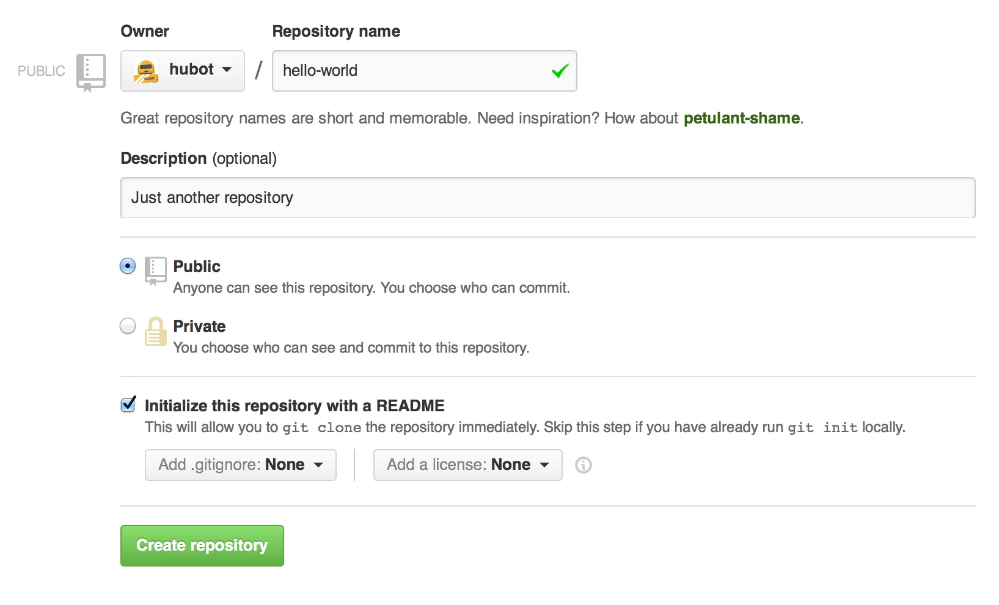

از repository معمولا برای مدیریت و سازمان دهی یک پروژه استفاده می شود. 

معادل فارسی repositoy، مخزن است، هر آنچه که پروژه ما به آن نیاز دارد از جمله پوشه ها (folders)، فایل ها (files)، تصاویر (images)، فیلم ها (videos) و...، در آن قرار می گیرد.

پیشنهاد می شود که همیشه پروژه ه شما یک فایل README داشته باشد که در آن اطلاعاتی در مورد پروژه نوشته می شود. در github میتوان هنگام ایجاد یک repository جدید فایل هایی مانند README و یا فایل لایسنس را نیز به آن اضافه کرد.

## ایجاد یک repository:
1. در نوار بالایی github در سمت راست کنار آیکون آواتار بر روی آیکون + کلیک کنید و گزینه <a href="https://github.com/new" target="_blank">New repository</a> را انتخاب کنید.

2. در قسمت Repository Name نام repository خود که در اینجا hello-world است را بنویسید.

3. یک توضیح کوتاه در مورد این پروژه بنویسید

4. می توانید با انتخاب گزینه پرایوت (Private) مخزن خود را از دید بقیه کاربران سایت مخفی کنید در غیر این صورت بقیه کاربران می توانند مخزن شما و محتویات آن را ببینند.

5. گزینه  Initialize this repository with a README را برای اضافه کردن فایل README به پروژه، انتخاب کنید.

6. شما همچنین می توانید با اضافه کردن لایسنس (license) به مخزن خود , دیگران را در استفاده از محتویات مخزن خود محدود کنید با انتخاب گزینه Add a license می توانید یکی از لایسنس (license) های رایج را انتخاب کنید.

7. برای ایجاد روی Create Repository کلیک کنید.

