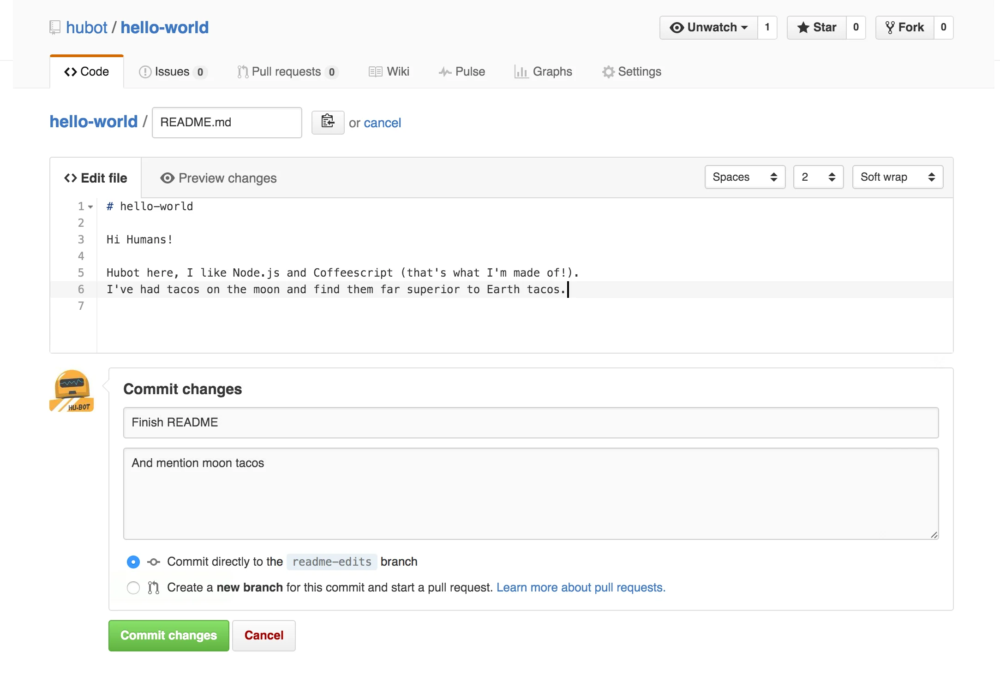

اکنون که یک **Branch** جدید به نام `readme-edits` ایجاد کرده‌اید، زمان آن رسیده که روی این **Branch** کار کنید. این **Branch** در حال حاضر یک کپی از **Master Branch** است. تغییرات جدیدی را روی آن اعمال خواهیم کرد.

## Commit: ذخیره تغییرات در GitHub
در GitHub، ذخیره تغییرات **Commit** نامیده می‌شود. هر **Commit** شامل یک پیام است که توضیح می‌دهد چرا تغییرات انجام شده‌اند. این پیام به شما و همکارانتان کمک می‌کند تا از هدف تغییرات و منطق پشت آن‌ها مطلع شوید.

### مراحل ایجاد تغییر و Commit کردن آن
برای ایجاد تغییرات در فایل **README.md** و ثبت آن‌ها به صورت **Commit**، مراحل زیر را دنبال کنید:

1. **باز کردن فایل**  
   - به `readme-edits Branch` بروید.  
   - روی فایل `README.md` کلیک کنید.

2. **ویرایش فایل**  
   - روی آیکن مداد که در بالای سمت راست صفحه قرار دارد، کلیک کنید.  
   - ویرایشگر (Editor) باز خواهد شد. در این بخش، اطلاعات جدیدی درباره پروژه بنویسید یا تغییرات دلخواه خود را اعمال کنید.

3. **نوشتن پیام Commit**  
   - در بخش پایینی ویرایشگر، یک پیام توضیحی بنویسید.  
   - پیام باید به‌صورت خلاصه و روشن توضیح دهد که چه تغییراتی اعمال شده و دلیل آن چیست. برای مثال:  
     - "اضافه کردن توضیحات پروژه به README"  
     - "اصلاح ساختار توضیحات پروژه"

4. **ثبت تغییرات**  
   - روی دکمه **Commit changes** کلیک کنید.

### نتیجه تغییرات
این تغییرات تنها در `readme-edits Branch` اعمال خواهند شد. `Master Branch` همچنان بدون تغییر باقی می‌ماند. اکنون، **readme-edits Branch** محتوایی دارد که با **Master Branch** متفاوت است. این تفاوت نشان می‌دهد که تغییرات شما در محیطی جداگانه نگهداری می‌شوند.

---

### مزیت استفاده از Commit‌ها
1. ثبت تغییرات به همراه توضیحات واضح.
2. امکان بازگشت به نسخه‌های قبلی در صورت نیاز.
3. بهبود شفافیت و همکاری در پروژه‌های تیمی.

در مرحله بعد، می‌توانید این تغییرات را با **Master Branch** ادغام (Merge) کنید. این کار با استفاده از یک **Pull Request** انجام خواهد شد.