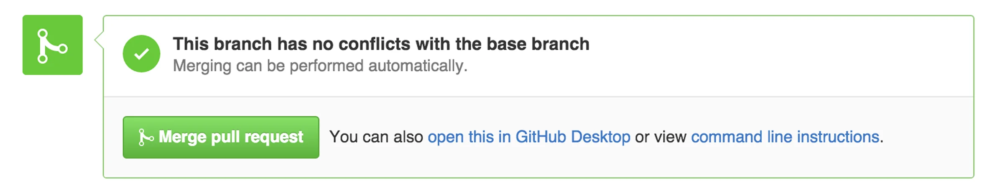
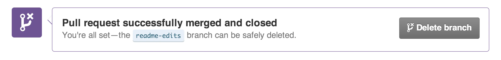

اکنون که تغییرات لازم را در **readme-edits Branch** اعمال و Commit کرده‌اید، زمان آن رسیده که این تغییرات را با **Master Branch** ادغام (Merge) کنید. فرآیند Merge به شما کمک می‌کند که تغییرات نهایی را به **Branch اصلی** پروژه منتقل کنید.

## مراحل Merge کردن Branch‌ها

1. **ایجاد Pull Request**  
   - به **Repository** خود بروید.  
   - در بخش بالای صفحه، روی گزینه **Pull requests** کلیک کنید.  
   - روی دکمه **New pull request** کلیک کنید.  
   - تغییرات موجود در **readme-edits Branch** را مرور کنید و آن‌ها را با **Master Branch** مقایسه کنید.  
   - یک پیام توضیحی در مورد Pull Request بنویسید (مثلاً: "اضافه کردن تغییرات فایل README").  
   - روی دکمه **Create pull request** کلیک کنید.

2. **ادغام Pull Request**  
   - زمانی که آماده هستید، روی دکمه سبز رنگ **Merge pull request** کلیک کنید.

   

   - برای تأیید، روی **Confirm merge** کلیک کنید.  
   - اکنون تغییرات **readme-edits Branch** با **Master Branch** ادغام شده است.

3. **حذف Branch اضافی**  
   - برای پاک‌سازی و جلوگیری از سردرگمی، می‌توانید **readme-edits Branch** را حذف کنید.  
   - پس از ادغام، روی گزینه **Delete branch** کلیک کنید.

### نتیجه
با انجام این مراحل:
- تغییرات نهایی شما اکنون در **Master Branch** اعمال شده‌اند.  
- **readme-edits Branch** دیگر نیازی ندارد و حذف شده است، اما تمامی تغییرات آن در تاریخچه **Master Branch** ذخیره شده‌اند.  

---

### **مزایای این فرآیند**
1. **تفکیک و تست تغییرات**: Branch‌ها به شما اجازه می‌دهند که تغییرات را به‌صورت جداگانه اعمال کنید.  
2. **پیشگیری از ایرادات**: ادغام تغییرات پس از بازبینی و تأیید، باعث کاهش خطاها می‌شود.  
3. **نظم و سازمان‌دهی**: حذف Branch‌های اضافی از شلوغی Repository جلوگیری می‌کند.

در این مرحله، شما موفق به مدیریت، ویرایش، و ادغام تغییرات پروژه خود شده‌اید!

