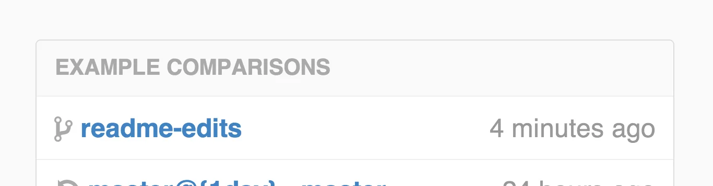
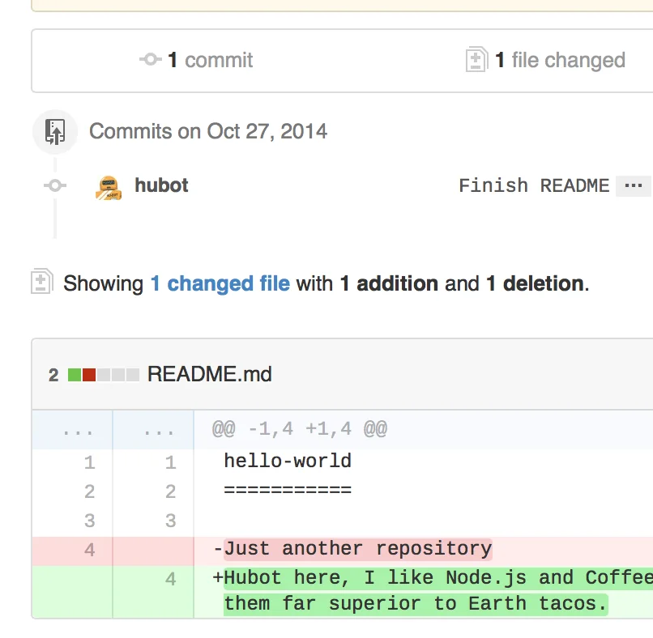
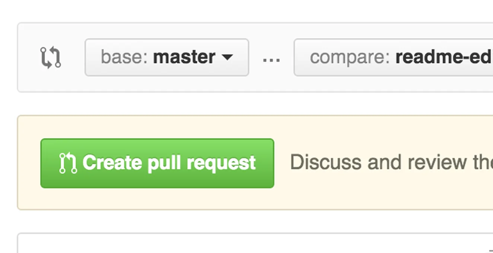
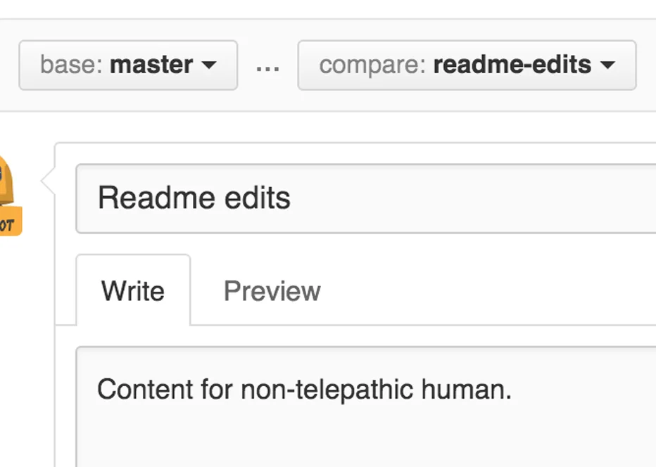

Pull Request‌ها بخش کلیدی در فرآیند همکاری در **GitHub** هستند. این ابزار به شما اجازه می‌دهد تغییراتی که در یک **Branch** ایجاد کرده‌اید را پیشنهاد دهید، بازبینی کنید و سپس با Branch اصلی پروژه ادغام (Merge) کنید. 

## عملکرد Pull Request
- **پیشنهاد تغییرات**: با ایجاد Pull Request، تغییرات خود را برای بررسی دیگران ارسال می‌کنید.  
- **نمایش تفاوت‌ها**: GitHub تمام تغییرات بین Branch شما و Branch اصلی را به‌صورت بصری نمایش می‌دهد.  
- **ابزار بررسی**: با نمایش رنگ‌های سبز (اضافه شدن) و قرمز (حذف شدن)، می‌توانید تغییرات را دقیق‌تر بررسی کنید.  
- **مناسب برای یادگیری**: حتی می‌توانید برای پروژه‌های خودتان Pull Request ایجاد کنید تا با فرآیند کار آشنا شوید.

---

### **مراحل ایجاد Pull Request**

#### ۱. باز کردن Pull Request
1. وارد **Repository** خود شوید.  
2. در بالای صفحه، روی تب **Pull Requests** کلیک کنید.  
3. روی دکمه سبز رنگ **New Pull Request** کلیک کنید.

#### ۲. انتخاب Branch برای مقایسه
1. در بخش **Example Comparisons**، Branch‌ای که تغییرات در آن اعمال شده است (مثلاً `readme-edits`) را انتخاب کنید.  
2. این Branch با **Master Branch** (یا هر Branch اصلی دیگر) مقایسه خواهد شد.

#### ۳. بررسی تغییرات
1. صفحه مقایسه تفاوت‌ها نمایش داده می‌شود.  
2. مطمئن شوید تغییراتی که در **readme-edits** ایجاد کرده‌اید، همان مواردی هستند که می‌خواهید ارسال کنید.  
3. تغییرات به‌صورت زیر نمایش داده می‌شود:  
   - **سبز**: نشان‌دهنده خطوط اضافه شده.  
   - **قرمز**: نشان‌دهنده خطوط حذف شده.

#### ۴. ایجاد Pull Request
1. پس از بررسی، روی دکمه سبز رنگ **Create Pull Request** کلیک کنید.  
2. یک عنوان برای Pull Request بنویسید.  
3. توضیح مختصری درباره تغییراتی که اعمال کرده‌اید، اضافه کنید.  

#### ۵. ارسال Pull Request
1. پس از نوشتن پیام، روی دکمه **Create Pull Request** کلیک کنید.  
2. Pull Request شما اکنون ایجاد شده و آماده بررسی است.

### نتیجه و نکات مهم
- **ایجاد گفتگو**: با Pull Request می‌توانید گفتگوهای مفید در مورد تغییرات داشته باشید.  
- **تمرین**: می‌توانید برای پروژه‌های شخصی نیز Pull Request باز کرده و تغییرات را خودتان ادغام کنید.  
- **پشتیبانی از همکاری تیمی**: ابزارهای GitHub نظیر Pull Request کار تیمی را ساده و شفاف‌تر می‌کند.

با این کار، فرآیند Pull Request کامل می‌شود و شما آماده مشارکت در پروژه‌های بزرگتر هستید.