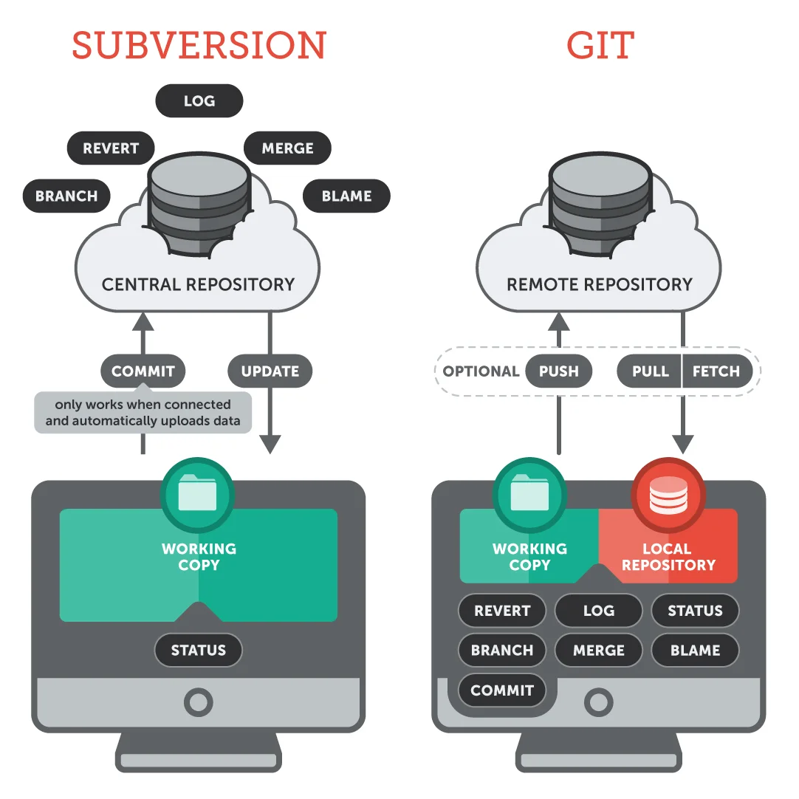

<blockquote class="faq-block">

  
آنچه در این مطلب خواهید خواند

  <ul>
    <li>نرم‌افزارهای مدیریت کد</li>
    <li>سورس کنترل مرکزی (Centralized Source Control)</li>
    <li>سورس کنترل توزیع‌شده (Distributed Source Control)</li>
    <li>تاریخچه مدیریت ورژن‌ها: از Subversion تا Git</li>
    <li>تفاوت Git و Subversion</li>
    <li>سوالات متداول</li>
    <li>جمع‌بندی</li>
  </ul>

</blockquote> 

داشتن ورژن‌های مختلف از فایل‌های یک پروژه نرم‌افزاری یا هر پروژه دیگری، همچون نگارش یک کتاب، به‌ویژه در پروژه‌های گروهی، از اهمیت ویژه‌ای برخوردار است. این کار نه تنها یک روش مطلوب برای حفظ تاریخچه تغییرات و پیشرفت‌ها به شمار می‌رود، بلکه در پروژه‌های گروهی و تیمی به امری ضروری تبدیل می‌شود. با استفاده از مدیریت مناسب ورژن‌ها، اعضای تیم می‌توانند به راحتی تغییرات خود را ثبت کرده و از مشکلات احتمالی در هنگام همگام‌سازی پروژه جلوگیری کنند.

## نرم‌افزارهای مدیریت کد

نرم‌افزارهای مدیریت کد از لحاظ نحوه نگهداری و مدیریت کد (source control) به دو دسته کلی تقسیم می‌شوند: **توزیع‌شده (distributed)** و **متمرکز (centralized)**. هر کدام از این روش‌ها ویژگی‌ها، مزایا و معایب خاص خود را دارند که به طور دقیق در ادامه بررسی خواهند شد.

---

### سورس کنترل مرکزی (Centralized Source Control)
در این روش، یک **سرور** مرکزی وجود دارد که تمامی تغییرات کد در آن ذخیره می‌شود. کاربران (برنامه‌نویسان) از **کلاینت‌ها** برای اعمال تغییرات یا دریافت تغییرات دیگران استفاده می‌کنند. به عبارت دیگر، در این سیستم، تمام اطلاعات و داده‌های مدیریتی و متادیتاها بر روی سرور نگهداری می‌شود و کلاینت‌ها تنها به یک نسخه مشخص از سورس کد دسترسی دارند.

**مزایا**:
- دسترسی به اطلاعات از یک نقطه متمرکز.
- ساده‌تر بودن مدیریت در مقیاس کوچک یا تیم‌های کوچک.

**معایب**:
- در صورتی که سرور از کار بیافتد یا دچار مشکل شود، کل فرآیند متوقف می‌شود.
- نیاز به اتصال آنلاین برای انجام تغییرات و دسترسی به کد.

---

### سورس کنترل توزیع‌شده (Distributed Source Control)
در این روش، سرور مرکزی وجود ندارد و هر فرد در تیم می‌تواند یک نسخه کامل از پروژه را در اختیار داشته باشد. تاریخچه کامل تغییرات هر فایل و متادیتاها به طور کامل در هر کلاینت ذخیره می‌شود. این امکان به کاربران اجازه می‌دهد که حتی بدون اتصال به اینترنت نیز تغییرات خود را اعمال کنند.

**مزایا**:
- امکان کار مستقل و بدون نیاز به اتصال آنلاین.
- هر کلاینت دارای یک نسخه کامل از پروژه و تاریخچه تغییرات است، بنابراین در صورت از کار افتادن سرور، کار ادامه پیدا می‌کند.
- امنیت بیشتر در حفظ تاریخچه و تغییرات.

**معایب**:
- نیاز به هماهنگی دقیق‌تر بین اعضای تیم در زمان همگام‌سازی تغییرات.

---

### تاریخچه مدیریت ورژن‌ها: از Subversion تا Git

پیش از توسعه روش‌های توزیع‌شده، بسیاری از تیم‌ها از سیستم‌هایی همچون **Subversion** (SVN) برای مدیریت کد استفاده می‌کردند. این سیستم‌ها تغییرات را نسبت به ورژن قبلی ذخیره می‌کردند، اما هنوز هم نیاز به سرور مرکزی داشتند و مشکلاتی مانند محدودیت‌های دسترسی آنلاین و عدم امکان ذخیره تمام نسخه‌ها وجود داشت. در این سیستم‌ها، کاربر نمی‌توانست به راحتی از همه نسخه‌ها استفاده کند و این فرآیند برای تیم‌ها محدودیت‌هایی به همراه داشت.

با معرفی **Git** در سال ۲۰۰۵ توسط **Linus Torvalds** (مخترع لینوکس)، این چالش‌ها حل شد. Git با استفاده از روش توزیع‌شده، دسترسی به تاریخچه کامل پروژه را به کاربران فراهم کرد و این امر باعث شد که Git تبدیل به یکی از محبوب‌ترین ابزارهای مدیریت کد در دنیای نرم‌افزار شود. اکنون بسیاری از پروژه‌ها به‌ویژه در پلتفرم‌هایی مانند **GitHub** و **GitLab** به کمک Git مدیریت می‌شوند.

---

### تفاوت Git و Subversion

**Git** و **Subversion** (SVN) از نظر نحوه ذخیره‌سازی و همگام‌سازی تغییرات تفاوت‌های اساسی دارند:

- **Git** به صورت توزیع‌شده عمل می‌کند و هر کاربر نسخه کامل پروژه و تاریخچه تغییرات را در اختیار دارد.
- **Subversion** به صورت متمرکز است و تمامی تغییرات بر روی یک سرور مرکزی ذخیره می‌شوند.

این ویژگی‌های اساسی باعث شده‌اند که Git به ابزاری بسیار محبوب برای توسعه‌دهندگان تبدیل شود، به‌ویژه در پروژه‌های بزرگ و تیم‌های توزیع‌شده که نیاز به انعطاف‌پذیری بیشتری دارند.

---

### سوالات متداول

<blockquote class="faq-block">
  

    
سورس کنترل چیست و چرا استفاده از آن ضروری است؟

    
سورس کنترل سیستمی برای ذخیره، پیگیری و مدیریت نسخه‌های مختلف کد یا فایل‌های پروژه است. این ابزار امکان کار تیمی بدون تداخل، بازگشت به نسخه‌های قبلی، و بررسی تاریخچه تغییرات را فراهم می‌کند.

  

</blockquote>

<blockquote class="faq-block">
  

    
تفاوت اصلی بین سورس کنترل مرکزی و توزیع‌شده چیست؟

    
در نوع مرکزی (Centralized)، همه تغییرات روی یک سرور ذخیره می‌شود. در نوع توزیع‌شده (Distributed)، هر توسعه‌دهنده یک نسخه کامل از پروژه و تاریخچه آن را روی سیستم خود دارد. این موضوع در روش توزیع‌شده وابستگی به سرور مرکزی را کاهش می‌دهد.

  

</blockquote>

<blockquote class="faq-block">
  

    
آیا برای کار با Git نیاز به اینترنت داریم؟

    
خیر. Git یک سیستم توزیع‌شده است و اکثر عملیات‌ها مثل commit، log و branch به‌صورت آفلاین انجام می‌شود. فقط برای push و pull به یک سرور نیاز به اینترنت یا شبکه داخلی دارید.

  

</blockquote>

<blockquote class="faq-block">
  

    
GitHub و Git چه تفاوتی دارند؟

    
Git یک ابزار مدیریت نسخه است، اما GitHub یک سرویس میزبانی آنلاین برای مخازن Git همراه با امکانات تکمیلی مانند Issue Tracking، Pull Request و CI/CD می‌باشد.

  

</blockquote>

<blockquote class="faq-block">
  

    
Subversion (SVN) هنوز هم استفاده می‌شود؟

    
بله. با وجود رشد Git، بسیاری از سازمان‌ها به دلیل ساختار متمرکز، قوانین امنیتی یا پروژه‌های قدیمی همچنان از SVN استفاده می‌کنند؛ اما روند کلی صنعت به سمت Git است.

  

</blockquote>

<blockquote class="faq-block">
  

    
کدام‌یک برای تیم‌های بزرگ مناسب‌تر است: Git یا SVN؟

    
در اکثر موارد، Git به دلیل سرعت، انعطاف‌پذیری، کار آفلاین و قدرت branching گزینه بهتری برای تیم‌های بزرگ است. بااین‌حال، تیم‌هایی که ساختار شدیداً متمرکز دارند ممکن است از SVN استفاده کنند.

  

</blockquote>

<blockquote class="faq-block">
  

    
آیا مهاجرت از SVN به Git امکان‌پذیر است؟

    
بله. ابزارهای رسمی و جانبی متعددی برای انتقال مخازن SVN به Git وجود دارد تا تاریخچه پروژه نیز حفظ شود. بسیاری از سازمان‌ها این مهاجرت را انجام داده‌اند.

  

</blockquote>

---

### جمع‌بندی
در این مقاله به بررسی دو نوع مختلف از سیستم‌های مدیریت کد پرداخته شد: **سورس کنترل مرکزی** و **سورس کنترل توزیع‌شده**. همچنین تفاوت‌های کلیدی بین **Git** و **Subversion** (SVN) بررسی شد. در نهایت، با گسترش استفاده از ابزارهایی مانند Git و پلتفرم‌های محبوبی همچون **GitHub** و **GitLab**، تیم‌ها و توسعه‌دهندگان می‌توانند به راحتی تغییرات پروژه‌های نرم‌افزاری خود را مدیریت کنند.

اگر مایلید که اطلاعات بیشتری در خصوص source control ها داشته باشید با ما همراه شوید چرا که در ادامه به بررسی چند سرویس پرطرفدار و پرکاربرد نظیر github و tfs خواهیم پرداخت.