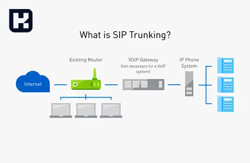
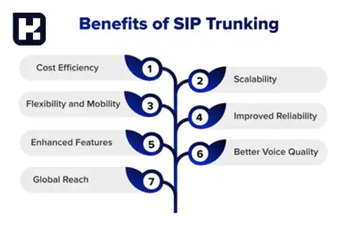

<blockquote style="background-color:#eeeefc; padding:0.5rem">

  
آنچه در این مطلب خواهید خواند

  <ul>
   <li>سیپ ترانک چیست؟</li>
   <li>مقایسه SIP Trunk و SIP Phone چیست؟</li>
   <li>مزایای استفاده از سیپ ترانک</li>
  </ul>

</blockquote>

سیپ ترانک (SIP Trunk) یکی از فناوری‌های پیشرفته در دنیای ارتباطات است که به سازمان‌ها این امکان را می‌دهد تا تماس‌های صوتی و تصویری را از طریق اینترنت و با استفاده از پروتکل SIP مدیریت کنند. این تکنولوژی با ارائه امکانات بیشتر و کاهش هزینه‌ها، جایگزین خطوط تلفن سنتی شده است.

## سیپ ترانک چیست؟

سیپ ترانک یک اتصال اینترنتی است که به شرکت‌ها این امکان را می‌دهد تا از سیستم تلفن خود، تماس‌های صوتی و تصویری را به صورت همزمان و از طریق بستر VoIP (صوت از طریق اینترنت) انجام دهند. با استفاده از این تکنولوژی، دیگر محدودیتی برای تعداد تماس‌های ورودی و خروجی وجود ندارد و می‌توان چندین تماس همزمان را تنها با یک خط SIP Trunk مدیریت کرد. این قابلیت سیپ ترانک مزیت بزرگی برای سازمان‌ها و کسب‌وکارها فراهم کرده که می‌توانند از یک زیرساخت کم‌هزینه و با کارایی بالا استفاده کنند.

---

### مقایسه سیپ ترانک و SIP Phone

- **سیپ ترانک:** سیپ ترانک به عنوان یک اتصال شبکه، به سیستم PBX (سانترال خصوصی) اجازه می‌دهد که با شبکه تلفن عمومی سوئیچ‌شده (PSTN) ارتباط برقرار کند. این ترانک‌ها دارای ویژگی‌هایی نظیر مسیریابی تماس‌ها، انتقال تماس و کنفرانس هستند. سیپ ترانک از بستر VoIP استفاده می‌کند و به همین دلیل قادر است چندین تماس همزمان را از یک خط مدیریت کند.

- **SIP Phone:** تلفن‌های SIP برای برقراری تماس‌ها استفاده می‌شوند، اما محدودیت‌هایی دارند. این تلفن‌ها قادر به برقراری تنها یک تماس همزمان روی یک خط هستند و در صورت دریافت تماس جدید، خط اشغال می‌شود. برخلاف سیپ ترانک، تلفن‌های SIP نیازی به اتصال اینترنتی به صورت مداوم ندارند و می‌توانند به صورت مستقل از شبکه اینترنت عمل کنند.

---

### مزایای استفاده از سیپ ترانک

استفاده از سیپ ترانک برای کسب‌وکارها مزایای زیادی دارد، از جمله:

- کاهش هزینه‌ها به دلیل استفاده از بستر VoIP
- امکان برقراری چندین تماس همزمان روی یک خط
- افزایش کارایی و بهره‌وری در ارتباطات
- انعطاف‌پذیری بالا در مسیریابی تماس‌ها و مدیریت تماس‌ها

---

### جمع‌بندی

سیپ ترانک یک فناوری کلیدی برای سازمان‌ها و کسب‌وکارهاست که با استفاده از بستر اینترنت می‌توانند تماس‌های خود را به راحتی مدیریت کنند. با توجه به ویژگی‌های پیشرفته این فناوری، به راحتی می‌توان سیپ ترانک را به عنوان جایگزینی مناسب برای خطوط تلفن سنتی در نظر گرفت. این فناوری، علاوه بر کاهش هزینه‌ها، امکانات پیشرفته‌ای همچون مسیریابی تماس‌ها و انتقال تماس را نیز فراهم می‌کند.