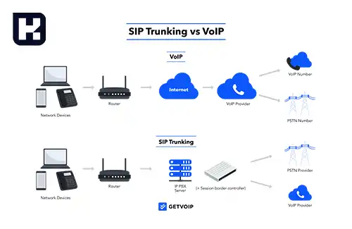

<blockquote class="faq-block">

  
آنچه در این مطلب خواهید خواند

  <ul>
   <li>سیپ ترانک چیست؟</li>
   <li>مقایسه SIP Trunk و SIP Phone چیست؟</li>
   <li>مزایای استفاده از سیپ ترانک</li>
   <li>سوالات متداول</li>
   <li>جمع‌بندی</li>
  </ul>

</blockquote> 

سیپ ترانک (SIP Trunk) یکی از فناوری‌های پیشرفته در دنیای ارتباطات است که به سازمان‌ها این امکان را می‌دهد تا تماس‌های صوتی و تصویری را از طریق اینترنت و با استفاده از پروتکل SIP مدیریت کنند. این تکنولوژی با ارائه امکانات بیشتر و کاهش هزینه‌ها، جایگزین خطوط تلفن سنتی شده است.

## سیپ ترانک چیست؟

سیپ ترانک یک اتصال اینترنتی است که به شرکت‌ها این امکان را می‌دهد تا از سیستم تلفن خود، تماس‌های صوتی و تصویری را به صورت همزمان و از طریق بستر VoIP (صوت از طریق اینترنت) انجام دهند. با استفاده از این تکنولوژی، دیگر محدودیتی برای تعداد تماس‌های ورودی و خروجی وجود ندارد و می‌توان چندین تماس همزمان را تنها با یک خط SIP Trunk مدیریت کرد. این قابلیت سیپ ترانک مزیت بزرگی برای سازمان‌ها و کسب‌وکارها فراهم کرده که می‌توانند از یک زیرساخت کم‌هزینه و با کارایی بالا استفاده کنند.

---

### مقایسه سیپ ترانک و SIP Phone

- **سیپ ترانک:** سیپ ترانک به عنوان یک اتصال شبکه، به سیستم PBX (سانترال خصوصی) اجازه می‌دهد که با شبکه تلفن عمومی سوئیچ‌شده (PSTN) ارتباط برقرار کند. این ترانک‌ها دارای ویژگی‌هایی نظیر مسیریابی تماس‌ها، انتقال تماس و کنفرانس هستند. سیپ ترانک از بستر VoIP استفاده می‌کند و به همین دلیل قادر است چندین تماس همزمان را از یک خط مدیریت کند.

- **SIP Phone:** تلفن‌های SIP برای برقراری تماس‌ها استفاده می‌شوند، اما محدودیت‌هایی دارند. این تلفن‌ها قادر به برقراری تنها یک تماس همزمان روی یک خط هستند و در صورت دریافت تماس جدید، خط اشغال می‌شود. برخلاف سیپ ترانک، تلفن‌های SIP نیازی به اتصال اینترنتی به صورت مداوم ندارند و می‌توانند به صورت مستقل از شبکه اینترنت عمل کنند.

---

### مزایای استفاده از سیپ ترانک

استفاده از سیپ ترانک برای کسب‌وکارها مزایای زیادی دارد، از جمله:

- کاهش هزینه‌ها به دلیل استفاده از بستر VoIP
- امکان برقراری چندین تماس همزمان روی یک خط
- افزایش کارایی و بهره‌وری در ارتباطات
- انعطاف‌پذیری بالا در مسیریابی تماس‌ها و مدیریت تماس‌ها

---
### سوالات متداول

<blockquote class="faq-block">
    

        
سیپ ترانک چیست؟

        سیپ ترانک (SIP Trunk) یک اتصال اینترنتی است که به سازمان‌ها اجازه می‌دهد تماس‌های صوتی و تصویری خود را از طریق بستر VoIP و پروتکل SIP مدیریت کنند. این فناوری امکان برقراری چندین تماس همزمان را روی یک خط فراهم می‌کند و جایگزینی کم‌هزینه و با انعطاف‌پذیری بالا برای خطوط تلفن سنتی است.
    

</blockquote>

<blockquote class="faq-block">
    

        
SIP Phone چیست؟

        تلفن‌های SIP دستگاه‌هایی هستند که برای برقراری تماس‌های صوتی و تصویری از طریق پروتکل SIP طراحی شده‌اند. این تلفن‌ها معمولاً تنها می‌توانند یک تماس همزمان روی هر خط برقرار کنند و برخلاف سیپ ترانک، نیازی به اتصال مداوم اینترنت برای عملکرد پایه ندارند.
    

</blockquote>

<blockquote class="faq-block">
    

        
تفاوت اصلی بین سیپ ترانک و SIP Phone چیست؟

        تفاوت‌های کلیدی عبارتند از:
        <ul>
            <li>سیپ ترانک یک اتصال شبکه است که PBX را به شبکه تلفن عمومی متصل می‌کند؛ SIP Phone یک دستگاه تلفنی است.</li>
            <li>سیپ ترانک امکان چندین تماس همزمان روی یک خط را دارد؛ SIP Phone معمولاً تنها یک تماس همزمان برقرار می‌کند.</li>
            <li>سیپ ترانک کاملاً وابسته به اینترنت است؛ SIP Phone می‌تواند مستقل از اینترنت هم کار کند.</li>
        </ul>
    

</blockquote>

<blockquote class="faq-block">
    

        
مزایای استفاده از سیپ ترانک چیست؟

        مزایای اصلی سیپ ترانک شامل موارد زیر است:
        <ul>
            <li>کاهش هزینه‌های ارتباطی با استفاده از بستر VoIP</li>
            <li>امکان برقراری چندین تماس همزمان روی یک خط</li>
            <li>افزایش کارایی و بهره‌وری در مدیریت تماس‌ها</li>
            <li>انعطاف‌پذیری بالا در مسیریابی و انتقال تماس‌ها</li>
        </ul>
    

</blockquote>

<blockquote class="faq-block">
    

        
آیا سیپ ترانک می‌تواند جایگزین تلفن‌های سنتی شود؟

        بله، سیپ ترانک به‌عنوان جایگزینی مناسب برای خطوط تلفن سنتی عمل می‌کند و امکانات بیشتری مانند تماس همزمان، مسیریابی پیشرفته و مدیریت مرکزی تماس‌ها ارائه می‌دهد.
    

</blockquote>

<blockquote class="faq-block">
    

        
آیا برای استفاده از سیپ ترانک نیاز به تجهیزات خاصی داریم؟

        برای استفاده از سیپ ترانک، معمولاً به یک سیستم PBX (سنتی یا نرم‌افزاری) و اتصال اینترنت پایدار نیاز است. همچنین تلفن‌های SIP یا نرم‌افزارهای تلفنی می‌توانند برای برقراری تماس‌ها مورد استفاده قرار گیرند.
    

</blockquote>

<blockquote class="faq-block">
    

        
چند تماس همزمان می‌توان با سیپ ترانک برقرار کرد؟

        تعداد تماس‌های همزمان به ظرفیت خط سیپ ترانک و پهنای باند اینترنت بستگی دارد. معمولاً یک سیپ ترانک می‌تواند ده‌ها یا حتی صدها تماس همزمان را مدیریت کند.
    

</blockquote>

<blockquote class="faq-block">
    

        
آیا SIP Phone بدون سیپ ترانک کار می‌کند؟

        بله، SIP Phone می‌تواند به شبکه VoIP مستقیم متصل شود، اما بدون سیپ ترانک، مدیریت چندین تماس همزمان و اتصال به شبکه تلفن عمومی محدود خواهد بود.
    

</blockquote>

<blockquote class="faq-block">
    

        
کدام فناوری برای کسب‌وکارهای بزرگ مناسب‌تر است؟

        برای کسب‌وکارهای بزرگ با حجم تماس زیاد، سیپ ترانک گزینه بهتری است، زیرا امکان مدیریت تماس‌های همزمان و کاهش هزینه‌ها را فراهم می‌کند. SIP Phone بیشتر برای کاربران فردی یا کسب‌وکارهای کوچک مناسب است.
    

</blockquote>

<blockquote class="faq-block">
    

        
آیا می‌توان سیپ ترانک و SIP Phone را ترکیب کرد؟

        بله، معمولاً کسب‌وکارها از ترکیب سیپ ترانک و SIP Phone استفاده می‌کنند: سیپ ترانک برای مدیریت تماس‌ها و SIP Phone برای برقراری تماس‌های فردی یا گروهی به کار می‌رود.
    

</blockquote>

---

### جمع‌بندی

سیپ ترانک یک فناوری کلیدی برای سازمان‌ها و کسب‌وکارهاست که با استفاده از بستر اینترنت می‌توانند تماس‌های خود را به راحتی مدیریت کنند. با توجه به ویژگی‌های پیشرفته این فناوری، به راحتی می‌توان سیپ ترانک را به عنوان جایگزینی مناسب برای خطوط تلفن سنتی در نظر گرفت. این فناوری، علاوه بر کاهش هزینه‌ها، امکانات پیشرفته‌ای همچون مسیریابی تماس‌ها و انتقال تماس را نیز فراهم می‌کند.