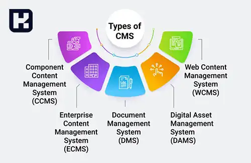

<blockquote class="faq-block">

  
آنچه در این مطلب خواهید خواند

  <ul>
      <li>سیستم مدیریت محتوا (CMS) چیست؟</li>
      <li>سیستم‌های مدیریت محتوا از دو بخش اصلی تشکیل شده‌اند</li>
      <li>مزایای CMS</li>
      <li>انواع سیستم‌های مدیریت محتوا (CMS)</li>
      <li>چه زمانی باید CMS اختصاصی را انتخاب کنیم؟</li>
      <li>ویژگی‌های اصلی سیستم‌های مدیریت محتوا</li>
      <li>مزایای CMS اختصاصی</li>
      <li>معایب CMS اختصاصی</li>
      <li>چه وب‌سایت‌هایی با CMS می‌توان ساخت؟</li>
      <li>چگونه با استفاده از CMS وب‌سایت بسازیم؟</li>
      <li>سوالات متداول</li>
      <li>جمع‌بندی</li>
  </ul>

</blockquote> 

داشتن یک وب‌سایت کارآمد و به‌روز برای هر کسب‌وکار یا فردی در دنیای دیجیتال امروزی ضروری است. اما ساخت و مدیریت یک وب‌سایت می‌تواند فرآیندی پیچیده باشد، به‌ویژه برای کسانی که دانش فنی محدودی دارند. در این میان، سیستم‌های مدیریت محتوا (CMS) به کمک آمده‌اند تا فرآیند ایجاد، ویرایش و مدیریت وب‌سایت‌ها را ساده و سریع کنند. در این مقاله، به بررسی CMS، مزایای آن، ویژگی‌ها و انواع مختلف این سیستم‌ها می‌پردازیم.

## سیستم مدیریت محتوا (CMS) چیست؟

CMS یا سیستم مدیریت محتوا، نرم‌افزاری است که به کاربران این امکان را می‌دهد تا بدون نیاز به برنامه‌نویسی، محتوای وب‌سایت خود را ایجاد، ویرایش و مدیریت کنند. به عبارت ساده‌تر، CMS ابزاری است که فرآیند ساخت و مدیریت وب‌سایت‌ها را به‌طور قابل توجهی ساده‌تر می‌کند.

با استفاده از این سیستم، کاربران می‌توانند به راحتی صفحات وب، تصاویر، ویدئوها و دیگر محتواهای دیجیتال را بارگذاری و ویرایش کنند. به این ترتیب، آن‌ها نیازی به ساخت سیستم‌های پیچیده برای ذخیره‌سازی اطلاعات یا طراحی صفحات وب نخواهند داشت.

---

### سیستم‌های مدیریت محتوا از دو بخش اصلی تشکیل شده‌اند:
1. **برنامه مدیریت محتوا (CMS):** این بخش به شما این امکان را می‌دهد که محتوای جدید اضافه کرده، آن را ویرایش و منتشر کنید.

2. **برنامه تحویل محتوا (CDA):** این بخش مسئول ذخیره‌سازی و ارائه محتوای منتشر شده به بازدیدکنندگان سایت است.

---

### مزایای CMS

- **محیط همکاری:** سیستم‌های CMS به تیم‌ها این امکان را می‌دهند که به‌طور همزمان بر روی پروژه‌ها کار کنند و محتوا را به‌راحتی ویرایش کنند.
- **ساده‌سازی فرآیند ویرایش:** بدون نیاز به مهندسان وب، افراد می‌توانند تغییرات را به راحتی اعمال کرده و محتوا را به‌روزرسانی کنند.
- **امکانات داخلی:** امکاناتی مانند بهینه‌سازی سئو، قابلیت اضافه کردن افزونه‌ها، ایجاد نقشه سایت و بسیاری دیگر، به راحتی در دسترس قرار دارند.

---

### انواع سیستم‌های مدیریت محتوا (CMS)

انواع مختلفی از سیستم‌های مدیریت محتوا (CMS) وجود دارند که هرکدام ویژگی‌ها و مخاطبان خاص خود را دارند. در اینجا به برخی از انواع رایج CMS اشاره شده است:

1. **سیستم مدیریت محتوای وب (WCMS)**:  

   WCMS رایج‌ترین نوع CMS که برای مدیریت محتوا در وب‌سایت‌ها طراحی شده است. این سیستم ابزارهایی برای ایجاد، ویرایش و انتشار صفحات وب، مدیریت دارایی‌های دیجیتال و سازماندهی محتوای به صورت سلسله‌مراتبی فراهم می‌آورد. نمونه‌هایی از آن شامل وردپرس، جوملا، دروپال و TYPO3 هستند.

2. **سیستم مدیریت محتوای سازمانی (ECMS)**:  

   ECMS برای سازمان‌های بزرگ با نیازهای پیچیده مدیریت محتوا طراحی شده است. این سیستم‌ها اغلب ویژگی‌هایی برای مدیریت اسناد، اتوماسیون جریان کار، همکاری و مدیریت سوابق دارند. نمونه‌هایی از آن شامل SharePoint ،Documentum و Alfresco هستند.

3. **سیستم مدیریت دارایی‌های دیجیتال (DAM)**:  

   سیستم‌های DAM به طور خاص برای مدیریت و سازماندهی دارایی‌های دیجیتال مانند تصاویر، ویدیوها، فایل‌های صوتی و اسناد ساخته شده‌اند. این سیستم‌ها ویژگی‌هایی برای مدیریت متادیتا، کنترل نسخه، جستجو و توزیع دارایی‌ها ارائه می‌دهند. نمونه‌هایی از آن شامل Adobe Experience Manager ،Widen Collective و Bynder هستند.

4. **سیستم مدیریت یادگیری (LMS)**:  

   LMS‌ها CMS‌های تخصصی هستند که برای مقاصد آموزشی و آموزشی طراحی شده‌اند. این سیستم‌ها امکان ایجاد و ارائه دوره‌های آنلاین، مواد آموزشی، ارزیابی‌ها و ویژگی‌های مدیریت دانش‌آموزان را فراهم می‌آورند. نمونه‌هایی از آن شامل Moodle ،Blackboard و Canvas هستند.

5. **CMS‌ های تجارت الکترونیک**:  

   این CMS‌ها بر مدیریت فروشگاه‌های آنلاین و وب‌سایت‌های تجارت الکترونیک تمرکز دارند. آنها ویژگی‌هایی برای مدیریت کاتالوگ محصولات، پیگیری موجودی، ادغام درگاه پرداخت و مدیریت سفارشات ارائه می‌دهند. نمونه‌هایی از آن شامل Magento ،Shopify و WooCommerce (افزونه وردپرس) هستند.

6. **سیستم مدیریت اسناد (DMS)**: 

   DMS‌ها برای سازماندهی و مدیریت اسناد الکترونیکی درون یک سازمان طراحی شده‌اند. این سیستم‌ها معمولاً ویژگی‌هایی مانند کنترل نسخه، همکاری در اسناد، کنترل دسترسی و قابلیت‌های جستجو دارند. نمونه‌هایی از آن شامل SharePoint ،OpenText و M-Files هستند.

7. **CMS (Headless CMS)**: 

   CMS مدیریت محتوای پشت‌صحنه را از لایه نمایش جلویی جدا می‌کند. این سیستم به توسعه‌دهندگان امکان می‌دهد تا از طریق API ها محتوا را دریافت کرده و آن را به چندین پلتفرم یا کانال مانند وب‌سایت‌ها، برنامه‌های موبایل، دستگاه‌های اینترنت اشیا و غیره ارسال کنند. نمونه‌هایی از آن شامل Contentful ،Strapi و Prismic هستند.

---
  
### چه زمانی باید CMS اختصاصی را انتخاب کنیم؟
اگر کسب‌وکار شما نیاز به ویژگی‌های بسیار خاص دارد که سیستم‌های مدیریت محتوای عمومی قادر به برآورده کردن آن‌ها نیستند، CMS اختصاصی گزینه مناسبی است. این نوع CMS همچنین برای کسب‌وکارهایی که امنیت و مقیاس‌پذیری بسیار بالا نیاز دارند، مناسب است.

#### ویژگی‌های CMS اختصاصی

1. **طراحی متناسب با نیاز خاص سازمان:** این سیستم‌ها به‌طور کامل بر اساس نیازهای خاص یک کسب‌وکار یا پروژه طراحی می‌شوند. این ویژگی باعث می‌شود که عملکرد سایت کاملاً مطابق با الزامات و فرآیندهای داخلی سازمان باشد.
   
2. **انعطاف‌پذیری بیشتر:** CMS‌های اختصاصی به دلیل اینکه از ابتدا برای یک کسب‌وکار خاص ساخته می‌شوند، قابلیت شخصی‌سازی بسیار زیادی دارند و می‌توانند تمام ویژگی‌های خاص مورد نیاز را در خود جای دهند.
   
3. **امنیت بالا:** از آنجا که CMS‌های اختصاصی برای یک سازمان خاص طراحی می‌شوند، معمولاً امنیت بالاتری نسبت به سیستم‌های کدباز دارند زیرا آن‌ها کمتر در معرض آسیب‌پذیری‌ها و حملات مشابه قرار می‌گیرند.
   
4. **توانایی مقیاس‌پذیری:** این سیستم‌ها می‌توانند به‌راحتی با رشد کسب‌وکار و نیازهای جدید آن گسترش پیدا کنند و عملکردهای جدید را اضافه کنند.

---

### مزایای CMS اختصاصی

- **پشتیبانی اختصاصی:** با یک CMS اختصاصی، تیم توسعه می‌تواند پشتیبانی و به‌روزرسانی‌هایی متناسب با نیازهای خاص شما ارائه دهد.
- **دسترس‌پذیری و عملکرد:** می‌توان CMS را به گونه‌ای طراحی کرد که پاسخ‌گویی و عملکرد آن در شرایط خاص بهینه باشد.
- **ویژگی‌های خاص و منحصر به فرد:** برخلاف CMS‌های عمومی، CMS اختصاصی می‌تواند ویژگی‌هایی خاص مانند سیستم‌های مدیریت محتوای خاص یا ابزارهای تجزیه و تحلیل مختص کسب‌وکار شما را در برداشته باشد.
- **ادغام با سیستم‌های داخلی:** این نوع CMS به راحتی می‌تواند با دیگر نرم‌افزارهای داخلی کسب‌وکار شما (مانند نرم‌افزار مدیریت مشتریان یا ERP) ادغام شود.

### معایب CMS اختصاصی

- **هزینه بالا:** توسعه یک CMS اختصاصی معمولاً هزینه‌بر است و به زمان و منابع زیادی نیاز دارد.
- **نیاز به تیم توسعه:** این سیستم‌ها برای نگهداری و به‌روزرسانی نیاز به تیم فنی دارند که ممکن است برای برخی کسب‌وکارها هزینه‌های اضافی ایجاد کند.
- **زمان پیاده‌سازی طولانی:** فرآیند طراحی و پیاده‌سازی یک CMS اختصاصی ممکن است زمان زیادی ببرد.

---

### ویژگی‌های اصلی سیستم‌های مدیریت محتوا

سیستم‌های مدیریت محتوا امکانات مختلفی برای ساخت و مدیریت وب‌سایت‌ها ارائه می‌دهند، از جمله:

- ایجاد و ویرایش محتوای وب‌سایت
- مدیریت و سازمان‌دهی رسانه‌ها (تصاویر، ویدئوها، فایل‌ها)
- امکانات سئو و بهینه‌سازی سایت
- مدیریت کاربران و اعضای سایت
- ایجاد و مدیریت آرشیو محتوا
- امکان افزودن افزونه‌ها و ویژگی‌های اضافی

---

### چه وب‌سایت‌هایی با CMS می‌توان ساخت؟

با استفاده از CMS، می‌توان انواع مختلف وب‌سایت‌ها را ایجاد کرد، از جمله:

- فروشگاه‌های آنلاین
- دوره‌های آموزشی آنلاین
- سایت‌های عضویت
- وب‌سایت‌های شبکه‌های اجتماعی و انجمن‌ها
- وبلاگ‌ها و نمونه‌کارها
- وب‌سایت‌های استاتیک

### چگونه با استفاده از CMS وب‌سایت بسازیم؟

برای ایجاد یک وب‌سایت با CMS، مراحل زیر باید طی شود:
1. خرید میزبانی وب و نام دامنه
2. نصب CMS مورد نظر بر روی سرور
3. پیکربندی سیستم برای نمایش صحیح محتوا
4. ایجاد و ویرایش محتوا از طریق رابط کاربری CMS

---

### سوالات متداول

<blockquote class="faq-block">
  

    
سیستم مدیریت محتوا (CMS) دقیقاً چه کاری انجام می‌دهد؟

    
CMS ابزاری است که به شما امکان می‌دهد بدون نیاز به برنامه‌نویسی، محتوای وب‌سایت را ایجاد، ویرایش و مدیریت کنید. این سیستم همه ابزارهای لازم برای مدیریت صفحات، رسانه‌ها، کاربران و سئو را در اختیار شما قرار می‌دهد.

  

</blockquote>

<blockquote class="faq-block">
  

    
آیا استفاده از CMS برای افراد بدون مهارت فنی مناسب است؟

    
بله. یکی از دلایل اصلی محبوبیت CMS‌ها، امکان استفاده آسان از آن‌ها برای افراد بدون دانش برنامه‌نویسی است. رابط کاربری گرافیکی CMS باعث می‌شود افراد بتوانند به‌صورت کاملاً بصری محتوا را مدیریت کنند.

  

</blockquote>

<blockquote class="faq-block">
  

    
فرق بین CMS آماده و CMS اختصاصی چیست؟

    
CMSهای آماده مانند وردپرس و جوملا امکانات از پیش ساخته دارند و سریع‌تر راه‌اندازی می‌شوند، در حالی که CMS اختصاصی کاملاً بر اساس نیازهای یک سازمان طراحی شده و انعطاف‌پذیری، امنیت و سفارشی‌سازی بیشتری دارد، اما هزینه و زمان بیشتری نیز نیاز دارد.

  

</blockquote>

<blockquote class="faq-block">
  

    
آیا CMSهای آماده برای فروشگاه‌های اینترنتی مناسب هستند؟

    
بله. بسیاری از CMSهای آماده دارای افزونه‌های تجارت الکترونیک هستند؛ مانند ووکامرس برای وردپرس یا افزونه‌های مشابه برای جوملا. این افزونه‌ها امکان مدیریت محصولات، کاربران، پرداخت‌ها و سفارش‌ها را فراهم می‌کنند.

  

</blockquote>

<blockquote class="faq-block">
  

    
چه زمانی باید از CMS اختصاصی استفاده کنیم؟

    
اگر کسب‌وکار نیازمند ویژگی‌های بسیار خاص، امنیت سطح بالا، اتصال به سیستم‌های داخلی یا مقیاس‌پذیری بزرگ باشد، CMS اختصاصی بهترین گزینه است.

  

</blockquote>

<blockquote class="faq-block">
  

    
آیا CMS Headless برای همه پروژه‌ها مناسب است؟

    
Headless CMS برای پروژه‌های چندپلتفرمی، برنامه‌های موبایل، سیستم‌های بزرگ و وب‌سایت‌هایی که نیاز به جدا بودن لایه نمایش از مدیریت محتوا دارند مناسب است؛ اما برای وب‌سایت‌های ساده ممکن است گزینه‌ای پیچیده و پرهزینه باشد.

  

</blockquote>

<blockquote class="faq-block">
  

    
آیا CMS روی سئو تأثیر دارد؟

    
بله. بسیاری از CMSها امکانات داخلی مانند ایجاد نقشه سایت، مدیریت Meta Tagها، بهینه‌سازی سرعت، افزونه‌های سئو و ساختاردهی URLها را ارائه می‌دهند که تأثیر مستقیم بر سئو دارد.

  

</blockquote>

---

### جمع‌بندی

سیستم‌های مدیریت محتوا (CMS) ابزارهای قدرتمندی هستند که فرآیند ساخت و مدیریت وب‌سایت‌ها را ساده و کارآمد می‌کنند. 

انتخاب یک CMS مناسب به نیازهای کسب‌وکار، نوع محتوا و میزان سفارشی‌سازی مورد نیاز بستگی دارد. در حالی که CMSهای آماده مانند وردپرس و جوملا امکانات گسترده‌ای ارائه می‌دهند، CMSهای اختصاصی برای سازمان‌هایی با نیازهای خاص، امنیت بالا و مقیاس‌پذیری بیشتر مناسب‌ترند. 

در نهایت، استفاده از CMS باعث کاهش هزینه‌ها، افزایش بهره‌وری و سهولت مدیریت محتوای دیجیتال شده و نقش مهمی در موفقیت آنلاین کسب‌وکارها ایفا می‌کند.