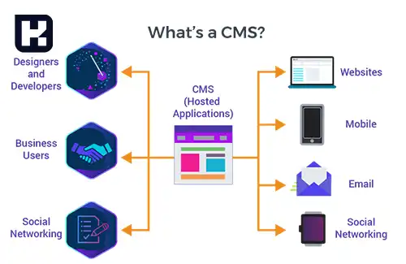

<blockquote style="background-color:#eeeefc; padding:0.5rem">

  
آنچه در این مطلب خواهید خواند

  <ul>
      <li>سیستم مدیریت محتوا (CMS) چیست؟</li>
      <li>اجزای سیستم مدیریت محتوا و ساختار آن</li>
      <li>مزایای CMS</li>
      <li>استفاده از ابزارهای داخلی یا افزونه‌های شخص ثالث</li>
      <li>انواع مختلف سیستم‌های مدیریت محتوا</li>
      <li>عملکرد سیستم مدیریت محتوا (CMS)</li>
      <li>امکانات سیستم مدیریت محتوا</li>
      <li>وب‌سایت‌های قابل ساخت با CMS کدام‌اند؟</li>
      <li>چگونه با استفاده از CMS وب‌سایت بسازیم؟</li>
  </ul>

</blockquote>

داشتن یک وب‌سایت کارآمد و به‌روز برای کسب‌وکارها و افراد ضروری است اما ساخت و مدیریت یک وب‌سایت می‌تواند چالش‌برانگیز باشد، به‌ویژه برای کسانی که دانش فنی محدودی دارند. اینجاست که سیستم مدیریت محتوا (CMS) وارد عمل می‌شود.

 سیستم مدیریت محتوا ابزاری قدرتمند است که فرآیند ایجاد، ویرایش و مدیریت محتوای دیجیتال را ساده می‌کند. در این مقاله، به بررسی مفهوم CMS، مزایای آن و چگونگی عملکرد آن می‌پردازیم تا درک بهتری از این تکنولوژی کاربردی داشته باشید.

## سیستم مدیریت محتوا (CMS) چیست؟ 

CMS یا Content Management System یک نرم‌افزار است که به وسیله آن می‌توان محتوا را به راحتی منتشر، ویرایش، سازماندهی، حذف و نگهداری کرد همه این فعالیت‌ ها جزو وظایف مدیریت محتوا محسوب می‌شوند.

به زبان ساده ‌تر:

سیستم مدیریت محتوا یک ابزار است که بدون نیاز به برنامه‌نویسی، کمکتان می‌کند یک وب‌ سایت درست کنید شما نیاز ندارید خودتان سیستمی برای ساخت صفحات وب ذخیره عکس‌ها و دیگر کارهای پایه ‌ای درست کنید CMS این کارهای پایه را برایتان انجام می‌دهد تا بتوانید روی بخش‌های مهم وب‌سایت‌تان تمرکز کنید علاوه بر وب‌سایت‌ها، می‌توانید CMS را برای مدیریت اسناد و دیگر کارها هم استفاده کنید

### اجزای سیستم مدیریت محتوا و ساختار آن
- برنامه مدیریت محتوا (CMS): این بخش به شما اجازه می‌دهد محتوا را در سایت خود اضافه کنید و مدیریت نمایید.
- برنامه تحویل محتوا (CDA): این قسمت در پس‌زمینه فعالیت می‌کند و محتوای وارد شده در CMS را ذخیره کرده و برای نمایش به بازدیدکنندگان سایت آماده می‌کند.

### مزایای CMS 

یکی از مزایای اصلی CMS، بوجود آورنده محیط همکاری است. چندین فرد می‌توانند وارد سیستم شده و در زمانی که لازم است، محتوا را ویرایش یا برنامه‌ریزی کنند. با توجه به اینکه رابط کاربری اغلب بر مبنای مرورگر است، CMS می‌تواند از هر مکان برای هر تعداد از کاربران قابل دسترسی باشد.

زمانی که یک شرکت از CMS برای انتشار صفحات وب خود استفاده می‌کند، وابستگی به مهندسان اصلی برای اعمال تغییرات در وب‌سایت کاهش یافته و فرآیند انتشار محتوا به شکل سریعتر و آسان‌تری امکان‌پذیر می‌شود.

### استفاده از ابزارهای داخلی یا افزونه‌های شخص ثالث 

- تخصیص عنوان صفحه و توضیحات متا به دلخواه
- انتخاب ساختار URL مناسب برای بهبود بهینه‌ سازی سئو
- ایجاد نقشه سایت XML
- افزودن متن alt به تصاویر
- ایجاد تغییرات در مسیرهای مورد نیاز
- وارد کردن پیمایش فید
- بهینه‌سازی زمان بارگذاری صفحه
اعمال این تنظیمات به بهبود احتمال رتبه‌بندی شما در موتورهای جستجوی اصلی، از جمله Google، به شدت کمک می‌کند.

### انواع مختلف سیستم‌های مدیریت محتوا

سیستم‌های مدیریت محتوا دارای انواع و اقسام مختلفی هستند؛ اما به طور کلی، آن‌ها را به دو دسته اشتراکی (SAAS) و کدباز (Open Source) می‌توان تقسیم کرد. 
وردپرس توانسته است بیشترین سهم بازار را در بین انواع سیستم‌های مدیریت محتوا به خود اختصاص دهد.

به جز ابزار وردپرس، دیگر سیستم‌های مدیریت محتوا معروف شامل:

-	جوملا(Joomla)
-	دروپال(drupal)
-	برای فروشگاه های تجارت الکترونیک(magneto) 
-	Squarespace 
-	ویکس (wix) 
-	TYPO3

### عملکرد سیستم مدیریت محتوا (CMS)

-	ایجاد محتوای وب سایت
-	مدیریت محتوای سایت
-	انتشار مطالب
-	نمایش مطالب در سایت

### امکانات سیستم مدیریت محتوا 
سیستم‌های مدیریت محتوا، به طور پیش‌فرض یا از طریق نصب افزونه‌های مختلف، امکانات زیادی را فراهم می‌کنند این امکانات شامل موارد زیر هستند:
-	ایجاد پنل ورود و عضویت در سایت
-	تولید، ویرایش و انتشار محتوا در سایت
-	مدیریت کاربران وب‌ سایت
-	ایجاد آرشیو برای هر نوع محتوا
-	مدیریت رسانه ‌های سایت
-	امکانات سئو یا بهینه سازی سایت
-	درج، ویرایش و حذف محصول

### وب‌سایت‌های قابل ساخت با CMS کدام‌اند؟

اکثر سیستم‌های مدیریت محتوا (CMS) بسیار انعطاف‌پذیر هستند. برخی از آنها ممکن است بر استفاده‌های خاصی تمرکز داشته باشند – مانند Magento که برای تجارت الکترونیک طراحی شده است – اما اکثر CMS‌های رایج می‌توانند برای ساخت انواع وب‌سایت‌ها مورد استفاده قرار گیرند. 

- فروشگاه‌های تجارت الکترونیک  
- دوره‌های آنلاین  
- سایت‌های عضویت  
- شبکه‌های اجتماعی  
- انجمن‌ها  
- وبلاگ‌ها  
- نمونه‌کارها  
- وب‌سایت‌های استاتیک

### چگونه با استفاده از CMS وب‌سایت بسازیم؟

برای فروش آنلاین کالا یا خدمات، به یک وب‌سایت و درگاه پرداخت نیاز دارید. آیا قصد دارید وب‌سایت خود را با استفاده از سیستم مدیریت محتوا (CMS) بسازید؟ اگر پاسخ مثبت است، مراحل کلی به شرح زیر است:

-  خرید میزبانی وب و نام دامنه
- نصب سیستم مدیریت محتوای انتخابی بر روی سرور وب
- پیکربندی CMS برای تعیین نحوه نمایش و عملکرد سایت
- ایجاد محتوا از طریق رابط کاربری CMS
