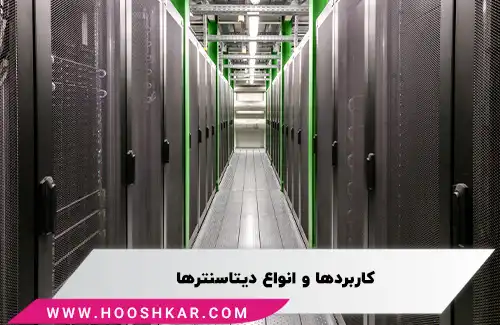

<blockquote style="background-color:#eeeefc; padding:0.5rem">

  
آنچه در این مطلب خواهید خواند

  <ul>
  <li>دیتاسنتر چیست؟</li>
  <li>تاریخچه دیتاسنتر</li>
  <li>ویژگی‌های یک دیتاسنتر مدرن چیست؟</li>
  <li>اجزای معماری دیتاسنتر</li>
  <li>دیتاسنتر چه کاربرد هایی دارد؟</li>
  <li>انواع دیتاسنتر</li>
  <li>سطوح گوناگون مراکز داده چیست؟</li>
  <li>امنیت مرکز داده</li>
  </ul>

</blockquote>

مرکز داده یا دیتاسنتر (Data Center) یک زیرساخت کلیدی در دنیای فناوری اطلاعات است که برای میزبانی، مدیریت و پردازش حجم‌های بزرگ داده‌ها طراحی شده است. این مراکز با ارائه تجهیزات و امکانات پیشرفته، نقش حیاتی در نگهداری و پردازش داده‌ها و ارائه خدمات اینترنتی و ابری به سازمان‌ها و شرکت‌ها ایفا می‌کنند. 

در این مقاله به بررسی ویژگی‌های دیتاسنتر، تاریخچه توسعه آن، کاربردهای مختلف و انواع مختلف این مراکز خواهیم پرداخت. همچنین به تحلیل سطوح مختلف دیتاسنترها و اهمیت امنیت در این مراکز خواهیم پرداخت تا درک کاملی از نحوه عملکرد و اهمیت آن‌ها در دنیای دیجیتال امروز پیدا کنیم.

## دیتاسنتر چیست؟

مرکز داده، که به آن دیتاسنتر (Data Center) نیز گفته می‌شود، یک مجموعه تخصصی است که برای میزبانی، مدیریت و ارائه خدمات پردازش و ذخیره‌سازی داده‌ها طراحی شده است.
این مراکز با فراهم آوردن زیرساخت‌ها و امکانات لازم، قادر به پردازش و نگهداری حجم عظیمی از داده‌ها و تجهیزات شبکه هستند. دیتاسنترها به شرکت‌ها و سازمان‌ها این امکان را می‌دهند تا ضمن حفظ امنیت و پایداری اطلاعات خود، خدمات اینترنتی و ابری را نیز ارائه دهند.

### تاریخچه دیتاسنتر

نخستین نسل دیتاسنترها را می‌توان در سیستم‌های کامپیوتری ابتدایی مانند ENIAC یافت، که در دهه ۱۹۴۰ توسط دکتر جان ماکلی و تیمی ۵۰ نفره ساخته شد. این سیستم‌های پیچیده، که عمدتاً توسط ارتش استفاده می‌شدند، نیاز به نگهداری و مدیریت خاصی داشتند. در دهه ۱۹۵۰، سیستم UNIVAC به عنوان اولین کامپیوتری که داده‌ها را روی نوارهای مغناطیسی ذخیره می‌کرد، ساخته شد. سپس در دهه ۱۹۶۰، IBM با تولید TRADIC، اولین کامپیوتر ترانزیستوری جهان، دیتاسنترها را وارد حوزه تجاری کرد. در دهه ۱۹۷۰، زیراکس با ساخت کامپیوتر زیراکس آلتو، اولین رایانه رومیزی با رابط گرافیکی، نمایشگر با وضوح بالا و حافظه داخلی بزرگ، تحول بزرگی ایجاد کرد.

با ورود به دهه ۱۹۹۰ و رشد سریع علم کامپیوتر، اصطلاح دیتاسنتر برای اولین بار مطرح شد و شرکت‌ها قادر شدند تمامی سرورهای ضروری خود را در یک اتاق مشخص قرار دهند. در اواخر همین دهه، با افزایش تقاضا برای اینترنت پرسرعت، تجهیزات بزرگ‌تر و پیچیده‌تری برای نگهداری سرورها مورد استفاده قرار گرفت و دیتاسنترها به محبوبیت بیشتری دست یافتند.

 در سال ۲۰۰۲، آمازون با ارائه خدمات ابری، نوآوری جدیدی را معرفی کرد. سپس در سال ۲۰۰۷، Sun Microsystems دیتاسنتر مدولار را ارائه داد که به شکل قابل توجهی توان محاسباتی شرکت‌ها را افزایش داد. بین سال‌های ۲۰۰۸ تا ۲۰۱۱، تمرکز شرکت‌ها به سمت بهره‌وری انرژی و مدیریت امکانات دیتاسنترها معطوف شد. در نهایت، در سال ۲۰۱۳ گوگل مبلغ ۷.۳۵ میلیارد دلار برای گسترش شبکه جهانی دیتاسنترهای خود سرمایه‌گذاری کرد. امکانات و فناوری‌های مراکزداده همچنان در حال پیشرفت و تکامل هستند.

### ویژگی‌های یک دیتاسنتر مدرن چیست؟

در حوزه فناوری اطلاعات سازمانی، دیتاسنترها به منظور پشتیبانی از برنامه‌ها و عملیات تجاری مختلف طراحی شده‌اند که موارد زیر را در بر می‌گیرند:

- ارسال ایمیل و اشتراک‌گذاری فایل‌ها
- نرم‌افزارهای افزایش بهره‌وری
- مدیریت روابط با مشتری (CRM)
- برنامه‌ریزی منابع سازمانی (ERP) و مدیریت پایگاه‌های داده
- تحلیل داده‌های کلان، هوش مصنوعی و یادگیری ماشینی
- دسکتاپ‌های مجازی، سرویس‌های ارتباطی و همکاری تیمی

### اجزای معماری دیتاسنتر

مرکزهای داده از سه بخش اصلی تشکیل می‌شوند: محاسبات، ذخیره‌سازی و شبکه اما این بخش‌ها تنها قسمت کوچکی از یک دیتاسنتر مدرن را تشکیل می‌دهند. در لایه‌های زیرین، زیرساخت‌های پشتیبانی برای تامین توافق‌نامه‌های سطح خدمات دیتاسنترهای سازمانی بسیار حیاتی هستند.

### دیتاسنتر چه کاربرد هایی دارد؟

امروزه بیش از ۷ میلیون دیتاسنتر در سطح جهانی وجود دارد. این مراکز داده به عنوان اجزای ضروری در سازمان‌ها و شرکت‌های بزرگ و کوچک عمل می‌کنند و برای پشتیبانی از فعالیت‌های تجاری و ارائه خدمات گوناگون طراحی شده‌اند. برخی از این خدمات عبارتند از:

- اشتراک‌گذاری فایل‌ها از طریق ایمیل
- ذخیره‌سازی، مدیریت، پشتیبان‌گیری و بازیابی داده‌ها
- اپلیکیشن‌های مرتبط با بهره‌وری
- انجام تراکنش‌های آنلاین با حجم بالا
- سیستم‌های مدیریت ارتباط با مشتری (CRM)
- تقویت جوامع بازی‌های آنلاین
- ارتباط بین سیستم‌های برنامه‌ریزی منابع سازمانی (ERP) و پایگاه‌های داده
- کلان‌داده، هوش مصنوعی و یادگیری ماشین
- دسکتاپ مجازی و خدمات ارتباطی

### انواع دیتاسنتر

- دیتاسنتر سازمانی (Enterprise Data Center)
- دیتاسنتر تحت مدیریت (Managed Data Center)
- دیتاسنتر کولوکیشن   (Colocation Data center)
- دیتاسنتر فرامقیاس (Hyperscale Data Center)

### سطوح گوناگون مراکز داده چیست؟

دیتاسنترها بر اساس منابع، نرخ آپتایم و ظرفیت به سطوح مختلف تقسیم می‌شوند. در سال ۲۰۰۵، مؤسسه استانداردهای ملی آمریکا و انجمن صنایع ارتباطات استاندارد ANSI/TIA-942 را منتشر کردند که در آن دیتاسنترها از نظر آپتایم و افزونگی به چهار دسته اصلی تقسیم شده‌اند.

**سطح اول (Tier I)**

دیتاسنترهای سطح اول، ابتدایی‌ترین نوع مراکز داده هستند و تنها یک UPS دارند. این دیتاسنترها باید حداقل نرخ آپتایم ۹۹.۶۷۱٪ را تأمین کنند و تنها به میزان محدودی قادر به محافظت از خود در برابر حوادث فیزیکی هستند.

**سطح دوم (Tier II)**

این دیتاسنترها به سیستم‌های پشتیبان برق و خنک‌کننده مجهز بوده و آپتایم حداقلی ۹۹.۷۴۱٪ را تضمین می‌کنند. سطح امنیت و حفاظت در این مراکز نسبت به سطح اول به طور محسوسی ارتقا یافته است.

**سطح سوم (Tier III)**

دیتاسنترهای سطح سوم دارای افزونگی کامل و نرخ آپتایم ۹۹.۹۸۲٪ هستند و در برابر خطاهای نسبی مقاومند. این مراکز داده تقریباً به طور کامل از خود در برابر تمام حوادث فیزیکی محافظت می‌کنند.

**سطح چهارم (Tier IV)**

دیتاسنترهای سطح چهارم نرخ آپتایم ۹۹.۹۹۵٪ را تضمین می‌کنند و دارای تحمل خطا و افزونگی سیستمی کامل هستند. این مراکز داده تقریباً در برابر تمامی حوادث فیزیکی به طور کامل ایمن هستند.

### امنیت مرکز داده

علاوه بر سیستم‌های امنیتی ساختمان که از مرکز داده پشتیبانی می‌کنند و پیش‌تر به آن‌ها اشاره شد، شبکه‌های مرکز داده نیاز به تحلیل دقیق مدل (Zero Trust) دارند که باید در طراحی هر مرکز داده گنجانده شود. فایروال‌های مرکز داده، کنترل‌های دسترسی به داده‌ها، سیستم‌های IPS، WAF و معادل‌های مدرن آن‌ها نظیر سیستم‌های محافظت از وب و API (WAAP) باید به‌طور صحیح انتخاب شوند تا مقیاس‌پذیری لازم برای پاسخگویی به نیازهای شبکه‌های مرکز داده را فراهم کنند.

 همچنین، اگر به دنبال انتخاب یک ارائه‌دهنده خدمات ذخیره‌سازی داده یا خدمات ابری هستید، مهم است که از تدابیر امنیتی که آن‌ها برای مرکز داده خود استفاده می‌کنند، آگاهی داشته باشید. برای حفاظت از اطلاعات خود، در بالاترین سطح امنیت ممکن سرمایه‌گذاری کنید.
