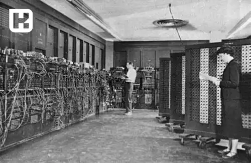
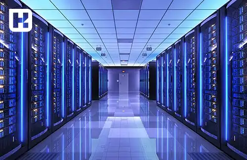
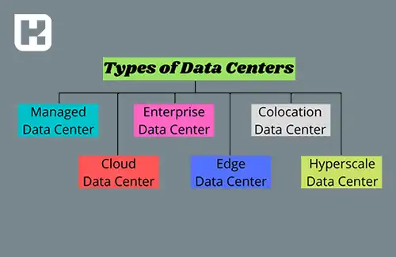

<blockquote style="background-color:#eeeefc; padding:0.5rem">

  
آنچه در این مطلب خواهید خواند

  <ul>
    <li>دیتاسنتر چیست؟</li>
    <li>تاریخچه دیتاسنتر</li>
    <li>ویژگی‌های دیتاسنتر مدرن</li>
    <li>کاربردهای دیتاسنتر</li>
    <li>انواع دیتاسنتر</li>
    <li>سطوح مختلف دیتاسنترها</li>
    <li>امنیت دیتاسنتر</li>
  </ul>

</blockquote>

مرکز داده یا دیتاسنتر (Data Center) یکی از زیرساخت‌های کلیدی فناوری اطلاعات است که برای ذخیره‌سازی، مدیریت و پردازش حجم عظیمی از داده‌ها طراحی شده است. این مراکز با ارائه تجهیزات و امکانات پیشرفته، نقشی اساسی در نگهداری اطلاعات، پشتیبانی از عملیات سازمانی و ارائه خدمات ابری و اینترنتی به عهده دارند. در ادامه با مفهوم دیتاسنتر، تاریخچه، ویژگی‌ها، کاربردها، انواع و اهمیت امنیت در این مراکز آشنا می‌شویم.  

## دیتاسنتر چیست؟
دیتاسنتر یا مرکز داده، مکانی تخصصی است که برای ذخیره، پردازش و مدیریت داده‌ها و خدمات دیجیتال طراحی شده است. این مراکز شامل تجهیزات فیزیکی و مجازی از جمله سرورها، ذخیره‌سازها، سیستم‌های شبکه و زیرساخت‌های امنیتی هستند. دیتاسنترها به سازمان‌ها کمک می‌کنند تا اطلاعات را با امنیت بالا نگهداری کرده و خدمات اینترنتی و ابری خود را ارائه دهند.  

---

### تاریخچه دیتاسنتر
#### الف) اولین دیتاسنترها
نخستین دیتاسنترها در دهه ۱۹۴۰ با ساخت کامپیوترهای بزرگی مانند ENIAC شکل گرفتند که نیاز به محیط‌های تخصصی برای مدیریت و نگهداری داشتند.  

#### ب) توسعه در دهه‌های بعد
- دهه ۱۹۵۰: معرفی UNIVAC برای ذخیره‌سازی مغناطیسی.  
- دهه ۱۹۶۰: IBM با TRADIC اولین کامپیوتر ترانزیستوری تجاری را معرفی کرد.  
- دهه ۱۹۹۰: مفهوم مدرن دیتاسنتر با تمرکز بر نگهداری سرورها و ارائه خدمات اینترنتی پدید آمد.  

#### ج) نوآوری‌های قرن ۲۱
- سال ۲۰۰۲: آمازون خدمات ابری را معرفی کرد.  
- سال ۲۰۰۷: Sun Microsystems دیتاسنتر مدولار ارائه داد.  
- سال ۲۰۱۳: گوگل با سرمایه‌گذاری بزرگ شبکه جهانی دیتاسنترها را گسترش داد.  

---

### ویژگی‌های دیتاسنتر مدرن
دیتاسنترهای مدرن برای پشتیبانی از فعالیت‌های مختلف طراحی شده‌اند، از جمله:  
- ارسال ایمیل و اشتراک‌گذاری فایل.  
- پردازش کلان‌داده، هوش مصنوعی و یادگیری ماشین.  
- اجرای اپلیکیشن‌های تجاری مانند CRM و ERP.  
- ارائه خدمات ابری و ذخیره‌سازی داده.  

#### اجزای اصلی دیتاسنتر
1. **محاسبات**: سرورها و منابع پردازشی.  
2. **ذخیره‌سازی**: سیستم‌های ذخیره داده.  
3. **شبکه**: اتصال بین اجزا و ارتباط با دنیای خارج.  

---

### کاربردهای دیتاسنتر

#### الف) ذخیره و مدیریت داده‌ها
دیتاسنترها حجم عظیمی از داده‌ها را ذخیره و مدیریت می‌کنند.  

#### ب) پشتیبانی از عملیات تجاری
این مراکز زیرساخت لازم برای عملیات حیاتی مانند مدیریت پایگاه داده، تراکنش‌های آنلاین و تحلیل داده‌ها را فراهم می‌کنند.  

#### ج) ارائه خدمات ابری
دیتاسنترها امکان ارائه خدمات ابری و دسکتاپ‌های مجازی را فراهم می‌کنند.  

#### د) تحلیل و یادگیری ماشین
برای پردازش کلان‌داده و پیشرفت‌های هوش مصنوعی و یادگیری ماشین استفاده می‌شوند.  

---

### انواع دیتاسنتر

می‌توانید انواع مختلفی از مراکز داده را براساس مالکیت، فناوری‌های استفاده‌شده و بهره‌وری انرژی مشاهده کنید. برخی از انواع اصلی مراکز داده که سازمان‌ها از آن‌ها استفاده می‌کنند عبارت‌اند از:

مراکز داده مدیریت‌شده
در یک مرکز داده مدیریت‌شده، یک ارائه‌دهنده خدمات شخص ثالث، محاسبات، ذخیره‌سازی داده و سایر خدمات مرتبط را به سازمان‌ها ارائه می‌دهد تا به آن‌ها در اجرای عملیات IT کمک کند. این ارائه‌دهنده خدمات این نوع مرکز داده را راه‌اندازی، نظارت و مدیریت کرده و قابلیت‌ها را از طریق یک پلتفرم مدیریت‌شده ارائه می‌دهد.

خدمات مراکز داده مدیریت‌شده را می‌توان از یک مرکز کولیشن (colocation)، مراکز داده ابری یا سایت‌های میزبانی ثابت دریافت کرد. این مرکز داده می‌تواند به‌طور جزئی یا کامل مدیریت شود.

اگر به‌طور جزئی مدیریت شود، سازمان کنترل مدیریتی بر خدمات و پیاده‌سازی مرکز داده خواهد داشت.
اگر به‌طور کامل مدیریت شود، همه جزئیات داده‌های پشتیبانی و فنی توسط ارائه‌دهنده خدمات مدیریت و کنترل می‌شود.

**مناسب برای: کسب‌وکارهای متوسط تا بزرگ.**

**مزایا:**

نیاز به مدیریت تعمیرات و نگهداری، امنیت و سایر جنبه‌ها از بین می‌رود. ارائه‌دهنده مرکز داده مسئول حفظ خدمات شبکه، ارتقاء سیستم‌ها و بازگردانی خدمات در صورت بروز مشکل است.

#### مراکز داده سازمانی
مرکز داده سازمانی یک تأسیسات خصوصی است که از عملیات IT یک سازمان پشتیبانی می‌کند. این مرکز می‌تواند در مکانی درون‌سازمانی یا خارج از آن قرار گیرد. این نوع مرکز داده ممکن است شامل چندین مرکز داده در مکان‌های مختلف جهانی باشد تا از عملکردهای کلیدی سازمان پشتیبانی کند.

برای مثال: اگر یک کسب‌وکار مشتریانی در مناطق مختلف جهانی داشته باشد، می‌تواند مراکز داده‌ای نزدیک‌تر به مشتریان خود ایجاد کند تا خدمات سریع‌تری ارائه دهد.

#### انواع مراکز داده سازمانی

**اینترانت:** داده‌ها و برنامه‌های داخل مرکز داده اصلی را کنترل می‌کند. سازمان از این داده‌ها برای تحقیق و توسعه، بازاریابی، تولید و سایر فعالیت‌ها استفاده می‌کند.

**اکسترانت:** تراکنش‌های بین کسب‌وکارها را در شبکه مرکز داده انجام می‌دهد.

**اینترنت:** برای پشتیبانی از سرورها و دستگاه‌های موردنیاز جهت اجرای برنامه‌های وب استفاده می‌شود.

**مناسب برای: سازمان‌های بزرگ با گسترش جهانی و نیازهای شبکه‌ای ویژه.**

**مزایا:**

- امکان نظارت بر معیارهای مهم مانند مصرف انرژی و پهنای باند.

- امکان به‌روزرسانی سیستم‌ها و برنامه‌ها برای تطبیق با نیازهای در حال تغییر.

**معایب:**

 سرمایه‌گذاری‌های سنگین، نیازهای نگهداری بالا و صرف زمان و تلاش زیاد برای ساخت این تأسیسات.

#### مراکز داده کولیشن (Colocation)

یک مرکز داده کولیشن، تأسیساتی است که یک کسب‌وکار می‌تواند از مالک آن اجاره کند تا عملیات IT خود را پشتیبانی کند. این مراکز به‌ویژه برای سازمان‌هایی که منابع کافی برای ساخت و مدیریت یک مرکز داده مستقل ندارند، محبوب شده‌اند.

**مناسب برای: کسب‌وکارهای متوسط تا بزرگ.**

**مزایا:**

- مقیاس‌پذیری برای حمایت از رشد کسب‌وکار.

- امکان میزبانی مرکز داده در مکان‌های نزدیک به مشتریان برای ارائه تجربه بهتر.

- قابلیت اطمینان بالا با سرورهای قدرتمند و سیستم‌های پشتیبان.

- کاهش هزینه‌ها با اجاره به‌جای ساخت مراکز داده مستقل.

- نیازی به مدیریت فرآیندهای نگهداری نیست.

#### مراکز داده ابری

یکی از انواع محبوب مراکز داده، مرکز داده ابری است که توسط یک ارائه‌دهنده خدمات ابری مدیریت می‌شود. در این نوع، داده‌ها در سرورهای ابری آپلود و تکرار شده و در مکان‌های مختلف ذخیره می‌شوند تا از از دست رفتن آن‌ها جلوگیری شود.

**دو نوع اصلی:**

**ابر عمومی:** ارائه منابع از طریق اینترنت به عموم مردم (مثل AWS و Azure).

**ابر خصوصی:** ارائه خدمات سفارشی با دسترسی خصوصی.

**مناسب برای:** تمام سازمان‌ها، صرف‌نظر از نوع یا اندازه.

**مزایا:**

- مقرون‌به‌صرفه بودن.

- بدون نیاز به نگهداری.

- انعطاف‌پذیری در برنامه‌های قیمت‌گذاری.

- مراکز داده مرزی (Edge)

- این مراکز داده کوچک‌تر و نزدیک‌تر به مشتریان هستند. آن‌ها با استفاده از محاسبات مرزی عملیات سریع‌تر را امکان‌پذیر می‌کنند.

**مناسب برای: کسب‌وکارهای کوچک تا متوسط.**

**مزایا:**

- افزایش سرعت پاسخ‌دهی به درخواست‌های کاربران.
- افزایش قابلیت اطمینان شبکه.
- مراکز داده فوق مقیاس (Hyperscale) این مراکز داده عظیم برای مدیریت داده‌های بزرگ طراحی شده‌اند و به سازمان‌ها امکان مقیاس‌پذیری بالا را می‌دهند.

**مناسب برای: سازمان‌های بزرگ با داده‌های زیاد.**

**مزایا:**

- انعطاف‌پذیری بالا.
- سرعت بیشتر در ارائه خدمات به مشتریان.
- بدون نیاز به نگهداری مستقل.

#### سایر انواع مراکز داده:

- هتل‌های حامل: نقاط اصلی تبادل اینترنتی.
- مراکز داده کوچک: نسخه‌ای فشرده از مراکز داده مرزی.
- مراکز داده سنتی: شامل چندین سرور در رک‌های مختلف.
- مراکز داده ماژولار: قابل حمل و مقیاس‌پذیر برای مکان‌های خاص.

---

### سطوح مختلف دیتاسنترها

یکی دیگر از روش‌های طبقه‌بندی مراکز داده بر اساس زمان کارکرد و قابلیت اطمینان، استفاده از رده‌بندی (Tier) مراکز داده است. این سیستم توسط موسسه Uptime در دهه 1990 توسعه داده شد و شامل ۴ رده است. بیایید آن‌ها را بررسی کنیم:

**رده ۱ (Tier 1):**

یک مرکز داده رده ۱ دارای ظرفیت پایه است و شامل یک UPS (منبع تغذیه بدون وقفه) می‌شود.
تعداد کمتری از اجزا برای افزونگی (Redundancy) و پشتیبان‌گیری دارد و تنها یک مسیر برای خنک‌سازی و تأمین برق فراهم می‌کند.
این مراکز شامل زمان توقف بیشتری هستند و ممکن است فاقد سیستم‌های بهینه‌سازی انرژی باشند.

**زمان کارکرد تضمین‌شده:**  حداقل 99.671% که به معنای ۲۸.۸ ساعت توقف سالانه است.

**رده ۲ (Tier 2):**

یک مرکز داده رده ۲ دارای ظرفیت افزونگی است و تعداد بیشتری از اجزا برای افزونگی و پشتیبان‌گیری نسبت به رده ۱ ارائه می‌دهد.
این مراکز نیز مانند رده ۱ تنها یک مسیر برای خنک‌سازی و تأمین برق دارند.
معمولاً این مراکز داده خصوصی هستند و از نظر بهره‌وری انرژی محدودیت‌هایی دارند.

**زمان کارکرد تضمین‌شده:** حداقل 99.741% که به معنای ۲۲ ساعت توقف سالانه است.

**رده ۳ (Tier 3):**

یک مرکز داده رده ۳ به‌صورت قابل نگهداری هم‌زمان (Concurrently Maintainable) طراحی شده است، به‌طوری که حذف هر جزء بدون تأثیر بر فرآیندها امکان‌پذیر است.
این مراکز دارای مسیرهای مختلفی برای خنک‌سازی و تأمین برق هستند تا بتوانند سیستم‌ها را حفظ و به‌روزرسانی کنند.

دارای سیستم‌های افزونه‌ای برای کاهش خطاهای عملیاتی و خرابی تجهیزات هستند.
از سیستم‌های UPS استفاده می‌کنند که برق را به‌طور مداوم به سرورها تأمین می‌کنند و ژنراتورهای پشتیبان نیز دارند.

**زمان کارکرد تضمین‌شده:** حداقل 99.982% که معادل ۱.۶ ساعت توقف سالانه است.

**افزونگی:** N+1، بالاتر از رده‌های ۱ و ۲.

**رده ۴ (Tier 4):**

یک مرکز داده رده ۴ به‌صورت مقاوم در برابر خطا (Fault-Tolerant) طراحی شده است و به آن اجازه می‌دهد که ظرفیت تولید خود را در برابر هر نوع خرابی محافظت کند.
این مراکز نیاز به دو برابر اجزا، تجهیزات و منابع دارند تا جریان خدمات را حتی در زمان اختلالات حفظ کنند.

**کاربرد:** عملیات‌های حیاتی کسب‌وکارهایی که نمی‌توانند توقف را تحمل کنند، از مراکز داده رده ۴ استفاده می‌کنند.

**زمان کارکرد تضمین‌شده:** حداقل 99.995% که به معنای ۰.۴ ساعت توقف سالانه است.

**افزونگی:** 2N، که سطح بالایی از قابلیت اطمینان و پایداری را فراهم می‌کند.

---

### امنیت دیتاسنتر
امنیت دیتاسنترها شامل تدابیر زیر است:  
- استفاده از مدل امنیتی **Zero Trust**.  
- فایروال‌های قوی، سیستم‌های پیشگیری از نفوذ (IPS) و ابزارهای تحلیل رفتار.  
- مدیریت دسترسی و جلوگیری از نشت اطلاعات حساس.  
- به‌کارگیری فناوری‌های پیشرفته برای مقابله با حملات سایبری.  

---

### جمع‌بندی
دیتاسنترها زیرساختی حیاتی در دنیای دیجیتال هستند که امکان ذخیره‌سازی، پردازش و ارائه خدمات ابری را برای شرکت‌ها فراهم می‌کنند. توسعه فناوری‌های مدرن و پیشرفت در امنیت و بهره‌وری انرژی، دیتاسنترها را به بخشی جدایی‌ناپذیر از عصر دیجیتال تبدیل کرده است. سازمان‌ها برای دستیابی به موفقیت‌های بیشتر در حوزه فناوری اطلاعات، به سرمایه‌گذاری در دیتاسنترهای پیشرفته نیاز دارند.  