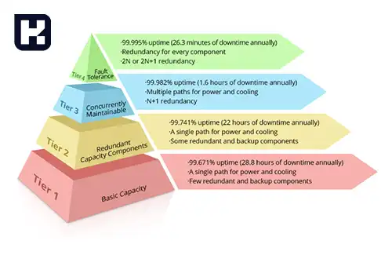

<blockquote class="faq-block">

  
آنچه در این مطلب خواهید خواند

  <ul>
    <li>دیتاسنتر چیست؟</li>
    <li>تاریخچه دیتاسنتر</li>
    <li>ویژگی‌های دیتاسنتر مدرن</li>
    <li>کاربردهای دیتاسنتر</li>
    <li>انواع دیتاسنتر</li>
    <li>سطوح مختلف دیتاسنترها</li>
    <li>امنیت دیتاسنتر</li>
    <li>سوالات متداول</li>
    <li>جمع‌بندی</li>
  </ul>

</blockquote> 

مرکز داده یا دیتاسنتر (Data Center) یکی از زیرساخت‌های کلیدی فناوری اطلاعات است که برای ذخیره‌سازی، مدیریت و پردازش حجم عظیمی از داده‌ها طراحی شده است. این مراکز با ارائه تجهیزات و امکانات پیشرفته، نقشی اساسی در نگهداری اطلاعات، پشتیبانی از عملیات سازمانی و ارائه خدمات ابری و اینترنتی به عهده دارند. در ادامه با مفهوم دیتاسنتر، تاریخچه، ویژگی‌ها، کاربردها، انواع و اهمیت امنیت در این مراکز آشنا می‌شویم.  

## دیتاسنتر چیست؟
دیتاسنتر یا مرکز داده، مکانی تخصصی است که برای ذخیره، پردازش و مدیریت داده‌ها و خدمات دیجیتال طراحی شده است. این مراکز شامل تجهیزات فیزیکی و مجازی از جمله سرورها، ذخیره‌سازها، سیستم‌های شبکه و زیرساخت‌های امنیتی هستند. دیتاسنترها به سازمان‌ها کمک می‌کنند تا اطلاعات را با امنیت بالا نگهداری کرده و خدمات اینترنتی و ابری خود را ارائه دهند.  

---

### تاریخچه دیتاسنتر

#### الف) اولین دیتاسنترها
نخستین دیتاسنترها در دهه ۱۹۴۰ با ساخت کامپیوترهای بزرگی مانند ENIAC شکل گرفتند که نیاز به محیط‌های تخصصی برای مدیریت و نگهداری داشتند.  

#### ب) توسعه در دهه‌های بعد
- دهه ۱۹۵۰: معرفی UNIVAC برای ذخیره‌سازی مغناطیسی.  
- دهه ۱۹۶۰: IBM با TRADIC اولین کامپیوتر ترانزیستوری تجاری را معرفی کرد.  
- دهه ۱۹۹۰: مفهوم مدرن دیتاسنتر با تمرکز بر نگهداری سرورها و ارائه خدمات اینترنتی پدید آمد.  

#### ج) نوآوری‌های قرن ۲۱
- سال ۲۰۰۲: آمازون خدمات ابری را معرفی کرد.  
- سال ۲۰۰۷: Sun Microsystems دیتاسنتر مدولار ارائه داد.  
- سال ۲۰۱۳: گوگل با سرمایه‌گذاری بزرگ شبکه جهانی دیتاسنترها را گسترش داد.  

---

### ویژگی‌های دیتاسنتر مدرن

دیتاسنترهای مدرن برای پشتیبانی از فعالیت‌های مختلف طراحی شده‌اند، از جمله:  

- ارسال ایمیل و اشتراک‌گذاری فایل.  
- پردازش کلان‌داده، هوش مصنوعی و یادگیری ماشین.  
- اجرای اپلیکیشن‌های تجاری مانند CRM و ERP.  
- ارائه خدمات ابری و ذخیره‌سازی داده.  

#### اجزای اصلی دیتاسنتر

1. **محاسبات**: سرورها و منابع پردازشی.  
2. **ذخیره‌سازی**: سیستم‌های ذخیره داده.  
3. **شبکه**: اتصال بین اجزا و ارتباط با دنیای خارج.  

---

### کاربردهای دیتاسنتر

#### الف) ذخیره و مدیریت داده‌ها
دیتاسنترها حجم عظیمی از داده‌ها را ذخیره و مدیریت می‌کنند.  

#### ب) پشتیبانی از عملیات تجاری
این مراکز زیرساخت لازم برای عملیات حیاتی مانند مدیریت پایگاه داده، تراکنش‌های آنلاین و تحلیل داده‌ها را فراهم می‌کنند.  

#### ج) ارائه خدمات ابری
دیتاسنترها امکان ارائه خدمات ابری و دسکتاپ‌های مجازی را فراهم می‌کنند.  

#### د) تحلیل و یادگیری ماشین
برای پردازش کلان‌داده و پیشرفت‌های هوش مصنوعی و یادگیری ماشین استفاده می‌شوند.  

---

### انواع دیتاسنتر

می‌توانید انواع مختلفی از مراکز داده را براساس مالکیت، فناوری‌های استفاده‌شده و بهره‌وری انرژی مشاهده کنید. برخی از انواع اصلی مراکز داده که سازمان‌ها از آن‌ها استفاده می‌کنند عبارت‌اند از:

#### 1. مراکز داده مدیریت‌شده
   توسط یک ارائه‌دهنده خدمات شخص ثالث راه‌اندازی و مدیریت می‌شوند. خدمات آن می‌تواند به‌صورت جزئی یا کامل باشد.  
   
   - **مناسب برای**: کسب‌وکارهای متوسط تا بزرگ.  
   - **مزایا**: حذف نیاز به مدیریت مستقیم، ارتقاء سیستم‌ها و بازگردانی خدمات توسط ارائه‌دهنده.  

#### 2. مراکز داده سازمانی
   تأسیساتی خصوصی که از عملیات IT یک سازمان پشتیبانی می‌کند و ممکن است درون‌سازمانی یا در چند مکان جهانی باشد.  
   
   - **مناسب برای**: سازمان‌های بزرگ با گسترش جهانی.  
   - **مزایا**: نظارت بر مصرف انرژی، به‌روزرسانی سیستم‌ها، ارائه خدمات سریع‌تر به مشتریان.  
   - **معایب**: هزینه و نگهداری بالا.  

#### 3. مراکز داده کولوکیشن (Colocation)
   اجاره مراکز داده از مالک برای پشتیبانی از عملیات IT، مناسب برای سازمان‌هایی که امکان ساخت دیتاسنتر مستقل ندارند.
   
   - **مناسب برای**: کسب‌وکارهای متوسط تا بزرگ.  
   - **مزایا**: مقیاس‌پذیری، کاهش هزینه‌ها، نیازی به مدیریت نگهداری.  

#### 4. مراکز داده ابری
   داده‌ها در سرورهای ابری ذخیره می‌شوند و توسط ارائه‌دهنده خدمات ابری مدیریت می‌شوند.

   - **انواع**: ابر عمومی (مانند AWS)، ابر خصوصی.  
   - **مناسب برای**: سازمان‌هایی با هر اندازه.  
   - **مزایا**: مقرون‌به‌صرفه، انعطاف‌پذیر، بدون نیاز به نگهداری.  

#### 5. مراکز داده مرزی (Edge)
   مراکز کوچک و نزدیک به کاربران برای پردازش سریع‌تر درخواست‌ها.  
   
   - **مناسب برای**: کسب‌وکارهای کوچک تا متوسط.  
   - **مزایا**: افزایش سرعت پاسخ‌دهی، اطمینان شبکه.  

#### 6. مراکز داده فوق مقیاس (Hyperscale)
   طراحی‌شده برای مدیریت داده‌های بزرگ با مقیاس‌پذیری بالا.
   
   - **مناسب برای**: سازمان‌های بزرگ با حجم داده زیاد.
   - **مزایا**: انعطاف‌پذیری و سرعت بالا، عدم نیاز به نگهداری مستقل.

---

### سطوح مختلف دیتاسنترها

یکی دیگر از روش‌های طبقه‌بندی مراکز داده بر اساس زمان کارکرد و قابلیت اطمینان، استفاده از رده‌بندی (Tier) مراکز داده است. این سیستم توسط موسسه Uptime در دهه 1990 توسعه داده شد و شامل ۴ رده است. بیایید آن‌ها را بررسی کنیم:

- **Tier 1**

یک مرکز داده رده ۱ دارای ظرفیت پایه است و شامل یک UPS (منبع تغذیه بدون وقفه) می‌شود.
تعداد کمتری از اجزا برای افزونگی (Redundancy) و پشتیبان‌گیری دارد و تنها یک مسیر برای خنک‌سازی و تأمین برق فراهم می‌کند.
این مراکز شامل زمان توقف بیشتری هستند و ممکن است فاقد سیستم‌های بهینه‌سازی انرژی باشند.

**زمان کارکرد تضمین‌شده:**  حداقل 99.671% که به معنای ۲۸.۸ ساعت توقف سالانه است.

- **Tier 2**

یک مرکز داده رده ۲ دارای ظرفیت افزونگی است و تعداد بیشتری از اجزا برای افزونگی و پشتیبان‌گیری نسبت به رده ۱ ارائه می‌دهد.
این مراکز نیز مانند رده ۱ تنها یک مسیر برای خنک‌سازی و تأمین برق دارند.
معمولاً این مراکز داده خصوصی هستند و از نظر بهره‌وری انرژی،
 محدودیت‌هایی دارند.

**زمان کارکرد تضمین‌شده:** حداقل 99.741% که به معنای ۲۲ ساعت توقف سالانه است.

- **Tier 3**

یک مرکز داده رده ۳ به‌صورت قابل نگهداری هم‌زمان (Concurrently Maintainable) طراحی شده است، به‌طوری که حذف هر جزء بدون تأثیر بر فرآیندها امکان‌پذیر است.
این مراکز دارای مسیرهای مختلفی برای خنک‌سازی و تأمین برق هستند تا بتوانند سیستم‌ها را حفظ و به‌روزرسانی کنند.

دارای سیستم‌های افزونه‌ای برای کاهش خطاهای عملیاتی و خرابی تجهیزات هستند.
از سیستم‌های UPS استفاده می‌کنند که برق را به‌طور مداوم به سرورها تأمین می‌کنند و ژنراتورهای پشتیبان نیز دارند.

**زمان کارکرد تضمین‌شده:** حداقل 99.982% که معادل ۱.۶ ساعت توقف سالانه است.

**افزونگی:** N+1، بالاتر از رده‌های ۱ و ۲.

- **Tier 4**

یک مرکز داده رده ۴ به‌صورت مقاوم در برابر خطا (Fault-Tolerant) طراحی شده است و به آن اجازه می‌دهد که ظرفیت تولید خود را در برابر هر نوع خرابی محافظت کند.
این مراکز نیاز به دو برابر اجزا، تجهیزات و منابع دارند تا جریان خدمات را حتی در زمان اختلالات حفظ کنند.

**کاربرد:** عملیات‌های حیاتی کسب‌وکارهایی که نمی‌توانند توقف را تحمل کنند، از مراکز داده رده ۴ استفاده می‌کنند.

**زمان کارکرد تضمین‌شده:** حداقل 99.995% که به معنای ۰.۴ ساعت توقف سالانه است.

**افزونگی:** 2N، که سطح بالایی از قابلیت اطمینان و پایداری را فراهم می‌کند.

---

### امنیت دیتاسنتر
امنیت دیتاسنترها شامل تدابیر زیر است:  
- استفاده از مدل امنیتی **Zero Trust**.  
- فایروال‌های قوی، سیستم‌های پیشگیری از نفوذ (IPS) و ابزارهای تحلیل رفتار.  
- مدیریت دسترسی و جلوگیری از نشت اطلاعات حساس.  
- به‌کارگیری فناوری‌های پیشرفته برای مقابله با حملات سایبری.  

---

### سوالات متداول

<blockquote class="faq-block">

  
دیتاسنتر چیست و چه کاربردی دارد؟

  دیتاسنتر یک مرکز تخصصی برای ذخیره‌سازی، پردازش و مدیریت داده‌ها و اجرای اپلیکیشن‌ها و سرویس‌های حیاتی سازمان است. این مراکز زیرساخت لازم برای خدمات ابری، پایگاه داده، تحلیل داده و سرویس‌های آنلاین را فراهم می‌کنند.

</blockquote>

<blockquote class="faq-block">

  
تفاوت دیتاسنتر با سرور چیست؟

  سرور یک سخت‌افزار یا نرم‌افزار واحد است، در حالی که دیتاسنتر مجموعه‌ای از سرورها، شبکه، ذخیره‌سازی، سیستم‌های امنیتی و تجهیزات پشتیبان است. دیتاسنتر شامل صدها تا هزاران سرور می‌شود.

</blockquote>

<blockquote class="faq-block">

  
دیتاسنتر چگونه خنک می‌شود؟

  مراکز داده از سیستم‌های خنک‌کننده ویژه مانند تهویه دقیق (Precision Cooling)، چیلرها، درای‌کولرها و خنک‌سازی مبتنی بر جریان هوای سرد و گرم استفاده می‌کنند تا از داغ شدن تجهیزات جلوگیری شود.

</blockquote>

<blockquote class="faq-block">

  
کدام رده دیتاسنتر برای کسب‌وکارها بهتر است؟

  به‌طور معمول **Tier 3** برای اغلب سازمان‌ها مناسب است چون قابلیت نگهداری هم‌زمان و افزونگی مناسب دارد. **Tier 4** مخصوص سازمان‌های بسیار حیاتی است که تحمل هیچ قطعی ندارند.

</blockquote>

<blockquote class="faq-block">

  
تفاوت دیتاسنتر ابری و فیزیکی چیست؟

  دیتاسنتر فیزیکی تحت مالکیت سازمان است و تجهیزات به‌طور کامل مدیریت می‌شود. دیتاسنتر ابری توسط ارائه‌دهنده‌هایی مانند AWS ،Google Cloud و Azure ارائه می‌شود و کاربر تنها از منابع ابری استفاده می‌کند بدون اینکه تجهیزی بخرد.

</blockquote>

<blockquote class="faq-block">

  
چه عواملی باعث افزایش امنیت دیتاسنتر می‌شود؟

  - کنترل دسترسی فیزیکی  
  - سیستم‌های تشخیص و پیشگیری از نفوذ  
  - پشتیبان‌گیری مداوم  
  - رمزنگاری داده‌ها  
  - استفاده از مدل امنیتی Zero Trust  
  - مانیتورینگ ۲۴ ساعته  

</blockquote>

<blockquote class="faq-block">

  
چرا برخی دیتاسنترها مصرف انرژی بالایی دارند؟

  به‌دلیل تعداد بالای سرورها، تجهیزات شبکه، ذخیره‌سازها، سیستم‌های خنک‌کننده و نیاز به کارکرد مداوم ۲۴×۷ مصرف انرژی دیتاسنترها بسیار زیاد است. دیتاسنترهای مدرن از خنک‌سازی هوشمند و تجهیزات کم‌مصرف استفاده می‌کنند.

</blockquote>

<blockquote class="faq-block">

  
آیا دیتاسنترها می‌توانند از انرژی تجدیدپذیر استفاده کنند؟

  بله. شرکت‌هایی مانند گوگل، آمازون و مایکروسافت از انرژی خورشیدی و بادی برای تأمین بخشی از مصرف دیتاسنترهای خود استفاده می‌کنند که باعث کاهش هزینه و اثرات زیست‌محیطی می‌شود.

</blockquote>

<blockquote class="faq-block">

  
دیتاسنتر چه نقشی در خدمات ابری دارد؟

  همه سرویس‌های ابری مانند IaaS ،PaaS و SaaS روی دیتاسنترها اجرا می‌شوند. دیتاسنترها زیرساخت فیزیکی ابر را تشکیل می‌دهند و به ارائه‌دهندگان امکان می‌دهند منابع را به‌صورت اشتراکی عرضه کنند.

</blockquote>

<blockquote class="faq-block">

  
چگونه بفهمیم یک دیتاسنتر معتبر است؟

  - داشتن استانداردهای بین‌المللی (ISO 27001، ISO 20000، SOC 2)  
  - داشتن رده‌بندی Tier معتبر  
  - امنیت فیزیکی و سایبری قوی  
  - سیستم برق و خنک‌سازی پایدار  
  - مانیتورینگ و پشتیبانی ۲۴ ساعته  

</blockquote>

---

### جمع‌بندی
دیتاسنترها زیرساختی حیاتی در دنیای دیجیتال هستند که امکان ذخیره‌سازی، پردازش و ارائه خدمات ابری را برای شرکت‌ها فراهم می‌کنند. توسعه فناوری‌های مدرن و پیشرفت در امنیت و بهره‌وری انرژی، دیتاسنترها را به بخشی جدایی‌ناپذیر از عصر دیجیتال تبدیل کرده است. سازمان‌ها برای دستیابی به موفقیت‌های بیشتر در حوزه فناوری اطلاعات، به سرمایه‌گذاری در دیتاسنترهای پیشرفته نیاز دارند.  