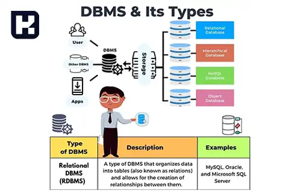

<blockquote class="faq-block">

  
آنچه در این مطلب خواهید خواند

  <ul>
    <li>پایگاه داده چیست؟</li>
    <li>داده در پایگاه داده به چه معناست؟</li>
    <li>سیستم مدیریت پایگاه داده (DBMS) چیست؟</li>
    <li>انواع پایگاه داده</li>
    <li>نقش حیاتی DataBase در سازمان‌ها</li>
    <li>سوالات متداول</li>
    <li>جمع‌بندی</li>
  </ul>

</blockquote> 

در دنیای دیجیتال امروز، داده‌ها حکم طلا را دارند و مدیریت بهینه آن‌ها می‌تواند به مزیت رقابتی تبدیل شود. پایگاه داده، ابزاری ضروری برای ذخیره، سازمان‌دهی و دسترسی به داده‌هاست و نقش مهمی در پردازش اطلاعات، تحلیل داده‌های کلان و تصمیم‌گیری‌های هوشمند ایفا می‌کند. این مقاله به معرفی پایگاه داده، انواع آن و اهمیت استفاده از سیستم‌های مدیریت پایگاه داده می‌پردازد.

## پایگاه داده چیست؟

پایگاه داده (Database) مجموعه‌ای ساختاریافته از داده‌هاست که به صورت الکترونیکی ذخیره و مدیریت می‌شود. این داده‌ها می‌توانند اطلاعات مربوط به افراد، مکان‌ها یا اشیا را شامل شوند و به صورت یکپارچه سازمان‌دهی شوند تا دسترسی و تجزیه‌وتحلیل آسان‌تر شود. مدیریت پایگاه داده معمولاً توسط سیستم‌های مدیریت پایگاه داده (DBMS) انجام می‌شود، که شامل نرم‌افزارها، داده‌ها و برنامه‌های کاربردی مرتبط است.

---

### داده در پایگاه داده به چه معناست؟
داده (Data) به اطلاعاتی اطلاق می‌شود که برای پردازش یا انتقال آماده شده‌اند. داده‌ها می‌توانند به صورت متن، عدد، رسانه یا حتی داده‌های بدون ساختار مشخص باشند. داده‌های پایگاه داده به دو دسته اصلی تقسیم می‌شوند:  

- **رابطه‌ای (Relational):** داده‌های ساختاریافته با روابط مشخص.  

- **غیر رابطه‌ای (Non-relational):** داده‌های مستقل یا بدون ساختار منظم.  

---

### سیستم مدیریت پایگاه داده (DBMS) چیست؟

سیستم مدیریت پایگاه داده نرم‌افزاری است که به کاربران و برنامه‌ها امکان می‌دهد داده‌ها را سازمان‌دهی، بهینه‌سازی و مدیریت کنند. این سیستم وظایفی نظیر کنترل دسترسی، نظارت بر عملکرد و پشتیبان‌گیری از داده‌ها را بر عهده دارد و استقلال فیزیکی و منطقی داده‌ها را برای کاربران فراهم می‌کند.

### انواع پایگاه داده

1. **پایگاه داده رابطه‌ای (Relational Database):**  
   - ساختار جدولی برای ذخیره داده‌ها.  
   - تعامل با زبان SQL.  
   - امکان مدیریت و تجزیه‌وتحلیل اطلاعات سازمان‌یافته.  

2. **پایگاه داده توزیع‌شده (Distributed Database):**  
   - ذخیره داده‌ها در مکان‌های فیزیکی مختلف.  
   - دسته‌بندی همگن (زیرساخت یکسان) و ناهمگن (زیرساخت متفاوت).  

3. **پایگاه داده ابری (Cloud Database):**  
   - ذخیره‌سازی در محیط‌های ابری عمومی، خصوصی یا ترکیبی.  
   - هزینه بر اساس مصرف فضای ذخیره‌سازی و پهنای باند.  

4. **پایگاه داده NoSQL:**  
   - مدیریت کلان‌داده‌های توزیع‌شده.  
   - مناسب برای داده‌های بزرگ و بدون ساختار.  

5. **پایگاه داده شی‌گرا (Object-oriented Database):**  
   - ذخیره‌سازی داده‌های تولیدشده با زبان‌های شی‌گرا.  
   - تمرکز بر اشیا به جای مقادیر داده‌ای ساده.  

6. **پایگاه داده گراف (Graph Database):**  
   - استفاده از مفاهیم نظریه گراف برای ذخیره روابط بین داده‌ها.  
   - مناسب برای تحلیل تعاملات کاربران در شبکه‌های اجتماعی.  

---

### نقش حیاتی DataBase در سازمان‌ها
پایگاه‌های داده نقش حیاتی در عملکرد و پیشرفت سازمان‌ها ایفا می‌کنند:  

- **مقیاس‌پذیری:** امکان مدیریت حجم انبوه داده‌ها.

- **حفظ یکپارچگی:** قوانین داخلی برای جلوگیری از خطا و تضاد در داده‌ها.

- **تأمین امنیت:** محدودیت دسترسی کاربران برای حفاظت از داده‌ها.

- **تحلیل داده‌ها:** کمک به شناسایی روندها و الگوها برای تصمیم‌گیری بهتر.

- **بهبود فرایندها:** تحلیل اطلاعات برای بهینه‌سازی فرایندهای تجاری.

- **مدیریت اطلاعات مشتریان:** ذخیره‌سازی داده‌های کاربران و تحلیل رفتار آن‌ها.

---

### سوالات متداول

<blockquote class="faq-block">
  

    
تفاوت پایگاه داده با سیستم مدیریت پایگاه داده (DBMS) چیست؟

    
پایگاه داده مجموعه‌ای از داده‌های سازمان‌دهی‌شده است؛ اما DBMS نرم‌افزاری است که امکان ذخیره، مدیریت، و دسترسی به این داده‌ها را فراهم می‌کند.

  

</blockquote>

<blockquote class="faq-block">
  

    
کدام نوع پایگاه داده برای کسب‌وکارهای کوچک مناسب‌تر است؟

    
معمولاً پایگاه‌های داده رابطه‌ای مانند MySQL یا PostgreSQL برای کسب‌وکارهای کوچک مناسب‌ترند، زیرا ساختارمند، قابل‌اعتماد و مقرون‌به‌صرفه هستند.

  

</blockquote>

<blockquote class="faq-block">
  

    
NoSQL برای چه کاربردهایی استفاده می‌شود؟

    
NoSQL برای داده‌های بدون ساختار، حجم بالا و سیستم‌های با مقیاس‌پذیری افقی مانند شبکه‌های اجتماعی، موتورهای جستجو و تحلیل کلان‌داده استفاده می‌شود.

  

</blockquote>

<blockquote class="faq-block">
  

    
آیا پایگاه داده‌های ابری امن هستند؟

    
اگرچه امنیت بستگی به ارائه‌دهنده و تنظیمات دارد، اما پایگاه داده‌های ابری معمولاً از استانداردهای امنیتی پیشرفته مانند رمزنگاری، احراز هویت چندمرحله‌ای و کنترل دسترسی پشتیبانی می‌کنند.

  

</blockquote>

<blockquote class="faq-block">
  

    
آیا همه پایگاه‌های داده از SQL استفاده می‌کنند؟

    
خیر. پایگاه‌های داده رابطه‌ای از SQL استفاده می‌کنند، اما پایگاه‌های داده NoSQL از روش‌های دیگری مانند Document، Key-Value، Graph و Column-based استفاده می‌کنند.

  

</blockquote>

<blockquote class="faq-block">
  

    
چطور تشخیص بدهم چه نوع دیتابیسی برای پروژه‌ام مناسب است؟

    
نوع داده‌ها، حجم اطلاعات، نیاز به مقیاس‌پذیری، سرعت خواندن/نوشتن، ساختار داده و نوع پردازش‌ها معیارهای اصلی انتخاب هستند.

  

</blockquote>

---

### جمع‌بندی
پایگاه‌های داده ابزارهایی قدرتمند برای ذخیره، سازمان‌دهی و تحلیل داده‌ها هستند که در حوزه‌های مختلف از مدیریت اطلاعات مشتریان تا تحلیل داده‌های کلان کاربرد دارند.

انتخاب نوع مناسب پایگاه داده و استفاده از سیستم‌های مدیریت کارآمد می‌تواند عملکرد سازمان‌ها را بهبود بخشد و تصمیم‌گیری‌ها را هوشمندانه‌تر کند. برای سازمان‌ها، پایگاه داده نه‌تنها یک ابزار، بلکه یک ضرورت است.