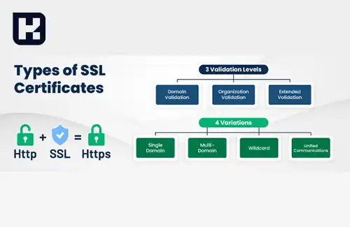

<blockquote class="faq-block">

  
آنچه در این مطلب خواهید خواند

  <ul>
    <li>SSL چیست و چرا اهمیت دارد؟</li>
    <li>نحوه عملکرد SSL</li>
    <li>انواع گواهینامه‌های SSL</li>
    <li>مزایای استفاده از SSL</li>
    <li>معایب عدم استفاده از SSL</li>
    <li>مدت اعتبار گواهینامه SSL</li>
    <li>سوالات متداول</li>
    <li>جمع‌بندی</li>
  </ul>

</blockquote> 

در دنیای دیجیتال امروزی، امنیت اطلاعات یکی از اولویت‌های اصلی کاربران و کسب‌وکارها است. پروتکل SSL (Secure Socket Layer) یکی از مهم‌ترین ابزارهای امنیتی برای محافظت از داده‌های حساس در هنگام انتقال بین سیستم‌ها است. این فناوری با رمزنگاری داده‌ها از دسترسی غیرمجاز جلوگیری می‌کند و ارتباطات آنلاین را ایمن و قابل اعتماد می‌سازد. در این مقاله، به بررسی مفهوم SSL، نحوه عملکرد، مزایا، انواع گواهینامه‌ها و اهمیت فعال‌سازی آن می‌پردازیم.

## SSL چیست و چرا اهمیت دارد؟

SSL، مخفف عبارت Secure Socket Layer، به معنای "لایه اتصال امن" است. این فناوری امنیتی برای رمزنگاری اطلاعات بین مرورگر و سرور طراحی شده است. هنگامی که یک وب‌سایت با گواهینامه SSL ایمن می‌شود، کاربران در مرورگر خود با پروتکل HTTPS مواجه می‌شوند، که نشان‌دهنده امنیت اطلاعات منتقل‌شده است.

---

### نحوه عملکرد SSL
پروتکل SSL از دو نوع رمزنگاری استفاده می‌کند:  

1. **رمزنگاری متقارن:** فرآیندی که در آن یک کلید واحد برای رمزگذاری و رمزگشایی اطلاعات به کار گرفته می‌شود

2. **رمزنگاری نامتقارن:** از دو کلید عمومی و خصوصی برای ایمن‌سازی اطلاعات بهره می‌برد.  

فرآیند عملکرد SSL به این صورت است که سرور ابتدا یک کلید عمومی تولید و به صادرکننده گواهینامه ارسال می‌کند. پس از تأیید سرور توسط صادرکننده، یک کلید خصوصی ایجاد می‌شود که برای رمزنگاری داده‌ها استفاده می‌گردد. این کلیدها تضمین می‌کنند که اطلاعات کاربران در طول انتقال محافظت‌شده و غیرقابل دسترسی برای هکرها باقی بمانند.

---

### انواع گواهینامه‌های SSL

1. **تک‌دامنه (Single-Domain):** مناسب برای ایمن‌سازی یک دامنه خاص.  
2. **چنددامنه (Multi-Domain):** برای چندین دامنه مختلف قابل استفاده است.  
3. **وایلدکارد (Wildcard):** برای یک دامنه و تمامی زیردامنه‌های آن کاربرد دارد.

---

### مزایای استفاده از SSL

- **حفاظت از اطلاعات حساس:** رمزنگاری داده‌ها، امنیت اطلاعات حساس مانند شماره کارت‌های اعتباری و اطلاعات شخصی را تضمین می‌کند.

- **افزایش اعتماد کاربران:** نمایش قفل امنیتی در مرورگر کاربران، اعتماد آن‌ها به امنیت وب‌سایت را افزایش می‌دهد.

- **بهبود رتبه در موتورهای جستجو:** استفاده از HTTPS به بهبود رتبه وب‌سایت‌ها در نتایج جستجوی گوگل کمک می‌کند.

- **پیش‌نیاز نماد اعتماد الکترونیکی:** دریافت گواهینامه SSL یکی از الزامات دریافت نماد اعتماد است.

### معایب عدم استفاده از SSL
عدم فعال‌سازی SSL ممکن است پیام "غیرامن" در مرورگرها نمایش دهد، که منجر به کاهش اعتماد کاربران و کاهش بازدید وب‌سایت می‌شود. مرورگرها ممکن است حتی از دسترسی به چنین سایت‌هایی جلوگیری کنند، که این مسئله می‌تواند تأثیر منفی چشم‌گیری بر کسب‌وکارها داشته باشد.

---

### مدت اعتبار گواهینامه SSL
گواهینامه‌های SSL دائمی نیستند و معمولاً بین 12 تا 24 ماه اعتبار دارند. برای حفظ امنیت، باید این گواهینامه‌ها پیش از اتمام اعتبار، تمدید شوند. انجمن مرورگرهای صادرکننده گواهینامه (CA/Browser Forum) حداکثر مدت اعتبار را ۲۷ ماه تعیین کرده است.

---

### سوالات متداول

<blockquote class="faq-block">

  
SSL چیست و چرا اهمیت دارد؟

  SSL یا Secure Socket Layer یک پروتکل امنیتی است که ارتباط بین مرورگر و سرور را رمزنگاری می‌کند تا اطلاعات حساس مانند رمز عبور و شماره کارت اعتباری محافظت شود.

</blockquote>

<blockquote class="faq-block">

  
تفاوت HTTPS و HTTP چیست؟

  HTTPS نسخه امن HTTP است که با استفاده از SSL/TLS، اطلاعات را رمزنگاری می‌کند. این امر از دسترسی هکرها به داده‌های منتقل‌شده جلوگیری می‌کند.

</blockquote>

<blockquote class="faq-block">

  
چگونه SSL اطلاعات را ایمن می‌کند؟

  SSL از ترکیب رمزنگاری متقارن و نامتقارن استفاده می‌کند. کلید عمومی برای رمزنگاری و کلید خصوصی برای رمزگشایی اطلاعات به کار می‌رود، بنابراین داده‌ها در طول انتقال محافظت می‌شوند.

</blockquote>

<blockquote class="faq-block">

  
انواع گواهینامه‌های SSL کدام‌اند؟

  1. تک‌دامنه (Single-Domain)  
  2. چنددامنه (Multi-Domain)  
  3. وایلدکارد (Wildcard)  
  هر نوع برای سناریوی خاصی از ایمن‌سازی دامنه‌ها و زیردامنه‌ها مناسب است.

</blockquote>

<blockquote class="faq-block">

  
مزایای استفاده از SSL چیست؟

  - حفاظت از اطلاعات حساس کاربران  
  - افزایش اعتماد کاربران  
  - بهبود رتبه در موتورهای جستجو  
  - پیش‌نیاز دریافت نماد اعتماد الکترونیکی  

</blockquote>

<blockquote class="faq-block">

  
چه مشکلاتی در صورت عدم استفاده از SSL رخ می‌دهد؟

  مرورگرها سایت‌های بدون SSL را غیرامن نمایش می‌دهند، که کاهش اعتماد کاربران، کاهش بازدید و حتی مسدود شدن دسترسی را به دنبال دارد.

</blockquote>

<blockquote class="faq-block">

  
مدت اعتبار گواهینامه SSL چقدر است؟

  معمولاً بین 12 تا 24 ماه اعتبار دارد و برای حفظ امنیت باید پیش از انقضا تمدید شود. حداکثر مدت اعتبار توسط CA/Browser Forum، ۲۷ ماه تعیین شده است.

</blockquote>

<blockquote class="faq-block">

  
چگونه می‌توان گواهینامه SSL مناسب انتخاب کرد؟

  انتخاب SSL بستگی به تعداد دامنه‌ها و زیردامنه‌ها، نوع کسب‌وکار و سطح امنیت مورد نیاز دارد. گواهینامه‌های Single-Domain، Multi-Domain و Wildcard هر کدام کاربرد خاص دارند.

</blockquote>

<blockquote class="faq-block">

  
آیا SSL تنها برای وب‌سایت‌ها لازم است؟

  خیر، SSL برای هر نوع ارتباط اینترنتی که نیاز به امنیت دارد کاربرد دارد، مانند سرویس‌های ایمیل، API‌ها و برنامه‌های تحت وب.

</blockquote>

---

### جمع‌بندی
SSL یکی از ابزارهای حیاتی برای تضمین امنیت اطلاعات در فضای آنلاین است. این فناوری علاوه بر حفاظت از اطلاعات حساس کاربران، به افزایش اعتماد مشتریان و بهبود رتبه وب‌سایت‌ها در نتایج جستجو کمک می‌کند. با انتخاب گواهینامه SSL مناسب و تمدید به‌موقع آن، می‌توان امنیت و اعتماد را در فضای دیجیتال به حداکثر رساند.