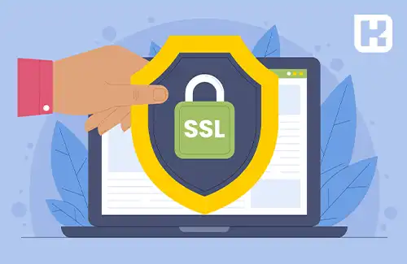

<blockquote style="background-color:#eeeefc; padding:0.5rem">

  
آنچه در این مطلب خواهید خواند

  <ul>
    <li>SSL چیست و چرا اهمیت دارد؟</li>
    <li>نحوه عملکرد SSL</li>
    <li>مزایای استفاده از SSL</li>
    <li>انواع گواهینامه‌های SSL</li>
    <li>معایب عدم استفاده از SSL</li>
    <li>مدت اعتبار گواهینامه SSL</li>
  </ul>

</blockquote>

در دنیای دیجیتال امروزی، امنیت اطلاعات یکی از اولویت‌های اصلی کاربران و کسب‌وکارها است. پروتکل SSL (Secure Socket Layer) یکی از مهم‌ترین ابزارهای امنیتی برای محافظت از داده‌های حساس در هنگام انتقال بین سیستم‌ها است. این فناوری با رمزنگاری داده‌ها از دسترسی غیرمجاز جلوگیری می‌کند و ارتباطات آنلاین را ایمن و قابل اعتماد می‌سازد. در این مقاله، به بررسی مفهوم SSL، نحوه عملکرد، مزایا، انواع گواهینامه‌ها و اهمیت فعال‌سازی آن می‌پردازیم.

## SSL چیست و چرا اهمیت دارد؟
SSL، مخفف عبارت Secure Socket Layer، به معنای "لایه اتصال امن" است. این فناوری امنیتی برای رمزنگاری اطلاعات بین مرورگر و سرور طراحی شده است. هنگامی که یک وب‌سایت با گواهینامه SSL ایمن می‌شود، کاربران در مرورگر خود با پروتکل HTTPS مواجه می‌شوند، که نشان‌دهنده امنیت اطلاعات منتقل‌شده است.

### نحوه عملکرد SSL
پروتکل SSL از دو نوع رمزنگاری استفاده می‌کند:  
1. **رمزنگاری متقارن:** از یک کلید واحد برای رمزگذاری و رمزگشایی داده‌ها استفاده می‌شود.  
2. **رمزنگاری نامتقارن:** از دو کلید عمومی و خصوصی برای ایمن‌سازی اطلاعات بهره می‌برد.  

فرآیند عملکرد SSL به این صورت است که سرور ابتدا یک کلید عمومی تولید و به صادرکننده گواهینامه ارسال می‌کند. پس از تأیید سرور توسط صادرکننده، یک کلید خصوصی ایجاد می‌شود که برای رمزنگاری داده‌ها استفاده می‌گردد. این کلیدها تضمین می‌کنند که اطلاعات کاربران در طول انتقال محافظت‌شده و غیرقابل دسترسی برای هکرها باقی بمانند.

### مزایای استفاده از SSL
- **حفاظت از اطلاعات حساس:** رمزنگاری داده‌ها، امنیت اطلاعات حساس مانند شماره کارت‌های اعتباری و اطلاعات شخصی را تضمین می‌کند.  
- **افزایش اعتماد کاربران:** نمایش قفل امنیتی در مرورگر کاربران، اعتماد آن‌ها به امنیت وب‌سایت را افزایش می‌دهد.  
- **بهبود رتبه در موتورهای جستجو:** استفاده از HTTPS به بهبود رتبه وب‌سایت‌ها در نتایج جستجوی گوگل کمک می‌کند.  
- **پیش‌نیاز نماد اعتماد الکترونیکی:** دریافت گواهینامه SSL یکی از الزامات دریافت نماد اعتماد است.

### انواع گواهینامه‌های SSL
1. **تک‌دامنه (Single-Domain):** مناسب برای ایمن‌سازی یک دامنه خاص.  
2. **چنددامنه (Multi-Domain):** برای چندین دامنه مختلف قابل استفاده است.  
3. **وایلدکارد (Wildcard):** برای یک دامنه و تمامی زیردامنه‌های آن کاربرد دارد.

### معایب عدم استفاده از SSL
عدم فعال‌سازی SSL ممکن است پیام "غیرامن" در مرورگرها نمایش دهد، که منجر به کاهش اعتماد کاربران و کاهش بازدید وب‌سایت می‌شود. مرورگرها ممکن است حتی از دسترسی به چنین سایت‌هایی جلوگیری کنند، که این مسئله می‌تواند تأثیر منفی چشم‌گیری بر کسب‌وکارها داشته باشد.

### مدت اعتبار گواهینامه SSL
گواهینامه‌های SSL دائمی نیستند و معمولاً بین 12 تا 24 ماه اعتبار دارند. برای حفظ امنیت، باید این گواهینامه‌ها پیش از اتمام اعتبار، تمدید شوند. انجمن مرورگرهای صادرکننده گواهینامه (CA/Browser Forum) حداکثر مدت اعتبار را ۲۷ ماه تعیین کرده است.

---

### جمع‌بندی
SSL یکی از ابزارهای حیاتی برای تضمین امنیت اطلاعات در فضای آنلاین است. این فناوری علاوه بر حفاظت از اطلاعات حساس کاربران، به افزایش اعتماد مشتریان و بهبود رتبه وب‌سایت‌ها در نتایج جستجو کمک می‌کند. با انتخاب گواهینامه SSL مناسب و تمدید به‌موقع آن، می‌توان امنیت و اعتماد را در فضای دیجیتال به حداکثر رساند.