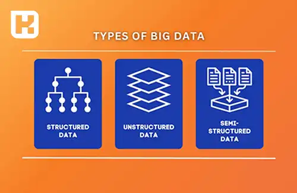
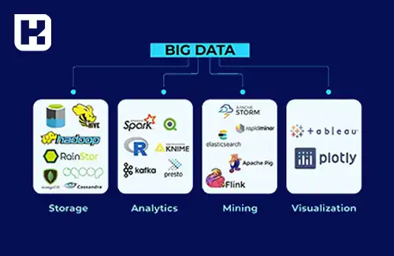
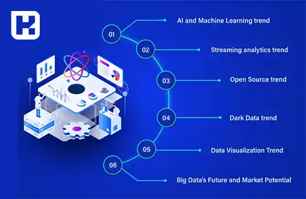

<blockquote class="faq-block">

  
آنچه در این مطلب خواهید خواند

  <ul>
   <li>مفهوم کلان داده (Big Data)</li>
   <li>انواع کلان داده</li>
   <li>فواید کلان داده</li>
   <li>چالش‌های کلان داده</li>
   <li>ابزارها و فناوری‌های کلان داده</li>
   <li>نمونه‌های واقعی از استفاده کلان داده</li>
  </ul>

</blockquote>

کلان داده یا **Big Data** به مجموعه‌ای از داده‌های حجیم و پیچیده اشاره دارد که با سرعت و تنوع زیاد تولید می‌شوند. این داده‌ها به گونه‌ای هستند که پردازش آن‌ها با استفاده از روش‌های سنتی دشوار است. در این مقاله، به بررسی دقیق مفهوم کلان داده، انواع آن و چگونگی استفاده از آن در بهبود فرآیندهای کسب‌وکار و تصمیم‌گیری‌های هوشمند خواهیم پرداخت.

## مفهوم کلان داده (Big Data)

کلان داده‌ها به حجم عظیمی از اطلاعات گفته می‌شود که در معرض چالش‌هایی نظیر سرعت بالا، تنوع زیاد و پیچیدگی هستند. این داده‌ها در دنیای دیجیتال امروز از منابع مختلفی نظیر شبکه‌های اجتماعی، تراکنش‌های مالی، دستگاه‌های اینترنت اشیاء (IoT) و سایر منابع جمع‌آوری می‌شوند. پردازش و تجزیه و تحلیل این داده‌ها به شیوه‌های سنتی ممکن نیست و نیازمند ابزارهای تخصصی و الگوریتم‌های پیچیده است.

---

### انواع کلان داده

1. **داده‌های ساختاریافته:** این داده‌ها دارای قالب مشخص و منظم هستند و می‌توان آن‌ها را به راحتی در جداول و پایگاه‌های داده ذخیره و پردازش کرد.

2. **داده‌های نیمه‌ساختار یافته:** این داده‌ها دارای برخی ساختارها و نشانه‌ها هستند اما به طور کامل ساختار نیافته‌اند و برای پردازش نیاز به پردازش‌های خاص دارند.

3. **داده‌های بدون ساختار:** این داده‌ها فاقد هرگونه ساختار مشخص هستند و به طور معمول شامل متن‌های آزاد، تصاویر، ویدیوها و صوت‌ها می‌باشند.

---

### فواید کلان داده‌
استفاده از کلان داده‌ها در کسب‌وکار می‌تواند به شکل‌های مختلف به شرکت‌ها کمک کند. تجزیه و تحلیل این داده‌ها موجب بهبود فرآیندهای تصمیم‌گیری، شناسایی فرصت‌های تجاری و پیش‌بینی روندهای آینده می‌شود. همچنین، این داده‌ها به کاهش هزینه‌ها، افزایش بهره‌وری و بهبود استراتژی‌های بازاریابی کمک خواهند کرد.

---

### چالش‌های کلان داده
با وجود مزایای گسترده‌ای که کلان داده ارائه می‌دهد، سازمان‌ها در مسیر پردازش و تحلیل این داده‌ها با چالش‌های متعددی مواجه هستند. برخی از مهم‌ترین چالش‌های کلان داده عبارتند از:

1. **امنیت و حریم خصوصی**: حجم عظیمی از داده‌ها شامل اطلاعات حساس کاربران و سازمان‌هاست. نشت این داده‌ها می‌تواند منجر به مشکلات قانونی، مالی و از بین رفتن اعتماد مشتریان شود. رعایت استانداردهای امنیتی و استفاده از تکنیک‌های رمزنگاری و کنترل دسترسی از اهمیت بالایی برخوردار است.  

2. **هزینه‌های پردازش و ذخیره‌سازی**: پردازش داده‌های حجیم نیازمند زیرساخت‌های قوی مانند سرورهای پرقدرت، فضای ذخیره‌سازی گسترده و نرم‌افزارهای تخصصی است که هزینه‌های بالایی را به همراه دارد. استفاده از سرویس‌های ابری و بهینه‌سازی فرآیندهای پردازشی می‌تواند تا حدی این هزینه‌ها را کاهش دهد.  

3. **نیاز به متخصصان ماهر**: تحلیل و مدیریت کلان داده نیازمند دانش عمیق در حوزه‌هایی مانند علم داده (Data Science)، یادگیری ماشین (Machine Learning) و مهندسی داده است. کمبود متخصصان ماهر در این زمینه، یکی از چالش‌های اساسی برای سازمان‌ها محسوب می‌شود.  

4. **کیفیت و یکپارچگی داده‌ها**: داده‌های جمع‌آوری‌شده ممکن است دارای تناقض، داده‌های تکراری یا نویز باشند. بدون تمیزسازی و یکپارچه‌سازی صحیح داده‌ها، نتایج تحلیل ممکن است گمراه‌کننده باشد.  

5. **سرعت پردازش و پاسخگویی**: با رشد مداوم داده‌ها، سیستم‌های پردازشی باید به‌گونه‌ای طراحی شوند که توانایی پاسخگویی در لحظه (Real-time Processing) را داشته باشند. استفاده از فناوری‌های پردازش توزیع‌شده و پایگاه‌های داده بهینه می‌تواند این چالش را کاهش دهد.  

---

### ابزارها و فناوری‌های کلان داده
برای مدیریت، پردازش و تحلیل کلان داده، ابزارهای متعددی توسعه یافته‌اند که برخی از مهم‌ترین آن‌ها عبارتند از:  

1. **Hadoop**: یک فریم‌ورک متن‌باز برای ذخیره‌سازی و پردازش توزیع‌شده داده‌های حجیم که امکان مدیریت داده‌ها را در خوشه‌های سرور فراهم می‌کند.  

2. **Apache Spark**: یک پلتفرم پردازش داده‌های حجیم که سرعت پردازش بالاتری نسبت به Hadoop دارد و قابلیت پردازش داده‌های بلادرنگ را فراهم می‌کند.  

3. **NoSQL Databases**: پایگاه‌های داده غیررابطه‌ای مانند MongoDB ،Cassandra و HBase که برای مدیریت داده‌های غیرساختاریافته و مقیاس‌پذیر طراحی شده‌اند.  

4. **Apache Kafka**: یک پلتفرم پردازش جریانی (Stream Processing) که برای مدیریت و تحلیل داده‌های بلادرنگ استفاده می‌شود.  

5. **Google BigQuery**: یک سرویس تحلیل داده‌های حجیم مبتنی بر فضای ابری که پردازش سریع و مقیاس‌پذیر را فراهم می‌کند.  

استفاده از این ابزارها بستگی به نیاز سازمان و نوع داده‌های مورد پردازش دارد. انتخاب فناوری مناسب می‌تواند تأثیر قابل‌توجهی بر سرعت، دقت و هزینه‌های پردازش داده داشته باشد.  

---

### نمونه‌های واقعی از استفاده کلان داده
کلان داده در صنایع مختلفی به کار گرفته شده و تحول چشمگیری در نحوه تحلیل و تصمیم‌گیری ایجاد کرده است. برخی از نمونه‌های واقعی شامل:  

1. **آمازون (Amazon)**: این شرکت با تحلیل داده‌های خرید مشتریان، پیشنهادهای شخصی‌سازی‌شده ارائه می‌دهد و از کلان داده برای بهینه‌سازی زنجیره تأمین و مدیریت انبارهای خود استفاده می‌کند.  

2. **گوگل (Google)**: موتور جستجوی گوگل، تبلیغات هوشمند و حتی سیستم‌های ناوبری مبتنی بر google maps از کلان داده برای بهبود تجربه کاربران و نمایش نتایج دقیق‌تر بهره می‌برند.  

3. **بانک‌ها و مؤسسات مالی**: بانک‌ها از کلان داده برای شناسایی رفتارهای مشکوک و جلوگیری از تقلب‌های مالی، ارزیابی ریسک‌های اعتباری و بهینه‌سازی خدمات بانکی استفاده می‌کنند.  

4. **بخش سلامت**: بیمارستان‌ها و شرکت‌های داروسازی از تحلیل داده‌های بیماران برای تشخیص بیماری‌ها، بهینه‌سازی درمان‌ها و تحقیق در مورد اثرات داروها استفاده می‌کنند.  

5. **شبکه‌های اجتماعی**: فیسبوک، اینستاگرام و توییتر از کلان داده برای تحلیل رفتار کاربران، شخصی‌سازی محتوا و هدف‌گیری تبلیغاتی استفاده می‌کنند.  

---

### آینده کلان داده
روندهای جدید در حوزه کلان داده نشان می‌دهد که این فناوری همچنان در حال پیشرفت است و نقش آن در صنایع مختلف پررنگ‌تر خواهد شد. برخی از مهم‌ترین روندهای آینده شامل:  

1. **هوش مصنوعی (AI) و یادگیری ماشین (ML)**: ترکیب کلان داده با الگوریتم‌های یادگیری ماشین به شرکت‌ها امکان می‌دهد تا از داده‌ها برای پیش‌بینی رفتار کاربران، شناسایی الگوهای پنهان و بهبود تصمیم‌گیری استفاده کنند.  

2. **تحلیل داده‌های بلادرنگ (Real-time Analytics)**: نیاز به پردازش و تحلیل لحظه‌ای داده‌ها در صنایعی مانند مالی، سلامت و اینترنت اشیاء روزبه‌روز افزایش می‌یابد. فناوری‌هایی مانند Apache Flink و Spark Streaming در این حوزه نقش کلیدی دارند.  

3. **افزایش اهمیت امنیت داده‌ها**: با توجه به نگرانی‌های مربوط به حریم خصوصی، مقررات جدیدی مانند GDPR در اروپا و قوانین مشابه در سایر کشورها به شرکت‌ها الزام می‌کند که از روش‌های امن‌تر برای مدیریت داده‌ها استفاده کنند.  

4. **Edge Computing**: با گسترش اینترنت اشیاء، بسیاری از پردازش‌های داده به شبکه Edge Devices منتقل می‌شوند تا سرعت و کارایی افزایش یابد.  

5. **ترکیب کلان داده با بلاکچین**: استفاده از بلاکچین برای ثبت و مدیریت داده‌های حجیم می‌تواند شفافیت و امنیت را بهبود بخشد و کاربردهای جدیدی در صنایع مالی و سلامت ایجاد کند.  

با توجه به این روندها، می‌توان انتظار داشت که کلان داده همچنان به‌عنوان یک فناوری حیاتی در مدیریت و تحلیل داده‌ها باقی بماند و تأثیر بسزایی در تحولات آینده کسب‌وکارها و سازمان‌ها داشته باشد.

---

### جمع‌بندی

در نهایت، کلان داده به عنوان یک ابزار حیاتی در دنیای دیجیتال امروزی شناخته می‌شود که می‌تواند به سازمان‌ها در بهبود تصمیم‌گیری، پیش‌بینی روندها و شناسایی فرصت‌های جدید کمک کند.

با وجود چالش‌هایی مانند امنیت، هزینه‌ها و نیاز به متخصصان ماهر، استفاده از ابزارهای پیشرفته مانند Hadoop و Apache Spark می‌تواند این مشکلات را کاهش دهد و امکان پردازش داده‌های حجیم را فراهم سازد.

با توجه به روندهای نوین مانند ترکیب کلان داده با هوش مصنوعی و تحلیل داده‌های بلادرنگ، به نظر می‌رسد که این فناوری در آینده نیز به یکی از ارکان اصلی موفقیت در کسب‌وکارها و سازمان‌ها تبدیل خواهد شد.
امیدواریم این مقاله به شما کمک کرده باشد تا دید بهتری از مفهوم کلان داده و کاربردهای آن در حوزه‌های مختلف پیدا کنید.