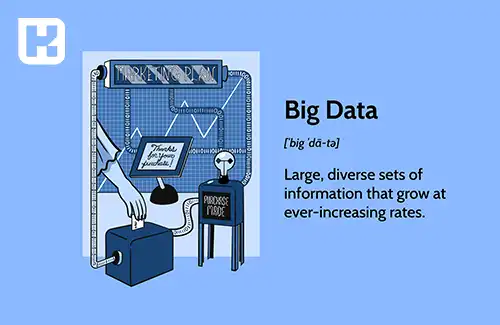

<blockquote style="background-color:#eeeefc; padding:0.5rem">

  
آنچه در این مطلب خواهید خواند

  <ul>
    <li>آشنایی با مفهوم کلان داده یا Big Data</li>
      <li>انواع (Big Data) چیست؟</li>
      <ul>
        <li>داده های بدون ساختار</li>
        <li>داده های نیمه ساختار یافته</li>
        <li>داده های ساختار یافته</li>
      </ul>
      <li>فواید استفاده از کلان داده ها در حوزه کسب‌وکار</li>
      <li>سخن پایانی</li>
  </ul>

</blockquote>

  
 مفهوم کلان داده یا Big Data به عنوان یکی از مفاهیم بارز و حیاتی در حوزه علم داده و فناوری اطلاعات مطرح است. این مفهوم به حجم زیادی از داده‌ها اشاره دارد که با سرعت و پیچیدگی فراوانی به وجود می‌آیند و پردازش آن‌ها با استفاده از روش‌های سنتی، دشوار و غیرممکن می‌شود. 

در این مقاله، مفهوم کلان داده و انواع آن و سپس چگونگی استفاده از این داده‌های حجیم  برای بهبود فرآیندهای کسب‌وکار و تصمیم‌گیری‌های هوشمند  بررسی خواهد شد.

##  آشنایی با مفهوم کلان داده یا Big Data

اصطلاح داده‌های بزرگ یا Big Data به حجم عظیمی از داده‌ها اشاره دارد که از سرعت و پیچیدگی فراوانی برخوردارند و پردازش آن‌ها با استفاده از روش‌های سنتی، دشوار و غیرممکن است. 

در حوزه علم داده، داده‌های بزرگ یک چالش اساسی برای جستجوی داده، تحلیل و استفاده از آن‌ها برای یادگیری ماشین و تصمیم‌گیری‌های هوشمند محسوب می‌شوند. ذخیره و مدیریت این حجم عظیم از اطلاعات برای تحلیل‌های آینده زمان‌بر و هزینه‌بر است.

## انواع (Big Data) چیست؟

### داده های بدون ساختار

تمام اطلاعات با یک ساختار خاص مرتب نمی‌شوند. حدود ۸۰٪ از داده‌های جهانی بدون ساختار هستند. هر فعالیتی که شما با استفاده از رایانه انجام می‌دهید، منجر به ایجاد داده‌های بدون ساختار می‌شود. این نوع اطلاعات دارای ماهیت پیچیده‌ای هستند و مدیریت و درک آنها دشوار است. اما برای استخراج اطلاعات مفید، داده‌ها باید تفسیر شوند. 

این فرآیند زمان‌بر است، اما نتیجه آن ارزشمندتر از جمع‌آوری داده‌های بدون ساختار است. برنامه‌ها باید به این داده‌ها درکی بیاموزند که آن را به فرم ساختاریافته ترجمه کند، که این فرآیند غالباً با استفاده از تجزیه متن و پردازش زبان طبیعی انجام می‌شود.

### داده های نیمه ساختار یافته

داده‌های نیمه‌ساختاریافته، ترکیبی از داده‌های ساختاریافته و بدون ساختار می‌باشند. برخلاف داده‌های ساختاری که الگوها و جداول معین دارند، این نوع داده‌ها، الگوها و جداول مشخصی ندارند. با این حال، برای این داده‌ها برچسب‌ها و نشانه‌هایی وجود دارد که آنها را برای ضبط، طبقه‌بندی و ذخیره در مجموعه‌های داده آماده می‌کند. این فرآیند ذخیره‌سازی را نسبت به داده‌های بدون ساختار ساده‌تر می‌سازد.

### داده های ساختار یافته

این نوع داده‌ها بسیار منظم و سازمان‌یافته هستند. فرض کنید داده‌های صدها صفحه را در ستون‌ها و ردیف‌هایی کاملاً منظم و مرتب شده مشاهده می‌کنید. برای هر متغیر و عنوان، توضیحاتی در دسترس است و اعداد به طور واضح و قابل فهم ظاهر می‌شوند. کار با این داده‌ها بسیار آسان است و می‌توان آنها را به راحتی مرتب کرد.

داده‌های ساختاریافته با الگوهای مشخصی همراه هستند. این الگوها تعیین می‌کنند که هر داده کجا  قرار دارد و معنای آن چیست.

به عنوان مثال، یک پایگاه داده حاوی اطلاعات حقوق و دستمزد کارکنان، اطلاعاتی مانند شناسه کارمند، نرخ دستمزد، ساعات کار، نحوه پرداخت اضافه کاری و غیره را در اختیار ما قرار می‌دهد. الگوی داده‌های ساختاریافته، برای هر نرم‌افزار یا برنامه‌ای که از آن استفاده می‌شود، هر یک از این موارد را به طور صحیح تعریف می‌کند. بنابراین، برنامه برای تفسیر معنای واقعی هرکدام از این موارد، نیازی به جستجوی داده ندارد، بلکه می‌تواند به صورت مستقیم از داده‌ها استفاده کند و آن‌ها را پردازش کند.

## فواید استفاده از کلان داده ها در حوزه کسب‌وکار

حضور و جمع‌آوری داده‌های حجیم می‌تواند برای هر سازمانی ارزشمند باشد. تجزیه و تحلیل این داده‌ها با استفاده از سیستم‌های نرم‌افزاری پیشرفته، به سازمان‌ها در فرآیند تصمیم‌گیری و تعیین استراتژی کمک می‌کند و این امر منجر به کاهش هزینه‌ها و افزایش درآمد در هر کسب‌وکاری می‌شود.

#### سخن پایانی:

از اینکه با ما همراه بودید و با مفهوم کلان داده یا Big Data آشنا شدید، متشکریم. در این مقاله، به بررسی انواع کلان داده پرداختیم و نشان دادیم که چگونه استفاده از این داده‌های حجیم می‌تواند برای بهبود فرآیندهای کسب‌وکار و تصمیم‌گیری‌های هوشمند اهمیت زیادی داشته باشد. امیدواریم که این مقاله به شما کمک کرده باشد تا درک بهتری از مفهوم کلان داده و کاربردهای آن در حوزه علم داده و فناوری اطلاعات پیدا کنید.