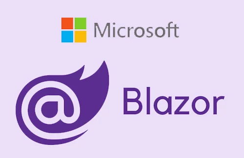
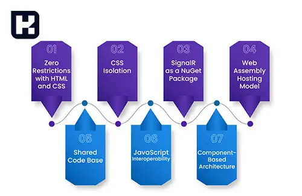
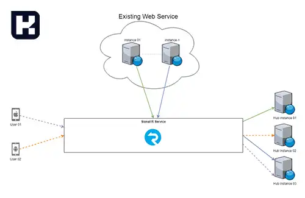
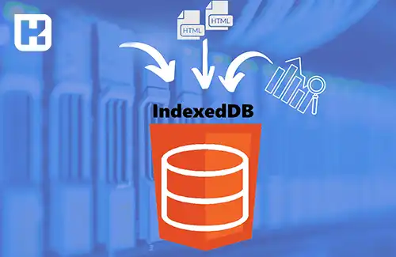

<blockquote style="background-color:#eeeefc; padding:0.5rem">

  
آنچه در این مطلب خواهید خواند

  <ul>
    <li>بلیزر چیست</li>
    <li>امکانات Blazor برای توسعه دهندگان</li>
  </ul>

</blockquote>

Blazor فریم‌ورکی تحت پلتفرم ASP.NET از شرکت مایکروسافت است که به برنامه‌نویسان این امکان را می‌دهد تا برنامه‌های وب تعاملی را با استفاده از زبان‌های #C و Razor بسازند. این فریم‌ورک با استفاده از تکنولوژی‌های مدرن مانند WebAssembly و SignalR، اجرای برنامه‌های وب را بدون نیاز به پلاگین‌ها و در مرورگر فراهم می‌کند و به توسعه‌دهندگان امکان ساخت برنامه‌های Single Page Application (SPA) را می‌دهد.

## بلیزر - Blazor
بلیزر <a href="https://dotnet.microsoft.com/en-us/apps/aspnet/web-apps/blazor" target="_blank">Blazor</a>
یک فریم ورک توسعه وب تحت پلتفرم ASP.NET توسط شرکت مایکروسافت است. با استفاده از Blazor، برنامه‌نویسان می‌توانند برنامه‌های وب تعاملی را با استفاده از زبان‌های برنامه‌نویسی #C و Razor بنویسند.

بلیزر از مدل برنامه‌نویسی <a href="https://en.wikipedia.org/wiki/Single-page_application" target="_blank">SPA</a>
(تک‌صفحه‌ای) پیروی می‌کند و به برنامه‌نویسان اجازه می‌دهد از کدهای #C توسط مرورگرها در سمت کاربر، برای ساخت و اجرای برنامه‌های وب تعاملی استفاده کنند. Blazor از تکنولوژی <a href="https://webassembly.org/" 
target="_blank">WebAssembly</a> برای اجرای کد #C مستقیماً در مرورگرها استفاده می‌کند و به این ترتیب امکان اجرای برنامه‌های بلیزر بدون نیاز به پلاگین‌ها وابسته به سیستم عامل در مرورگرها را فراهم می‌کند.

بلیزر (Blazor) پشتیبانی از مدل‌های برنامه‌نویسی سمت سرور (Server-Side Blazor) و سمت کاربر (Client-Side Blazor) را دارد و اجازه می‌دهد برنامه‌نویسان برنامه‌های تحت وب تعاملی و بدون نیاز به تحویل مجدد صفحه (Single Page Applications) را بسازند.

بلیزر (Blazor) پشتیبانی از مدل‌های برنامه‌نویسی سمت سرور (Server-Side Blazor) و سمت کاربر (Client-Side Blazor) را دارد و اجازه می‌دهد برنامه‌نویسان برنامه‌های تحت وب تعاملی و بدون نیاز به تحویل مجدد صفحه (Single Page Applications) را بسازند.

## امکانات Blazor برای توسعه دهندگان

**1. بلیزر Reusability:** اجازه می‌دهد کدهای #C و Razor را بین سمت سرور و سمت کاربر به اشتراک بگذارید، که امکان استفاده مجدد از کد و کاهش تکرار را فراهم می‌کند.

**2. بلیزر Component-based Development:**  از مدل برنامه‌نویسی مبتنی بر کامپوننت (Component-based) پیروی می‌کند، که امکان ساخت کامپوننت‌های قابل استفاده و قابل تعویض را فراهم می‌کند. این رویکرد، بازاستفاده، مدیریت و تست کامپوننت‌ها را ساده‌تر می‌کند.

**3. دسترسی به اکوسیستم ASP.NET:** بلیزر یک بخش از پلتفرم ASP.NET است و به برنامه‌نویسان اجازه می‌دهد از ابزارها، کتابخانه‌ها و قابلیت‌های ASP.NET مانند مدیریت وضعیت، آموزش‌های وب، تأمین امنیت و ارتباط با سمت سرور بهره‌برداری کنند.

**4. پشتیبانی از SignalR:** بلیزر به طور پیش‌فرض از SignalR، یک کتابخانه برنامه‌نویسی همگام‌سازی و ارتباط در زمان واقعی، پشتیبانی می‌کند. این امکان را به برنامه‌نویسان می‌دهد تا به راحتی از تبادل داده‌ها بین سمت سرور و سمت کاربر در زمان واقعی استفاده کنند.

**5. پشتیبانی از WebAssembly:** بلیزر امکان اجرای کد #C در محیط WebAssembly را فراهم می‌کند، که به توسعه‌دهندگان امکان معتبرسازی و تحویل برنامه‌های کاربردی تحت وب را در مرورگرها بدون نیاز به پلاگین‌ها یا نصب برنامه‌های جانبی می‌دهد. این باعث کاهش زمان بارگیری و اجرای برنامه‌های وب و افزایش سرعت واکنش‌گرایی آن‌ها می‌شود.

**6. پشتیبانی از ویرایشگر‌های کد محبوب:** Blazor  با ویرایشگر‌های کد محبوبی مانند Visual Studio و Visual Studio Code  یکپارچه شده است، که توسعه‌دهندگان را در توسعه، تست و اشتراک‌گذاری برنامه‌های Blazor کمک می‌کند.

**7. امکانات Debugging:** بلیزر امکانات پیشرفته‌ای برای دیباگ کردن برنامه‌ها ارائه می‌دهد، از جمله امکان افزودن نقاط وقفه، پیگیری استک، مشاهده مقادیر متغیرها و رویدادها و ...

**8. پشتیبانی از استانداردهای وب:** بلیزر از استانداردهای وب مانند WebRTC ،Web Workers ،Service Workers و IndexedDB پشتیبانی می‌کند که به توسعه‌دهندگان اجازه می‌دهد برنامه‌های پیشرفته‌تری با استفاده از این تکنولوژی‌ها ایجاد کنند.

### جمع‌بندی
Blazor به‌عنوان یک فریم‌ورک توسعه وب، امکان ایجاد برنامه‌های وب با کارایی بالا و تجربه کاربری تعاملی را با استفاده از زبان‌های #C و Razor فراهم می‌کند. این فریم‌ورک با استفاده از تکنولوژی‌های مدرن مانند WebAssembly و SignalR، به برنامه‌نویسان امکان می‌دهد تا برنامه‌های تحت وب را بدون نیاز به پلاگین‌های اضافی یا نصب برنامه‌های جانبی، در مرورگر اجرا کنند. Blazor علاوه بر ویژگی‌های پیشرفته‌ای مانند پشتیبانی از کامپوننت‌ها، اشتراک‌گذاری کد و ابزارهای دیباگ، به توسعه‌دهندگان این امکان را می‌دهد که برنامه‌های وب با کیفیت و مقیاس‌پذیر بسازند. بنابراین ،Blazor می‌تواند یکی از انتخاب‌های اصلی برای توسعه برنامه‌های تحت وب در دنیای مدرن باشد.