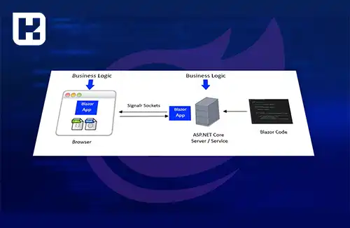

بلیزور (["Blazor"](https://dotnet.microsoft.com/en-us/apps/aspnet/web-apps/blazor)
) یک فریم‌ورک توسعه وب تحت پلتفرم ASP.NET توسط شرکت مایکروسافت است. با استفاده از Blazor، برنامه‌نویسان می‌توانند برنامه‌های وب تعاملی را با استفاده از زبان‌های برنامه‌نویسی C# و Razor بنویسند.

بلیزور از مدل برنامه‌نویسی ["SPA"](https://en.wikipedia.org/wiki/Single-page_application)
 (تک‌صفحه‌ای) پیروی می‌کند و به برنامه‌نویسان اجازه می‌دهد از کدهای C# توسط مرورگرها در سمت کاربر، برای ساخت و اجرای برنامه‌های وب تعاملی استفاده کنند. Blazor از تکنولوژی ["WebAssembly"](https://webassembly.org/) برای اجرای کد C# مستقیماً در مرورگرها استفاده می‌کند و به این ترتیب امکان اجرای برنامه‌های بلیزور بدون نیاز به پلاگین‌ها وابسته به سیستم عامل در مرورگرها را فراهم می‌کند.

بلیزور (Blazor) پشتیبانی از مدل‌های برنامه‌نویسی سمت سرور (Server-Side Blazor) و سمت کاربر (Client-Side Blazor) را دارد و اجازه می‌دهد برنامه‌نویسان برنامه‌های تحت وب تعاملی و بدون نیاز به تحویل مجدد صفحه (Single Page Applications) را بسازند.

بلیزور (Blazor) پشتیبانی از مدل‌های برنامه‌نویسی سمت سرور (Server-Side Blazor) و سمت کاربر (Client-Side Blazor) را دارد و اجازه می‌دهد برنامه‌نویسان برنامه‌های تحت وب تعاملی و بدون نیاز به تحویل مجدد صفحه (Single Page Applications) را بسازند.

## امکانات Blazor برای توسعه‌دهندگان:

**1. بلیزور Reusability:** اجازه می‌دهد کدهای C# و Razor را بین سمت سرور و سمت کاربر به اشتراک بگذارید، که امکان استفاده مجدد از کد و کاهش تکرار را فراهم می‌کند.

**2. بلیزور Component-based Development:** از مدل برنامه‌نویسی مبتنی بر کامپوننت  (Component-based)پیروی می‌کند، که امکان ساخت کامپوننت‌های قابل استفاده و قابل تعویض را فراهم می‌کند. این رویکرد، بازاستفاده، مدیریت و تست کامپوننت‌ها را ساده‌تر می‌کند.

**3. دسترسی به اکوسیستم ASP.NET:** Blazor یک بخش از پلتفرم ASP.NET است و به برنامه‌نویسان اجازه می‌دهد از ابزارها، کتابخانه‌ها و قابلیت‌های ASP.NET مانند مدیریت وضعیت، آموزش‌های وب، تأمین امنیت و ارتباط با سمت سرور بهره‌برداری کنند.

**4. پشتیبانی از SignalR:** بلیزور به طور پیش‌فرض از SignalR، یک کتابخانه برنامه‌نویسی همگام‌سازی و ارتباط در زمان واقعی، پشتیبانی می‌کند. این امکان را به برنامه‌نویسان می‌دهد تا به راحتی از تبادل داده‌ها بین سمت سرور و سمت کاربر در زمان واقعی استفاده کنند.

**5. پشتیبانی از WebAssembly:** بلیزور امکان اجرای کد C# در محیط WebAssembly را فراهم می‌کند، که به توسعه‌دهندگان امکان معتبرسازی و تحویل برنامه‌های کاربردی تحت وب را در مرورگرها بدون نیاز به پلاگین‌ها یا نصب برنامه‌های جانبی می‌دهد. این باعث کاهش زمان بارگیری و اجرای برنامه‌های وب و افزایش سرعت واکنش‌گرایی آن‌ها می‌شود.

**6. پشتیبانی از ویرایشگر‌های کد محبوب:** Blazor  با ویرایشگر‌های کد محبوبی مانند Visual Studio و Visual Studio Code  یکپارچه شده است، که توسعه‌دهندگان را در توسعه، تست و اشتراک‌گذاری برنامه‌های Blazor کمک می‌کند.

**7. امکانات Debugging:** بلیزور امکانات پیشرفته‌ای برای دیباگ کردن برنامه‌ها ارائه می‌دهد، از جمله امکان افزودن نقاط وقفه، پیگیری استک، مشاهده مقادیر متغیرها و رویدادها و ...

**8. پشتیبانی از استانداردهای وب:** بلیزور از استانداردهای وب مانند WebRTC، Web Workers، Service Workers و  IndexedDB پشتیبانی می‌کند که به توسعه‌دهندگان اجازه می‌دهد برنامه‌های پیشرفته‌تری با استفاده از این تکنولوژی‌ها ایجاد کنند.

در کل،Blazor  یک فریم‌ورک پویا و قدرتمند برای توسعه برنامه‌های وب با استفاده از C# و Razor است که توسعه‌دهندگان را قادر می‌سازد برنامه‌های بسیار پویا و قابل تعامل را با کارایی بالا و تجربه کاربری بهتر بسازند.