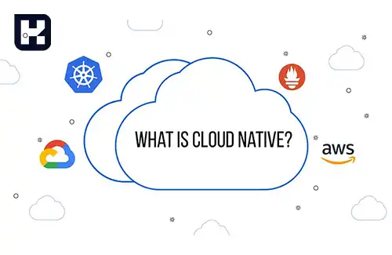
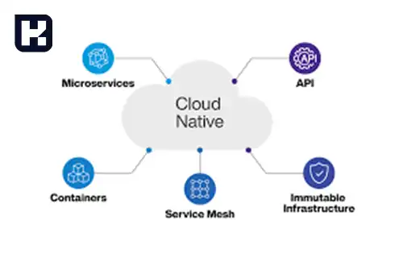
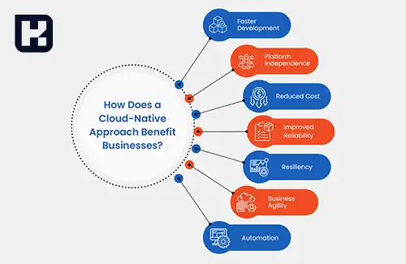
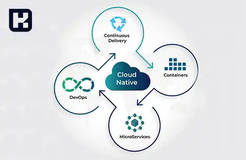

<blockquote style="background-color:#eeeefc; padding:0.5rem">

  
آنچه در این مطلب خواهید خواند

  <ul>
   <li>ابر بومی (Cloud Native) چیست؟</li>
   <li>معماری ابر بومی (Cloud Native) چگونه طراحی می‌شود؟</li>
   <li>تفاوت نرم‌افزارهای سنتی و ابر بومی</li>
   <li>مزایای اپلیکیشن‌های Cloud-Native</li>
   <li>چالش‌های اپلیکیشن‌های ابر بومی</li>
   <li>ارتباط ابر بومی با سایر فناوری‌ها</li>
  </ul>

</blockquote>

ابر بومی (Cloud Native) رویکردی در توسعه نرم‌افزار است که برای بهره‌گیری کامل از قابلیت‌های محیط‌های ابری طراحی شده است. این روش با استفاده از میکروسرویس‌ها، کانتینرسازی، مدیریت پویا و اتوماسیون، امکان توسعه سریع‌تر، استقرار آسان‌تر و مقیاس‌پذیری بالاتر را فراهم می‌کند.

در این مقاله، معماری ابر بومی، تفاوت آن با مدل‌های سنتی، مزایا و چالش‌های آن بررسی می‌شود. همچنین، نقش فناوری‌هایی مانند دواپس، میکروسرویس‌ها و Kubernetes در این رویکرد مورد بحث قرار خواهد گرفت.

## ابر بومی (Cloud Native) چیست؟

«کلاود نیتیو» یک رویکرد نوین در توسعه نرم‌افزار است که به‌طور خاص برای طراحی، استقرار و مدیریت برنامه‌ها در محیط‌های ابری به کار می‌رود. سازمان‌های مدرن به دنبال راهکارهایی مقیاس‌پذیر، منعطف و پایدار هستند تا بتوانند سریع‌تر و کارآمدتر به نیازهای مشتریان پاسخ دهند. 

به همین دلیل، آن‌ها از ابزارها و تکنیک‌هایی بهره می‌برند که به‌طور بومی با زیرساخت‌های ابری سازگارند. ابر بومی به توسعه‌دهندگان امکان می‌دهد نرم‌افزارهای خود را با سرعت و نوآوری بیشتر، بدون ایجاد اختلال در عملکرد و پشتیبانی، عرضه کنند.

### معماری ابر بومی (Cloud Native) چگونه طراحی می‌شود؟

معماری ابر بومی (Cloud Native Architecture) شامل مجموعه‌ای از مؤلفه‌ها و فناوری‌هایی است که تیم‌های توسعه برای طراحی، اجرا و گسترش نرم‌افزارها در محیط ابری از آن‌ها استفاده می‌کنند. بنیاد CNCF برخی از مفاهیم کلیدی این معماری را به شرح زیر معرفی کرده است:

-	زیرساخت تغییرناپذیر (Immutable Infrastructure) 

زیرساخت غیرقابل تغییر به این معناست که سرورهای میزبان اپلیکیشن‌های ابر بومی پس از فرآیند استقرار (Deployment) بدون تغییر باقی می‌مانند. در صورت افزایش نیاز اپلیکیشن به منابع، سرور قبلی از کار خارج شده و اپلیکیشن به سروری قدرتمندتر منتقل می‌شود. این رویکرد باعث می‌شود که به‌روزرسانی و ارتقای سخت‌افزاری به‌صورت دستی انجام نشود و اپلیکیشن‌های ابر بومی بتوانند منابع مورد نیاز خود را بر اساس تغییرات تطبیق دهند.

-	میکروسرویس‌ها (Microservices) 

میکروسرویس‌ها به این معنا هستند که برنامه‌های بزرگ به مجموعه‌ای از سرویس‌های مستقل و کوچک‌تر تقسیم شوند. هر سرویس (میکروسرویس) به‌صورت جداگانه راه‌اندازی، ارتقا، مقیاس‌پذیر و مجدداً اجرا می‌شود. این معماری به تیم‌های توسعه اجازه می‌دهد که به‌طور مستقل و موازی روی بخش‌های مختلف نرم‌افزار کار کنند.

هر میکروسرویس فرآیند اختصاصی خود را اجرا کرده و پایگاه داده مجزایی دارد. این سرویس‌ها می‌توانند وظایفی مانند ارسال هشدارها، مدیریت داده‌های ثبت‌نام، پشتیبانی از رابط‌های کاربری و احراز هویت را انجام دهند و از طریق API با یکدیگر در ارتباط باشند.
نمونه‌هایی از این معماری را می‌توان در شرکت‌هایی مانند Netflix، Amazon، WhatsApp، سیستم مدیریت ارتباط با مشتری Salesforce و حتی موتور جست‌وجوی Google مشاهده کرد. 

در این شرکت‌ها، قابلیت‌های مختلف نرم‌افزار به اجزای ماژولار تقسیم شده و هر سرویس به‌صورت مستقل ارائه می‌شود. همچنین، هر میکروسرویس می‌تواند با مناسب‌ترین زبان برنامه‌نویسی برای وظیفه خود توسعه یابد و توسط تیم اختصاصی مدیریت شود.

-	کانتینرسازی (Containerization)

کانتینرها کوچک‌ترین واحد محاسباتی در خدمات ابر بومی هستند که کد میکروسرویس و فایل‌های ضروری دیگر را در محیط‌های ابری ذخیره می‌کنند. با استفاده از کانتینرهای ابر بومی، اپلیکیشن‌ها می‌توانند مستقل از سیستم‌عامل یا سخت‌افزار اصلی اجرا شوند.

این ویژگی به توسعه‌دهندگان اجازه می‌دهد تا اپلیکیشن‌های ابر بومی را در محیط‌های داخلی (On-premises)، زیرساخت‌های ابری یا محیط‌های ترکیبی (Hybrid Cloud) مستقر کنند. کانتینرها امکان بسته‌بندی (Packaging) میکروسرویس‌ها و وابستگی‌های آن‌ها، مانند فایل‌های منبع، کتابخانه‌ها و اسکریپت‌های ضروری را فراهم می‌کنند.

-	سرویس مش (Service Mesh) 

سرویس مش یک لایه نرم‌افزاری در زیرساخت‌های ابری است که ارتباط بین چندین میکروسرویس را مدیریت می‌کند. توسعه‌دهندگان از این فناوری برای افزودن قابلیت‌های جدید به اپلیکیشن‌ها، بدون نیاز به نوشتن کد اضافی، بهره می‌برند.

-	مدیریت پویا (Dynamic Management) 

مدیریت پویا به استفاده از سرورهای ابری و ابزارهایی مانند Kubernetes برای تخصیص منابع به‌صورت انعطاف‌پذیر اشاره دارد. این رویکرد باعث کاهش هزینه‌ها و افزایش سرعت واکنش به تغییرات می‌شود. به‌عنوان مثال، در اپلیکیشن‌های ای‌کامرس، سیستم می‌تواند به‌طور خودکار با افزایش ترافیک و تعداد درخواست‌ها، منابع مورد نیاز را تنظیم کرده و مقیاس‌پذیری را بهینه کند.

-	اتوماسیون (Automation) 

اتوماسیون به جایگزینی فرآیندهای دستی و تکراری با اسکریپت‌ها و ابزارهای خودکارسازی اشاره دارد. این فرآیندها شامل راه‌اندازی، مقیاس‌پذیری و ارتقا بوده و موجب افزایش قابلیت اطمینان سیستم می‌شوند. علاوه بر این، اتوماسیون منابع انسانی را از وظایف تکراری آزاد کرده و به مدیران امکان می‌دهد روی اهداف اصلی کسب‌وکار تمرکز کنند.

-	هماهنگ‌سازی (Orchestration) 

هماهنگ‌سازی در توسعه ابر بومی به مدیریت خودکار منابع، سرویس‌ها و میکروسرویس‌ها برای تضمین عملکرد یکپارچه و بهینه سیستم اشاره دارد. این فرآیند به‌ویژه در سیستم‌هایی که شامل چندین سرویس مستقل هستند، اهمیت بالایی دارد.

در معماری Cloud Native که از میکروسرویس‌ها، کانتینرها و پلتفرم‌های ابری بهره می‌برد، هماهنگ‌سازی می‌تواند وظایفی مانند استقرار، مقیاس‌گذاری، نظارت و رفع مشکلات را به‌صورت خودکار انجام دهد و کارایی سیستم را بهبود ببخشد.

-	API‌ های اعلامی (Declarative APIs) 

این فناوری‌ها در کنار هم به توسعه نرم‌افزارهای مقیاس‌پذیر، انعطاف‌پذیر و کارآمد کمک می‌کنند و امکان مدیریت بهینه سرویس‌ها در فضای ابری را فراهم می‌سازند.

### تفاوت نرم‌افزارهای سنتی و ابر بومی

نرم‌افزارهای سنتی سازمانی معمولاً انعطاف‌پذیری کمتری در فرایند توسعه دارند. توسعه‌دهندگان باید قبل از ورود به مرحله طراحی، بخش زیادی از تحلیل‌ها و آزمون‌های نرم‌افزار را انجام دهند، که این موضوع باعث طولانی شدن فرایند پیاده‌سازی و استقرار نرم‌افزار می‌شود.

در مقابل، نرم‌افزارهای ابر بومی (Cloud Native) از رویکردی چابک‌تر و منعطف‌تر پیروی می‌کنند. در این مدل، توسعه‌دهندگان از ابزارهای خودکارسازی برای تست، استقرار و مدیریت نرم‌افزار استفاده می‌کنند که باعث افزایش سرعت توسعه و بهبود بهره‌وری تیم‌ها می‌شود.

### مزایای اپلیکیشن‌های Cloud-Native 

- توسعه سریع‌تر

رویکرد ابر بومی به توسعه‌دهندگان این امکان را می‌دهد که زمان ساخت و عرضه اپلیکیشن‌های خود را به میزان قابل توجهی کاهش دهند و در عین حال، نرم‌افزاری با کیفیت بالاتر ارائه کنند. بهره‌گیری از زیرساخت‌های مقیاس‌پذیر، کانتینرهای آماده استقرار و قابلیت‌های DevOps ، همگی ابزارهایی هستند که توسعه را سریع‌تر و کارآمدتر می‌کنند.

- استقلال از پلتفرم

با اجرای اپلیکیشن‌ها در فضای ابری، محیطی پایدار و سازگار در اختیار خواهید داشت. دیگر نگرانی بابت ناسازگاری‌های سخت‌افزاری یا چالش‌های یکپارچگی توسعه وجود ندارد، چرا که سرویس‌دهنده ابری تمامی این مسائل را مدیریت می‌کند.

- کاهش هزینه‌ها

ابر بومی شما را از هزینه‌های ثابت خرید زیرساخت بی‌نیاز می‌کند. در این مدل، تنها به اندازه مصرف واقعی خود پرداخت می‌کنید (Pay As You Go) .برای مثال، اگر در یک دوره زمانی نیاز اپلیکیشن شما به منابع کاهش یابد، هزینه‌هایتان نیز به همان نسبت کم خواهد شد.

### چالش‌های اپلیکیشن‌های ابر بومی

با وجود مزایای قابل‌توجه، اپلیکیشن‌های ابر بومی نیز با برخی چالش‌ها همراه هستند که باید مورد توجه قرار گیرند.

-	 مدیریت پیچیده‌تر

میکروسرویس‌ها اگرچه توسعه و بهبود برنامه‌ها را ساده‌تر می‌کنند، اما در عین حال نیاز به مدیریت تعداد زیادی از سرویس‌های کوچک و مستقل را افزایش می‌دهند. این امر می‌تواند پیچیدگی‌های عملیاتی را نسبت به یک نرم‌افزار یکپارچه بیشتر کند.

-	 نیاز به فرهنگ سازمانی سازگار

سرعت توسعه و استقرار در محیط‌های ابر بومی بالاست، اما سازمان‌ها باید از نظر فرهنگی و عملیاتی آمادگی پذیرش این تغییرات سریع را داشته باشند. در غیر این صورت، چابکی فنی ممکن است با مقاومت داخلی مواجه شود.

-	 نیاز به ابزارهای پیشرفته

اجرای موفق اپلیکیشن‌های ابر بومی به مجموعه‌ای از ابزارهای جدید نیاز دارد، از جمله   سیستم‌های مدیریت DevOps ، مانیتورینگ پیشرفته و کنترل دقیق معماری میکروسرویس‌ها. این امر می‌تواند چالش‌هایی در زمینه آموزش، استقرار و نگهداری ایجاد کند.

### ارتباط ابر بومی با سایر فناوری‌ها

رویکرد ابر بومی به‌طور مستقیم با مفاهیمی مانند میکروسرویس‌ها، دواپس و کانتینرها در ارتباط است. این فناوری‌ها در کنار هم، توسعه نرم‌افزارهای مدرن و مبتنی بر فضای ابری را سریع‌تر و منعطف‌تر می‌کنند.

- ابر بومی و میکروسرویس‌ها

میکروسرویس‌ها یکی از ارکان اصلی معماری ابر بومی هستند و به افزایش مقیاس‌پذیری و چابکی سیستم‌ها کمک می‌کنند. این معماری امکان به‌روزرسانی مستقل هر بخش از نرم‌افزار را بدون تأثیرگذاری بر سایر اجزا فراهم می‌کند. ابزارهایی مانند Kubernetes و Docker مدیریت و ارکستراسیون این سرویس‌ها را در بستر ابری ساده‌تر و کارآمدتر می‌کنند.

- ابر بومی و دواپس

دواپس (DevOps) در محیط‌های ابر بومی نقش کلیدی در خودکارسازی و بهینه‌سازی فرآیند توسعه، آزمایش و استقرار نرم‌افزار دارد. این دو مفهوم با یکدیگر ادغام شده‌اند تا تیم‌های توسعه بتوانند نرم‌افزارهای خود را سریع‌تر و بدون اختلال در مقیاس گسترده منتشر کنند.

- ابر بومی و کانتینرها

کانتینرها مانند (Docker) بسته‌های مستقلی هستند که نرم‌افزار و وابستگی‌های آن را در خود جای می‌دهند. این فناوری امکان اجرای نرم‌افزار را بدون وابستگی به زیرساخت خاصی فراهم می‌کند. استفاده از کانتینرها در معماری ابر بومی باعث افزایش استقلال نرم‌افزارها، تسریع در استقرار، بهبود مقیاس‌پذیری و بهینه‌سازی مدیریت منابع می‌شود.
