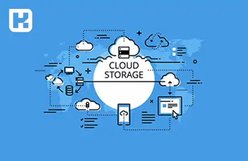
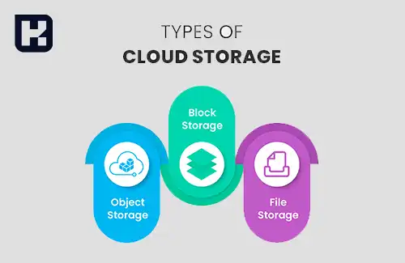

<blockquote style="background-color:#eeeefc; padding:0.5rem">

  
آنچه در این مطلب خواهید خواند

  <ul>
    <li>فضای ابری چیست؟</li>
    <li>چرا ذخیره‌سازی ابری گزینه‌ای بهتر است؟</li>
    <li>فضای ابری چه کاربردهایی دارد؟</li>
    <li>انواع روش‌های ذخیره‌سازی در فضای ابری</li>
    <li>بررسی دقیق انواع ذخیره‌سازی ابری</li>
    <li>مزایای حافظه ابری برای کسب‌وکارها</li>
    <li>معایب ذخیره‌سازی اطلاعات در فضای ابری</li>
  </ul>

</blockquote>

فضای ذخیره‌سازی ابری به کاربران این امکان را می‌دهد که اطلاعات خود را به‌جای ذخیره‌سازی محلی، در سرورهای ابری و از طریق اینترنت نگهداری کنند. این فناوری با افزایش نیاز به دسترسی آسان به داده‌ها از هر نقطه‌ای، به یک راه‌حل محبوب تبدیل شده است. 

با استفاده از فضای ابری، کاربران می‌توانند بدون نگرانی از زیرساخت‌های فیزیکی و نگهداری اطلاعات، به راحتی به داده‌های خود دسترسی داشته و آن‌ها را مدیریت کنند. این فضا به‌طور عمده از مجموعه‌ای از سرورها تشکیل شده است که امنیت اطلاعات ذخیره‌شده بر روی آن‌ها توسط شرکت‌های ارائه‌دهنده تضمین می‌شود. در این مقاله، به بررسی مزایا و معایب فضای ذخیره‌سازی ابری و همچنین روش‌های مختلف آن خواهیم پرداخت.

## فضای ابری چیست؟

فضای ذخیره‌سازی ابری، که در انگلیسی به آن **Cloud Storage** گفته می‌شود، یکی از خدمات رایانش ابری است که امکان ذخیره داده‌ها و اطلاعات را به‌جای استفاده از حافظه محلی، بر روی سرورهای آنلاین از طریق اینترنت فراهم می‌کند. برای ذخیره یا دسترسی به این اطلاعات، تنها داشتن یک اتصال اینترنتی کافی است.

فضای ابری مانند یک حافظه آنلاین عمل می‌کند که تبادل اطلاعات با آن از طریق اینترنت انجام می‌شود. این فضا معمولاً شامل مجموعه‌ای از سرورها است که امنیت اطلاعات ذخیره‌شده بر روی آن‌ها توسط شرکت‌های ارائه‌دهنده تضمین می‌شود. زیرساخت‌های ابری به کاربران امکان می‌دهند تا از هر مکان و دستگاهی به فایل‌های خود دسترسی داشته باشند. از جمله خدمات معروف ذخیره‌سازی ابری می‌توان به **Google Drive** ،**OneDrive** و **Dropbox** اشاره کرد.

### چرا ذخیره‌سازی ابری گزینه‌ای بهتر است؟
فضای ذخیره‌سازی ابری پاسخ‌گوی نیازهای مدرن کاربران و سازمان‌ها است که به دسترسی سریع و آسان به داده‌ها از هر نقطه‌ای در دنیا نیاز دارند. استفاده از فضای ابری به کاربران این امکان را می‌دهد که در صورت از دست دادن داده‌ها به راحتی آن‌ها را بازیابی کنند و همچنین نیازی به نگرانی از تجهیزات سخت‌افزاری و مدیریت زیرساخت‌ها نداشته باشند.

---

### فضای ابری چه کاربردهایی دارد؟
1. **ذخیره‌سازی اطلاعات:**  
   یکی از اصلی‌ترین کاربردهای فضای ابری، ذخیره‌سازی داده‌ها است. کاربران و سازمان‌ها می‌توانند اطلاعات خود را در این فضا نگهداری کنند و از هر نقطه‌ای در جهان به آن‌ها دسترسی داشته باشند.

2. **پشتیبان‌گیری و بازیابی:**  
   فضای ابری گزینه‌ای عالی برای پشتیبان‌گیری و بازیابی اطلاعات است. این فضا از داده‌ها در برابر تهدیداتی مانند حذف تصادفی، هک یا از دست رفتن محافظت می‌کند.

3. **اشتراک‌گذاری فایل‌ها:**  
   با استفاده از فضای ابری، امکان به‌اشتراک‌گذاری آسان فایل‌ها و اسناد با دیگران فراهم می‌شود.

4. **اجرای برنامه‌ها و خدمات:**  
   فضای ابری به توسعه‌دهندگان این امکان را می‌دهد که برنامه‌ها و سرویس‌های خود را در محیط ابری اجرا کرده و از قابلیت‌های آن بهره ببرند.

5. **پردازش ابری:**  
   فضای ابری توانایی‌های گسترده‌ای برای پردازش و تحلیل داده‌ها فراهم می‌کند و به کاربران امکان انجام محاسبات پیچیده را می‌دهد.

---

### بررسی دقیق انواع ذخیره‌سازی ابری
فضاهای ذخیره‌سازی ابری توسط ارائه‌دهندگان خدمات ابری ایجاد می‌شوند که ظرفیت ذخیره‌سازی داده‌ها را از طریق نگهداری مراکز داده بزرگ در نقاط مختلف جهان تأمین می‌کنند و به مدیریت این مراکز پرداخته می‌شود. این ارائه‌دهندگان قادر به کنترل ظرفیت، امنیت و نگهداری داده‌ها هستند و دسترسی به آن‌ها را از طریق اینترنت با مدل پرداخت مداوم امکان‌پذیر می‌سازند. کاربران معمولاً از طریق اینترنت یا یک اتصال خصوصی اختصاصی با استفاده از یک پورتال وب، وب‌سایت یا اپلیکیشن به فضای ذخیره‌سازی ابری متصل می‌شوند.

1. **روش ذخیره‌سازی بلوکی (Block Storage):**  
   در این شیوه، داده‌ها به بلوک‌های کوچک یا بزرگ تقسیم می‌شوند که هر بلوک دارای نشانه‌گذاری خاصی است. این بلوک‌ها به‌طور مستقل از داده‌های دیگر ذخیره می‌شوند و مانند یک سیستم فایل عمل می‌کنند. دسترسی به این روش ذخیره‌سازی به‌صورت مستقیم و فیزیکی انجام می‌گیرد و معمولاً در سیستم‌های پایگاه داده یا ماشین‌های مجازی مورد استفاده قرار می‌گیرد.

2. **روش ذخیره‌سازی فایلی (File Storage):**  
   در این نوع ذخیره‌سازی، داده‌ها به‌صورت یک ساختار سلسله‌مراتبی شامل پوشه‌ها و فایل‌ها ذخیره می‌شوند. کاربران می‌توانند به‌طور مشترک به این فایل‌ها دسترسی داشته باشند و از آن‌ها استفاده کنند. مشابه Block Storage، این نوع نیز دسترسی مستقیم و فیزیکی دارد.

3. **روش ذخیره‌سازی شیء محور (Object-based Storage):**  
   در این روش، داده‌ها به‌عنوان شی‌های مستقل (مانند فایل‌ها، تصاویر و ویدیوها) با اطلاعات اضافی در محیط ذخیره‌سازی قرار می‌گیرند. هر شی یک شناسه یکتا دارد و به‌طور مستقل از سایر داده‌ها ذخیره می‌شود. این روش انتخاب مناسبی برای ذخیره‌سازی مقیاس‌پذیر و داده‌های بزرگ است و به‌ویژه در کاربردهای ذخیره‌سازی ابری رایج است.

---

### مزایای حافظه ابری برای کسب‌وکارها
- **کاهش هزینه‌های ذخیره‌سازی:**  
  استفاده از فضای ابری به کسب‌وکارها این امکان را می‌دهد که هزینه‌های مربوط به خرید و نگهداری سخت‌افزار را کاهش دهند.

- **افزایش چابکی تیم‌ها:**  
  فضای ابری به تیم‌ها این امکان را می‌دهد که از هر مکان و دستگاهی به داده‌ها و فایل‌ها دسترسی داشته باشند و همکاری به‌طور مؤثرتری انجام شود.

- **تسریع در استقرار:**  
  ذخیره‌سازی در فضای ابری می‌تواند زمان استقرار سرویس‌ها و برنامه‌ها را به‌طور قابل‌ملاحظه‌ای کاهش دهد.

- **مدیریت مؤثر داده‌ها:**  
  با ذخیره‌سازی اطلاعات در فضای ابری، کسب‌وکارها قادر به مدیریت بهتر و مؤثرتر داده‌ها و اطلاعات خود خواهند بود.

- **مقیاس‌پذیری نامحدود:**  
  فضای ابری مقیاس‌پذیری نامحدود را فراهم می‌کند، به این معنی که سازمان‌ها می‌توانند با توجه به نیاز خود فضای ذخیره‌سازی را افزایش دهند.

- **ایجاد فضای ابری برای تداوم فعالیت‌های کسب‌وکار:**  
  فضای ابری به کسب‌وکارها کمک می‌کند تا تداوم فعالیت‌های خود را تضمین کرده و به راحتی از وقوع بحران‌ها جلوگیری کنند.

---

### معایب ذخیره‌سازی اطلاعات در فضای ابری
- **وابستگی به اتصال اینترنت:**  
  ذخیره‌سازی ابری وابسته به اتصال اینترنت است، که در صورت قطع یا اختلال در اینترنت می‌تواند دسترسی به داده‌ها را مختل کند.

- **افزایش هزینه‌ها برای فضای ذخیره‌سازی بیشتر:**  
  استفاده از فضای ابری برای ذخیره‌سازی حجم زیاد داده‌ها ممکن است هزینه‌های زیادی را به همراه داشته باشد.

- **امنیت پایین‌تر اطلاعات:**  
  هرچند فضای ابری از نظر امنیتی محافظت می‌شود، اما احتمال وقوع حملات سایبری و دسترسی غیرمجاز به داده‌ها همیشه وجود دارد.

- **کنترل کمتر بر فرآیند ذخیره‌سازی:**  
  در ذخیره‌سازی ابری، کاربران کنترل کمتری بر فرآیند ذخیره‌سازی داده‌ها و مدیریت سرورها دارند.

- **دشواری در مهاجرت به خدمات دیگر:**  
  مهاجرت داده‌ها از یک سرویس ابری به سرویس دیگر ممکن است پیچیده و زمان‌بر باشد.

---

### جمع‌بندی
فضای ذخیره‌سازی ابری یک راه‌حل کاربردی و مقرون به‌صرفه برای ذخیره‌سازی داده‌ها است که به کاربران این امکان را می‌دهد تا به راحتی به اطلاعات خود دسترسی داشته باشند. با این حال، فضای ابری مزایا و معایب خاص خود را دارد که باید در انتخاب بهترین گزینه برای ذخیره‌سازی داده‌ها مورد توجه قرار گیرد. با توجه به رشد سریع فناوری‌های ابری، این امکان وجود دارد که در آینده، فضای ابری به عنوان استانداردی برای ذخیره‌سازی داده‌ها در تمامی صنایع تبدیل شود.