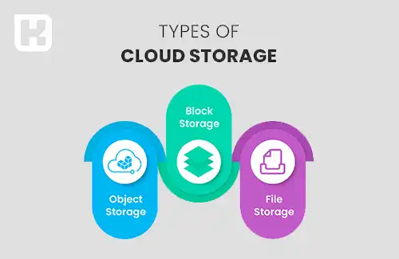

<blockquote style="background-color:#eeeefc; padding:0.5rem">

  
آنچه در این مطلب خواهید خواند

  <ul>
      <li>فضای ابری چیست؟</li>
      <li>فضای ابری چه کاربردهایی دارد؟</li>
      <li>انواع روش‌های ذخیره‌سازی در فضای ابری</li>
      <li>مزایای حافظه ابری برای کسب‌وکارها</li>
      <li>معایب ذخیره‌سازی اطلاعات در فضای ابری</li>
      <li>انواع فضای ابری و روش‌های آن</li>
  </ul>

</blockquote>

فضای ذخیره‌سازی ابری به کاربران این امکان را می‌دهد که اطلاعات خود را به‌جای ذخیره‌سازی محلی، در سرورهای ابری و از طریق اینترنت نگهداری کنند. این فناوری با افزایش نیاز به دسترسی آسان به داده‌ها از هر نقطه‌ای، به یک راه‌حل محبوب تبدیل شده است. کاربران می‌توانند بدون نگرانی درباره زیرساخت‌های فیزیکی و نگهداری اطلاعات، به راحتی به داده‌های خود دسترسی داشته و آن‌ها را مدیریت کنند. 

در این مقاله، به بررسی مزایا و معایب فضای ذخیره‌سازی ابری و همچنین روش‌های مختلف آن خواهیم پرداخت.

## فضای ابری چیست؟

فضای ذخیره‌سازی ابری، که در انگلیسی به آن Cloud Storage گفته می‌شود، یکی از خدمات رایانش ابری است که امکان ذخیره داده‌ها و اطلاعات را به جای استفاده از حافظه محلی، بر روی سرورهای آنلاین از طریق اینترنت فراهم می‌کند. برای ذخیره یا دسترسی به این اطلاعات، تنها داشتن یک اتصال اینترنتی کافی است.

به طور کلی، فضای ابری مانند یک حافظه آنلاین عمل می‌کند که تبادل اطلاعات با آن از طریق اینترنت انجام می‌شود. این فضا معمولاً شامل مجموعه‌ای از سرورها است که امنیت اطلاعات ذخیره‌شده بر روی آن‌ها توسط شرکت‌های ارائه‌دهنده تضمین می‌شود.

زیرساخت‌های ابری به کاربران امکان می‌دهند تا از هر مکان و دستگاهی به فایل‌های خود دسترسی داشته باشند. از جمله خدمات معروف ذخیره‌سازی ابری می‌توان به Google Drive، OneDrive و Dropbox اشاره کرد.

### فضای ابری چه کاربردهایی دارد؟

**ذخیره‌سازی اطلاعات:** یکی از اصلی‌ترین کاربردهای فضای ابری، ذخیره‌سازی داده‌ها است. کاربران و سازمان‌ها می‌توانند اطلاعات خود را در این فضا نگهداری کنند و از هر نقطه‌ای در جهان به آن‌ها دسترسی داشته باشند.

**پشتیبان‌گیری و بازیابی:** فضای ابری گزینه‌ای عالی برای پشتیبان‌گیری و بازیابی اطلاعات است. این فضا از داده‌ها در برابر تهدیداتی مانند حذف تصادفی، هک یا از دست رفتن محافظت می‌کند.

**اشتراک‌گذاری فایل‌ها:** با استفاده از فضای ابری، امکان به‌اشتراک‌گذاری آسان فایل‌ها و اسناد با دیگران فراهم می‌شود.

اجرای برنامه‌ها و خدمات: فضای ابری به توسعه‌دهندگان این امکان را می‌دهد که برنامه‌ها و سرویس‌های خود را در محیط ابری اجرا کرده و از قابلیت‌های آن بهره ببرند.

**پردازش ابری:** فضای ابری توانایی‌های گسترده‌ای برای پردازش و تحلیل داده‌ها فراهم می‌کند و به کاربران امکان انجام محاسبات پیچیده را می‌دهد.

### انواع روش‌های ذخیره‌سازی در فضای ابری

فضاهای ذخیره‌سازی ابری توسط ارائه‌دهندگان خدمات ابری ایجاد می‌شوند که ظرفیت ذخیره‌سازی داده‌ها را از طریق نگهداری مراکز داده بزرگ در نقاط مختلف جهان تأمین می‌کنند و به مدیریت این مراکز پرداخته می‌شود.

 این ارائه‌دهندگان قادر به کنترل ظرفیت، امنیت و نگهداری داده‌ها هستند و دسترسی به آن‌ها را از طریق اینترنت با مدل پرداخت مداوم امکان‌پذیر می‌سازند. کاربران معمولاً از طریق اینترنت یا یک اتصال خصوصی اختصاصی با استفاده از یک پورتال وب، وب‌سایت یا اپلیکیشن به فضای ذخیره‌سازی ابری متصل می‌شوند.

هنگامی که کاربران فضای ذخیره‌سازی را از یک ارائه‌دهنده خدمات ابری تهیه می‌کنند، مدیریت جنبه‌های مختلف مرتبط با ذخیره‌سازی داده‌ها، از جمله ظرفیت، امنیت، دسترسی، سرورهای ذخیره‌سازی و منابع محاسباتی، بر عهده ارائه‌دهنده است.

برنامه‌های کاربردی که کاربران به‌کار می‌برند، معمولاً از طریق پروتکل‌های ذخیره‌سازی سنتی یا به‌طور مستقیم از طریق API به فضای ذخیره‌سازی ابری متصل می‌شوند. علاوه بر این، شرکت‌های ارائه‌دهنده خدمات ذخیره‌سازی ابری ممکن است امکاناتی برای جمع‌آوری، مدیریت، حفاظت و تحلیل داده‌ها در مقیاس گسترده فراهم کنند.

### مزایای حافظه ابری برای کسب‌وکارها

1. کاهش هزینه‌های ذخیره‌سازی با استفاده از فضای ابری  
2. افزایش چابکی تیم‌ها با بهره‌گیری از حافظه ابری  
3. تسریع در استقرار با ذخیره‌سازی در فضای ابری  
4. مدیریت مؤثر داده‌ها با ذخیره‌سازی اطلاعات در فضای ابری  
5. مقیاس‌پذیری نامحدود در فضای ابری  
6. ایجاد فضای ابری برای تداوم فعالیت‌های کسب‌وکار 

### معایب ذخیره‌سازی اطلاعات در فضای ابری

1. وابستگی به اتصال اینترنت  
2. افزایش هزینه‌ها برای فضای ذخیره‌سازی بیشتر  
3. امنیت پایین‌تر اطلاعات  
4. کنترل کمتر بر فرایند ذخیره‌سازی  
5. دشواری در مهاجرت به خدمات دیگر  

### انواع فضای ابری و روش‌های آن

**روش ذخیره‌سازی بلوکی (Block Storage)**

در این شیوه، داده‌ها به بلوک‌های کوچک یا بزرگ تقسیم می‌شوند که هر بلوک دارای نشانه‌گذاری خاصی است. این بلوک‌ها به‌طور مستقل از داده‌های دیگر ذخیره می‌شوند و مانند یک سیستم فایل عمل می‌کنند. دسترسی به این روش ذخیره‌سازی به‌صورت مستقیم و فیزیکی انجام می‌گیرد و معمولاً در سیستم‌های پایگاه داده یا ماشین‌های مجازی مورد استفاده قرار می‌گیرد.

**روش ذخیره‌سازی فایلی (File Storage)**

در این نوع ذخیره‌سازی، داده‌ها به‌صورت یک ساختار سلسله‌مراتبی شامل پوشه‌ها و فایل‌ها ذخیره می‌شوند. کاربران می‌توانند به‌طور مشترک به این فایل‌ها دسترسی داشته باشند و از آن‌ها استفاده کنند. مشابه Block Storage، این نوع نیز دسترسی مستقیم و فیزیکی دارد.

**روش ذخیره‌سازی شیء محور (Object-based Storage)** 

در این روش، داده‌ها به‌عنوان شی‌های مستقل (مانند فایل‌ها، تصاویر و ویدیوها) با اطلاعات اضافی در محیط ذخیره‌سازی قرار می‌گیرند. هر شی یک شناسه یکتا دارد و به‌طور مستقل از سایر داده‌ها ذخیره می‌شود. این روش انتخاب مناسبی برای ذخیره‌سازی مقیاس‌پذیر و داده‌های بزرگ است و به‌ویژه در کاربردهای ذخیره‌سازی ابری رایج است.

