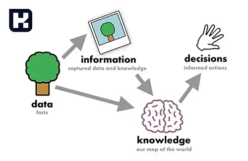
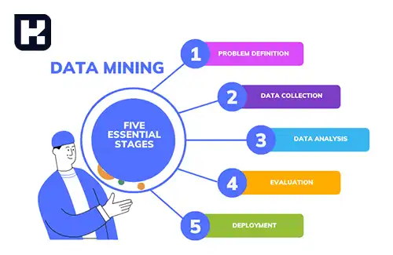
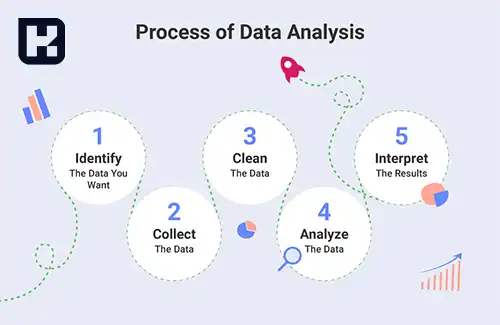

<blockquote style="background-color:#eeeefc; padding:0.5rem">

  
آنچه در این مطلب خواهید خواند

  <ul>
    <li>داده‌کاوی (Data Mining) چیست؟</li>
    <li>تفاوت بین داده (Data) و اطلاعات (Information)</li>
    <li>کاربردهای داده‌کاوی</li>
    <li>فرآیند داده‌کاوی</li>
    <li>مزایای داده‌کاوی</li>
    <li>معایب داده‌کاوی</li>
  </ul>

</blockquote>

داده‌ها به عنوان منابع ارزشمندی در دنیای امروز شناخته می‌شوند که می‌توانند جهت‌گیری‌ها و استراتژی‌های یک کسب‌وکار را به‌طور کامل تغییر دهند. اما داده‌های خام به خودی خود تنها مجموعه‌ای از اطلاعات بی‌معنی هستند که برای تبدیل به ارزش واقعی نیاز به تحلیل و پردازش دارند. داده‌کاوی، فرآیندی است که به شرکت‌ها کمک می‌کند تا این داده‌ها را به اطلاعات معنادار و قابل‌استفاده تبدیل کنند و از آن‌ها برای تصمیم‌گیری‌های هوشمندانه و بهره‌برداری از مزیت رقابتی استفاده کنند.

در این مقاله به معرفی داده‌کاوی، مراحل مختلف آن، کاربردهای وسیع این فرآیند و مزایا و چالش‌هایی که ممکن است برای کسب‌وکارها به همراه داشته باشد خواهیم پرداخت.

## داده‌کاوی (Data Mining) چیست؟

داده‌کاوی به فرآیندی اطلاق می‌شود که به وسیله آن کسب‌وکارها از داده‌های خام استفاده می‌کنند تا به الگوها و اطلاعات ارزشمندی دست یابند که می‌تواند به تصمیم‌گیری بهتر و ارتقای عملکرد کمک کند. این فرآیند به‌طور مستقیم از ترکیب دانش آمار، هوش مصنوعی و فناوری اطلاعات برای تحلیل داده‌ها بهره می‌برد. داده‌کاوی نه تنها یک مفهوم جدید است، بلکه سابقه‌ای طولانی دارد و به حدود یک قرن پیش بازمی‌گردد. 

یکی از نخستین مثال‌ها از داده‌کاوی به معرفی ماشین تورینگ در سال 1936 برمی‌گردد. امروزه این فرآیند در بسیاری از حوزه‌ها مانند بازاریابی، مدیریت ریسک، تحلیل رفتار مشتریان و ... به‌طور گسترده استفاده می‌شود.

### تفاوت بین داده (Data) و اطلاعات (Information)

قبل از ورود به جزئیات داده‌کاوی، باید تفاوت اساسی بین داده و اطلاعات را درک کنیم. داده‌ها به‌طور کلی مجموعه‌ای از حقایق خام هستند که به خودی خود معنای خاصی ندارند. این داده‌ها ممکن است شامل اعداد، کلمات، اندازه‌گیری‌ها، مشاهدات و حتی تصاویر باشند. در مقابل، اطلاعات زمانی ارزش پیدا می‌کند که داده‌ها پردازش و تحلیل شوند و در یک زمینه خاص قرار بگیرند تا معنای خاصی را منتقل کنند.

### کاربردهای داده‌کاوی

داده‌کاوی ابزاری حیاتی برای تجزیه‌وتحلیل داده‌های حجیم و کشف اطلاعات پنهان و ارزشمند است. این فرآیند به کسب‌وکارها کمک می‌کند تا با شناسایی الگوها و روندهای پنهان، به مزیت رقابتی دست یابند. به‌عنوان مثال:

- **بازاریابی:** تحلیل رفتار مشتریان برای طراحی استراتژی‌های هدفمند.
- **مدیریت ریسک:** شناسایی و پیش‌بینی خطرات احتمالی.
- **تحلیل پیش‌بینی:** ارائه پیش‌بینی‌های دقیق از رفتارهای آینده مشتریان و روند بازار.
- **مراقبت‌های بهداشتی:** تجزیه‌وتحلیل داده‌ها برای پیش‌بینی بیماری‌ها و بهبود خدمات بهداشتی.

### فرآیند داده‌کاوی

داده‌کاوی معمولاً از پنج مرحله اصلی تشکیل شده است که در اینجا به‌طور مختصر به آن‌ها اشاره می‌کنیم:

#### تعریف مسئله

اولین مرحله از داده‌کاوی تعریف مسئله است که شامل شناسایی یک مشکل مشخص کسب‌وکار یا هدفی است که باید از طریق تحلیل داده‌ها به آن دست یافت. این مسئله می‌تواند شامل بهبود نرخ حفظ مشتری یا شناسایی فرصت‌های صرفه‌جویی در هزینه باشد.

**مرحله تعریف مسئله در داده‌کاوی**  

در این مرحله، تعریف دقیق مسئله و اطمینان از هم‌راستایی تمامی ذی‌نفعان اهمیت زیادی دارد. این امر پایه‌ای را برای سایر مراحل داده‌کاوی فراهم می‌کند و تلاش‌های شما را بر دستیابی به یک نتیجه خاص متمرکز می‌سازد.

در طول مرحله تعریف مسئله، جمع‌آوری نظرات از تمامی افراد مرتبط، از جمله رهبران کسب‌وکار، کارشناسان موضوع و کاربران نهایی، ضروری است. این کار به تضمین درک همه از دامنه مسئله و اهداف مورد نظر کمک می‌کند.

علاوه بر این، این مرحله اغلب شامل مرور منابع داده موجود و انجام یک ارزیابی اولیه امکان‌سنجی برای اطمینان از کافی بودن داده‌ها برای حل مشکل کسب‌وکار است.

#### جمع‌آوری داده‌ها  

پس از تعریف واضح مسئله، مرحله بعدی در داده‌کاوی جمع‌آوری داده‌های مرتبط از منابع مختلف داخلی و خارجی است.

**مرحله جمع‌آوری داده در داده‌کاوی**  

منابع داده می‌توانند شامل موارد زیر باشند:  
- نظرسنجی‌های بازخورد مشتری،  
- تحلیل شبکه‌های اجتماعی،  
- گزارش‌های مالی و موارد دیگر.  

اطمینان از دقیق و کامل بودن داده‌های جمع‌آوری‌شده قبل از ادامه مراحل بعدی ضروری است. پس از جمع‌آوری داده‌های مرتبط، لازم است آنها را در قالبی سازمان‌دهی کنید که تحلیل آنها آسان باشد. این معمولاً شامل ذخیره داده‌ها در پایگاه داده یا برنامه صفحه‌گسترده است.

**نکات مهم:**  
- تعیین اینکه چه داده‌هایی برای حل مشکل لازم است.  
- اجتناب از جمع‌آوری داده‌های غیرمرتبط که منجر به اتلاف زمان و منابع می‌شود.  
- اطمینان از اینکه داده‌ها دقیق و از منابع قابل‌اعتماد هستند.  

#### تحلیل داده‌ها

پس از جمع‌آوری و سازمان‌دهی داده‌ها، مرحله بعدی تحلیل داده‌ها است. در این مرحله از روش‌های آماری و الگوریتم‌ها برای کشف الگوها، روابط و بینش‌ها استفاده می‌شود.

**مرحله تحلیل داده در داده‌کاوی**  

این مرحله می‌تواند شامل استفاده از تکنیک‌هایی مانند:  

- **تحلیل رگرسیون**: برای شناسایی رابطه بین متغیرها،  
- **تحلیل خوشه‌بندی**: برای گروه‌بندی داده‌ها بر اساس شباهت‌ها،  
- **درخت تصمیم**: برای پیش‌بینی نتایج آینده بر اساس سناریوهای مختلف.  
هدف از این مرحله، درک بهتر داده‌ها و کاربردهای بالقوه آنها برای حل مشکل یا اتخاذ تصمیمات استراتژیک است.

#### ارزیابی 

پس از تکمیل مرحله تحلیل داده، ارزیابی نتایج نسبت به تعریف اولیه مسئله بسیار مهم است.

**مرحله ارزیابی در داده‌کاوی**  

این مرحله شامل:  
- بررسی کیفیت و دقت نتایج و اطمینان از قابل‌اعتماد بودن آنها برای تصمیم‌گیری.  
- شناسایی شکاف‌ها یا ناسازگاری‌ها و در صورت لزوم جمع‌آوری داده‌های اضافی.  
- تحلیل بیشتر برای درک بهتر الگوها یا روابط کشف‌شده.  

#### استقرار

مرحله نهایی در داده‌کاوی، استقرار نتایج است. این شامل ادغام یافته‌ها در فرآیندهای تصمیم‌گیری کسب‌وکار می‌شود.

**مرحله استقرار در داده‌کاوی**  

این مرحله فراتر از انتقال نتایج تحلیل است و شامل استفاده عملی از یافته‌ها برای دستیابی به اهداف خاص می‌شود. 

**نکات مهم:**  
- همکاری نزدیک با ذی‌نفعان و تیم‌های مرتبط برای درک و استفاده از بینش‌ها.  
- نظارت مداوم بر پیشرفت و ایجاد تغییرات در صورت نیاز.  
- تضمین تبدیل بینش‌های داده‌محور به اقدامات معنی‌دار که نتایج مطلوب را به همراه داشته باشد.  

### مزایای داده‌کاوی

داده‌کاوی مزایای متعددی برای کسب‌وکارها به همراه دارد که شامل موارد زیر می‌شود:

- **شناسایی تقلب و کلاه‌برداری:** با شناسایی الگوهای غیرعادی، می‌توان از وقوع تقلب جلوگیری کرد.
- **مدیریت ریسک:** ارزیابی دقیق ریسک‌ها به سازمان‌ها کمک می‌کند تا خطرات را به حداقل برسانند.
- **افزایش وفاداری مشتریان:** با تحلیل ترجیحات و رفتار مشتریان، کسب‌وکارها می‌توانند استراتژی‌هایی برای حفظ مشتریان و افزایش وفاداری آن‌ها ایجاد کنند.
- **تقویت فروش و درآمد:** شناسایی الگوهای خرید مشتریان و ارائه پیشنهادات هدفمند می‌تواند منجر به افزایش فروش و درآمد شود.

### معایب داده‌کاوی

گرچه داده‌کاوی مزایای زیادی دارد، اما در کنار آن برخی چالش‌ها و معایب نیز وجود دارد:

- **نیاز به دانش پیشرفته:** برای استفاده صحیح از داده‌کاوی، دانش گسترده‌ای در زمینه آمار و علم داده نیاز است که ممکن است برای بسیاری از کسب‌وکارها چالش‌برانگیز باشد.

اگر می‌خواهید دید بهتری نسبت به نقش علم داده در تحلیل و پردازش داده‌ها پیدا کنید، مقاله <a href="https://www.hooshkar.com/Wiki/InformationTechnology/WhatIsDataScienceTheDifferenceBetweenDataScienceAndArtificialIntelligence" target="_blank">علم داده چیست؟
</a> را مطالعه کنید. علم داده به‌عنوان یک حوزه جامع‌تر، از روش‌هایی مانند داده‌کاوی برای استخراج اطلاعات ارزشمند از داده‌ها بهره می‌برد.

- **حریم خصوصی و امنیت:** در برخی موارد، ممکن است فرآیند داده‌کاوی به نقض حریم خصوصی کاربران منجر شود.
- **هزینه‌های بالا:** راه‌اندازی زیرساخت‌های لازم برای داده‌کاوی و استخدام متخصصان ممکن است هزینه‌های زیادی به همراه داشته باشد.

---
### جمع‌بندی

داده‌کاوی، با تجزیه و تحلیل داده‌های حجیم و کشف الگوهای پنهان، یک ابزار قدرتمند برای بهبود تصمیم‌گیری‌های کسب‌وکارها به‌شمار می‌رود. این فرآیند به‌ویژه در حوزه‌های بازاریابی، مدیریت ریسک و تحلیل رفتار مشتریان کاربردهای گسترده‌ای دارد و می‌تواند مزایای بسیاری را برای کسب‌وکارها به ارمغان آورد. با این حال، به دلیل نیاز به تخصص و هزینه‌های بالا، ممکن است برخی از سازمان‌ها با چالش‌هایی در پیاده‌سازی آن مواجه شوند.