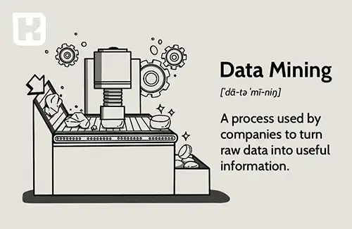
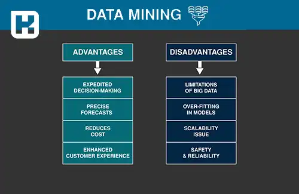

<blockquote class="faq-block">

  
آنچه در این مطلب خواهید خواند

  <ul>
    <li>داده‌کاوی (Data Mining) چیست؟</li>
    <li>تفاوت بین داده (Data) و اطلاعات (Information)</li>
    <li>کاربردهای داده‌کاوی</li>
    <li>فرآیند داده‌کاوی</li>
    <li>مزایای داده‌کاوی</li>
    <li>معایب داده‌کاوی</li>
  </ul>

</blockquote>

داده‌ها به عنوان منابع ارزشمندی در دنیای امروز شناخته می‌شوند که می‌توانند جهت‌گیری‌ها و استراتژی‌های یک کسب‌وکار را به‌طور کامل تغییر دهند. اما داده‌های خام به خودی خود تنها مجموعه‌ای از اطلاعات بی‌معنی هستند که برای تبدیل به ارزش واقعی نیاز به تحلیل و پردازش دارند. داده‌کاوی، فرآیندی است که به شرکت‌ها کمک می‌کند تا این داده‌ها را به اطلاعات معنادار و قابل‌استفاده تبدیل کنند و از آن‌ها برای تصمیم‌گیری‌های هوشمندانه و بهره‌برداری از مزیت رقابتی استفاده کنند.

در این مقاله به معرفی داده‌کاوی، مراحل مختلف آن، کاربردهای وسیع این فرآیند و مزایا و چالش‌هایی که ممکن است برای کسب‌وکارها به همراه داشته باشد خواهیم پرداخت.

## داده‌کاوی (Data Mining) چیست؟

داده‌کاوی به فرآیندی اطلاق می‌شود که به وسیله آن کسب‌وکارها از داده‌های خام استفاده می‌کنند تا به الگوها و اطلاعات ارزشمندی دست یابند که می‌تواند به تصمیم‌گیری بهتر و ارتقای عملکرد کمک کند. این فرآیند به‌طور مستقیم از ترکیب دانش آمار، هوش مصنوعی و فناوری اطلاعات برای تحلیل داده‌ها بهره می‌برد. داده‌کاوی نه تنها یک مفهوم جدید است، بلکه سابقه‌ای طولانی دارد و به حدود یک قرن پیش بازمی‌گردد. 

یکی از نخستین مثال‌ها از داده‌کاوی به معرفی ماشین تورینگ در سال 1936 برمی‌گردد. امروزه این فرآیند در بسیاری از حوزه‌ها مانند بازاریابی، مدیریت ریسک، تحلیل رفتار مشتریان و ... به‌طور گسترده استفاده می‌شود.

### تفاوت بین داده (Data) و اطلاعات (Information)

قبل از ورود به جزئیات داده‌کاوی، باید تفاوت اساسی بین داده و اطلاعات را درک کنیم. داده‌ها به‌طور کلی مجموعه‌ای از حقایق خام هستند که به خودی خود معنای خاصی ندارند. این داده‌ها ممکن است شامل اعداد، کلمات، اندازه‌گیری‌ها، مشاهدات و حتی تصاویر باشند. در مقابل، اطلاعات زمانی ارزش پیدا می‌کند که داده‌ها پردازش و تحلیل شوند و در یک زمینه خاص قرار بگیرند تا معنای خاصی را منتقل کنند.

### کاربردهای داده‌کاوی

داده‌کاوی ابزاری حیاتی برای تجزیه‌وتحلیل داده‌های حجیم و کشف اطلاعات پنهان و ارزشمند است. این فرآیند به کسب‌وکارها کمک می‌کند تا با شناسایی الگوها و روندهای پنهان، به مزیت رقابتی دست یابند. به‌عنوان مثال:

- **بازاریابی:** تحلیل رفتار مشتریان برای طراحی استراتژی‌های هدفمند.
- **مدیریت ریسک:** شناسایی و پیش‌بینی خطرات احتمالی.
- **تحلیل پیش‌بینی:** ارائه پیش‌بینی‌های دقیق از رفتارهای آینده مشتریان و روند بازار.
- **مراقبت‌های بهداشتی:** تجزیه‌وتحلیل داده‌ها برای پیش‌بینی بیماری‌ها و بهبود خدمات بهداشتی.

### فرآیند داده‌کاوی

داده‌کاوی معمولاً از پنج مرحله اصلی تشکیل شده است که در اینجا به‌طور مختصر به آن‌ها اشاره می‌کنیم:

#### 1. تعریف مسئله

اولین مرحله از داده‌کاوی تعریف مسئله است که شامل شناسایی یک مشکل مشخص کسب‌وکار یا هدفی است که باید از طریق تحلیل داده‌ها به آن دست یافت. این مسئله می‌تواند شامل بهبود نرخ حفظ مشتری یا شناسایی فرصت‌های صرفه‌جویی در هزینه باشد.

مرحله تعریف مسئله در داده‌کاوی:

در این مرحله، تعریف دقیق مسئله و اطمینان از هم‌راستایی تمامی ذی‌نفعان اهمیت زیادی دارد. این امر پایه‌ای را برای سایر مراحل داده‌کاوی فراهم می‌کند و تلاش‌های شما را بر دستیابی به یک نتیجه خاص متمرکز می‌سازد.

در طول مرحله تعریف مسئله، جمع‌آوری نظرات از تمامی افراد مرتبط، از جمله رهبران کسب‌وکار، کارشناسان موضوع و کاربران نهایی، ضروری است. این کار به تضمین درک همه از دامنه مسئله و اهداف مورد نظر کمک می‌کند.

علاوه بر این، این مرحله اغلب شامل مرور منابع داده موجود و انجام یک ارزیابی اولیه امکان‌سنجی برای اطمینان از کافی بودن داده‌ها برای حل مشکل کسب‌وکار است.

#### 2. جمع‌آوری داده‌ها  

پس از تعریف واضح مسئله، مرحله بعدی در داده‌کاوی جمع‌آوری داده‌های مرتبط از منابع مختلف داخلی و خارجی است.

مرحله جمع‌آوری داده در داده‌کاوی:

منابع داده می‌توانند شامل موارد زیر باشند:  
- نظرسنجی‌های بازخورد مشتری،  
- تحلیل شبکه‌های اجتماعی،  
- گزارش‌های مالی و موارد دیگر.  

اطمینان از دقیق و کامل بودن داده‌های جمع‌آوری‌شده قبل از ادامه مراحل بعدی ضروری است. پس از جمع‌آوری داده‌های مرتبط، لازم است آنها را در قالبی سازمان‌دهی کنید که تحلیل آنها آسان باشد. این معمولاً شامل ذخیره داده‌ها در پایگاه داده یا برنامه صفحه‌گسترده است.

نکات مهم:
- تعیین اینکه چه داده‌هایی برای حل مشکل لازم است.  
- اجتناب از جمع‌آوری داده‌های غیرمرتبط که منجر به اتلاف زمان و منابع می‌شود.  
- اطمینان از اینکه داده‌ها دقیق و از منابع قابل‌اعتماد هستند.  

#### 3. تحلیل داده‌ها

پس از جمع‌آوری و سازمان‌دهی داده‌ها، مرحله بعدی تحلیل داده‌ها است. در این مرحله از روش‌های آماری و الگوریتم‌ها برای کشف الگوها، روابط و بینش‌ها استفاده می‌شود.

مرحله تحلیل داده در داده‌کاوی:

این مرحله می‌تواند شامل استفاده از تکنیک‌هایی مانند:  

- **تحلیل رگرسیون**: برای شناسایی رابطه بین متغیرها،  
- **تحلیل خوشه‌بندی**: برای گروه‌بندی داده‌ها بر اساس شباهت‌ها،  
- **درخت تصمیم**: برای پیش‌بینی نتایج آینده بر اساس سناریوهای مختلف.  
هدف از این مرحله، درک بهتر داده‌ها و کاربردهای بالقوه آنها برای حل مشکل یا اتخاذ تصمیمات استراتژیک است.

#### 4. ارزیابی 

پس از تکمیل مرحله تحلیل داده، ارزیابی نتایج نسبت به تعریف اولیه مسئله بسیار مهم است.

مرحله ارزیابی در داده‌کاوی:

این مرحله شامل:  
- بررسی کیفیت و دقت نتایج و اطمینان از قابل‌اعتماد بودن آنها برای تصمیم‌گیری.  
- شناسایی شکاف‌ها یا ناسازگاری‌ها و در صورت لزوم جمع‌آوری داده‌های اضافی.  
- تحلیل بیشتر برای درک بهتر الگوها یا روابط کشف‌شده.  

#### 5. استقرار

مرحله نهایی در داده‌کاوی، استقرار نتایج است. این شامل ادغام یافته‌ها در فرآیندهای تصمیم‌گیری کسب‌وکار می‌شود.

مرحله استقرار در داده‌کاوی:

این مرحله فراتر از انتقال نتایج تحلیل است و شامل استفاده عملی از یافته‌ها برای دستیابی به اهداف خاص می‌شود. 

نکات مهم:

- همکاری نزدیک با ذی‌نفعان و تیم‌های مرتبط برای درک و استفاده از بینش‌ها.  
- نظارت مداوم بر پیشرفت و ایجاد تغییرات در صورت نیاز.  
- تضمین تبدیل بینش‌های داده‌محور به اقدامات معنی‌دار که نتایج مطلوب را به همراه داشته باشد.  

### مزایای داده‌کاوی

**1. گرفتن تصمیمات سریع‌تر**

داده‌کاوی یک فرآیند خودکار است که امکان تحلیل مستمر داده‌ها را فراهم می‌کند. این موضوع کل فرآیند را بدون نیاز به دخالت انسانی اتوماتیک می‌کند و تصمیمات مهم می‌توانند به سرعت بر اساس نتایج تحلیل داده‌ها گرفته شوند. این امر همچنین فرآیند تصمیم‌گیری را ساده‌تر می‌کند.  

**2. پیش‌بینی‌های دقیق**

داده‌کاوی به فرآیند برنامه‌ریزی در سازمان‌ها کمک می‌کند. با پیش‌بینی‌های دقیق بر اساس روندهای گذشته و حال سازمان، مدیران برنامه‌ریزی می‌توانند تصمیمات بهتری بگیرند و برنامه‌های مؤثرتری ارائه دهند.  

**3. کاهش هزینه‌ها**

داده‌کاوی باعث تخصیص کارآمدتر منابع در سازمان می‌شود. به دلیل خودکار شدن بسیاری از کارها و پیش‌بینی‌های دقیق، هزینه‌های مربوط به تحقیقات داده کاهش می‌یابد. این موضوع رضایت کارکنان را افزایش داده و انرژی ذخیره‌شده را می‌توان برای طراحی استراتژی‌های بهتر برنامه‌ریزی سازمان استفاده کرد.  

**4. بهبود تجربه مشتری**
 
اجرای مدل‌های داده‌کاوی به شدت تجربه مشتری را بهبود می‌بخشد، زیرا امکان تعاملات شخصی‌سازی‌شده فراهم می‌شود. این فرآیند بر اساس ویژگی‌ها و تفاوت‌های منحصر به فرد هر مشتری انجام می‌شود که از طریق داده‌کاوی شناسایی می‌گردد.  

### معایب داده‌کاوی

**1. محدودیت‌های داده‌های بزرگ**  
مقدار عظیم داده‌هایی که جمع‌آوری می‌شود، به دلیل نادرستی داده‌ها و کندی ابزارهای داده‌کاوی، چالشی برای تحلیل ایجاد می‌کند. حجم، تنوع، دقت و سرعت داده‌ها، بهینه‌سازی داده‌کاوی را دشوار می‌کند. مدیریت کیفیت و کمیت داده‌های جمع‌آوری‌شده نیز مشکل‌ساز است.  

**2. مدل‌های بیش‌برازش (Overfitting)**  
گاهی اوقات در مدل‌های داده‌کاوی، به جای شناسایی روندهای نمونه، اشتباهات اساسی نشان داده می‌شود. مدل‌ها به دلیل وجود متغیرهای مستقل بیش از حد، پیچیده می‌شوند و ممکن است تنها به داده‌های نمونه شناخته‌شده محدود شوند.  

**3. مسئله مقیاس‌پذیری**  
با افزایش حجم و تنوع داده‌ها، مدل‌های داده‌کاوی باید برای پشتیبانی از این تغییرات مقیاس‌پذیر شوند. این امر باعث افزایش هزینه پردازش و زیرساخت‌های محاسباتی می‌شود و هزینه کلی مدیریت داده‌های سازمانی را بالا می‌برد.  

**4. امنیت و قابلیت اطمینان**  
افزایش نیاز به ذخیره داده‌ها، افراد و سازمان‌ها را به سمت استفاده از رایانش ابری سوق می‌دهد. اما ماهیت این نوع ذخیره‌سازی خطر نقض داده را به همراه دارد. هر سازمان باید برای امنیت داده‌های جمع‌آوری‌شده تلاش کند تا رابطه‌ای مبتنی بر اعتماد با مشتریان ایجاد کند.  

---

### جمع‌بندی

داده‌کاوی، با تجزیه و تحلیل داده‌های حجیم و کشف الگوهای پنهان، یک ابزار قدرتمند برای بهبود تصمیم‌گیری‌های کسب‌وکارها به‌شمار می‌رود. این فرآیند به‌ویژه در حوزه‌های بازاریابی، مدیریت ریسک و تحلیل رفتار مشتریان کاربردهای گسترده‌ای دارد و می‌تواند مزایای بسیاری را برای کسب‌وکارها به ارمغان آورد. با این حال، به دلیل نیاز به تخصص و هزینه‌های بالا، ممکن است برخی از سازمان‌ها با چالش‌هایی در پیاده‌سازی آن مواجه شوند.