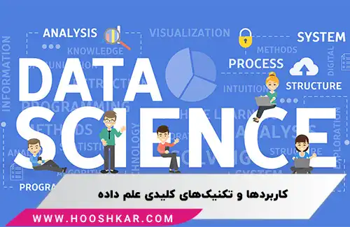

<blockquote style="background-color:#eeeefc; padding:0.5rem">

  
آنچه در این مطلب خواهید خواند

  <ul>
    <li>علم داده چیست؟</li>
    <li>تاریخچه و تکامل علم داده</li>
    <li>کاربردهای علم داده</li>
    <li>تکنیک‌های کلیدی در علم داده</li>
    <li>علم داده و هوش مصنوعی: مقایسه و تفاوت‌ها</li>
    <li>تفاوت‌های کلیدی بین علم داده و هوش مصنوعی</li>
    <li>کدام یک برای شما مناسب‌تر است؟</li>
  </ul>

</blockquote>

علم داده (Data Science) به عنوان یک حوزه میان‌رشته‌ای از ترکیب دانش‌های مختلف مانند ریاضیات، آمار، برنامه‌نویسی و تحلیل داده‌ها برای استخراج اطلاعات ارزشمند پدید آمده است. این علم به سازمان‌ها کمک می‌کند تا با تجزیه و تحلیل داده‌ها، تصمیم‌گیری‌های مؤثرتر و برنامه‌ریزی‌های بهتری انجام دهند. علم داده به سرعت تبدیل به یکی از ابزارهای حیاتی در زمینه‌های مختلف تجاری و علمی شده است. در این مقاله، به بررسی مفاهیم اصلی علم داده، کاربردهای آن و تفاوت‌های آن با هوش مصنوعی خواهیم پرداخت.

### علم داده چیست؟ 

علم داده (Data Science) یک رشته بین‌رشته‌ای است که از ترکیب ریاضیات، آمار، برنامه‌نویسی، تحلیل داده‌ها و هوش مصنوعی تشکیل شده است. هدف اصلی این رشته، تجزیه و تحلیل داده‌ها برای استخراج اطلاعات مفید و بینش‌های پنهان است که به تصمیم‌گیری‌های سازمان‌ها کمک می‌کند.

### تاریخچه و تکامل علم داده
- علم داده ابتدا در سال 1962 تحت عنوان تحلیل داده معرفی شد.
- تا اواخر دهه 90 میلادی به طور رسمی به نام "دیتا ساینس" شناخته نشد.
- این حوزه به یکی از محبوب‌ترین و آینده‌دارترین زمینه‌ها برای متخصصان تبدیل شده است.

### کاربردهای علم داده
علم داده به سازمان‌ها کمک می‌کند تا از داده‌ها برای تصمیم‌گیری‌های کلان و برنامه‌ریزی‌های تجاری استفاده کنند. برخی از کاربردها عبارتند از:
- تحلیل داده‌ها برای کشف الگوها و روندها
- مدل‌سازی پیش‌بینی‌کننده
- تحلیل بازار و رفتار مشتریان

### تکنیک‌های کلیدی در علم داده
1. **طبقه‌بندی (Classification)**:
   - تقسیم داده‌ها به گروه‌ها یا دسته‌های خاص.
   - مثال‌ها: دسته‌بندی محصولات به محبوب یا غیرمحبوب، دسته‌بندی نظرات به مثبت، منفی یا خنثی.

2. **رگرسیون (Regression)**:
   - شناسایی روابط بین داده‌ها و پیش‌بینی مقادیر بر اساس آن‌ها.
   - مثال‌ها: پیش‌بینی میزان شیوع بیماری‌ها، رابطه رضایت مشتری با تعداد کارکنان.

3. **خوشه‌بندی (Clustering)**:
   - گروه‌بندی داده‌ها بر اساس شباهت‌های آن‌ها.
   - کاربرد در شناسایی الگوها و ناهنجاری‌ها.

---

### علم داده و هوش مصنوعی: مقایسه و تفاوت‌ها

#### 1. **<a href="https://www.hooshkar.com/Wiki/InformationTechnology/ArtificialIntelligence" target="_blank">هوش مصنوعی (Artificial Intelligence)</a>**

- **هدف**: توسعه الگوریتم‌ها و مدل‌هایی که می‌توانند به صورت خودکار کارهایی را انجام دهند که معمولاً نیاز به هوش انسانی دارند.
- **کاربردها**: 
  - تشخیص گفتار و پردازش زبان طبیعی (دستیارهای صوتی مثل Siri و Alexa)
  - بینایی ماشین (تشخیص چهره، تحلیل ویدئوها)
  - سیستم‌های توصیه‌گر (پیشنهاد فیلم در نتفلیکس)
- **مهارت‌های مورد نیاز**: 
  - یادگیری ماشین و یادگیری عمیق
  - برنامه‌نویسی در Python و استفاده از کتابخانه‌هایی مثل TensorFlow و PyTorch

#### 2. علم داده (Data Science)
- **هدف**: استخراج دانش و الگوها از داده‌ها برای تصمیم‌گیری بهتر و پیش‌بینی‌های دقیق‌تر.
- **کاربردها**:
  - تحلیل داده‌ها و کشف الگوهای تجاری
  - مدل‌سازی پیش‌بینی‌کننده برای پیش‌بینی آینده
  - تحلیل بازار و رفتار مشتریان
- **مهارت‌های مورد نیاز**:
  - تحلیل داده‌ها و آماری
  - برنامه‌نویسی در Python و R
  - بصری‌سازی داده‌ها با ابزارهایی مثل Tableau و Matplotlib

---

### تفاوت‌های کلیدی بین علم داده و هوش مصنوعی
1. **تمرکز اصلی**:
   - **هوش مصنوعی**: توسعه سیستم‌هایی که می‌توانند بیاموزند و تصمیم‌گیری کنند.
   - **علم داده**: تجزیه و تحلیل داده‌ها برای کشف الگوها و پیش‌بینی‌ها.

2. **سطح تعامل با داده‌ها**:
   - **علم داده**: تمرکز بر تحلیل داده‌های واقعی (پاکسازی، تحلیل آماری، بصری‌سازی).
   - **هوش مصنوعی**: تمرکز بر ایجاد مدل‌های پیچیده و یادگیری الگوریتم‌ها.

3. **خروجی**:
   - **علم داده**: توصیه‌ها، گزارش‌ها و مدل‌های تحلیلی.
   - **هوش مصنوعی**: سیستم‌های خودکار که تصمیم‌گیری می‌کنند و عملی انجام می‌دهند.

---

### کدام یک برای شما مناسب‌تر است؟
- اگر به یادگیری ماشین، خودکارسازی سیستم‌ها و هوش ماشینی علاقه دارید، **هوش مصنوعی** مناسب‌تر است.
- اگر علاقه‌مند به تحلیل داده‌ها، استخراج بینش‌ها و پیش‌بینی بر اساس داده‌های گذشته هستید، **علم داده** گزینه بهتری است.

---

### ترکیب هر دو
در بسیاری از مشاغل، این دو حوزه به هم مرتبط هستند:
- **علم داده** می‌تواند از الگوریتم‌های **هوش مصنوعی** برای ایجاد مدل‌های پیش‌بینی‌کننده استفاده کند.
- برای ساخت مدل‌های هوش مصنوعی نیاز به تحلیل داده‌ها و یادگیری ماشین (که یکی از شاخه‌های علم داده است) دارید.

بنابراین، یادگیری هر دو حوزه می‌تواند شما را برای کار در پروژه‌های مختلف و تنوع بیشتر در شغل آماده کند.

### جمع‌بندی

علم داده و هوش مصنوعی هر دو از جمله حوزه‌های پرطرفدار و در حال توسعه در دنیای امروز هستند. علم داده به تجزیه و تحلیل داده‌ها برای کشف الگوها و پیش‌بینی آینده می‌پردازد و به تصمیم‌گیری‌های مبتنی بر داده کمک می‌کند. در مقابل، هوش مصنوعی بیشتر بر توسعه سیستم‌هایی تمرکز دارد که می‌توانند به صورت خودکار تصمیم‌گیری کنند و عمل نمایند. 

هر یک از این دو حوزه ویژگی‌ها و کاربردهای خاص خود را دارند، اما در بسیاری از پروژه‌ها به هم مرتبط هستند و می‌توانند مکمل یکدیگر باشند. بنابراین، آگاهی از هر دو حوزه و ترکیب مهارت‌های مرتبط با آن‌ها می‌تواند فرد را در مسیر شغلی موفق‌تری قرار دهد.