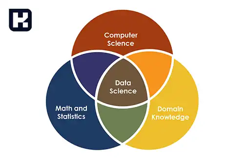

<blockquote class="faq-block">

  
آنچه در این مطلب خواهید خواند

  <ul>
    <li>علم داده چیست؟</li>
    <li>تاریخچه و تکامل علم داده</li>
    <li>کاربردهای علم داده</li>
    <li>تکنیک‌های کلیدی در علم داده</li>
    <li>علم داده و هوش مصنوعی: مقایسه و تفاوت‌ها</li>
    <li>تفاوت‌های کلیدی بین علم داده و هوش مصنوعی</li>
    <li>کدام یک برای شما مناسب‌تر است؟</li>
    <li>سوالات متداول</li>
    <li>جمع‌بندی</li>
  </ul>

</blockquote> 

علم داده (Data Science) به عنوان یک حوزه میان‌رشته‌ای از ترکیب دانش‌های مختلف مانند ریاضیات، آمار، برنامه‌نویسی و تحلیل داده‌ها برای استخراج اطلاعات ارزشمند پدید آمده است. این علم به سازمان‌ها کمک می‌کند تا با تجزیه و تحلیل داده‌ها، تصمیم‌گیری‌های مؤثرتر و برنامه‌ریزی‌های بهتری انجام دهند. علم داده به سرعت تبدیل به یکی از ابزارهای حیاتی در زمینه‌های مختلف تجاری و علمی شده است. در این مقاله، به بررسی مفاهیم اصلی علم داده، کاربردهای آن و تفاوت‌های آن با هوش مصنوعی خواهیم پرداخت.

### علم داده چیست؟ 

علم داده (Data Science) یک رشته بین‌رشته‌ای است که از ترکیب ریاضیات، آمار، برنامه‌نویسی، تحلیل داده‌ها و هوش مصنوعی تشکیل شده است. هدف اصلی این رشته، تجزیه و تحلیل داده‌ها برای استخراج اطلاعات مفید و بینش‌های پنهان است که به تصمیم‌گیری‌های سازمان‌ها کمک می‌کند.

### تاریخچه و تکامل علم داده
- علم داده ابتدا در سال 1962 تحت عنوان تحلیل داده معرفی شد.
- تا اواخر دهه 90 میلادی به طور رسمی به نام "دیتا ساینس" شناخته نشد.
- این حوزه به یکی از محبوب‌ترین و آینده‌دارترین زمینه‌ها برای متخصصان تبدیل شده است.

### کاربردهای علم داده
علم داده به سازمان‌ها کمک می‌کند تا از داده‌ها برای تصمیم‌گیری‌های کلان و برنامه‌ریزی‌های تجاری استفاده کنند. برخی از کاربردها عبارتند از:

- تحلیل داده‌ها برای کشف الگوها و روندها
- مدل‌سازی پیش‌بینی‌کننده
- تحلیل بازار و رفتار مشتریان

### تکنیک‌های کلیدی در علم داده
1. **طبقه‌بندی (Classification)**:
   - تقسیم داده‌ها به گروه‌ها یا دسته‌های خاص.
   - مثال‌ها: دسته‌بندی محصولات به محبوب یا غیرمحبوب، دسته‌بندی نظرات به مثبت، منفی یا خنثی.

2. **رگرسیون (Regression)**:
   - شناسایی روابط بین داده‌ها و پیش‌بینی مقادیر بر اساس آن‌ها.
   - مثال‌ها: پیش‌بینی میزان شیوع بیماری‌ها، رابطه رضایت مشتری با تعداد کارکنان.

3. **خوشه‌بندی (Clustering)**:
   - گروه‌بندی داده‌ها بر اساس شباهت‌های آن‌ها.
   - کاربرد در شناسایی الگوها و ناهنجاری‌ها.

---

###  مقایسه و تفاوت‌های علم داده و هوش مصنوعی

#### 1. **<a href="https://www.hooshkar.com/Wiki/InformationTechnology/ArtificialIntelligence" target="_blank">هوش مصنوعی (Artificial Intelligence)</a>**

- **هدف**: توسعه الگوریتم‌ها و مدل‌هایی که می‌توانند به صورت خودکار کارهایی را انجام دهند که معمولاً نیاز به هوش انسانی دارند.
- **کاربردها**: 
  - تشخیص گفتار و پردازش زبان طبیعی (دستیارهای صوتی مثل Siri و Alexa)
  - بینایی ماشین (تشخیص چهره، تحلیل ویدئوها)
  - سیستم‌های توصیه‌گر (پیشنهاد فیلم در نتفلیکس)
- **مهارت‌های مورد نیاز**: 
  - یادگیری ماشین و یادگیری عمیق
  - برنامه‌نویسی در Python و استفاده از کتابخانه‌هایی مثل TensorFlow و PyTorch

#### 2. علم داده (Data Science)
- **هدف**: استخراج دانش و الگوها از داده‌ها برای تصمیم‌گیری بهتر و پیش‌بینی‌های دقیق‌تر.
- **کاربردها**:
  - تحلیل داده‌ها و کشف الگوهای تجاری
  - مدل‌سازی پیش‌بینی‌کننده برای پیش‌بینی آینده
  - تحلیل بازار و رفتار مشتریان

- **مهارت‌های مورد نیاز**:
  - تحلیل داده‌ها و آماری
  - برنامه‌نویسی در Python و R
  - بصری‌سازی داده‌ها با ابزارهایی مثل Tableau و Matplotlib

---

### کدام یک برای شما مناسب‌تر است؟
- اگر به یادگیری ماشین، خودکارسازی سیستم‌ها و هوش ماشینی علاقه دارید، **هوش مصنوعی** مناسب‌تر است.
- اگر علاقه‌مند به تحلیل داده‌ها، استخراج بینش‌ها و پیش‌بینی بر اساس داده‌های گذشته هستید، **علم داده** گزینه بهتری است.

---

### ترکیب هر دو
در بسیاری از مشاغل، این دو حوزه به هم مرتبط هستند:
- **علم داده** می‌تواند از الگوریتم‌های **هوش مصنوعی** برای ایجاد مدل‌های پیش‌بینی‌کننده استفاده کند.
- برای ساخت مدل‌های هوش مصنوعی نیاز به تحلیل داده‌ها و یادگیری ماشین (که یکی از شاخه‌های علم داده است) دارید.

بنابراین، یادگیری هر دو حوزه می‌تواند شما را برای کار در پروژه‌های مختلف و تنوع بیشتر در شغل آماده کند.

---

### سوالات متداول

<blockquote class="faq-block">
    

        
علم داده چیست؟

        علم داده (Data Science) رشته‌ای میان‌رشته‌ای است که با ترکیب ریاضیات، آمار، برنامه‌نویسی و تحلیل داده‌ها، به استخراج بینش‌ها و اطلاعات ارزشمند از داده‌ها می‌پردازد.
    

</blockquote>

<blockquote class="faq-block">
    

        
تفاوت علم داده و هوش مصنوعی چیست؟

        علم داده به تحلیل داده‌ها و استخراج بینش‌ها می‌پردازد، در حالی که هوش مصنوعی الگوریتم‌ها و مدل‌هایی را توسعه می‌دهد که می‌توانند کارهای خودکار و هوشمند انجام دهند.
    

</blockquote>

<blockquote class="faq-block">
    

        
کاربردهای علم داده چیست؟

        کاربردهای علم داده شامل تحلیل داده‌ها برای کشف الگوها، مدل‌سازی پیش‌بینی‌کننده، تحلیل بازار و رفتار مشتریان، و پشتیبانی از تصمیم‌گیری‌های سازمانی است.
    

</blockquote>

<blockquote class="faq-block">
    

        
کاربردهای هوش مصنوعی چیست؟

        هوش مصنوعی در تشخیص گفتار و پردازش زبان طبیعی، بینایی ماشین، سیستم‌های توصیه‌گر، و خودکارسازی فرایندها کاربرد دارد.
    

</blockquote>

<blockquote class="faq-block">
    

        
مهارت‌های مورد نیاز برای علم داده چیست؟

        مهارت‌های مورد نیاز شامل تحلیل داده‌ها و آمار، برنامه‌نویسی در Python و R، و بصری‌سازی داده‌ها با ابزارهایی مانند Tableau و Matplotlib است.
    

</blockquote>

<blockquote class="faq-block">
    

        
مهارت‌های مورد نیاز برای هوش مصنوعی چیست؟

        مهارت‌های کلیدی شامل یادگیری ماشین و یادگیری عمیق، برنامه‌نویسی Python و استفاده از کتابخانه‌هایی مانند TensorFlow و PyTorch است.
    

</blockquote>

<blockquote class="faq-block">
    

        
کدام یک برای من مناسب‌تر است؟

        اگر علاقه‌مند به خودکارسازی و هوش ماشینی هستید، هوش مصنوعی مناسب است؛ اگر علاقه‌مند به تحلیل داده‌ها و استخراج بینش‌ها هستید، علم داده گزینه بهتری است.
    

</blockquote>

<blockquote class="faq-block">
    

        
آیا می‌توان هر دو حوزه را ترکیب کرد؟

        بله، در بسیاری از پروژه‌ها علم داده و هوش مصنوعی مکمل یکدیگر هستند. الگوریتم‌های هوش مصنوعی می‌توانند بر اساس تحلیل داده‌های علم داده مدل‌های پیش‌بینی‌کننده بسازند.
    

</blockquote>

<blockquote class="faq-block">
    

        
تاریخچه علم داده چگونه است؟

        علم داده ابتدا در سال 1962 تحت عنوان تحلیل داده معرفی شد و تا اواخر دهه 90 میلادی به طور رسمی به نام "Data Science" شناخته نشد.
    

</blockquote>

<blockquote class="faq-block">
    

        
چه تکنیک‌هایی در علم داده استفاده می‌شوند؟

        تکنیک‌های کلیدی شامل طبقه‌بندی (Classification)، رگرسیون (Regression) و خوشه‌بندی (Clustering) هستند که برای تحلیل داده‌ها و استخراج الگوها به کار می‌روند.
    

</blockquote>

---

### جمع‌بندی

علم داده و هوش مصنوعی هر دو از جمله حوزه‌های پرطرفدار و در حال توسعه در دنیای امروز هستند. علم داده به تجزیه و تحلیل داده‌ها برای کشف الگوها و پیش‌بینی آینده می‌پردازد و به تصمیم‌گیری‌های مبتنی بر داده کمک می‌کند. در مقابل، هوش مصنوعی بیشتر بر توسعه سیستم‌هایی تمرکز دارد که می‌توانند به صورت خودکار تصمیم‌گیری کنند و عمل نمایند. 

هر یک از این دو حوزه ویژگی‌ها و کاربردهای خاص خود را دارند، اما در بسیاری از پروژه‌ها به هم مرتبط هستند و می‌توانند مکمل یکدیگر باشند. بنابراین، آگاهی از هر دو حوزه و ترکیب مهارت‌های مرتبط با آن‌ها می‌تواند فرد را در مسیر شغلی موفق‌تری قرار دهد.