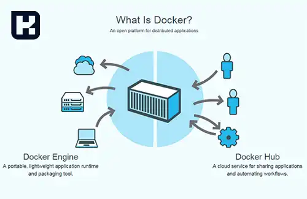
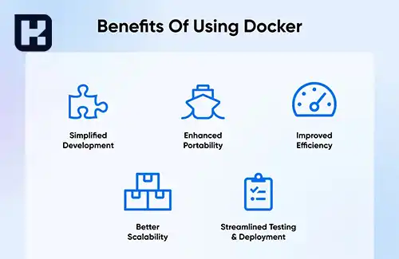

<blockquote class="faq-block">

  
آنچه در این مطلب خواهید خواند

  <ul>
    <li>داکر چیست؟</li>
    <li>ویژگی‌های برجسته داکر</li>
    <li>مزایای استفاده از داکر</li>
    <li>چالش‌ها و معایب داکر</li>
    <li>سوالات متداول</li>
    <li>جمع‌بندی</li>
  </ul>

</blockquote> 

در دنیای فناوری و توسعه نرم‌افزار، یکی از چالش‌های اصلی مدیریت وابستگی‌ها و محیط‌های اجرایی برای برنامه‌ها است. به خصوص زمانی که برنامه‌ها باید در محیط‌های مختلف مانند توسعه، تست و تولید اجرا شوند، این چالش‌ها پیچیده‌تر می‌شود. در این میان، داکر به عنوان یک پلتفرم محبوب و متن‌باز برای مدیریت و اجرای برنامه‌ها در محیط‌های کانتینری، راه‌حلی نوآورانه برای توسعه‌دهندگان و تیم‌های فناوری اطلاعات ارائه داده است. این مقاله به بررسی ویژگی‌ها، مزایا و کاربردهای داکر پرداخته و چگونگی استفاده از این تکنولوژی در پروژه‌ها را توضیح می‌دهد.

## داکر چیست؟

<a href="https://www.docker.com/" target="_blank">داکر</a> یک پلتفرم متن‌باز است که به توسعه‌دهندگان این امکان را می‌دهد تا برنامه‌ها و سرویس‌ها را در محیط‌هایی به نام کانتینرها اجرا کنند. این محیط‌ها به طور مستقل از محیط اجرایی سیستم‌عامل میزبان عمل می‌کنند و تمامی وابستگی‌ها و کتابخانه‌های مورد نیاز برای اجرای یک برنامه را شامل می‌شوند. به عبارت دیگر، داکر باعث می‌شود که برنامه‌ها به صورت بسته‌بندی‌شده در کانتینرهایی قرار بگیرند که قابل حمل و مستقل از هرگونه وابستگی به سیستم عامل هستند.

---

### ویژگی‌های برجسته داکر

1. **کانتینرها و ایزولاسیون:**
   یکی از ویژگی‌های برجسته داکر، ایزولاسیون کامل کانتینرها است. هر کانتینر به صورت جداگانه از سایر کانتینرها اجرا می‌شود و باعث می‌شود که برنامه‌ها به صورت کاملاً مستقل از یکدیگر عمل کنند. این ایزولاسیون از تداخل‌های احتمالی جلوگیری کرده و برنامه‌ها را در محیط‌های مختلف با امنیت بیشتر اجرا می‌کند.

2. **تصاویر کانتینری:**
   داکر به شما این امکان را می‌دهد که تصاویر کانتینری ایجاد کنید. این تصاویر شامل تمامی وابستگی‌ها، پیکربندی‌ها و فایل‌های مورد نیاز برای اجرای یک برنامه هستند. این تصاویر را می‌توان به راحتی به اشتراک گذاشت و در مخزن‌های مرکزی مانند Docker Hub ذخیره کرد.

3. **پرتابل بودن و انتقال بین محیط‌ها:**
   یکی از بزرگ‌ترین مزایای داکر، امکان اجرای یک برنامه در محیط‌های مختلف است. توسعه‌دهندگان می‌توانند تصاویر کانتینری را از محیط توسعه به محیط‌های تست و تولید منتقل کرده و بدون نیاز به تنظیمات اضافی یا تغییرات در پیکربندی، برنامه را اجرا کنند.

4. **مدیریت و ارکستراسیون با Docker Swarm و Kubernetes:**
   داکر ابزارهایی مانند <a href="https://www.hooshkar.com/Wiki/InformationTechnology/WhatIsDockerSwarm" target="_blank">Docker Swarm</a> و <a href="https://www.hooshkar.com/Wiki/InformationTechnology/WhatIsKubernetes" target="_blank">Kubernetes</a> را برای مدیریت و ارکستراسیون کانتینرها ارائه می‌دهد. این ابزارها به شما کمک می‌کنند تا در مقیاس‌های بزرگ، چندین کانتینر را به طور هماهنگ اجرا کرده و نظارت داشته باشید.

5. **پشتیبانی از محیط‌های مختلف:**
   داکر از سیستم‌عامل‌های مختلف از جمله لینوکس، ویندوز و مک پشتیبانی می‌کند. این ویژگی باعث می‌شود که داکر یک راه‌حل جهانی برای اجرای کانتینرها در هر محیطی باشد.

---

### مزایای استفاده از داکر

- **افزایش سرعت توسعه و تست:** به دلیل ایزولاسیون کانتینرها، توسعه‌دهندگان می‌توانند بدون نگرانی از تداخل با سایر پروژه‌ها، برنامه‌های خود را سریع‌تر توسعه دهند و تست کنند.
- **قابل حمل بودن:** برنامه‌ها می‌توانند به راحتی از محیط‌های مختلف منتقل شوند، بدون اینکه نیاز به تغییرات یا تنظیمات خاصی باشد.
- **کاهش مشکلات مربوط به وابستگی‌ها:** داکر تمام وابستگی‌های لازم برای اجرای برنامه را در کانتینر نگهداری می‌کند، بنابراین مشکلات مربوط به تفاوت‌های محیطی دیگر به وجود نمی‌آید.
- **مقیاس‌پذیری آسان:** با استفاده از ابزارهایی مانند Docker Swarm یا Kubernetes، می‌توان به راحتی تعداد کانتینرها را افزایش داد و برنامه‌ها را در مقیاس بزرگتر اجرا کرد.
- **سهولت در مدیریت و به‌روزرسانی:** به‌روزرسانی برنامه‌ها در داکر بسیار ساده است. شما می‌توانید به راحتی نسخه جدیدی از یک تصویر کانتینری ایجاد کرده و آن را در محیط‌های مختلف به‌روزرسانی کنید.

---

### چالش‌ها و معایب داکر

- **نیاز به آشنایی با مفاهیم کانتینری:** برای استفاده از داکر، نیاز است که توسعه‌دهندگان با مفاهیم کانتینر و ارکستراسیون آشنا شوند که ممکن است برای برخی چالش‌برانگیز باشد.
- **مشکلات در اجرای برنامه‌های گرافیکی:** به دلیل ماهیت ایزوله‌شده کانتینرها، اجرای برنامه‌های گرافیکی در داکر ممکن است با مشکلاتی مواجه شود.
- **محدودیت‌های عملکرد:** به‌طور کلی، داکر از نظر عملکرد ممکن است نتواند با محیط‌های بومی (native) هم‌تراز باشد، به خصوص در مواردی که نیاز به استفاده از منابع سخت‌افزاری خاصی باشد.

---

### سوالات متداول

<blockquote class="faq-block">
    

        
داکر چیست و چه کاربردی دارد؟

        داکر یک پلتفرم متن‌باز برای اجرای برنامه‌ها در محیط‌های کانتینری است که به توسعه‌دهندگان امکان می‌دهد برنامه‌ها را همراه با تمامی وابستگی‌ها و تنظیمات مورد نیاز در هر محیطی اجرا کنند.
    

</blockquote>

<blockquote class="faq-block">
    

        
کانتینرهای داکر چه ویژگی‌هایی دارند؟

        کانتینرهای داکر ایزوله هستند، به‌صورت مستقل اجرا می‌شوند و تمامی وابستگی‌ها و کتابخانه‌های لازم برای اجرای برنامه را شامل می‌شوند.
    

</blockquote>

<blockquote class="faq-block">
    

        
مزایای استفاده از داکر چیست؟

        داکر باعث افزایش سرعت توسعه و تست، قابل حمل بودن برنامه‌ها، کاهش مشکلات وابستگی‌ها، مقیاس‌پذیری آسان و سهولت در مدیریت و به‌روزرسانی برنامه‌ها می‌شود.
    

</blockquote>

<blockquote class="faq-block">
    

        
معایب و چالش‌های داکر چیست؟

        داکر نیاز به آشنایی با مفاهیم کانتینری دارد، اجرای برنامه‌های گرافیکی در آن ممکن است مشکل‌ساز باشد و محدودیت‌هایی در عملکرد نسبت به محیط‌های بومی دارد.
    

</blockquote>

<blockquote class="faq-block">
    

        
داکر چگونه به توسعه‌دهندگان کمک می‌کند برنامه‌ها را قابل حمل کنند؟

        داکر تصاویر کانتینری شامل تمامی وابستگی‌ها و پیکربندی‌ها را ایجاد می‌کند که می‌توان آن‌ها را به محیط‌های مختلف منتقل و بدون تغییر اجرا کرد.
    

</blockquote>

<blockquote class="faq-block">
    

        
آیا داکر با سیستم‌عامل‌های مختلف سازگار است؟

        بله، داکر از سیستم‌عامل‌های لینوکس، ویندوز و مک پشتیبانی می‌کند و به این ترتیب محیطی یکپارچه برای اجرای کانتینرها فراهم می‌کند.
    

</blockquote>

<blockquote class="faq-block">
    

        
داکر از چه ابزارهایی برای مدیریت کانتینرها پشتیبانی می‌کند؟

        داکر از ابزارهایی مانند Docker Swarm و Kubernetes برای مدیریت و ارکستراسیون کانتینرها پشتیبانی می‌کند.
    

</blockquote>

<blockquote class="faq-block">
    

        
داکر چه تاثیری بر سرعت توسعه و تست برنامه‌ها دارد؟

        با ایزوله بودن کانتینرها و مدیریت وابستگی‌ها، داکر امکان توسعه و تست سریع‌تر برنامه‌ها را بدون تداخل با سایر پروژه‌ها فراهم می‌کند.
    

</blockquote>

<blockquote class="faq-block">
    

        
تصاویر کانتینری داکر چه کاربردی دارند؟

        تصاویر کانتینری شامل تمامی وابستگی‌ها، پیکربندی‌ها و فایل‌های مورد نیاز برنامه هستند و می‌توان آن‌ها را به اشتراک گذاشت یا در مخازن مرکزی مانند Docker Hub ذخیره کرد.
    

</blockquote>

<blockquote class="faq-block">
    

        
آیا داکر برای پروژه‌های بزرگ نیز مناسب است؟

        داکر برای پروژه‌های کوچک و متوسط ایده‌آل است و با ابزارهای ارکستراسیون مانند Docker Swarm و Kubernetes، می‌توان آن را در مقیاس بزرگ‌تر مدیریت کرد.
    

</blockquote>

---

### جمع‌بندی

داکر یک پلتفرم قدرتمند برای ایجاد، مدیریت و اجرای برنامه‌ها در محیط‌های کانتینری است که به توسعه‌دهندگان این امکان را می‌دهد تا برنامه‌ها را به‌صورت مستقل از سیستم‌عامل‌های مختلف و همراه با تمامی وابستگی‌ها اجرا کنند. این فناوری، علاوه بر تسهیل در فرآیند توسعه و تست، به دلیل ویژگی‌های قابل حمل بودن و ایزولاسیون کامل، به ابزاری محبوب در دنیای نرم‌افزار تبدیل شده است.

با استفاده از داکر، برنامه‌ها می‌توانند به راحتی در محیط‌های مختلف منتقل شده و بدون نگرانی از تداخلات محیطی اجرا شوند. به‌علاوه، ابزارهای ارکستراسیون مانند Docker Swarm و Kubernetes، مدیریت و مقیاس‌پذیری کانتینرها را ساده‌تر کرده‌اند.