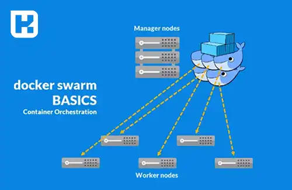
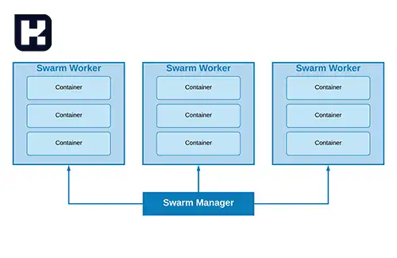
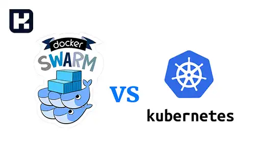
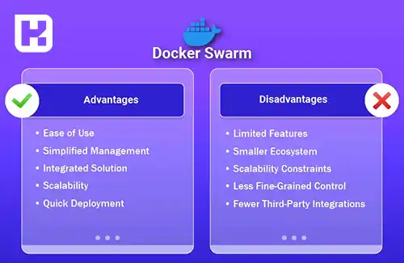

<blockquote class="faq-block">

  
آنچه در این مطلب خواهید خواند

  <ul>
    <li>تعریف Docker Swarm</li>
    <li>کاربردهای Docker Swarm</li>
    <li>آشنایی با نحوه کار Docker Swarm</li>
    <li>مقایسه Docker Swarm و Kubernetes</li>
    <li>مزایای Docker Swarm</li>
    <li>معایب Docker Swarm</li>
    <li>سوالات متداول</li>
    <li>جمع‌بندی</li>
  </ul>

</blockquote> 

در دنیای توسعه نرم‌افزار و فناوری اطلاعات، مدیریت کانتینرها در محیط‌های توزیع‌شده یکی از چالش‌های اساسی محسوب می‌شود. Docker Swarm، به عنوان یکی از ابزارهای کلیدی اکوسیستم <a href="https://www.hooshkar.com/Wiki/InformationTechnology/WhatIsDocker" target="_blank">Docker</a>، این چالش را با فراهم‌کردن بستری ساده، کارآمد و انعطاف‌پذیر برای مدیریت و اجرای برنامه‌های کانتینری حل کرده است. این ابزار به توسعه‌دهندگان و مدیران سیستم امکان می‌دهد تا یک خوشه از کانتینرها را با استفاده از قابلیت‌های مدیریت توزیع‌شده و خودکارسازی، به راحتی اداره کنند. در این مقاله، به تعریف، کاربردها، ویژگی‌ها و مقایسه Docker Swarm با Kubernetes پرداخته‌ایم.

## تعریف Docker Swarm

Docker Swarm یک ابزار متن‌باز و قدرتمند برای مدیریت و اجرای برنامه‌های کانتینری در محیط‌های توزیع‌شده است. این فناوری بخشی از اکوسیستم Docker محسوب می‌شود و به توسعه‌دهندگان اجازه می‌دهد که گروهی از سرورها را به عنوان یک خوشه (Cluster) مدیریت کرده و برنامه‌های کانتینری خود را بر روی آن اجرا کنند.

ویژگی‌های Docker Swarm شامل امکان توزیع بار، بازیابی خودکار از خرابی، مقیاس‌پذیری و مدیریت شبکه است. این ابزار همچنین به کاربران این امکان را می‌دهد که کانتینرهای خود را در محیط‌های چندگانه، با تنظیمات یکپارچه و به‌صورت ایمن اجرا کنند.

---

### کاربردهای Docker Swarm

Docker Swarm برای مدیریت تعداد زیادی از کانتینرها در محیط‌های توزیع‌شده طراحی شده است. برخی از کاربردهای اصلی آن عبارتند از:

1. **مدیریت کلاسترهای کانتینری:**
   Docker Swarm امکان مدیریت گروهی از نودها را فراهم می‌کند و به شما اجازه می‌دهد تا یک محیط توزیع‌شده با چندین سرور ایجاد کنید.

2. **توزیع یکنواخت بار:**
   با استفاده از Docker Swarm، ترافیک به صورت یکنواخت میان نودهای مختلف توزیع می‌شود، که باعث بهبود عملکرد و پایداری سیستم می‌شود.

3. **مانیتورینگ و نظارت:**
   قابلیت مانیتورینگ داخلی Docker Swarm، به کاربران امکان می‌دهد وضعیت سرویس‌ها و کانتینرهای خود را در هر لحظه بررسی و کنترل کنند.

4. **امنیت:**
   با فراهم کردن قابلیت‌هایی مانند رمزنگاری ارتباطات و مدیریت مجوزها، Docker Swarm یک محیط امن برای اجرای برنامه‌های کانتینری فراهم می‌کند.

---

### آشنایی با نحوه کار Docker Swarm

Docker Swarm با راه‌اندازی یک کلاستر شامل نودهای مدیر (Manager) و نودهای کارگر (Worker) عمل می‌کند. نودهای مدیر مسئولیت مدیریت و توزیع وظایف را دارند، در حالی که نودهای کارگر وظایف مشخص‌شده را اجرا می‌کنند. 

مراحل اصلی کارکرد Docker Swarm عبارتند از:

1. **ایجاد کلاستر:**
   ابتدا یک نود مدیر ایجاد می‌شود که به عنوان مرکز کنترل عمل می‌کند. سپس سایر نودها به کلاستر اضافه می‌شوند.

2. **راه‌اندازی سرویس:**
   توسعه‌دهنده سرویس‌هایی را تعریف می‌کند که شامل تعداد نمونه‌های اجرایی و وظایف مشخص است.

3. **توزیع وظایف:**
   Docker Swarm وظایف را بین نودهای مختلف توزیع کرده و از توازن بار میان آن‌ها اطمینان حاصل می‌کند.

4. **بازیابی خودکار:**
   در صورت خرابی یک نود، وظایف آن به صورت خودکار به نودهای دیگر منتقل می‌شود تا پایداری سیستم حفظ شود.

---

### مقایسه Docker Swarm و Kubernetes

دو ابزار Docker Swarm و Kubernetes از محبوب‌ترین فناوری‌ها برای مدیریت کانتینرها هستند. هر کدام ویژگی‌ها و مزایای خاص خود را دارند:

1. **سادگی و سهولت استفاده:**
   Docker Swarm به دلیل رابط کاربری ساده و هماهنگی کامل با Docker، انتخاب مناسبی برای پروژه‌های کوچک و متوسط است. در مقابل، Kubernetes به دلیل امکانات پیچیده‌تر، نیازمند دانش بیشتری است.

2. **مقیاس‌پذیری:**
   Kubernetes به دلیل طراحی پیشرفته‌تر، قابلیت مقیاس‌پذیری بالاتری را در محیط‌های پیچیده ارائه می‌دهد. با این حال، Docker Swarm برای نیازهای اولیه و متوسط کافی است.

3. **پشتیبانی و ابزارها:**
   Kubernetes دارای جامعه کاربری بزرگ‌تر و پشتیبانی گسترده‌تری است و از ابزارهای متنوعی برای مدیریت و خودکارسازی استفاده می‌کند. Docker Swarm اما به دلیل سادگی و هماهنگی با Docker، سریع‌تر و آسان‌تر نصب و راه‌اندازی می‌شود.

---

### مزایای Docker Swarm

- نصب و راه‌اندازی سریع و آسان
- رابط کاربری ساده و هماهنگی کامل با Docker
- توازن بار خودکار بین نودها
- امنیت بالا با پشتیبانی از رمزنگاری داخلی
- مدیریت ساده‌تر برای پروژه‌های کوچک و متوسط

### معایب Docker Swarm

- محدودیت در مقایسه با Kubernetes در مدیریت محیط‌های پیچیده
- جامعه کاربری کوچک‌تر نسبت به Kubernetes
- امکانات کمتر برای خودکارسازی پیشرفته

---

### سوالات متداول

<blockquote class="faq-block">
    

        
Docker Swarm چیست؟

        Docker Swarm یک ابزار متن‌باز برای مدیریت و اجرای برنامه‌های کانتینری است که به توسعه‌دهندگان امکان می‌دهد خوشه‌ای از سرورها را به‌عنوان یک کلاستر مدیریت کنند.
    

</blockquote>

<blockquote class="faq-block">
    

        
Docker Swarm چگونه کار می‌کند؟

        Docker Swarm با ایجاد نودهای مدیر (Manager) و نودهای کارگر (Worker)، وظایف را بین سرورها توزیع کرده و عملیات خودکار مانند بازیابی از خرابی و توازن بار را انجام می‌دهد.
    

</blockquote>

<blockquote class="faq-block">
    

        
تفاوت Docker Swarm و Kubernetes چیست؟

        Docker Swarm ساده‌تر و هماهنگ با Docker است و برای پروژه‌های کوچک و متوسط مناسب است. Kubernetes امکانات پیشرفته‌تر، مقیاس‌پذیری بالاتر و جامعه کاربری بزرگ‌تری دارد و برای محیط‌های پیچیده بهتر است.
    

</blockquote>

<blockquote class="faq-block">
    

        
مزایای استفاده از Docker Swarm چیست؟

        نصب و راه‌اندازی سریع، رابط کاربری ساده، توازن بار خودکار، امنیت بالا با رمزنگاری داخلی و مدیریت ساده برای پروژه‌های کوچک و متوسط از مزایای اصلی Docker Swarm هستند.
    

</blockquote>

<blockquote class="faq-block">
    

        
معایب Docker Swarm چیست؟

        محدودیت در مقایسه با Kubernetes برای محیط‌های پیچیده، جامعه کاربری کوچک‌تر و امکانات کمتر برای خودکارسازی پیشرفته از معایب Docker Swarm هستند.
    

</blockquote>

<blockquote class="faq-block">
    

        
Docker Swarm چگونه مقیاس‌پذیری را مدیریت می‌کند؟

        با اضافه کردن نودهای بیشتر به کلاستر، Docker Swarm وظایف و کانتینرها را به‌صورت خودکار بین سرورها توزیع می‌کند تا عملکرد و پایداری سیستم حفظ شود.
    

</blockquote>

<blockquote class="faq-block">
    

        
آیا Docker Swarm از امنیت داخلی برخوردار است؟

        بله، Docker Swarm از رمزنگاری ارتباطات بین نودها و مدیریت مجوزها برای حفظ امنیت کانتینرها پشتیبانی می‌کند.
    

</blockquote>

<blockquote class="faq-block">
    

        
آیا Docker Swarm مناسب پروژه‌های بزرگ است؟

        Docker Swarm برای پروژه‌های کوچک و متوسط مناسب است، اما برای محیط‌های بزرگ و پیچیده، Kubernetes گزینه بهتری است.
    

</blockquote>

<blockquote class="faq-block">
    

        
آیا Docker Swarm می‌تواند بار را بین سرورها توزیع کند؟

        بله، Docker Swarm قابلیت توازن بار خودکار دارد و به صورت یکنواخت ترافیک را بین نودهای مختلف کلاستر تقسیم می‌کند.
    

</blockquote>

<blockquote class="faq-block">
    

        
Docker Swarm چه قابلیت‌هایی برای مانیتورینگ ارائه می‌دهد؟

        Docker Swarm ابزارهای داخلی برای مشاهده وضعیت سرویس‌ها و کانتینرها دارد که به کاربران امکان کنترل و مدیریت لحظه‌ای سیستم را می‌دهد.
    

</blockquote>

---

### جمع‌بندی

Docker Swarm یک ابزار قدرتمند و کاربرپسند برای مدیریت و اجرای برنامه‌های کانتینری در محیط‌های توزیع‌شده است. این ابزار با ارائه امکاناتی مانند توزیع بار، مقیاس‌پذیری و امنیت داخلی، انتخاب مناسبی برای پروژه‌های کوچک و  متوسط است. در مقابل، کوبرنیتز برای مدیریت محیط‌های پیچیده‌تر و بزرگ‌تر طراحی شده است و امکانات بیشتری برای خودکارسازی ارائه می‌دهد. با توجه به نیاز پروژه و سطح دانش تیم، می‌توان از یکی از این دو ابزار استفاده کرد.