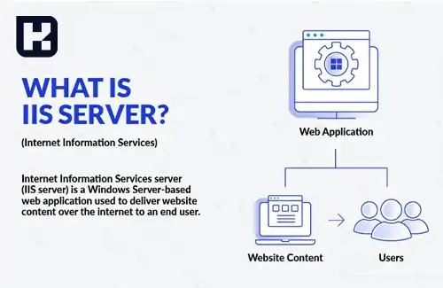
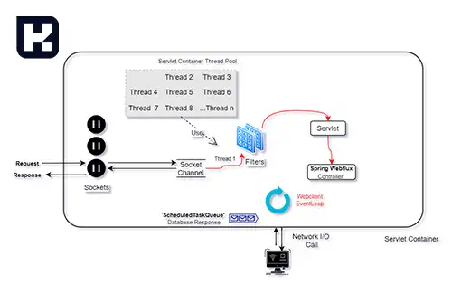
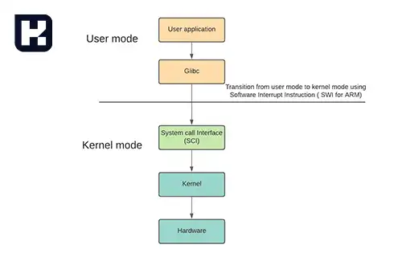

<blockquote class="faq-block">

  
آنچه در این مطلب خواهید خواند:

  <ul>
    <li>معرفی وب سرور IIS</li>
    <li>وظایف وب سرور IIS</li>
    <li>مزایای استفاده از وب سرور IIS</li>
    <li>معایب وب سرور IIS</li>
    <li>چگونگی پردازش درخواست‌ها در IIS</li>
    <li>بررسی نسخه‌های مختلف IIS</li>
    <li>سوالات متداول</li>
    <li>جمع‌بندی</li>
  </ul>

</blockquote> 

در دنیای فناوری امروز، وب‌سرورها نقش مهمی در ارائه خدمات آنلاین و میزبانی وب‌سایت‌ها ایفا می‌کنند. یکی از ابزارهای مهم و پرکاربرد در این حوزه، وب سرور IIS (Internet Information Services) است که توسط مایکروسافت توسعه یافته است. IIS به دلیل امکانات گسترده و توانایی‌های خود، یکی از گزینه‌های محبوب برای مدیریت وب‌سایت‌ها و اپلیکیشن‌های مبتنی بر ویندوز محسوب می‌شود. در این مقاله، به بررسی جامع این وب سرور، وظایف آن، مزایا و معایب و نحوه پردازش درخواست‌ها خواهیم پرداخت.

## معرفی وب سرور IIS

وب سرور IIS، مخفف عبارت «Internet Information Services»، به معنای «سرویس‌های اطلاعات اینترنتی» است. این وب سرور توسط شرکت مایکروسافت توسعه یافته و در سیستم‌عامل ویندوز اجرا می‌شود. علاوه بر این، با استفاده از Mono، امکان اجرای آن در سیستم‌عامل‌های MacOS و Linux نیز وجود دارد.

IIS وظیفه ارائه صفحات یا فایل‌های HTML درخواست‌شده را بر عهده دارد. به عبارت دیگر، زمانی که کاربران آدرس وب‌سایتی را در مرورگر وارد می‌کنند، IIS درخواست ارسالی را دریافت کرده و پاسخ مناسب را ارائه می‌دهد. این وب سرور به‌ویژه برای وب‌سایت‌هایی که با زبان برنامه‌نویسی ASP.NET توسعه یافته‌اند مناسب بوده و امکاناتی مانند پخش رسانه‌ای، میزبانی وب اپلیکیشن و بسیاری دیگر را فراهم می‌کند.

---

### وظایف وب سرور IIS
وب سرور IIS به‌عنوان واسطه‌ای بین کاربران و سرور میزبان عمل کرده و وظایف زیر را بر عهده دارد:  

- **مدیریت و میزبانی برنامه‌ها و فایل‌ها:** IIS مسئول ذخیره‌سازی، مدیریت و ارائه داده‌های وب‌سایت‌ها و اپلیکیشن‌ها به کاربران است.  
- **مدیریت ترافیک شبکه:** درخواست‌های ورودی کاربران از طریق پورت‌های استاندارد مانند ۸۰ (HTTP) و ۴۴۳ (HTTPS) دریافت و پردازش می‌شود.  
- **پشتیبانی از پروتکل‌های مختلف:** IIS علاوه بر HTTP و HTTPS از پروتکل‌های دیگری مانند FTP و SMTP نیز پشتیبانی می‌کند.  
- **مدیریت درخواست‌ها و پاسخ‌دهی سریع:** این وب سرور پیام‌های کاربران را به‌صورت بهینه پردازش کرده و پاسخ‌های مناسب را ارائه می‌دهد.  

---

### مزایای استفاده از وب سرور IIS

#### ۱. امنیت قوی
IIS با ارائه قابلیت‌های پیشرفته امنیتی، محیط امنی را برای اجرای وب‌سایت‌ها و اپلیکیشن‌ها فراهم می‌کند. از جمله این قابلیت‌ها می‌توان به موارد زیر اشاره کرد:

- **احراز هویت و صدور مجوز:** تعیین دقیق سطح دسترسی برای کاربران و برنامه‌ها.  
- **رمزگذاری:** پشتیبانی از پروتکل‌های SSL و TLS برای افزایش امنیت انتقال داده‌ها.  
- **فیلتر کردن درخواست‌ها:** امکان مدیریت لیست‌های سفید و سیاه برای محدود کردن دسترسی‌های غیرمجاز.  
- **کنترل دسترسی:** قابلیت‌های پیشرفته برای مدیریت دسترسی به منابع و سرویس‌ها.  

#### ۲. Application Pools
یکی از ویژگی‌های برجسته IIS، استفاده از Application Pool ها است. این ویژگی امکان جداسازی برنامه‌ها را فراهم می‌کند، به طوری که مشکلات یک اپلیکیشن تأثیری بر سایر برنامه‌ها نخواهد داشت. هر Application Pool به صورت مستقل توسط فرآیندهای کاری (Worker Processes) مدیریت می‌شود.  

#### ۳. مقیاس‌پذیری و قابلیت اطمینان
با استفاده از ویژگی‌هایی مانند IIS Web Farm، می‌توان زیرساختی مقیاس‌پذیر و مطمئن ایجاد کرد. این ویژگی امکان میزبانی وب‌سایت‌های پرترافیک را روی چندین سرور فراهم می‌کند. همچنین، ابزارهایی مانند **تعادل بار (Load Balancing)** و **مسیریابی درخواست‌ها (ARR)** به توزیع یکنواخت ترافیک میان سرورها کمک می‌کنند.  

---

### معایب وب سرور IIS
1. **سرعت و عملکرد:**  
در مقایسه با برخی وب سرورهای دیگر مانند Nginx یا Apache، IIS بهینه‌سازی کمتری در زمینه سرعت و مصرف منابع دارد.  

2. **مشکلات امنیتی:**  
با وجود ارائه راهکارهای امنیتی متعدد، IIS در صورت پیکربندی نادرست می‌تواند به یک نقطه ضعف امنیتی تبدیل شود.  

3. **هزینه:**  
در حالی که وب سرورهایی مانند Apache رایگان هستند، IIS به دلیل وابستگی به سیستم‌عامل ویندوز و برخی قابلیت‌های پیشرفته، نیازمند پرداخت هزینه است.  

---

### چگونگی پردازش درخواست‌ها در IIS

IIS از مدل پردازش درخواست «Thread-Per-Request» استفاده می‌کند. در این مدل، برای هر درخواست یک رشته (Thread) اختصاص داده می‌شود. این فرآیند شامل مراحل زیر است:  

1. **دریافت درخواست از سرویس گیرنده:** درخواست‌های کاربران از طریق پروتکل‌های HTTP یا HTTPS دریافت می‌شود.

2. **پردازش درخواست در دو سطح:**  

   - **Kernel Mode:** مدیریت درخواست‌ها در هسته سیستم‌عامل برای افزایش امنیت و کارایی.

   - **User Mode:** اجرای درخواست‌ها در سطح کاربر برای پشتیبانی از برنامه‌های کاربردی.
  

3. **ارسال پاسخ به کاربر:** پاسخ مناسب بر اساس مدل درخواست/پاسخ به کاربر ارائه می‌شود.

---

### بررسی نسخه‌های مختلف IIS
IIS در طول سال‌ها با به‌روزرسانی‌های متعدد توسعه یافته و ویژگی‌های جدیدی به آن اضافه شده است. نسخه‌های اخیر IIS شامل امکاناتی مانند پشتیبانی از پروتکل HTTP/2، بهبود در مدیریت Application Pool ها و ابزارهای پیشرفته مانیتورینگ هستند.

| نسخه‌های IIS | سیستم عامل |
|-------------|---------------------------------------------|
| 1.0         | Included with Windows NT 3.51 SP 3        |
| 2.0         | Included with Windows NT Server 4.0       |
| 3.0         | Included with Windows NT Server 4.0 Service pack 3  |
| 4.0         | Self-contained download                   |
| 5.0         | Built-in component of Windows 2000       |
| 5.1         | Built-in component of Windows XP Pro     |
| 6.0         | Built-in component of Windows Server 2003 |
| 7.0         | Built-in component of Windows Vista & Windows Server 2008 |
| 7.5         | Built-in component of Windows 7 & Windows Server 2008 R2 |
| 8.0         | Built-in component of Windows 8 & Windows Server 2012 |
| 8.5         | Built-in component of Windows 8.1 & Windows Server 2012 R2 |
| 10          | Built-in component of Windows 10 & Windows Server 2016 |

---

### سوالات متداول

<blockquote class="faq-block">
    

        
وب سرور IIS چیست و چه کاربردی دارد؟

        IIS یک وب‌سرور توسعه‌یافته توسط مایکروسافت است که برای میزبانی و پردازش وب‌سایت‌ها، صفحات HTML و اپلیکیشن‌های مبتنی بر فناوری‌های مایکروسافت مانند ASP.NET استفاده می‌شود.
    

</blockquote>

<blockquote class="faq-block">
    

        
آیا IIS فقط روی سیستم‌عامل ویندوز اجرا می‌شود؟

        IIS به‌صورت رسمی فقط روی ویندوز اجرا می‌شود، اما با استفاده از ابزار Mono می‌توان بخش‌هایی از آن را در سیستم‌عامل‌های MacOS و Linux نیز استفاده کرد.
    

</blockquote>

<blockquote class="faq-block">
    

        
مزیت اصلی استفاده از وب سرور IIS چیست؟

        مهم‌ترین مزیت IIS، یکپارچگی کامل با سیستم‌عامل ویندوز، امنیت بالا، پشتیبانی از Application Poolها و مدیریت ساده وب‌سایت‌ها و سرویس‌ها است.
    

</blockquote>

<blockquote class="faq-block">
    

        
آیا IIS از زبان‌های برنامه‌نویسی مختلف پشتیبانی می‌کند؟

        بله، علاوه بر ASP.NET، از زبان‌هایی مانند PHP، Python و Node.js نیز با نصب ماژول‌های مربوطه پشتیبانی می‌کند.
    

</blockquote>

<blockquote class="faq-block">
    

        
Application Pool در IIS چه کاربردی دارد؟

        Application Pool امکان جداسازی پردازش وب‌سایت‌ها را فراهم می‌کند تا عملکرد و امنیت افزایش یافته و خرابی یک سایت باعث توقف سایر سایت‌ها نشود.
    

</blockquote>

<blockquote class="faq-block">
    

        
آیا IIS برای وب‌سایت‌های پرترافیک مناسب است؟

        بله، با استفاده از ویژگی‌هایی مانند Web Farm، Load Balancing و ARR، IIS می‌تواند حجم بالایی از درخواست‌ها را مدیریت و توزیع کند.
    

</blockquote>

<blockquote class="faq-block">
    

        
مهم‌ترین معایب IIS چیست؟

        IIS نسبت به وب‌سرورهایی مانند Nginx و Apache مصرف منابع بیشتری دارد، هزینه لایسنس دارد و نیازمند پیکربندی دقیق برای امنیت است.
    

</blockquote>

<blockquote class="faq-block">
    

        
آیا IIS به صورت رایگان قابل استفاده است؟

        خود IIS رایگان است، اما برای استفاده از آن نیاز به سیستم‌عامل ویندوز دارید که ممکن است هزینه‌بر باشد.
    

</blockquote>

<blockquote class="faq-block">
    

        
آیا IIS از HTTPS و SSL پشتیبانی می‌کند؟

        بله، IIS کاملاً از SSL و TLS پشتیبانی می‌کند و امکانات مدیریتی گسترده‌ای برای صدور، نصب و پیکربندی گواهی‌های امنیتی دارد.
    

</blockquote>

<blockquote class="faq-block">
    

        
نسخه‌های مختلف IIS چه تفاوتی با هم دارند؟

        نسخه‌های جدید IIS امکاناتی مانند پشتیبانی از HTTP/2، بهبود Application Poolها، ابزارهای مانیتورینگ و امنیت پیشرفته‌تر را ارائه می‌دهند.
    

</blockquote>

---

### جمع‌بندی
وب سرور IIS به عنوان یکی از محصولات برجسته مایکروسافت، ابزار قدرتمندی برای میزبانی و مدیریت وب‌سایت‌ها و اپلیکیشن‌ها است. امکانات گسترده، امنیت بالا و سازگاری با محیط ویندوز از ویژگی‌های بارز آن هستند. با این حال، هزینه‌های مرتبط و نیاز به پیکربندی مناسب از مواردی هستند که باید در انتخاب این وب سرور در نظر گرفته شوند.