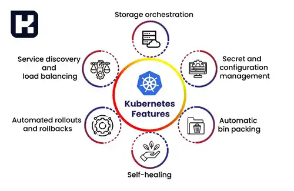
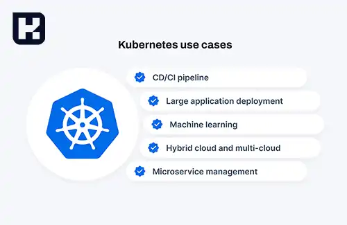
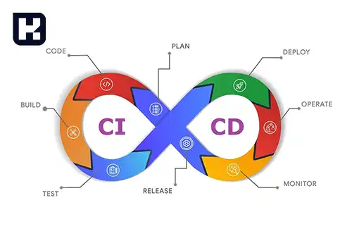

<blockquote class="faq-block">

  
آنچه در این مطلب خواهید خواند

  <ul>
    <li>کوبرنتیز چیست؟</li>
    <li>ویژگی‌های اصلی کوبرنتیز</li>
    <li>کاربردهای کوبرنتیز</li>
  </ul>

</blockquote> 

## کوبرنتیز چیست؟

کوبرنتیز (<a href="https://kubernetes.io/" target="_blank">Kubernetes</a>) که به اختصار **K8s** نیز نامیده می‌شود، یک پلتفرم متن‌باز برای مدیریت و ارکستراسیون کانتینرها است. این فناوری توسط گوگل توسعه یافت و امروزه تحت نظارت بنیاد CNCF (Cloud Native Computing Foundation) و پشتیبانی گسترده شرکت‌ها و جوامع متن‌باز قرار دارد.  

کوبرنتیز به‌عنوان ابزاری قدرتمند برای **اتوماسیون، اجرا، مدیریت و مقیاس‌پذیری برنامه‌های کانتینری** طراحی شده است. این پلتفرم برای مدیریت برنامه‌هایی که در قالب کانتینرها (مانند <a href="https://www.hooshkar.com/Wiki/InformationTechnology/WhatIsDocker" target="_blank">Docker</a>) اجرا می‌شوند، امکانات پیشرفته‌ای را فراهم می‌کند و به توسعه‌دهندگان اجازه می‌دهد برنامه‌های خود را به‌صورت قابل‌اعتماد و کارآمد در محیط‌های مختلف اجرا کنند.  

---

### ویژگی‌های اصلی کوبرنتیز 

**1. اتوماسیون فرآیندها**  

کوبرنتیز بسیاری از فرآیندهای مرتبط با مدیریت کانتینرها را به‌صورت خودکار انجام می‌دهد. این شامل توزیع و تخصیص کانتینرها به سرورها، جابجایی آن‌ها در صورت خرابی و نظارت مداوم بر عملکرد آن‌ها است.  

**2. مقیاس‌پذیری**  

یکی از ویژگی‌های برجسته کوبرنتیز، امکان مقیاس‌پذیری برنامه‌ها است. این پلتفرم به شما اجازه می‌دهد تعداد کانتینرهای در حال اجرا را به‌سادگی افزایش یا کاهش دهید تا با تغییر نیازهای سیستم هماهنگ شود.  

**3. مدیریت منابع**  

با کوبرنتیز، استفاده بهینه از منابع سیستم (مانند پردازنده و حافظه) امکان‌پذیر است. این ابزار به شما اجازه می‌دهد محدودیت‌ها و نیازمندی‌های منابع هر کانتینر را مشخص کنید.  

**4. دسترس‌پذیری بالا (High Availability)**  

کوبرنتیز با قابلیت‌هایی مانند **خودبهبودی (Self-Healing)** و **Failover**، تضمین می‌کند که در صورت بروز مشکل در یکی از کانتینرها یا گره‌ها (Nodes)، سرویس‌دهی برنامه قطع نمی‌شود.  

**5. به‌روزرسانی بدون توقف** 

این پلتفرم امکان انجام **Rolling Updates** را فراهم می‌کند، به‌گونه‌ای که نسخه‌های جدید نرم‌افزار بدون اختلال در سرویس‌های موجود، جایگزین نسخه‌های قدیمی شوند.  

**6. مانیتورینگ و گزارش‌دهی** 

کوبرنتیز امکانات پیشرفته‌ای برای نظارت بر عملکرد کانتینرها و لاگ‌گیری ارائه می‌دهد که فرآیند خطایابی و مدیریت مشکلات را تسهیل می‌کند.  

---

### کاربردهای کوبرنتیز

کوبرنتیز به دلیل انعطاف‌پذیری و قدرت بالای خود در صنایع مختلف مورد استفاده قرار می‌گیرد. برخی از کاربردهای اصلی این پلتفرم عبارتند از:  

**1. پیاده‌سازی و مدیریت برنامه‌های کانتینری**

کوبرنتیز فرآیند اجرای برنامه‌ها در قالب کانتینر را ساده کرده و امکان مدیریت آن‌ها در مقیاس وسیع را فراهم می‌کند.  

**2. توسعه و استقرار برنامه‌های وب**

این پلتفرم به توسعه‌دهندگان امکان می‌دهد برنامه‌های تحت وب با عملکرد بالا و اطمینان بیشتر ایجاد و ارائه کنند.

**3. مدیریت برنامه‌ها در محیط‌های ابری**

با استفاده از کوبرنتیز، سازمان‌ها می‌توانند برنامه‌های خود را به‌راحتی بین سرویس‌دهندگان ابری مختلف (مانند AWS ،Azure و Google Cloud) جابجا کرده و از مزایای **چندابری (Multi-Cloud)** بهره‌مند شوند.  

**4. اجرای برنامه‌ها در محیط‌های توزیع‌شده**

کوبرنتیز به شما اجازه می‌دهد برنامه‌های خود را در محیط‌های توزیع‌شده اجرا و مدیریت کنید، بدون نگرانی از هماهنگی بین اجزای مختلف سیستم.  

**5. مدیریت فرآیندهای CI/CD**

با استفاده از قابلیت‌های کوبرنتیز، می‌توان فرآیندهای **یکپارچه‌سازی و استقرار مداوم (CI/CD)** را بهینه کرد و به توسعه‌دهندگان امکان داد تا به‌سرعت تغییرات را اعمال کنند.  

---

<blockquote class="faq-block">
    

        
کوبرنتیز چیست و چه کاربردی دارد؟

        کوبرنتیز یک پلتفرم متن‌باز برای مدیریت و ارکستراسیون کانتینرها است که امکان استقرار، مقیاس‌پذیری، مانیتورینگ و مدیریت خودکار برنامه‌های کانتینری را فراهم می‌کند.
    

</blockquote>

<blockquote class="faq-block">
    

        
چرا کوبرنتیز محبوب‌ترین ابزار مدیریت کانتینرها است؟

        به دلیل قابلیت‌هایی مانند مقیاس‌پذیری خودکار، خودبهبودی، مدیریت منابع، به‌روزرسانی بدون توقف و پشتیبانی توسط جامعه بزرگ توسعه‌دهندگان، کوبرنتیز به پرکاربردترین ابزار کانتینر اورکستریشن تبدیل شده است.
    

</blockquote>

<blockquote class="faq-block">
    

        
آیا برای استفاده از کوبرنتیز لازم است Docker نصب باشد؟

        بله، به‌صورت معمول کانتینرها با Docker ساخته می‌شوند و کوبرنتیز آن‌ها را مدیریت می‌کند؛ اما کوبرنتیز می‌تواند با سایر Container Runtimeها مانند containerd یا CRI-O نیز کار کند.
    

</blockquote>

<blockquote class="faq-block">
    

        
کوبرنتیز چگونه مقیاس‌پذیری برنامه‌ها را مدیریت می‌کند؟

        با استفاده از مکانیزم‌های Horizontal Pod Autoscaler و Vertical Pod Autoscaler، کوبرنتیز می‌تواند تعداد پادها یا میزان منابع مصرفی را متناسب با بار کاری افزایش یا کاهش دهد.
    

</blockquote>

<blockquote class="faq-block">
    

        
آیا کوبرنتیز برای استفاده در سازمان‌های کوچک مناسب است؟

        بله، حتی سازمان‌های کوچک نیز می‌توانند از مزایای کوبرنتیز بهره ببرند؛ هرچند به‌طور معمول استفاده از نسخه‌های سبک‌تر مانند K3s یا Minikube برای کسب‌وکارهای کوچک توصیه می‌شود.
    

</blockquote>

<blockquote class="faq-block">
    

        
تفاوت کوبرنتیز با Docker Swarm چیست؟

        Docker Swarm ساده‌تر و سبک‌تر است، اما کوبرنتیز امکانات پیشرفته‌تری مانند مدیریت پیچیده‌تر منابع، مقیاس‌پذیری برتر، قابلیت‌های مانیتورینگ و تنظیمات دقیق‌تری ارائه می‌دهد.
    

</blockquote>

<blockquote class="faq-block">
    

        
آیا کوبرنتیز قابلیت خودبهبودی دارد؟

        بله، در صورت بروز مشکل برای یک پاد یا نود، کوبرنتیز به‌صورت خودکار آن را جایگزین، ری‌استارت یا جابه‌جا می‌کند تا سرویس در دسترس بماند.
    

</blockquote>

<blockquote class="faq-block">
    

        
آیا امکان اجرای کوبرنتیز در محیط‌های چند ابری وجود دارد؟

        بله، کوبرنتیز یکی از بهترین گزینه‌ها برای استقرار در محیط‌های Multi-Cloud است و امکان جابجایی سرویس‌ها بین AWS، Azure، Google Cloud و سایر ارائه‌دهندگان را فراهم می‌کند.
    

</blockquote>

<blockquote class="faq-block">
    

        
آیا کوبرنتیز برای مدیریت CI/CD مناسب است؟

        بله، کوبرنتیز با ابزارهایی مانند Jenkins، GitLab CI/CD و ArgoCD یکپارچه شده و امکان استقرار مداوم و به‌روزرسانی بدون توقف برنامه‌ها را فراهم می‌کند.
    

</blockquote>

<blockquote class="faq-block">
    

        
کوبرنتیز چه مزیتی برای برنامه‌های تحت وب دارد؟

        این پلتفرم مقیاس‌پذیری بالا، مدیریت خودکار بار، امنیت بیشتر و امکان ارائه نسخه‌های جدید بدون توقف سرویس را برای وب‌اپلیکیشن‌ها فراهم می‌کند.
    

</blockquote>

---

### جمع‌بندی  
کوبرنتیز، به‌عنوان یکی از پیشرفته‌ترین پلتفرم‌های مدیریت کانتینری، امکانات گسترده‌ای برای توسعه، استقرار و مدیریت برنامه‌های کانتینری ارائه می‌دهد. ویژگی‌هایی مانند مقیاس‌پذیری، دسترس‌پذیری بالا و قابلیت انجام به‌روزرسانی‌های بدون اختلال، آن را به ابزاری ضروری برای شرکت‌هایی تبدیل کرده که به دنبال بهینه‌سازی زیرساخت‌های خود در محیط‌های ابری و توزیع‌شده هستند.  

اگر به دنبال یک راه‌حل قدرتمند برای مدیریت کانتینرهای خود هستید، کوبرنتیز انتخابی ایده‌آل خواهد بود.