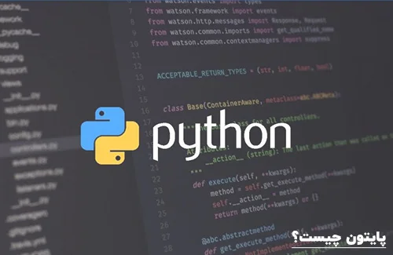
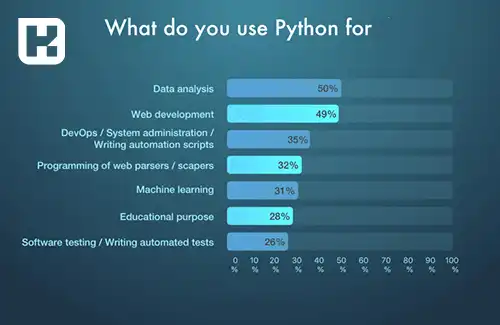
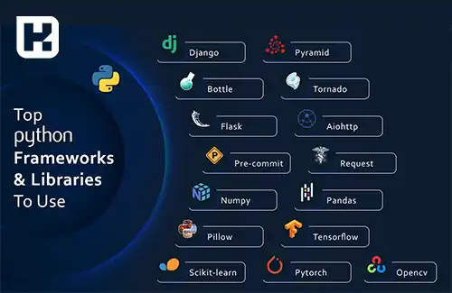

<blockquote class="faq-block">

  
فهرست مطالب

  <ul>
    <li>تاریخچه پایتون</li>
    <li>ویژگی‌های پایتون</li>
    <li>کاربردهای پایتون</li>
    <li>نسخه‌های مختلف پایتون</li>
    <li>کتابخانه‌ها و ابزارهای پایتون</li>
    <li>سوالات متداول</li>
    <li>جمع‌بندی</li>
  </ul>

</blockquote> 

در دنیای امروز، زبان‌های برنامه‌نویسی متعددی برای توسعه نرم‌افزارها، هوش مصنوعی، علوم داده و سایر حوزه‌های فناوری به کار می‌روند. در میان این زبان‌ها، پایتون (Python) یکی از محبوب‌ترین و پرکاربردترین زبان‌های برنامه‌نویسی محسوب می‌شود. سادگی، خوانایی بالا و انعطاف‌پذیری این زبان باعث شده است که هم برنامه‌نویسان مبتدی و هم توسعه‌دهندگان حرفه‌ای به آن علاقه‌مند شوند.
در این مقاله، به تاریخچه پایتون، ویژگی‌های کلیدی آن، کاربردهای گسترده و تأثیر آن بر دنیای برنامه‌نویسی می‌پردازیم.

## تاریخچه پایتون

پایتون (<a href="https://www.python.org/" target="_blank">Python</a>) یک زبان برنامه‌نویسی سطح بالا، تفسیری و شیءگرا است که توسط **(Guido van Rossum) خیدو فان روسوم** در سال 1991 توسعه یافت. این زبان با هدف سادگی و خوانایی بالا طراحی شده است و به یکی از محبوب‌ترین زبان‌های برنامه‌نویسی در دنیای امروز تبدیل شده است.  

در ابتدا، پایتون به‌عنوان یک پروژه شخصی در زمینه آموزش زبان‌های برنامه‌نویسی توسط فان روسوم آغاز شد. اما به‌زودی این زبان محبوبیت زیادی در میان توسعه‌دهندگان پیدا کرد و به سرعت به یکی از ابزارهای قدرتمند در توسعه نرم‌افزارها و برنامه‌ها تبدیل شد.  

---

### ویژگی‌های پایتون

پایتون از ویژگی‌هایی برخوردار است که باعث می‌شود برای برنامه‌نویسان جذاب و مفید باشد. برخی از این ویژگی‌ها عبارتند از:

1. **خوانایی بالا**  
   یکی از مهم‌ترین ویژگی‌های پایتون، کدنویسی ساده و خوانا است که به برنامه‌نویسان کمک می‌کند تا کدهایی تمیز و قابل‌فهم بنویسند. این ویژگی به توسعه‌دهندگان اجازه می‌دهد تا راحت‌تر کدهای خود را مدیریت و نگهداری کنند.

2. **سادگی در یادگیری**  
   پایتون به‌خاطر ساختار ساده‌اش، یکی از بهترین گزینه‌ها برای مبتدیان است. این زبان حتی کسانی که هیچ‌گونه تجربه‌ای در برنامه‌نویسی ندارند را قادر می‌سازد تا به سرعت برنامه‌های کاربردی ایجاد کنند.

3. **توسعه سریع**  
   پایتون به برنامه‌نویسان این امکان را می‌دهد که بدون نیاز به صرف زمان زیاد، کدهایی کوتاه و موثر بنویسند. این ویژگی به‌ویژه در پروژه‌هایی که نیاز به تحویل سریع دارند، بسیار مفید است.

4. **پشتیبانی وسیع از جامعه برنامه‌نویسی**  
   پایتون از یک جامعه بزرگ و فعال برنامه‌نویس بهره‌مند است که همواره ابزارها، کتابخانه‌ها و فریم‌ورک‌های جدیدی برای گسترش پایتون توسعه می‌دهند. این جامعه به حل مشکلات و ارتقاء زبان کمک می‌کند.

---

### کاربردهای پایتون

پایتون به‌خاطر انعطاف‌پذیری و سادگی خود در بسیاری از حوزه‌ها کاربرد دارد. برخی از مهم‌ترین کاربردهای پایتون عبارتند از:

- **توسعه برنامه‌های وب**  
   پایتون با استفاده از فریم‌ورک‌هایی مانند **Django** و **Flask** برای ایجاد برنامه‌های وب قدرتمند و مقیاس‌پذیر استفاده می‌شود.

- **علوم داده و یادگیری ماشین**  
   پایتون در زمینه‌هایی مانند **تحلیل داده‌ها**، **یادگیری ماشین** و **هوش مصنوعی** به‌طور گسترده‌ای مورد استفاده قرار می‌گیرد. کتابخانه‌هایی مانند **NumPy**، **Pandas**، **Scikit-learn** و **TensorFlow** به توسعه‌دهندگان این امکان را می‌دهند که پروژه‌های پیچیده‌تری ایجاد کنند.

- **اطلاعات کوچک (IoT)**  
   پایتون در پروژه‌های **اینترنت اشیاء (IoT)** نیز کاربرد دارد و به‌دلیل سادگی و قدرت انعطاف‌پذیری، در بسیاری از پروژه‌های مبتنی بر حسگرها و دستگاه‌های متصل استفاده می‌شود.

- **محاسبات علمی**  
   پایتون به‌عنوان ابزاری قدرتمند در دنیای **محاسبات علمی**، شبیه‌سازی‌های پیچیده و حل مسائل ریاضی و مهندسی مورد استفاده قرار می‌گیرد.

- **برنامه‌نویسی سیستم**  
   علاوه بر کاربردهای نرم‌افزاری، پایتون در برنامه‌نویسی سیستم‌های بزرگ، اتوماسیون فرآیندها و اسکریپت‌نویسی نیز کاربرد دارد.

---

### نسخه‌های مختلف پایتون

پایتون به مرور زمان چندین نسخه مختلف را تجربه کرده است. از مهم‌ترین نسخه‌ها می‌توان به **پایتون 2.x** و **پایتون 3.x** اشاره کرد. نسخه 3 به‌عنوان نسخه نهایی و پیشرفته‌تر پایتون معرفی شده و بسیاری از ویژگی‌های جدید و بهبودهای مختلف در آن گنجانده شده است. با این‌حال، بسیاری از پروژه‌ها همچنان از نسخه 2.x استفاده می‌کنند تا از سازگاری با کدهای قدیمی‌تر بهره‌برداری کنند.

---

### کتابخانه‌ها و ابزارهای پایتون

پایتون دارای مجموعه‌ای وسیع از کتابخانه‌ها و ابزارها است که برنامه‌نویسان را قادر می‌سازد پروژه‌های پیچیده را به‌راحتی پیاده‌سازی کنند. از جمله مهم‌ترین کتابخانه‌ها می‌توان به **Django** (برای وب‌سازی)، **NumPy** (برای محاسبات عددی) و **Pandas** (برای تحلیل داده‌ها) اشاره کرد. علاوه بر این، پایتون از **PyPI** (Python Package Index) پشتیبانی می‌کند که یک منبع آنلاین از کتابخانه‌های اضافی برای پایتون است.

---

<blockquote class="faq-block">
    

        
پایتون چیست؟

        پایتون یک زبان برنامه‌نویسی سطح بالا، تفسیری و شیءگرا است که توسط Guido van Rossum در سال 1991 ایجاد شد. این زبان به دلیل سادگی و خوانایی بالا، برای توسعه نرم‌افزار، علوم داده، هوش مصنوعی و وب‌سایت‌ها بسیار محبوب است.
    

</blockquote>

<blockquote class="faq-block">
    

        
ویژگی‌های اصلی پایتون کدام‌اند؟

        پایتون دارای خوانایی بالا، سادگی در یادگیری، توسعه سریع، پشتیبانی وسیع از جامعه برنامه‌نویسی و انعطاف‌پذیری در حوزه‌های مختلف است.
    

</blockquote>

<blockquote class="faq-block">
    

        
پایتون چه کاربردهایی دارد؟

        پایتون در توسعه وب (با فریم‌ورک‌های Django و Flask)، علوم داده و یادگیری ماشین (با کتابخانه‌های NumPy ،Pandas ،Scikit-learn و TensorFlow)، اینترنت اشیاء (IoT)، محاسبات علمی و برنامه‌نویسی سیستم کاربرد دارد.
    

</blockquote>

<blockquote class="faq-block">
    

        
نسخه‌های مختلف پایتون کدام‌اند؟

        مهم‌ترین نسخه‌ها عبارتند از پایتون 2.x و پایتون 3.x. نسخه 3 به‌عنوان نسخه پیشرفته و رسمی معرفی شده است و بسیاری از پروژه‌های جدید از آن استفاده می‌کنند.
    

</blockquote>

<blockquote class="faq-block">
    

        
کتابخانه‌ها و ابزارهای مهم پایتون کدام‌اند؟

        از مهم‌ترین کتابخانه‌ها می‌توان به Django (توسعه وب)، NumPy (محاسبات عددی)، Pandas (تحلیل داده‌ها) و فریم‌ورک‌های TensorFlow و PyTorch برای هوش مصنوعی اشاره کرد. همچنین PyPI منبع بزرگی از کتابخانه‌های اضافی پایتون است.
    

</blockquote>

<blockquote class="faq-block">
    

        
چرا پایتون برای مبتدیان مناسب است؟

        ساختار ساده، خوانایی بالای کدها و وجود مستندات و منابع آموزشی گسترده باعث می‌شود پایتون برای افرادی که تازه وارد برنامه‌نویسی شده‌اند، یک گزینه ایده‌آل باشد.
    

</blockquote>

<blockquote class="faq-block">
    

        
آیا پایتون برای پروژه‌های حرفه‌ای و سازمانی مناسب است؟

        بله، پایتون به دلیل انعطاف‌پذیری، کتابخانه‌های قدرتمند و پشتیبانی وسیع از جامعه برنامه‌نویسی، برای پروژه‌های بزرگ سازمانی، توسعه نرم‌افزار، تحلیل داده و هوش مصنوعی نیز استفاده می‌شود.
    

</blockquote>

---

### جمع‌بندی

پایتون یکی از محبوب‌ترین زبان‌های برنامه‌نویسی در جهان است که به دلیل سادگی در یادگیری، خوانایی بالا و انعطاف‌پذیری، هم برای مبتدیان و هم برای توسعه‌دهندگان حرفه‌ای جذابیت دارد. این زبان تفسیری و شیءگرا، با پشتیبانی وسیع از جامعه برنامه‌نویسان و داشتن کتابخانه‌ها و فریم‌ورک‌های متعدد، امکان توسعه سریع برنامه‌های وب، پروژه‌های علوم داده، هوش مصنوعی، اینترنت اشیاء، محاسبات علمی و برنامه‌نویسی سیستم را فراهم می‌کند.

نسخه‌های پایتون، به ویژه Python 3.x، ویژگی‌های پیشرفته و بهبودهای متعدد را ارائه می‌دهند و با ابزارهایی مانند Django ،Flask NumPy ،Pandas و TensorFlow توسعه پروژه‌های پیچیده را آسان می‌کنند. به این ترتیب، پایتون نه تنها یک زبان قدرتمند برای پروژه‌های فردی است، بلکه به یک ابزار حیاتی در محیط‌های سازمانی و علمی نیز تبدیل شده است و همچنان در حال گسترش و ارتقاء می‌باشد.