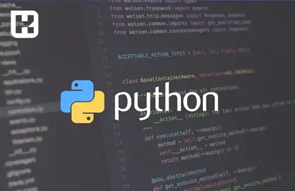

پایتون ([Python](https://www.python.org/)) یک زبان برنامه‌نویسی تفسیری، شیءگرا و همچنین پرکاربرد است که توسط خیدو فان روسوم (Guido van Rossum) در سال 1991 ایجاد شده شده است. پایتون برای توسعه نرم‌افزارهای متنوعی مانند برنامه‌های وب، علوم داده، هوش مصنوعی، اطلاعات کوچک (IoT) و بسیاری از حوزه‌های دیگر مورد استفاده قرار می‌گیرد.

از مهم‌ترین ویژگی‌های پایتون می‌توان به خوانایی بالا، سادگی در یادگیری، توسعه سریع و پشتیبانی وسیع از جامعه برنامه‌نویسی اشاره کرد. پایتون دارای یک بانک ابزار و کتابخانه وسیعی است که به برنامه‌نویسان اجازه می‌دهد به راحتی و با سرعت برنامه‌های پیچیده را بسازند.

پایتون در سطح جهانی یکی از محبوب‌ترین زبان‌های برنامه‌نویسی است و در بسیاری از بخش‌های صنعت، علم و فناوری، محاسبات علمی و آموزش مورد استفاده قرار می‌گیرد. نسخه‌های مختلف پایتون و کتابخانه‌های متنوعی که برای آن توسعه یافته‌اند، امکانات بی‌شماری را برای برنامه‌نویسان فراهم کرده‌اند. 