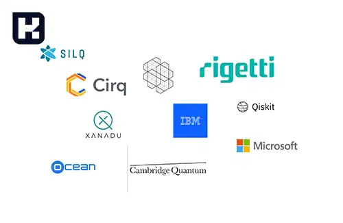
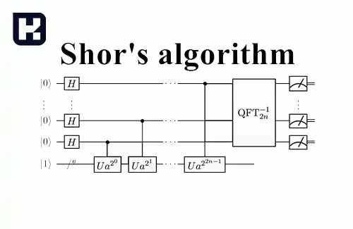
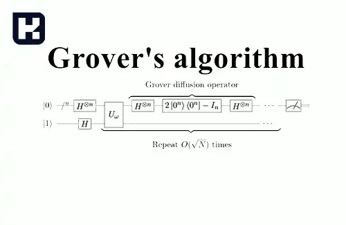
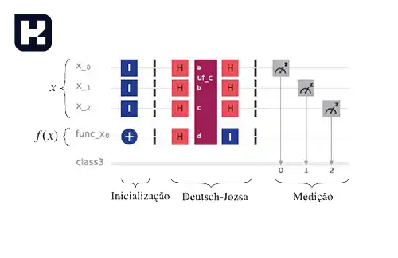
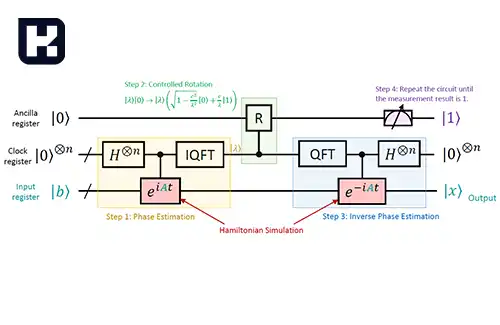
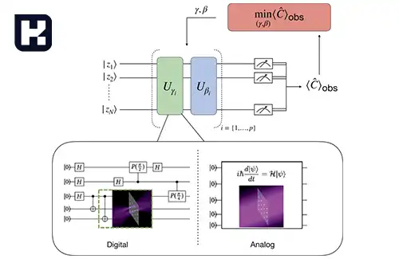
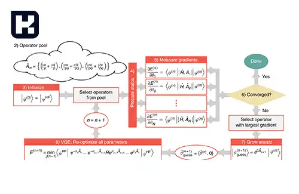
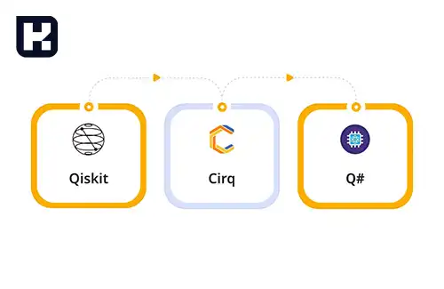
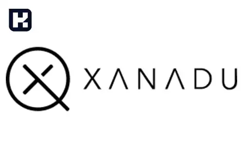

<style>
/* -----------------------
   تنظیمات کلی متن
-------------------------*/
body, .faq-block, p, li, td, th {
  font-size: 13px !important;
  line-height: 22px;
  color: #002145;
  margin: 0;
  padding: 0;
}

/* فاصله بین پاراگراف‌ها */
p + p {
  margin-top: 10px !important;
}

/* فاصله بین هر پاراگراف و هدینگ */
p + h1,
p + h2,
p + h3,
p + h4 {
  margin-top: 30px !important;
}

/* فاصله‌های قبل از هدینگ */
h1, h2, h3, h4 {
  margin-top: 30px !important;
  margin-bottom: 10px !important;
}

/* -----------------------
   تنظیم اندازه هدینگ‌ها
-------------------------*/
h1 {
  font-size: 18px !important;
}

h2 {
  font-size: 16px !important;
}

h3, h4 {
  font-size: 15px !important;
}

/* -----------------------
   لیست‌ها
-------------------------*/
ul li {
  font-size: 13px !important;
  margin-bottom: 2px;
}

/* -----------------------
   لینک‌ها
-------------------------*/

a {
  font-size: 13px !important;
  animation: colorRotate 4s linear infinite;
}

@keyframes colorRotate {
  0%   { color: #0d6efd; }
  25%  { color: #1ecbe1; }
  50%  { color: #00c37a; }
  75%  { color: #ff7f50; }
  100% { color: #0d6efd; }
}

/* -----------------------
   متن‌های بولد
-------------------------*/
strong, b {
  font-size: 12.5px !important;
}

/* -----------------------
   FAQ و فهرست
-------------------------*/
.faq-block {
  padding: 0.5rem;
  margin-top: 0.5rem;
  color: #002145 !important;
  font-size: 13px !important;
  background-color: #e9f4ff; /* آبی خیلی کم‌رنگ */
}

.faq-block summary {
  cursor: pointer;
  color: #002145 !important;
  font-size: 13px !important;
}

/* -----------------------
   جدول‌ها
-------------------------*/
table {
  width: 100%;
  border-collapse: collapse;
  margin-top: 20px !important;
  font-size: 12.5px !important;
}

th, td {
  padding: 0.6rem !important;
  border: 1px solid #dcdcdc;
  text-align: right !important;
  font-size: 12.5px !important;
}

thead tr {
  background-color: #eeeeff;
}

tbody tr:nth-child(even) {
  background-color: #fafaff;
}

/* -----------------------
   فاصله بیشتر بین بخش‌ها
-------------------------*/
blockquote.faq-block {
  margin-top: 10px !important;
}

</style>

<blockquote class="faq-block">
<details>
  <summary>آنچه در این مطلب خواهید خواند</summary>
  <ul>
    <li>برنامه‌نویسی کوانتومی چیست؟</li>
    <li>الگوریتم‌های برنامه‌نویسی کوانتومی</li>
      <ul>
        <li>۱. الگوریتم Shor</li>
        <li>۲. الگوریتم Grover</li>
        <li>۳. الگوریتم Deutsch-Josza</li>
        <li>۴. الگوریتم HHL (Harrow-Hassidim-Lloyd)</li>
        <li>۵. الگوریتم QAOA</li>
        <li>۶. الگوریتم VQE</li>
      </ul>
    <li>کاربردهای برنامه‌نویسی کوانتومی</li>
      <ul>
        <li>مدل‌سازی سیستم‌های کوانتومی</li>
        <li>مدل‌سازی تراشه‌های الکترونیکی</li>
      </ul>
    <li>بهترین زبان‌های برنامه‌نویسی کوانتومی</li>
      <ul>
        <li>Q#</li>
        <li>Qiskit</li>
        <li>Cirq</li>
        <li>Quil</li>
        <li>Xanadu (PennyLane)</li>
        <li>QCL</li>
      </ul>
    <li>تأثیر برنامه‌نویسی کوانتومی بر آینده</li>
    <li>سوالات متداول</li>
    <li>جمع‌بندی</li>
  </ul>
</details>
</blockquote><br/>

برنامه ‌نویسی کوانتومی نوعی از برنامه ‌نویسی محاسباتی است که از ویژگی‌های فیزیک کوانتومی مانند ابرموقعیت و درهم‌تنیدگی بهره می‌برد. به دلیل قابلیت حل سریع‌تر برخی مسائل نسبت به روش‌های کلاسیک، این نوع برنامه‌نویسی بسیار مورد توجه قرار گرفته است. در ادامه به برخی از کاربردهای برنامه‌نویسی کوانتومی اشاره می‌کنیم.

## برنامه‌نویسی کوانتومی



برنامه ‌نویسی کوانتومی با برنامه‌نویسی کلاسیک تفاوت‌های بنیادی دارد، زیرا به جای بیت‌های کلاسیک (0 و 1) از **کیوبیت‌ها** استفاده می‌کند. کیوبیت‌ها می‌توانند همزمان هم 0 و هم 1 باشند (به دلیل ویژگی برهم‌نهی در مکانیک کوانتومی). این ویژگی به برنامه‌نویسی کوانتومی قدرت پردازشی بیشتری می‌دهد.

---

### الگوریتم های برنامه ‌نویسی کوانتومی

الگوریتم‌های برنامه‌نویسی کوانتومی به ما این امکان را می‌دهند تا از قدرت پردازش موازی و ویژگی‌های منحصر به فرد مکانیک کوانتومی بهره‌برداری کنیم. در ادامه، برخی از مهم‌ترین و معروف‌ترین الگوریتم‌های کوانتومی معرفی شده‌اند:

#### ۱. الگوریتم **Shor**



این الگوریتم برای فاکتورگیری عدد صحیح به کار می‌رود. الگوریتم Shor می‌تواند عددهای بزرگ را به طور نمایی سریع‌تر از بهترین الگوریتم‌های کلاسیک فاکتور کند. این ویژگی آن را به یک تهدید بزرگ برای امنیت سیستم‌های رمزنگاری مبتنی بر RSA تبدیل کرده است.  

#### ۲. الگوریتم **Grover**



الگوریتم Grover برای جستجو در پایگاه‌های داده نامنظم طراحی شده است. این الگوریتم می‌تواند برای جستجوی یک عنصر خاص در یک مجموعه از N عنصر با پیچیدگی زمانی O(√N) عمل کند که به طور قابل توجهی سریع‌تر از الگوریتم‌های کلاسیک است.  

#### ۳. الگوریتم **Deutsch-Josza**



این الگوریتم یک مشکل جستجوی خاص را حل می‌کند و نشان می‌دهد که یک کامپیوتر کوانتومی می‌تواند به طور چشمگیری سریع‌تر از یک کامپیوتر کلاسیک عمل کند. الگوریتم Deutsch-Josza می‌تواند تعیین کند که یک تابع خاص متعادل است یا ثابت، با تنها یک ارزیابی.  

#### ۴. الگوریتم **HHL** (Harrow-Hassidim-Lloyd)



این الگوریتم برای حل معادلات خطی طراحی شده و می‌تواند برخی از مشکلات را به طور نمایی سریع‌تر از الگوریتم‌های کلاسیک حل کند. HHL می‌تواند در زمینه‌هایی مانند یادگیری ماشین و شبیه‌سازی‌های کوانتومی مفید باشد.  

#### ۵. **الگوریتم Quantum Approximate Optimization Algorithm (QAOA)**



این الگوریتم برای حل مسائل بهینه‌سازی NP-hard طراحی شده است و به دنبال بهینه‌سازی توابع خاصی در یک گراف می‌باشد. QAOA به طور خاص در حوزه‌هایی مانند یادگیری ماشین و برنامه‌ریزی کاربرد دارد.  

#### ۶. **الگوریتم Variational Quantum Eigensolver (VQE)**



VQE یک الگوریتم هیبریدی است که برای محاسبه انرژی حالت پایه یک سیستم کوانتومی استفاده می‌شود. این الگوریتم به طور خاص در شبیه‌سازی مولکولی و مطالعه خواص مواد مفید است.  

این الگوریتم‌ها تنها نمونه‌ای از توانایی‌های برنامه‌نویسی کوانتومی هستند و نشان‌دهنده پتانسیل بزرگ محاسبات کوانتومی در حل مسائل پیچیده‌ای هستند که برای کامپیوترهای کلاسیک غیرممکن یا زمان‌بر خواهند بود.

---

### کاربرد برنامه ‌نویسی کوانتومی

برنامه‌نویسی کوانتومی به عنوان یک حوزه نوظهور، کاربردهای گسترده‌ای در علوم و فناوری‌های مختلف دارد. در اینجا به دو کاربرد کلیدی اشاره می‌کنیم:

#### مدل‌سازی سیستم‌های کوانتومی

مدل‌سازی و شبیه‌سازی سیستم‌های کوانتومی یکی از کاربردهای اصلی برنامه‌نویسی کوانتومی است. این نوع شبیه‌سازی به محققان این امکان را می‌دهد که رفتار سیستم‌های پیچیده کوانتومی را که به دلیل اندازه و پیچیدگی، برای کامپیوترهای کلاسیک غیرقابل شبیه‌سازی هستند، مورد بررسی قرار دهند. 

به عنوان مثال، در حوزه شیمی، این روش به محققان کمک می‌کند تا ساختار و واکنش‌های مولکول‌ها را به دقت پیش‌بینی کنند. شبیه‌سازی‌های کوانتومی می‌توانند در توسعه داروهای جدید، تحلیل مواد جدید و فهم بهتر فرآیندهای طبیعی مفید باشند.

#### مدل‌سازی تراشه‌های الکترونیکی

برنامه‌نویسی کوانتومی همچنین در شبیه‌سازی تراشه‌های الکترونیکی کاربرد دارد. طراحی و بهینه‌سازی تراشه‌های الکترونیکی مدرن به دلیل پیچیدگی‌های بالا و نیاز به دقت در عملکرد، نیازمند شبیه‌سازی‌های دقیق است. الگوریتم‌های کوانتومی می‌توانند به طراحان کمک کنند تا ساختارهای بهینه‌تری را برای تراشه‌ها ایجاد کرده و ویژگی‌های عملکردی آنها را بهبود بخشند. این امر به ویژه در طراحی مدارهای مجتمع (IC) و تراشه‌های حافظه اهمیت دارد.

---

### بهترین زبان‌های برنامه‌نویسی کوانتومی

زبان‌ها و پلتفرم‌هایی برای برنامه‌نویسی کوانتومی وجود دارند:



#### 1- Q#

زبان **Q#** توسط مایکروسافت به عنوان یک زبان برنامه‌نویسی اختصاصی برای توسعه و اجرای برنامه‌های کوانتومی طراحی شده است. این زبان با پلتفرم کوانتومی مایکروسافت، یعنی **Quantum Development Kit (QDK)**، و شبیه‌سازهای کوانتومی مایکروسافت مثل **Azure Quantum** سازگار است.

در اینجا یک نمونه کد ساده با Q# برای ایجاد یک مدار کوانتومی که یک **حالت Bell** تولید می‌کند:

#### کد نمونه Q#:

<div class="code-block">

```qsharp
namespace QuantumBell {
    open Microsoft.Quantum.Canon;
    open Microsoft.Quantum.Intrinsic;

    @EntryPoint()
    operation GenerateBellState() : Result[] {
        // ایجاد دو کیوبیت
        using (qubits = Qubit[2]) {
            // اعمال دروازه هادامارد بر روی اولین کیوبیت
            H(qubits[0]);

            // اعمال دروازه CNOT بر روی دو کیوبیت
            CNOT(qubits[0], qubits[1]);

            // اندازه‌گیری دو کیوبیت
            let res1 = M(qubits[0]);
            let res2 = M(qubits[1]);

            // بازگرداندن نتایج اندازه‌گیری
            return [res1, res2];
        }
    }
}
```
</div>

#### توضیح کد:

1. **ایجاد کیوبیت‌ها**: `using (qubits = Qubit[2])` دو کیوبیت ایجاد می‌کند.
2. **دروازه‌های کوانتومی**:
   - دروازه **Hadamard (H)** بر روی اولین کیوبیت اعمال می‌شود که آن را به حالت ابرپوزیشن می‌برد.
   - دروازه **CNOT** سپس بین دو کیوبیت اعمال می‌شود تا وابستگی کوانتومی (یا همان entanglement) ایجاد شود.
3. **اندازه‌گیری**: هر دو کیوبیت اندازه‌گیری شده و نتایج بازگردانده می‌شوند.

#### نحوه اجرای برنامه Q#:

1. **نصب ابزارهای توسعه کوانتومی**: ابتدا باید **Quantum Development Kit** و ابزارهای وابسته به آن را نصب کنید. این ابزارها برای اجرای برنامه‌های کوانتومی استفاده می‌شوند. راه‌های نصب آن برای ویژوال استودیو، ویژوال استودیو کد، یا از طریق ترمینال با دات‌نت (.NET) وجود دارد.

2. **اجرای برنامه**: پس از نصب، می‌توانید کد خود را از طریق خط فرمان یا در محیط ویژوال استودیو یا VS Code اجرا کنید.

این زبان به دلیل سازگاری با اکوسیستم مایکروسافت و توانایی اتصال به شبیه‌سازها و سخت‌افزارهای کوانتومی، یک انتخاب مناسب برای توسعه‌دهندگان علاقه‌مند به محاسبات کوانتومی است.

#### 2- Qiskit

**Qiskit** یک فریم‌ورک منبع‌باز است که توسط IBM توسعه یافته و به‌طور خاص برای نوشتن الگوریتم‌های کوانتومی طراحی شده است. این فریم‌ورک به کاربران این امکان را می‌دهد که مدارهای کوانتومی را طراحی کرده و آنها را بر روی شبیه‌سازها یا سخت‌افزارهای واقعی کوانتومی اجرا کنند.

#### نمونه کد با Qiskit
در اینجا یک مثال ساده از یک مدار کوانتومی با استفاده از Qiskit آورده شده است. این کد یک مدار ایجاد می‌کند که یک حالت **Bell** تولید می‌کند و سپس آن را اندازه‌گیری می‌کند:

<div class="code-block">

```python
from qiskit import QuantumCircuit, Aer, execute

# ایجاد مدار کوانتومی
qc = QuantumCircuit(2)  # دو کیوبیت

# اعمال دروازه‌ها
qc.h(0)  # دروازه هادامارد بر روی کیوبیت 0
qc.cx(0, 1)  # دروازه CNOT بین کیوبیت 0 و 1

# اندازه‌گیری کیوبیت‌ها
qc.measure_all()

# چاپ مدار
print("مدار کوانتومی:")
print(qc)

# شبیه‌سازی مدار
simulator = Aer.get_backend('qasm_simulator')  # انتخاب شبیه‌ساز
result = execute(qc, simulator).result()  # اجرای مدار
counts = result.get_counts()  # نتایج اندازه‌گیری

# چاپ نتایج
print("نتایج اندازه‌گیری:")
print(counts)
```
</div>

#### توضیحات کد:

1. **ایجاد مدار**: با استفاده از `QuantumCircuit` یک مدار با دو کیوبیت ایجاد می‌شود.
2. **اعمال دروازه‌ها**:
   - **Hadamard Gate (H)**: این دروازه بر روی کیوبیت اول (کیوبیت 0) اعمال می‌شود تا آن را به حالت ابرپوزیشن ببرد.
   - **CNOT Gate**: این دروازه بین دو کیوبیت اعمال می‌شود و باعث ایجاد همبستگی کوانتومی بین آنها می‌شود.
3. **اندازه‌گیری**: با استفاده از `measure_all()`، هر دو کیوبیت اندازه‌گیری می‌شوند.
4. **شبیه‌سازی**: مدار با استفاده از شبیه‌ساز `qasm_simulator` اجرا می‌شود و نتایج اندازه‌گیری به صورت دیکشنری نمایش داده می‌شود.

#### نحوه اجرای برنامه Qiskit

1. اطمینان حاصل کنید که Qiskit نصب شده است. برای نصب، از دستور زیر استفاده کنید:

<div class="code-block">

   ```bash
   pip install qiskit
   ```

</div>

2. کد را در یک فایل با پسوند `.py` ذخیره کنید و آن را اجرا کنید:

<div class="code-block">

   ```bash
   python filename.py
   ```

</div>

#### 3- Cirq

**Cirq** یک فریم‌ورک برنامه‌نویسی کوانتومی است که توسط شرکت **گوگل** توسعه یافته و برای طراحی و اجرا برنامه‌های کوانتومی روی سخت‌افزارهای کوانتومی گوگل به کار می‌رود. این فریم‌ورک به برنامه‌نویسان این امکان را می‌دهد که با استفاده از زبان برنامه‌نویسی **پایتون**، مدارهای کوانتومی را طراحی و شبیه‌سازی کنند.

#### نمونه کد با Cirq
در اینجا یک مثال ساده از یک مدار کوانتومی با استفاده از Cirq آورده شده است. این کد یک مدار ایجاد می‌کند که یک حالت Bell را تولید می‌کند:

<div class="code-block">

```python
import cirq

# ایجاد کیوبیت‌ها
qubit1 = cirq.LineQubit(0)
qubit2 = cirq.LineQubit(1)

# ایجاد مدار
circuit = cirq.Circuit()

# اعمال دروازه‌ها
circuit.append([cirq.H(qubit1), cirq.CNOT(qubit1, qubit2)])

# اندازه‌گیری
circuit.append(cirq.measure(qubit1, key='result1'))
circuit.append(cirq.measure(qubit2, key='result2'))

# چاپ مدار
print("مدار کوانتومی:")
print(circuit)

# شبیه‌سازی مدار
simulator = cirq.Simulator()
result = simulator.run(circuit)

# چاپ نتایج
print("نتایج اندازه‌گیری:")
print(result)
```

</div>

#### توضیحات کد:
1. **ایجاد کیوبیت‌ها**: `cirq.LineQubit` برای ایجاد کیوبیت‌ها استفاده می‌شود.
2. **ایجاد مدار**: یک مدار با استفاده از `cirq.Circuit` ایجاد می‌شود.
3. **اعمال دروازه‌ها**:
   - دروازه **Hadamard** (`H`) بر روی کیوبیت اول اعمال می‌شود.
   - دروازه **CNOT** بین دو کیوبیت اعمال می‌شود تا حالت Bell تولید شود.
4. **اندازه‌گیری**: کیوبیت‌ها اندازه‌گیری می‌شوند.
5. **شبیه‌سازی**: مدار با استفاده از شبیه‌ساز `cirq.Simulator` اجرا می‌شود و نتایج اندازه‌گیری نمایش داده می‌شود.

#### نحوه اجرای برنامه Cirq
برای اجرای این کد، باید اطمینان حاصل کنید که **Cirq** نصب شده باشد. می‌توانید آن را با استفاده از pip نصب کنید:

<div class="code-block">

```bash
pip install cirq
```

</div>

سپس کد را در یک فایل با پسوند `.py` ذخیره کرده و با استفاده از دستور زیر اجرا کنید:

<div class="code-block">

```bash
python filename.py
```

</div>

#### 4- Quil

**Quil** (Quantum Instruction Language) یک زبان برنامه‌نویسی کوانتومی است که توسط شرکت **Rigetti Computing** توسعه یافته است. این زبان با هدف ایجاد و اجرای برنامه‌های کوانتومی بر روی سخت‌افزارهای کوانتومی طراحی شده است و به‌خوبی با زبان Lisp سازگار است.

#### نمونه کد با Quil
در اینجا یک مثال ساده از یک برنامه Quil که یک حالت Bell تولید می‌کند، آورده شده است. برای اجرای برنامه‌های Quil، شما می‌توانید از **Forest SDK** و **PyQuil** استفاده کنید. PyQuil یک کتابخانه Python است که به شما اجازه می‌دهد تا با Quil کار کنید.

<div class="code-block">

```python
from pyquil import Program
from pyquil.gates import H, CNOT
from pyquil.api import WavefunctionSimulator

# ایجاد برنامه
p = Program()

# ایجاد کیوبیت‌ها و اعمال دروازه‌ها
p += H(0)       # دروازه هادامارد بر روی کیوبیت 0
p += CNOT(0, 1) # دروازه CNOT بین کیوبیت 0 و 1

# چاپ برنامه
print("برنامه Quil:")
print(p)

# شبیه‌سازی
simulator = WavefunctionSimulator()
wavefunction = simulator.wavefunction(p)

# چاپ نتایج
print("حالت wavefunction:")
print(wavefunction)
```

</div>

#### توضیحات کد:
1. **ایجاد برنامه**: با استفاده از `Program` یک برنامه Quil ایجاد می‌شود.
2. **اعمال دروازه‌ها**:
   - **Hadamard Gate (H)**: این دروازه بر روی کیوبیت اول (کیوبیت 0) اعمال می‌شود تا آن را به حالت ابرپوزیشن ببرد.
   - **CNOT Gate**: این دروازه بین دو کیوبیت اعمال می‌شود و باعث ایجاد همبستگی کوانتومی (entanglement) بین آنها می‌شود.
3. **شبیه‌سازی**: با استفاده از `WavefunctionSimulator`، حالت wavefunction مدار شبیه‌سازی می‌شود و نتایج نمایش داده می‌شود.

#### نحوه اجرای برنامه Quil
برای اجرای این کد، باید PyQuil نصب شده باشد. می‌توانید آن را با استفاده از pip نصب کنید:

<div class="code-block">

```bash
pip install pyquil
```

</div>

سپس کد را در یک فایل با پسوند `.py` ذخیره کرده و با استفاده از دستور زیر اجرا کنید:

<div class="code-block">

```bash
python filename.py
```

</div>

#### 5- Xanadu



**Xanadu** یک فریم‌ورک برنامه‌نویسی کوانتومی است که توسط شرکت **Xanadu** توسعه یافته و برای برنامه‌نویسی کوانتومی با استفاده از سخت‌افزارهای کوانتومی این شرکت طراحی شده است. Xanadu از **PennyLane**، یک کتابخانه پایتون، برای برنامه‌نویسی کوانتومی استفاده می‌کند و به کاربران اجازه می‌دهد تا مدارهای کوانتومی را طراحی و شبیه‌سازی کنند.

#### نمونه کد با Xanadu و PennyLane
در اینجا یک مثال ساده از یک مدار کوانتومی با استفاده از PennyLane آورده شده است که یک حالت **Bell** تولید می‌کند:

<div class="code-block">

```python
import pennylane as qml

# تعیین تعداد کیوبیت‌ها
n_wires = 2

# ایجاد دایموند
dev = qml.device("default.qubit", wires=n_wires)

@qml.qnode(dev)
def circuit():
    # اعمال دروازه‌ها
    qml.Hadamard(wires=0)    # دروازه هادامارد بر روی کیوبیت 0
    qml.CNOT(wires=[0, 1])    # دروازه CNOT بین کیوبیت 0 و 1

    # اندازه‌گیری
    return qml.expval(qml.PauliZ(0)), qml.expval(qml.PauliZ(1))

# اجرای مدار
result = circuit()

# چاپ نتایج
print("نتایج اندازه‌گیری:")
print(result)
```

</div>

#### توضیحات کد:
1. **ایجاد دستگاه**: `qml.device` یک دستگاه کوانتومی ایجاد می‌کند که می‌توان از آن برای شبیه‌سازی مدار استفاده کرد.
2. **تعریف مدار**: با استفاده از `@qml.qnode(dev)` یک تابع برای مدار تعریف می‌شود.
3. **اعمال دروازه‌ها**:
   - **Hadamard Gate (H)**: بر روی کیوبیت اول (کیوبیت 0) اعمال می‌شود تا آن را به حالت ابرپوزیشن ببرد.
   - **CNOT Gate**: بین دو کیوبیت اعمال می‌شود و همبستگی کوانتومی ایجاد می‌کند.
4. **اندازه‌گیری**: با استفاده از `qml.expval` مقدار انتظاری کیوبیت‌ها اندازه‌گیری می‌شود.
5. **اجرای مدار**: با فراخوانی تابع `circuit()` مدار اجرا می‌شود و نتایج نمایش داده می‌شود.

#### نحوه اجرای برنامه Xanadu
برای اجرای این کد، باید **PennyLane** نصب شده باشد. می‌توانید آن را با استفاده از pip نصب کنید:

<div class="code-block">

```bash
pip install pennylane
```

</div>

سپس کد را در یک فایل با پسوند `.py` ذخیره کرده و با استفاده از دستور زیر اجرا کنید:

<div class="code-block">

```bash
python filename.py
```

</div>

#### 6- Qcl

**QCL** (Quantum Computing Language) یکی از اولین زبان‌های برنامه‌نویسی کوانتومی است که در سال ۱۹۹۶ توسط یک گروه تحقیقاتی ایجاد شد. این زبان بر پایه C++ طراحی شده و امکانات متعددی برای توسعه برنامه‌های کوانتومی پیشرفته فراهم می‌کند. QCL به طور خاص برای برنامه‌نویسی الگوریتم‌های کوانتومی طراحی شده و به کاربران این امکان را می‌دهد که با استفاده از دستورات ساده و مفهومی، مدارهای کوانتومی ایجاد کنند.

#### نمونه کد با QCL
در اینجا یک مثال ساده از کد QCL آورده شده است که یک حالت ابرپوزیشن را با استفاده از دروازه‌های کوانتومی ایجاد می‌کند:

<div class="code-block">

```c
// تعریف کیوبیت‌ها
qubit q[2];

// اعمال دروازه‌ها
H(q[0]); // دروازه هادامارد بر روی کیوبیت 0
CNOT(q[0], q[1]); // دروازه CNOT بین کیوبیت 0 و 1

// اندازه‌گیری
measure(q[0]);
measure(q[1]);
```
</div>

#### توضیحات کد:

1. **تعریف کیوبیت‌ها**: در این کد، دو کیوبیت `q[0]` و `q[1]` تعریف می‌شوند.
2. **اعمال دروازه‌ها**:
   - **Hadamard Gate (H)**: این دروازه بر روی کیوبیت اول (کیوبیت 0) اعمال می‌شود تا آن را به حالت ابرپوزیشن ببرد.
   - **CNOT Gate**: این دروازه بین دو کیوبیت اعمال می‌شود و باعث ایجاد همبستگی کوانتومی می‌شود.
3. **اندازه‌گیری**: در نهایت، هر دو کیوبیت اندازه‌گیری می‌شوند تا نتایج نهایی به دست آید.

#### نحوه اجرای برنامه QCL
برای اجرای کد QCL، شما نیاز به محیطی دارید که از QCL پشتیبانی کند. با توجه به قدیمی بودن این زبان، ممکن است نیاز به نصب نرم‌افزارهای خاص یا محیط‌های شبیه‌ساز داشته باشید. 

---

### تاثیر برنامه نویسی کوانتومی بر آینده 

با توجه به این که کامپیوترهای کوانتومی هنوز در مراحل ابتدایی توسعه قرار دارند، ایجاد یک زبان مخصوص برای این نوع کامپیوترها ممکن است به نظر عجیب بیاید. با این حال، توسعه نرم‌افزار (که از طریق شبیه‌سازی یک کامپیوتر کوانتومی روی مدل‌های کلاسیک انجام می‌شود) می‌تواند به طراحی و پیشرفت کامپیوترهای کوانتومی در آینده کمک کند.

آژانس تحقیقاتی پیشرفته هوش ایالات متحده (IARPA) در پروژه‌ی کوئیپر سرمایه‌گذاری کرده تا تعیین کند یک کامپیوتر کوانتومی برای انجام عملیات خاص به چه تعداد کیوبیت نیاز دارد تا بهتر از کامپیوترهای کلاسیک عمل کند. نوشتن برنامه‌ها در کوئیپر نیازمندی‌های سخت‌افزاری الگوریتم‌ها را روشن کرده و نتایج شگفت‌انگیزی به همراه داشته است. 

سلینگر پیش‌بینی می‌کند که با پیشرفت‌های مهندسی، تعداد کیوبیت‌های لازم برای کامپیوترهای کوانتومی کاهش خواهد یافت. این گروه برآوردهای خود را بر مبنای انواع مختلف سخت‌افزار کوانتومی ارائه کرده، اما کامپیوتر کوانتومی دی‌ویو که رویکرد متفاوتی دارد، در این ارزیابی‌ها در نظر گرفته نشده است.

---

### سوالات متداول

<blockquote class="faq-block">
    <details>
        <summary>برنامه‌نویسی کوانتومی چیست؟</summary>
        برنامه‌نویسی کوانتومی نوعی برنامه‌نویسی محاسباتی است که از ویژگی‌های فیزیک کوانتومی مانند ابرموقعیت و درهم‌تنیدگی بهره می‌برد. این نوع برنامه‌نویسی قادر است مسائل خاصی را سریع‌تر از روش‌های کلاسیک حل کند.
    </details>
</blockquote>

<blockquote class="faq-block">
    <details>
        <summary>چه الگوریتم‌هایی در برنامه‌نویسی کوانتومی وجود دارد؟</summary>
        الگوریتم‌های مهم شامل Shor (فاکتورگیری عدد صحیح)، Grover (جستجوی پایگاه داده)، Deutsch-Josza ،HHL (حل معادلات خطی)، QAOA (بهینه‌سازی مسائل NP-hard) و VQE (محاسبه انرژی حالت پایه سیستم‌های کوانتومی) هستند.
    </details>
</blockquote>

<blockquote class="faq-block">
    <details>
        <summary>برنامه‌نویسی کوانتومی چه کاربردهایی دارد؟</summary>
        کاربردها شامل مدل‌سازی سیستم‌های کوانتومی، شبیه‌سازی تراشه‌های الکترونیکی، طراحی دارو و مواد جدید، حل مسائل بهینه‌سازی و کاربردهای تحقیقاتی در فیزیک و علوم کامپیوتر است.
    </details>
</blockquote>

<blockquote class="faq-block">
    <details>
        <summary>بهترین زبان‌های برنامه‌نویسی کوانتومی کدام‌اند؟</summary>
        برخی از زبان‌ها و فریم‌ورک‌های برجسته شامل Q# ،Qiskit ،Cirq ،Quil ،Xanadu (PennyLane) و QCL هستند که هر کدام برای اهداف خاص توسعه یافته‌اند و قابلیت طراحی، شبیه‌سازی و اجرای مدارهای کوانتومی را فراهم می‌کنند.
    </details>
</blockquote>

<blockquote class="faq-block">
    <details>
        <summary>نمونه برنامه ساده کوانتومی چگونه نوشته می‌شود؟</summary>
        با استفاده از Q# ،Qiskit ،Cirq ،Quil یا PennyLane می‌توان مدارهای ساده مانند حالت Bell ایجاد کرد. این مدارها شامل ایجاد کیوبیت، اعمال دروازه‌های Hadamard و CNOT و سپس اندازه‌گیری کیوبیت‌ها هستند.
    </details>
</blockquote>

<blockquote class="faq-block">
    <details>
        <summary>آیا برنامه‌نویسی کوانتومی برای آینده اهمیت دارد؟</summary>
        بله، با پیشرفت سخت‌افزارهای کوانتومی و کاهش تعداد کیوبیت‌های لازم برای انجام محاسبات، برنامه‌نویسی کوانتومی نقش کلیدی در طراحی الگوریتم‌ها، شبیه‌سازی سیستم‌ها و پیشرفت علوم محاسباتی خواهد داشت.
    </details>
</blockquote>

<blockquote class="faq-block">
    <details>
        <summary>چگونه می‌توان برنامه‌های کوانتومی را اجرا کرد؟</summary>
        برنامه‌های کوانتومی را می‌توان روی شبیه‌سازهای محاسبات کوانتومی اجرا کرد و در صورت دسترسی به سخت‌افزارهای کوانتومی، روی آنها نیز پیاده‌سازی نمود. هر زبان کوانتومی دارای راهنمای نصب و اجرای مختص خود است، مانند Q# با Quantum Development Kit یا Qiskit با Python.
    </details>
</blockquote>

---

### جمع‌بندی

برنامه‌نویسی کوانتومی شاخه‌ای نوین از محاسبات است که از اصول مکانیک کوانتومی مانند ابرموقعیت و درهم‌تنیدگی برای افزایش توان پردازشی بهره می‌برد. برخلاف برنامه‌نویسی کلاسیک که بر پایه بیت‌های صفر و یک است، در برنامه‌نویسی کوانتومی از کیوبیت‌ها استفاده می‌شود که می‌توانند همزمان چند حالت را داشته باشند و امکان پردازش موازی گسترده‌ای فراهم کنند.

الگوریتم‌های کوانتومی مانند Shor ،Grover ،Deutsch-Josza ،HHL ،QAOA و VQE نمونه‌هایی از توانایی‌های محاسباتی کوانتوم هستند که مسائل فاکتورگیری، جستجو، حل معادلات خطی و بهینه‌سازی را به شکل چشمگیری سریع‌تر از روش‌های کلاسیک حل می‌کنند.

کاربردهای برنامه‌نویسی کوانتومی شامل مدل‌سازی سیستم‌های کوانتومی، شبیه‌سازی تراشه‌های الکترونیکی، طراحی دارو و مواد جدید و حل مسائل پیچیده بهینه‌سازی است. این حوزه نه تنها در تحقیقات علمی اهمیت دارد، بلکه پایه‌ای برای توسعه سخت‌افزارهای کوانتومی و طراحی الگوریتم‌های پیشرفته در آینده محسوب می‌شود.

بهترین زبان‌ها و فریم‌ورک‌های کوانتومی شامل Q# ،Qiskit ،Cirq ،Quil ،Xanadu (PennyLane) و QCL هستند که امکان طراحی، شبیه‌سازی و اجرای مدارهای کوانتومی را فراهم می‌کنند و با توجه به پیشرفت سخت‌افزارهای کوانتومی، برنامه‌نویسی کوانتومی نقش کلیدی در آینده محاسبات و علوم داده خواهد داشت.