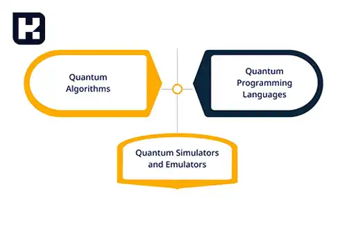

<blockquote style="background-color:#eeeefc; padding:0.5rem">

  
آنچه در این مطلب خواهید خواند

  <ul>
    <li>الگوریتم شور (Shor’s algorithm)</li>
    <li>الگوریتم گروور (Grover’s algorithm)</li>
    <li>مدل‌سازی تراشه‌های الکترونیکی</li>
    <li>بهترین زبان‌های برنامه‌نویسی کوانتومی</li>
    <li>تاثیر بر آینده</li>
  </ul>

</blockquote>

برنامه ‌نویسی کوانتومی نوعی از برنامه ‌نویسی محاسباتی است که از ویژگی‌های فیزیک کوانتومی مانند ابرموقعیت و درهم‌تنیدگی بهره می‌برد. به دلیل قابلیت حل سریع‌تر برخی مسائل نسبت به روش‌های کلاسیک، این نوع برنامه‌نویسی بسیار مورد توجه قرار گرفته است. در ادامه به برخی از کاربردهای برنامه‌نویسی کوانتومی اشاره می‌کنیم.

### الگوریتم شور (Shor’s algorithm)

این الگوریتم به‌عنوان یکی از کاربردهای مهم برنامه‌نویسی کوانتومی شناخته می‌شود و برای حل مسائلی مانند تجزیه عددهای بزرگ به عوامل اول به کار می‌رود. این الگوریتم امکان حل مسائلی را فراهم می‌کند که با روش‌های کلاسیک قابل حل نیستند.

### الگوریتم گروور (Grover’s algorithm)
این الگوریتم به کار می‌رود تا با سرعتی بیشتر از الگوریتم‌های کلاسیک، یک مقدار خاص را در مجموعه‌ای بزرگ از داده‌ها پیدا کند.

### مدل‌سازی سیستم‌های کوانتومی

برنامه ‌نویسی کوانتومی به دلیل اثربخشی بالا در توصیف سیستم‌های کوانتومی، در شبیه‌سازی این سیستم‌ها برای تحقیقات و کاربردهای مختلف بسیار مورد استفاده قرار می‌گیرد.

### مدل‌سازی تراشه‌های الکترونیکی

برنامه‌نویسی کوانتومی برای شبیه‌سازی تراشه‌های الکترونیکی کاربرد دارد. به دلیل پیچیدگی بالای این تراشه‌ها و نیاز به شبیه‌سازی دقیق برای طراحی و بهینه‌سازی، استفاده از برنامه‌نویسی کوانتومی اهمیت ویژه‌ای پیدا کرده است.

### بهترین زبان‌های برنامه‌نویسی کوانتومی

**#Q**

این زبان توسط مایکروسافت توسعه یافته و با سخت‌افزارهای کوانتومی مایکروسافت کاملاً سازگار است. این زبان شامل کتابخانه‌های مفیدی برای توسعه برنامه‌های کوانتومی است.

**Qiskit**

این زبان توسط شرکت IBM توسعه یافته و امکان توسعه برنامه‌های کوانتومی را در فریمورک خود فراهم می‌کند. Qiskit با استفاده از زبان Python، برنامه‌نویسی کوانتومی را امکان‌پذیر می‌سازد.

**Cirq**

این زبان توسط شرکت IBM توسعه یافته و امکان توسعه برنامه‌های کوانتومی را در فریمورک خود فراهم می‌کند. Qiskit با استفاده از زبان Python، برنامه‌نویسی کوانتومی را امکان‌پذیر می‌سازد.

**Quil** 

این زبان توسط شرکت Rigetti توسعه یافته است و امکان توسعه برنامه‌های کوانتومی را در چارچوب خود فراهم می‌کند Quil . با استفاده از زبان Lisp ، برنامه‌نویسی کوانتومی را ممکن می‌سازد.

**Xanadu**

این زبان توسط شرکت Xanadu توسعه یافته و برای برنامه‌نویسی کوانتومی با استفاده از سخت‌افزارهای کوانتومی Xanadu طراحی شده است. این زبان از Python برای توسعه برنامه‌های کوانتومی بهره می‌گیرد.

**Qcl**

این زبان برنامه‌نویسی کوانتومی، به عنوان قدیمی‌ترین زبان در این حوزه شناخته می‌شود و در سال ۱۹۹۶ توسط گروهی از محققان ایجاد شده است. این زبان بر پایه C++ طراحی شده و امکان توسعه برنامه‌های کوانتومی پیشرفته را برای کاربران فراهم می‌کند.

### تاثیر بر آینده 

با توجه به این که کامپیوترهای کوانتومی هنوز در مراحل ابتدایی توسعه قرار دارند، ایجاد یک زبان مخصوص برای این نوع کامپیوترها ممکن است به نظر عجیب بیاید. با این حال، توسعه نرم‌افزار (که از طریق شبیه‌سازی یک کامپیوتر کوانتومی روی مدل‌های کلاسیک انجام می‌شود) می‌تواند به طراحی و پیشرفت کامپیوترهای کوانتومی در آینده کمک کند.

آژانس تحقیقاتی پیشرفته هوش ایالات متحده (IARPA) در پروژه‌ی کوئیپر سرمایه‌گذاری کرده تا تعیین کند یک کامپیوتر کوانتومی برای انجام عملیات خاص به چه تعداد کیوبیت نیاز دارد تا بهتر از کامپیوترهای کلاسیک عمل کند. نوشتن برنامه‌ها در کوئیپر نیازمندی‌های سخت‌افزاری الگوریتم‌ها را روشن کرده و نتایج شگفت‌انگیزی به همراه داشته است. 

سلینگر پیش‌بینی می‌کند که با پیشرفت‌های مهندسی، تعداد کیوبیت‌های لازم برای کامپیوترهای کوانتومی کاهش خواهد یافت. این گروه برآوردهای خود را بر مبنای انواع مختلف سخت‌افزار کوانتومی ارائه کرده، اما کامپیوتر کوانتومی دی‌ویو که رویکرد متفاوتی دارد، در این ارزیابی‌ها در نظر گرفته نشده است.