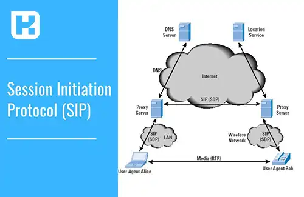
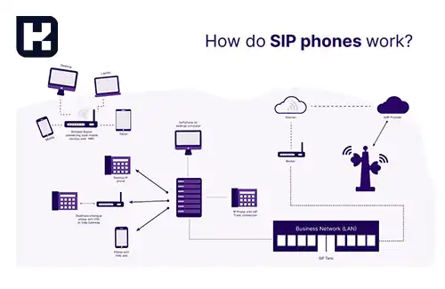
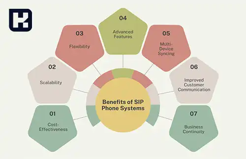

<blockquote style="background-color:#eeeefc; padding:0.5rem">

  
آنچه در این مطلب خواهید خواند

  <ul>
    <li>سیپ (SIP) چیست؟</li>
    <li>انواع سیپ (SIP)</li>
    <li>سرویس سیپ فون (SIP Phone) چیست؟</li>
    <li>تجهیزات لازم برای راه‌اندازی سرویس SIP Phone</li>
    <li>ویژگی‌های خدمات تلفن سیپ</li>
    <li>کاربردهای SIP</li>
  </ul>

</blockquote>

**سیپ** یا **Session Initiation Protocol**، یک پروتکل ارتباطی قدرتمند برای برقراری و مدیریت تماس‌های صوتی و تصویری در بستر اینترنت است. این فناوری، با جایگزینی خطوط تلفن سنتی، امکان ارتباطات دیجیتال پیشرفته‌ای را فراهم کرده و به‌ویژه در مراکز تماس، مجتمع‌ها و شهرهای هوشمند کاربرد فراوان دارد. در این مقاله، به بررسی مفهوم سیپ، انواع آن، تجهیزات موردنیاز و ویژگی‌های خدمات SIP می‌پردازیم.

## سیپ (SIP) چیست؟  

سیپ، یک پروتکل سیگنال‌دهی است که برای ایجاد، مدیریت و پایان دادن به ارتباطات صوتی و تصویری طراحی شده است. این پروتکل، جایگزین خطوط تلفن سنتی است و به‌صورت گسترده‌ای در زیرساخت‌های مدرن مانند مودم‌های فیبر نوری استفاده می‌شود. **SIP** امکان استفاده از چندین خط تلفن از طریق یک ارتباط را فراهم می‌کند، کیفیت تماس را افزایش داده و نویز یا قطعی ارتباط را به حداقل می‌رساند.

---

### انواع سیپ (SIP)  
به‌طور کلی، دو نوع اصلی از سیپ وجود دارد:  

1. **سیپ فون (SIP Phone):**  
   برای خطوط عادی و بدون امکان تماس همزمان استفاده می‌شود. این نوع سیپ معمولاً برای شماره‌های 8 یا 11 رقمی مناسب است و ویژگی‌های خاصی ارائه نمی‌دهد.  

2. **سیپ ترانک (SIP Trunk):**  
   مناسب برای خطوط تجاری و حرفه‌ای است و قابلیت ارائه چندین کانال تماس همزمان (حداقل 10 کانال) را دارد. سیپ ترانک معمولاً برای شماره‌های کوتاه (3، 4 یا 5 رقمی) استفاده می‌شود و در سیستم‌های پیشرفته مانند مرکز تماس یا سانترال کاربرد دارد.

---

### سرویس سیپ فون (SIP Phone) چیست؟  
سیپ فون‌ها، ابزارهای پیشرفته‌ای هستند که امکان برقراری تماس‌های صوتی و تصویری از طریق اینترنت را فراهم می‌کنند. این دستگاه‌ها، از پروتکل SIP برای ارتباطات کارآمد و باکیفیت استفاده می‌کنند. **SIP Phone** می‌تواند به‌صورت سخت‌افزاری یا نرم‌افزاری باشد و برای کاربران خانگی و سازمانی مناسب است.  

نحوه عملکرد این سرویس به‌گونه‌ای است که کاربر با اتصال به اینترنت و استفاده از سرویس‌دهنده سیپ، می‌تواند خطوط تلفن دیجیتال دریافت کرده و تماس‌های خود را برقرار کند.

---

### تجهیزات لازم برای راه‌اندازی سرویس SIP Phone  
برای استفاده از خدمات SIP، نیاز به تجهیزات زیر دارید:  

1. **تلفن IP:**  
   این تلفن‌ها با توجه به تعداد خطوط موردنیاز، امکان تعریف اکانت‌های سیپ متنوع را دارند. همچنین، تلفن‌های نرم‌افزاری نیز برای استفاده از این سرویس قابل انتخاب هستند.  

2. **مبدل VOIP (ATA):**  
   برای تبدیل خطوط اینترنتی به آنالوگ و استفاده از تلفن‌های معمولی، مبدل‌های VOIP به‌کار می‌روند. این دستگاه‌ها بر اساس تعداد خطوط موردنیاز انتخاب می‌شوند.  

3. **مرکز تلفن IP یا سرور VOIP:**  
   مناسب برای سازمان‌ها و شرکت‌ها، این سیستم‌ها امکان مدیریت چندین خط سیپ را برای تعداد زیادی از کاربران فراهم می‌کنند.  

---

### امکانات خدمات تلفن سیپ  
خدمات سیپ، امکانات متعددی برای بهبود ارتباطات سازمانی ارائه می‌دهد:  

**1. مقرون‌به‌صرفه بودن**  
یکی از مهم‌ترین مزایای سیستم‌های SIP، صرفه‌جویی در هزینه‌ها است:  

- خطوط تلفن سنتی هزینه‌های ماهانه بالایی دارند، در حالی که سیستم‌های SIP از اینترنت استفاده می‌کنند و هزینه‌ها را به میزان قابل توجهی کاهش می‌دهند.  
- تماس‌های بین کارمندان یا شعب، حتی در مکان‌های مختلف، اغلب رایگان است.  
- اکثر ارائه‌دهندگان VoIP مدل‌های قیمت‌گذاری انعطاف‌پذیری دارند که باعث می‌شود کسب‌وکارها فقط برای خدمات موردنیازشان هزینه پرداخت کنند.  
- طبق گزارشی از **Tech.co**، شرکت‌ها می‌توانند با تغییر به سیستم‌های SIP تا **45٪ در هزینه‌های ماهانه تلفن** صرفه‌جویی کنند.  

**2. مقیاس‌پذیری**  
سیستم‌های تلفن SIP ذاتاً مقیاس‌پذیر هستند و برای کسب‌وکارهای در حال رشد ایده‌آل محسوب می‌شوند:  

- امکان افزودن یا حذف خطوط تلفن بدون نیاز به تغییرات زیرساختی قابل‌توجه.  
- نیازی به خرید سخت‌افزار اضافی هنگام گسترش تیم یا افتتاح دفاتر جدید نیست.  
- بدون هزینه‌های اضافی، نوسانات فصلی در نیازهای ارتباطی را مدیریت می‌کند.  

**3. انعطاف‌پذیری**  
با توجه به اینکه کار از راه دور به یک استاندارد تبدیل شده است، سیستم‌های SIP به کارمندان اجازه می‌دهند از هر مکانی متصل بمانند:  

- دسترسی به حساب SIP از طریق تلفن‌های رومیزی، نرم‌افزارهای تلفنی (Softphone) یا اپلیکیشن‌های موبایل.  
- امکان برقراری و دریافت تماس‌های کاری از هر دستگاه SIP متصل به اینترنت.  
- پشتیبانی از مدل‌های کاری ترکیبی با همگام‌سازی ابزارهای ارتباطی در دستگاه‌های مختلف.  

**4. ویژگی‌های پیشرفته**  
سیستم‌های تلفن SIP دارای قابلیت‌های پیشرفته‌ای هستند که ارتباطات تجاری را بهبود می‌بخشند:  

- **ضبط مکالمات**: ثبت و ذخیره تماس‌ها برای تضمین کیفیت و رعایت قوانین.  
- **تحلیل و آنالیز تماس‌ها**: دریافت اطلاعات درباره مدت تماس، حجم تماس‌ها و زمان پاسخگویی.  
- **ادغام با CRM**: یکپارچه‌سازی با ابزارهای مدیریت ارتباط با مشتری برای بهینه‌سازی فرآیندها و شخصی‌سازی تعاملات.  
- **IVR (پاسخ صوتی تعاملی)**: خودکارسازی مسیر‌یابی تماس‌ها، کاهش زمان انتظار و افزایش رضایت مشتریان.  

**5. همگام‌سازی بین دستگاه‌ها**  
با استفاده از حساب‌های SIP، ارتباطات بین دستگاه‌های مختلف همگام‌سازی می‌شود، به طوری که کاربران می‌توانند تماس را روی یک دستگاه شروع کنند و در دستگاه دیگر ادامه دهند:  

- ایده‌آل برای تیم‌هایی که هم از تلفن‌های رومیزی و هم از دستگاه‌های موبایل استفاده می‌کنند.  
- بهبود دسترسی و پاسخگویی، به‌ویژه برای نقش‌هایی که با مشتریان در ارتباط هستند.  

**6. بهبود ارتباط با مشتری**  
برقراری ارتباط مؤثر با مشتریان برای موفقیت کسب‌وکار ضروری است. سیستم‌های تلفن SIP ابزارهایی برای بهبود تعاملات مشتری ارائه می‌دهند:  

- **سیستم‌های IVR** تماس‌ها را به‌صورت خودکار به بخش‌های مربوطه هدایت می‌کنند.  
- **مدیریت صف تماس**، حجم بالای تماس‌ها را به‌طور مؤثر سازماندهی می‌کند.  
- **انتقال تماس**، تماس‌ها را به اعضای در دسترس تیم منتقل کرده و از دست رفتن تماس‌ها جلوگیری می‌کند.  

**7. تداوم کسب‌وکار**  
سیستم‌های SIP حتی در شرایط غیرمنتظره، تداوم ارتباطات را تضمین می‌کنند:  

- در صورت قطعی اینترنت، تماس‌ها می‌توانند به شماره‌ها یا دستگاه‌های جایگزین هدایت شوند.  
- معماری مبتنی بر ابر، از خرابی‌های سخت‌افزاری فیزیکی جلوگیری می‌کند.  
- دسترسی از راه دور، امکان ادامه ارتباطات را در هنگام بلایای طبیعی یا قطع برق فراهم می‌کند.  

---

### کاربردهای SIP  
- **مراکز تماس (Call Centers):** مدیریت حجم بالای تماس‌ها.  
- **سازمان‌های بزرگ:** تسهیل ارتباطات داخلی و خارجی.  
- **شهرک‌ها و مجتمع‌های مسکونی:** جایگزینی خطوط سنتی با خطوط دیجیتال.  
- **ارتباطات بین‌المللی:** کاهش هزینه‌ها از طریق ارتباطات اینترنتی.

---

### جمع‌بندی  
سیپ، به‌عنوان یک فناوری نوین در ارتباطات دیجیتال، جایگاه ویژه‌ای در صنایع مختلف پیدا کرده است. امکانات گسترده، کیفیت بالای تماس‌ها و انعطاف‌پذیری بالا، SIP را به ابزاری قدرتمند برای ارتباطات مدرن تبدیل کرده است. با استفاده از این فناوری، کسب‌وکارها و کاربران می‌توانند از خدمات پیشرفته‌ای بهره‌مند شوند که نه‌تنها کارایی را افزایش می‌دهد، بلکه هزینه‌ها را نیز کاهش می‌دهد.