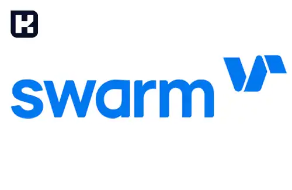
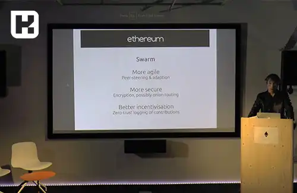

<blockquote class="faq-block">

  
آنچه در این مطلب خواهید خواند

  <ul>
    <li>پلتفرم Swarm چیست؟</li>
    <li>تیم توسعه‌دهنده Swarm</li>
    <li>نحوه عملکرد Swarm در ذخیره‌سازی و توزیع داده‌ها</li>
    <li>خدمات ارائه‌شده توسط پلتفرم Swarm</li>
    <li>نمونه پروژه‌های مرتبط با Swarm</li>
    <li>سوالات متداول</li>
    <li>جمع‌بندی</li>
  </ul>

</blockquote> 

پلتفرم Swarm یکی از راه‌حل‌های پیشرو و نوآورانه در دنیای Web3 به شمار می‌رود که به‌طور خاص برای ذخیره‌سازی و توزیع داده‌ها به صورت غیرمتمرکز طراحی شده است. این پلتفرم با هدف مقاوم‌سازی در برابر سانسور و ارائه زیرساختی بدون نیاز به مجوز، بستری ایده‌آل برای توسعه‌دهندگان برنامه‌های غیرمتمرکز (Dapps) فراهم می‌کند. در این مقاله، به بررسی ویژگی‌ها، عملکرد و خدمات Swarm می‌پردازیم و مزایا و قابلیت‌های آن را تحلیل خواهیم کرد.

## پلتفرم Swarm چیست؟

پلتفرم Swarm یک زیرساخت غیرمتمرکز برای ذخیره‌سازی، سرویس‌دهی و ارتباطات است که به‌طور خاص برای برنامه‌های غیرمتمرکز طراحی شده است. این پلتفرم که در Ethereum Web3 Stack قرار دارد، خدمات متنوعی نظیر پیام‌رسانی، پخش رسانه‌ای (موزیک و ویدیو) و میزبانی پایگاه داده را ارائه می‌دهد. شبکه Swarm بر اساس نودهای همتا به همتا (P2P) عمل می‌کند و ذخیره‌سازی داده‌ها را بدون نیاز به زیرساخت‌های متمرکز ممکن می‌سازد.

---

### تیم توسعه‌دهنده Swarm

توسعه Swarm با حمایت گوین وود (Gavin Wood)، یکی از بنیان‌گذاران شبکه اتریوم، آغاز شد. گوین وود به همراه ویتالیک بوترین و جفری ویلک (Jeffrey Wilck) تلاش کردند تا راه‌حلی برای ذخیره‌سازی و سرویس‌دهی داده‌ها در محیط Web3 ارائه دهند. این تیم با تأکید بر حفظ حریم خصوصی و مقاومت در برابر حملات، زیرساختی را ایجاد کردند که نیازهای جدید اینترنت غیرمتمرکز را برآورده سازد.

---

### نحوه عملکرد Swarm در ذخیره‌سازی و توزیع داده‌ها
پلتفرم Swarm با استفاده از فناوری‌های پیشرفته و معماری غیرمتمرکز، روشی منحصربه‌فرد برای ذخیره‌سازی و دسترسی به داده‌ها ارائه می‌دهد. مراحل کلیدی عملکرد Swarm عبارت‌اند از:

1. **تقسیم داده‌ها به Chunks:**

   فایل‌ها به قطعات کوچک‌تری به نام Chunks تقسیم می‌شوند. هر Chunk دارای یک هش (Hash) منحصربه‌فرد است که شناسه آن به شمار می‌رود.

2. **ذخیره Chunks در نودها:**

   Chunks در نودهای مختلف شبکه توزیع و ذخیره می‌شوند. این نودها می‌توانند رایانه‌های شخصی یا سرورهایی در سراسر جهان باشند.

3. **انتقال Chunks از طریق ارتباطات P2P:**

   Swarm با استفاده از ارتباطات همتا به همتا (P2P)، داده‌ها را به صورت مستقیم بین نودها منتقل می‌کند.

4. **مدیریت و جستجوی Chunks:**

   Swarm از هش‌ها برای پیدا کردن و مدیریت Chunks استفاده می‌کند. این فرآیند تضمین می‌کند که داده‌ها همیشه قابل دسترس باشند.

5. **امنیت و رمزگذاری:**

   داده‌ها با استفاده از رمزنگاری قوی محافظت می‌شوند تا دسترسی غیرمجاز و تغییرات ناخواسته به حداقل برسد.

6. **حذف نقاط شکست مرکزی:**

   ساختار غیرمتمرکز Swarm از بروز مشکلات ناشی از نقاط شکست مرکزی جلوگیری می‌کند.

---

### خدمات ارائه‌شده توسط پلتفرم Swarm
Swarm طیف گسترده‌ای از خدمات را برای توسعه‌دهندگان Dapps فراهم می‌کند که شامل موارد زیر است:

- **پخش رسانه‌ای:** امکان پخش موزیک و ویدیو به‌صورت غیرمتمرکز.
- **ذخیره‌سازی داده:** میزبانی امن و کارآمد پایگاه داده‌های مختلف.
- **پیام‌رسانی همتا به همتا:** ارسال پیام‌ها بدون نیاز به سرورهای متمرکز.
- **زیرساخت کانال‌های مقیاس‌پذیر:** مناسب برای توسعه dAppهای پیچیده و پرمصرف.

برای گسترش اکوسیستم خود، Swarm در سال 2020 برنامه‌ای به نام **Swarm Grant Waves** را راه‌اندازی کرد. این برنامه علاوه بر حمایت مالی از پروژه‌های مرتبط، راهنمایی‌های لازم را نیز به توسعه‌دهندگان ارائه می‌دهد.

---

### نمونه پروژه‌های مرتبط با Swarm

چندین پروژه کاربردی از زیرساخت Swarm برای ارائه خدمات خود استفاده می‌کنند، از جمله:

1. **Etherna:**

   یک پلتفرم ویدیویی غیرمتمرکز که برای پایداری محتوا و مقابله با سانسور طراحی شده است.

2. **Zetaseek:**

   موتور جستجوی بلاکچینی که برای سازماندهی فایل‌ها و منابع محتوای آپلود شده در شبکه Swarm استفاده می‌شود.

3. **Scaleout:**

   پلتفرمی برای ذخیره‌سازی داده‌ها با تمرکز بر حفظ حریم خصوصی و بهره‌گیری از یادگیری ماشینی.

4. **Boma:**

   ابزاری ارتباطی که امکاناتی مانند تحلیل تعامل، مدیریت محتوا و پخش صوتی و تصویری را ارائه می‌دهد.

5. **Giveth:**

   پلتفرم غیرمتمرکز جمع‌آوری کمک‌های مالی که به سازمان‌های غیرانتفاعی در مدیریت شفاف جوامع اهداکننده کمک می‌کند.

---

<blockquote class="faq-block">
    

        
پلتفرم Swarm چیست و چه کاربردی دارد؟

        Swarm یک پلتفرم غیرمتمرکز برای ذخیره‌سازی و توزیع داده‌ها است که به توسعه‌دهندگان Dapp امکان می‌دهد فایل‌ها و داده‌ها را به صورت امن و مقاوم در برابر سانسور مدیریت کنند.
    

</blockquote>

<blockquote class="faq-block">
    

        
Swarm چگونه داده‌ها را ذخیره و مدیریت می‌کند؟

        داده‌ها ابتدا به قطعات کوچک به نام Chunks تقسیم شده و سپس در نودهای مختلف شبکه توزیع می‌شوند. هر Chunk دارای یک هش منحصربه‌فرد است و دسترسی به داده‌ها از طریق شبکه P2P و مدیریت هش‌ها انجام می‌شود.
    

</blockquote>

<blockquote class="faq-block">
    

        
چه خدماتی توسط پلتفرم Swarm ارائه می‌شود؟

        خدمات Swarm شامل پخش رسانه‌ای غیرمتمرکز، ذخیره‌سازی داده‌ها، پیام‌رسانی P2P، و زیرساخت کانال‌های مقیاس‌پذیر برای توسعه Dappها می‌باشد.
    

</blockquote>

<blockquote class="faq-block">
    

        
آیا Swarm امن است؟

        بله، Swarm از رمزگذاری قوی برای حفاظت از داده‌ها استفاده می‌کند و ساختار غیرمتمرکز آن باعث حذف نقاط شکست مرکزی و افزایش امنیت داده‌ها می‌شود.
    

</blockquote>

<blockquote class="faq-block">
    

        
چه پروژه‌هایی از Swarm استفاده می‌کنند؟

        پروژه‌هایی مانند Etherna (پلتفرم ویدیویی غیرمتمرکز)، Zetaseek (موتور جستجوی بلاکچینی)، Scaleout، Boma و Giveth از زیرساخت Swarm برای ارائه خدمات خود بهره می‌برند.
    

</blockquote>

<blockquote class="faq-block">
    

        
Swarm چه تفاوتی با ذخیره‌سازی متمرکز دارد؟

        برخلاف سیستم‌های متمرکز، Swarm داده‌ها را در نودهای مختلف شبکه توزیع می‌کند، نقاط شکست مرکزی را حذف می‌کند و امکان دسترسی مقاوم و امن به داده‌ها را بدون نیاز به سرور مرکزی فراهم می‌سازد.
    

</blockquote>

<blockquote class="faq-block">
    

        
آیا توسعه‌دهندگان می‌توانند از برنامه‌های مالی و حمایتی Swarm بهره‌مند شوند؟

        بله، Swarm برنامه‌ای به نام Swarm Grant Waves دارد که حمایت مالی و راهنمایی‌های لازم برای توسعه‌دهندگان پروژه‌های مرتبط با شبکه Swarm ارائه می‌کند.
    

</blockquote>

---

### جمع‌بندی
پلتفرم Swarm با ارائه زیرساختی غیرمتمرکز و مقاوم در برابر سانسور، به‌عنوان یکی از ابزارهای کلیدی در دنیای Web3 شناخته می‌شود. این پلتفرم با ویژگی‌هایی نظیر امنیت بالا، مقیاس‌پذیری و حذف نقاط شکست مرکزی، گزینه‌ای ایده‌آل برای توسعه‌دهندگان Dapps محسوب می‌شود. با گسترش روزافزون کاربردهای Swarm در پروژه‌های مختلف، می‌توان انتظار داشت که این فناوری نقش پررنگ‌تری در آینده اینترنت غیرمتمرکز ایفا کند.