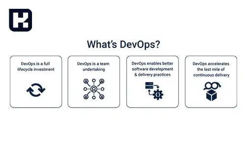

<blockquote style="background-color:#eeeefc; padding:0.5rem">

   
آنچه در این مطلب خواهید خواند:

 <ul>
  <li>مفهوم دواپس (DevOps) چیست؟</li>
  <li>مدل آبشاری (Waterfall) چیست؟</li>
  <li>فاز‌های مختلف مدل آبشاری</li>
  <li>معایب مدل آبشاری (Waterfall)</li>
  <li>مدل چابک (Agile) چیست؟</li>
  <li>ابزارها در DevOps</li>
  <li>چگونگی عملکرد مهندسین DevOps</li>
</ul>

</blockquote>

**مقدمه**

در دنیای فناوری امروزی، توسعه و اجرای نرم‌افزارها به یکی از مهم‌ترین عوامل موفقیت کسب و کارها تبدیل شده است. در این فرآیند، مفهوم دواپس (DevOps) به عنوان یک رویکرد جدید برای تسهیل همکاری بین تیم‌های توسعه و عملیات نرم‌افزار، به وجود آمده است. 
در این مقاله، به بررسی این مفهوم و اهمیت آن خواهیم پرداخت، همچنین نگاهی به مدل‌های مختلف توسعه‌ی نرم‌افزار با استفاده از دواپس خواهیم داشت. 

## مفهوم دواپس (DevOps) چیست؟

دواپس (DevOps) به معنای ترکیب دو کلمه "Development" به‌معنای توسعه و "Operations" به‌معنای عملیات است. 

این مفهوم بر ایجاد تعامل و همکاری بین اعضای تیم توسعه و عملیات تمرکز دارد. تیم عملیات معمولاً تیم IT است که مسئولیت نگه‌داری سخت‌افزار، نرم‌افزار و محیط‌های عملیاتی را بر عهده دارند. به عبارت دیگر، آنها مسئول اجرای برنامه‌ها و سیستم‌ها هستند. 

از سوی دیگر تیم توسعه، مسئول ساخت محصولات نهایی و رفع اشکالات پس از آزمون آنها است. دواپس یک ترکیب از ابزارها، روش‌ها و فلسفه‌هاست که با ترکیب و همکاری بین این دو تیم، امکان ادامه فرآیند تحویل برنامه‌ها و ارائه خدمات به کاربران نهایی را فراهم می‌کند.

## انواع مدل DevOps

### مدل آبشاری (Waterfall)

مدل آبشاری به عنوان اولین مدل معرفی‌شده در فرآیند توسعه نرم‌افزار شناخته می‌شود که به صورت فرایند خطی و متوالی عمل می‌کند. 

در این مدل، فرایند توسعه نرم‌افزار به چندین فاز مختلف تقسیم می‌شود؛ به‌طوری‌که خروجی هر فاز به عنوان ورودی برای فاز بعدی مورد استفاده قرار می‌گیرد. به همین دلیل، این مدل به نام مدل آبشاری شناخته می‌شود؛ زیرا فرایند به صورت مداوم جلو می‌رود و امکان بازگشت به مراحل قبلی وجود ندارد.

#### فاز‌های مختلف مدل آبشاری

1. الزامات (Requirements)
2. طراحی (Design)
3. اجرا (Implementation)
4. تأیید (Verification)
5. نگه‌داری (Maintenance)

#### معایب مدل آبشاری (Waterfall)

**1. دشواری ایجاد تغییرات:** در مدل آبشاری، ایجاد هرگونه تغییرات در مراحل قبلی به‌خصوص پس از شروع فاز اجرایی، با چالش‌هایی روبروست. این امر ممکن است باعث کندی در زمان و هزینه بر بودن پروژه شود.

**2. نامناسب ‌بودن برای پروژه‌های بزرگ:** مدل آبشاری ممکن است برای پروژه‌های بزرگ و پیچیده که نیازمند تغییرات مکرر و تعاملات مستمر با مشتری هستند، مناسب نباشد. این مدل به دلیل خطی بودن و عدم امکان بازگشت به مراحل قبلی، در مواجهه با پیچیدگی‌های بزرگ ناکارآمد می‌شود.

**3. احتمال بروز باگ‌های متعدد:** همکاری ناکافی بین اعضای تیم، به‌ویژه توسعه‌دهندگان و تسترها، می‌تواند منجر به بروز باگ‌های متعدد در محصول شود. عدم امکان تغییرات و به‌روزرسانی‌های مکرر نیز می‌تواند باعث باقی‌ماندن باگ‌ها در محصول شود.

**4. نامناسب‌بودن برای پروژه‌های نیازمند تغییر:** پروژه‌هایی که نیازمند تغییرات و به‌روزرسانی‌های مکرر هستند، با محدودیت‌های مدل آبشاری مواجه می‌شوند. این مدل، امکان تطابق با تغییرات متنوع مشتری را به میزان کافی فراهم نمی‌کند.

### مدل چابک (Agile) چیست؟

در مدل Agile، فرآیند توسعه نرم‌افزار به صورت چندین تکرار، مداوم انجام می‌شود. در پایان هر تکرار، یک محصول یا نرم‌افزار تحویل داده می‌شود که این فرآیند حدوداً یک تا سه هفته زمان می‌برد. در هر یک از این تکرارها، تیم‌های عملیاتی هم‌زمان در زمینه‌های زیر فعالیت می‌کنند:

- الزامات (Requirements)
- طراحی (Design)
- توسعه (Development)
- انتشار (Release)

## ابزارها در DevOps:

همانطور که در فرآیند عملکرد DevOps مشاهده کرده‌اید، برای استفاده از آن نیاز به استفاده از ابزارهای خاصی داریم که به عنوان ابزارهای DevOps شناخته می‌شوند. این ابزارها از هفت بخش زیر تشکیل شده‌اند:

•	Git

•	Maven

•	Selenium

•	Jenkins

•	Ansible

•	Nagios

## چگونگی عملکرد مهندسین DevOps

مهندس DevOps یک تخصص فناوری اطلاعات (IT) است که با تیم‌های توسعه نرم‌افزار، برنامه‌نویسان، اپراتورهای سیستم و سایر اعضای حوزه IT در ارتباط قرار می‌گیرد. برای اجرای وظایفش، مهندس دواپس باید به مهارت‌های فنی (مهارت‌های سخت) بالایی دست یابد. همچنین داشتن مهارت‌، او را در برقراری ارتباط و همکاری با تیم‌های توسعه، عملیات و تست موثرتر می‌سازد.

با استفاده از DevOps، تیم برنامه‌نویسی نیازی به صرف زمان در دیپلوی کردن پروژه بر روی سرور ندارد و می‌تواند به وظیفه اصلی خود، یعنی توسعه نرم‌افزار، بپردازد. از سوی دیگر، تیم عملیاتی مسئولیت نگهداری از سرورها و پایداری آن‌ها را برعهده دارد. 

مهندس DevOps می‌تواند کدهای توسعه داده شده توسط تیم برنامه‌نویسی را از آن‌ها دریافت و آن‌ها را بر روی سرورهای تیم عملیاتی دیپلوی کرده و آن را اجرا کند. بنابراین، او باید ترکیبی از مهارت‌های برنامه‌نویسی (از سوی تیم توسعه) و مهارت‌های کارشناسی IT (از سوی تیم عملیاتی) را داشته باشد تا به‌طور موثر واقعیت را اجرا کند.

### جمع بندی: 
دواپس به عنوان یک رویکرد جدید در توسعه و اجرای نرم‌افزارها، تلاش می‌کند تا هماهنگی و همکاری بین تیم‌های توسعه و عملیات را تسهیل کند. این مقاله به بررسی این مفهوم و اهمیت آن، همچنین مدل‌های مختلف توسعه‌ی نرم‌افزار با استفاده از دواپس پرداخته است. از مدل آبشاری تا مدل چابک، مزایا و معایب هر کدام بررسی شده‌اند. 

همچنین، ابزارهای مورد استفاده در فرآیند دواپس و عملکرد مهندسان DevOps مورد بحث قرار گرفته است. این رویکرد نه تنها به بهبود عملکرد و تسریع فرآیند توسعه نرم‌افزار کمک می‌کند، بلکه همچنین به ارائه خدمات بهتر به کاربران نهایی کمک شایانی می‌کند.