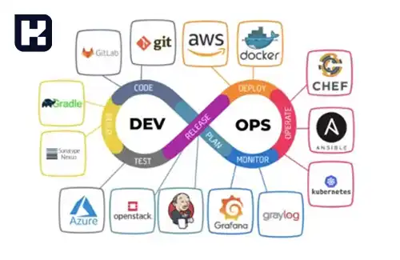

<blockquote style="background-color:#eeeefc; padding:0.5rem">

   
آنچه در این مطلب خواهید خواند:

 <ul>
    <li>دواپس (DevOps) چیست؟</li>
    <li>انواع مدل‌های توسعه نرم‌افزار</li>
    <li>نقش DevOps در توسعه نرم‌افزار</li>
    <li>ابزارهای DevOps</li>
    <li>وظایف مهندس DevOps</li>
    <li>مزایای پیاده‌سازی DevOps</li>
</ul>

</blockquote>

در دنیای مدرن کسب‌وکارها، توسعه و اجرای نرم‌افزارها به عنوان یکی از عوامل کلیدی موفقیت شناخته می‌شود. با افزایش پیچیدگی سیستم‌ها و نیاز به ارائه خدمات با کیفیت بالا و در زمان کوتاه، رویکردهای سنتی توسعه نرم‌افزار دیگر پاسخگو نیستند. در این میان، مفهوم **دواپس (DevOps)** به عنوان یک راهکار نوآورانه ظهور کرده است که همکاری بین تیم‌های توسعه و عملیات را تسهیل می‌کند. در این مقاله، به بررسی DevOps، اهمیت آن و مدل‌های مختلف توسعه نرم‌افزار خواهیم پرداخت.

## دواپس (DevOps) چیست؟

**دواپس** از ترکیب دو واژه "Development" (توسعه) و "Operations" (عملیات) شکل گرفته است. این مفهوم بر ایجاد تعامل و همکاری نزدیک بین تیم‌های توسعه نرم‌افزار و عملیات فناوری اطلاعات تمرکز دارد. 

در عمل، DevOps مجموعه‌ای از فلسفه‌ها، روش‌ها و ابزارهایی است که فرآیند توسعه، تست و تحویل نرم‌افزار را سرعت می‌بخشد و کیفیت آن را بهبود می‌دهد.

**هدف اصلی DevOps:**
- کاهش فاصله بین تیم‌های توسعه و عملیات.
- افزایش سرعت و کیفیت در ارائه محصولات نرم‌افزاری.
- بهبود هماهنگی و تعامل در کل چرخه عمر نرم‌افزار.

---

### انواع مدل‌های توسعه نرم‌افزار

#### مدل آبشاری (Waterfall)
مدل آبشاری یکی از روش‌های سنتی توسعه نرم‌افزار است که به صورت خطی و متوالی عمل می‌کند. در این مدل، فرایند توسعه به چندین فاز مجزا تقسیم می‌شود و هر فاز باید قبل از شروع مرحله بعد تکمیل شود.

**فازهای مدل آبشاری:**
1. **الزامات (Requirements):** تعریف نیازهای پروژه.
2. **طراحی (Design):** ایجاد معماری نرم‌افزار.
3. **اجرا (Implementation):** کدنویسی و پیاده‌سازی.
4. **تأیید (Verification):** تست و تأیید نرم‌افزار.
5. **نگه‌داری (Maintenance):** مدیریت و رفع اشکالات پس از تحویل.

**معایب مدل آبشاری:**
- دشواری ایجاد تغییرات در مراحل پایانی.
- ناکارآمدی برای پروژه‌های پیچیده و بزرگ.
- احتمال بروز باگ‌های متعدد به دلیل عدم همکاری هم‌زمان تیم‌ها.
- عدم انعطاف‌پذیری برای پاسخگویی به تغییرات نیازمندی‌ها.

#### مدل چابک (Agile)
مدل **چابک (Agile)** در پاسخ به محدودیت‌های مدل آبشاری توسعه یافت. در این مدل، فرآیند توسعه به صورت تکرارهای کوتاه و مداوم انجام می‌شود و در پایان هر تکرار (Sprint)، یک نسخه قابل استفاده از محصول تحویل داده می‌شود.

**ویژگی‌های مدل چابک:**
- امکان تغییر نیازمندی‌ها در طول پروژه.
- تعامل مستمر بین تیم‌ها و مشتریان.
- تحویل سریع و مداوم نسخه‌های بهبود یافته.

---

### نقش DevOps در توسعه نرم‌افزار

DevOps با ترکیب بهترین ویژگی‌های مدل‌های سنتی و چابک، رویکردی جامع‌تر ارائه می‌دهد. این رویکرد با استفاده از ابزارها و فرآیندهای خودکار، چرخه توسعه و انتشار نرم‌افزار را بهینه‌سازی می‌کند.

**ویژگی‌های کلیدی DevOps:**
1. **خودکارسازی (Automation):** استفاده از ابزارهایی برای خودکارسازی وظایفی مانند تست، دیپلوی و مانیتورینگ.
2. **مشارکت تیمی:** تقویت همکاری و تعامل بین تیم‌های مختلف.
3. **مانیتورینگ مداوم:** نظارت بر عملکرد نرم‌افزار و سرورها برای اطمینان از کیفیت خدمات.
4. **تحویل مداوم (Continuous Delivery):** امکان انتشار سریع به‌روزرسانی‌ها.

---

### ابزارهای DevOps

برای پیاده‌سازی موفق DevOps، استفاده از ابزارهای مناسب ضروری است. در زیر به برخی از مهم‌ترین ابزارهای DevOps اشاره می‌کنیم:

- **Git:** مدیریت نسخه‌سازی کدها و همکاری تیمی.
- **Jenkins:** خودکارسازی فرآیندهای CI/CD (یکپارچه‌سازی و تحویل مداوم).
- **Ansible:** مدیریت پیکربندی و استقرار نرم‌افزار.
- **Docker:** ایجاد و مدیریت کانتینرها برای اجرای برنامه‌ها.
- **Kubernetes:** ارکستراسیون کانتینرها برای مدیریت برنامه‌های پیچیده.
- **Nagios:** نظارت بر عملکرد سیستم‌ها و شناسایی مشکلات.

---

### وظایف مهندس DevOps

مهندس DevOps فردی است که با ترکیب مهارت‌های برنامه‌نویسی و فناوری اطلاعات، مسئولیت خودکارسازی فرآیندها و بهینه‌سازی همکاری تیم‌ها را بر عهده دارد. وظایف اصلی او شامل موارد زیر است:
- ایجاد و مدیریت سیستم‌های CI/CD.
- نظارت بر عملکرد سیستم‌ها و رفع مشکلات.
- خودکارسازی فرآیندهای تست و استقرار نرم‌افزار.
- ایجاد زیرساخت‌های ابری برای اجرای برنامه‌ها.

---

### مزایای پیاده‌سازی DevOps

1. **افزایش سرعت توسعه:** با خودکارسازی فرآیندها، زمان تحویل پروژه‌ها کاهش می‌یابد.
2. **بهبود کیفیت نرم‌افزار:** تست‌های مداوم و خودکار، احتمال بروز خطاها را کاهش می‌دهد.
3. **انعطاف‌پذیری بالا:** DevOps امکان پاسخگویی سریع به تغییرات و نیازهای مشتریان را فراهم می‌کند.
4. **کاهش هزینه‌ها:** با بهبود هماهنگی تیم‌ها و استفاده از ابزارهای خودکار، هزینه‌های کلی پروژه کاهش می‌یابد.

---

### جمع‌بندی

**DevOps** رویکردی انقلابی در توسعه نرم‌افزار است که با تقویت همکاری بین تیم‌های توسعه و عملیات، فرآیند تحویل و مدیریت نرم‌افزار را بهینه‌سازی می‌کند. برخلاف مدل‌های سنتی مانند آبشاری، DevOps با تأکید بر خودکارسازی، انعطاف‌پذیری و سرعت بالا، به نیازهای پروژه‌های مدرن پاسخ می‌دهد.

اگر به دنبال بهبود کیفیت، کاهش زمان تحویل و افزایش کارایی تیم‌های خود هستید، حالا بهترین زمان برای پیاده‌سازی DevOps است. با استفاده از ابزارهایی مانند Git ،Jenkins و Docker و با بهره‌گیری از مهارت‌های یک مهندس DevOps، می‌توانید پروژه‌های خود را به سطح جدیدی از کارایی و موفقیت برسانید.