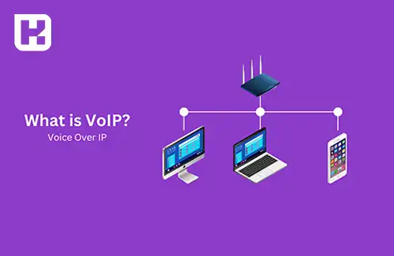
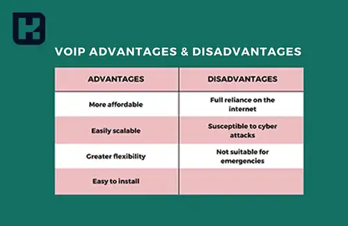

<blockquote style="background-color:#eeeefc; padding:0.5rem">

  
آنچه در این مطلب خواهید خواند

  <ul>
    <li>VoIP چیست و چگونه کار می‌کند؟</li>
    <li>تعریف دقیق عملکرد VoIP</li>
    <li>انواع سیستم‌های VoIP</li>
    <li>مزایا و معایب VoIP</li>
    <li>تلفن VoIP چیست؟</li>
    <li>انواع تلفن ویپ</li>
    <li>مراحل راه‌اندازی تلفن ویپ</li>
    <li>امکانات کلیدی تلفن‌های VoIP</li>
    <li>مرکز تلفن VoIP (IP-PBX)</li>
    <li>نرم‌افزارهای مرکز تماس</li>
    <li>تلفن اینترنتی VoIP</li>
    <li>مقایسه گوشی‌های VoIP ایرانی و خارجی</li>
    <li>دلایل محبوبیت VoIP</li>
    <li>سوالات متداول</li>
    <li>جمع‌بندی</li>
  </ul>

</blockquote>

فناوری VoIP (Voice over Internet Protocol) یکی از تحولات بزرگ در حوزه ارتباطات است که ارتباط صوتی و چندرسانه‌ای را از طریق اینترنت ممکن ساخته است. این مقاله‌ اطلاعات جامعی در این خصوص ارائه می‌دهد.

## VoIP چیست و چگونه کار می‌کند؟

فناوری VoIP یا «انتقال صوت از طریق پروتکل اینترنت» یکی از مهم‌ترین تحولات در حوزه ارتباطات محسوب می‌شود که امکان برقراری تماس‌های صوتی و چندرسانه‌ای را از طریق اینترنت فراهم می‌کند. در این روش، برخلاف تلفن‌های سنتی که وابسته به خطوط آنالوگ هستند، صدای کاربر به داده دیجیتال تبدیل شده و از طریق شبکه‌های IP منتقل می‌شود.

این فناوری پایه‌گذار تحول در ساختار تلفن‌های ثابت، مراکز تماس و راهکارهای ارتباطی شرکتی بوده و در سال‌های اخیر هم در سطح سازمانی و هم خانگی مورد استقبال قرار گرفته است.

---

### تعریف دقیق عملکرد VoIP
سیستم VoIP صدای آنالوگ را از طریق یک میکروفن یا تلفن دریافت کرده و آن را به داده دیجیتال تبدیل می‌کند. سپس این داده‌ها توسط پروتکل‌هایی مانند SIP یا IAX به مرکز تماس یا کاربر مقصد ارسال می‌شوند. در مقصد نیز این داده‌ها مجدداً به صدا تبدیل شده و تماس برقرار می‌شود. برای کاهش حجم مصرفی، از کدک‌هایی مانند G.711 یا G.729 استفاده می‌شود.

---

### انواع سیستم‌های VoIP
1. **Integrated Access:**
   - ترکیب فناوری‌های VoIP با سیستم‌های تلفنی سنتی.
   - مناسب برای کسب‌وکارهایی که قصد دارند زیرساخت‌های قدیمی خود را حفظ کنند.
2. **SIP Trunks:**
   - انتقال داده‌های صوتی و تصویری از طریق یک شبکه داده واحد.
   - مناسب برای کسب‌وکارهایی که نیازمند ارتباطات انعطاف‌پذیر و یکپارچه هستند.
3. **Hosted IP PBX:**
   - میزبانی سیستم تلفن در فضای ابری توسط ارائه‌دهندگان خدمات.
   - مناسب برای کسب‌وکارهای کوچک تا متوسط که خواهان مدیریت ساده‌تر و هزینه کمتر هستند.
4. **PBX مدیریت‌شده:**
   - سخت‌افزار در محل کسب‌وکار نگهداری می‌شود، اما مدیریت آن به ارائه‌دهنده خدمات واگذار می‌گردد.

---

### مزایا و معایب VoIP

#### مزایای VoIP:

- حذف هزینه‌های زیرساخت سنتی تلفن
- امکان جابجایی و استفاده در هر مکان با اینترنت
- کیفیت تماس بالا (با اینترنت مناسب)
- ویژگی‌های پیشرفته مانند انتقال تماس، ضبط، صف تماس، IVR و تماس تصویری
- امکان ارتباط با نرم‌افزارهای CRM و ERP

#### معایب VoIP:

- وابسته به اینترنت پرسرعت و پایدار (حداقل ۱۰۰ کیلوبیت بر ثانیه برای هر تماس)
- در صورت قطعی برق یا اینترنت، تماس قطع می‌شود
- دسترسی محدود به خدمات اضطراری مگر با تنظیمات خاص
- نیاز به پیکربندی شبکه و امنیت

---

### تلفن VoIP چیست؟

تلفن VoIP یا همان تلفن مبتنی بر IP دستگاهی است که تماس‌های صوتی را از طریق اینترنت برقرار می‌کند. این تلفن‌ها به‌جای اتصال به خطوط مخابراتی سنتی، از کابل شبکه یا Wi-Fi برای اتصال به مرکز تماس استفاده می‌کنند.

این گوشی‌ها می‌توانند سخت‌افزاری باشند (شبیه تلفن‌های رومیزی اما با پورت شبکه) یا نرم‌افزاری که روی موبایل یا کامپیوتر نصب می‌شوند.

---

### انواع تلفن ویپ

- تلفن سخت‌افزاری (IP Phone): گوشی رومیزی با پورت شبکه LAN
- تلفن نرم‌افزاری (Softphone): مانند Zoiper، MicroSIP، Linphone
- تلفن بی‌سیم (Wi-Fi یا DECT): مناسب برای محیط‌هایی با تحرک بالا مانند بیمارستان، انبار و شرکت‌های بزرگ

---

### مراحل راه‌اندازی تلفن ویپ
برای راه‌اندازی سیستم VoIP، به اجزای زیر نیاز دارید:

- مرکز تلفن IP-PBX: مانند Asterisk، FreePBX، 3CX، Issabel
- تعریف داخلی (Extension): برای هر کاربر
- نصب گوشی VoIP یا نرم‌افزار Softphone
- تنظیمات شبکه، NAT و باز کردن پورت‌ها (SIP/RTP)

bash
Copy
Edit
/etc/asterisk/sip.conf
/etc/asterisk/extensions.conf

### امکانات کلیدی تلفن‌های VoIP

- انتقال تماس (Call Transfer)
- صف تماس (Call Queue)
- پاسخ‌گوی خودکار (IVR)
- ضبط مکالمات
- تماس تصویری و کنفرانس
- فکس اینترنتی (Fax over IP)
- مانیتورینگ و گزارش‌گیری پیشرفته
- ارتباط با CRM مثل Zoho یا Odoo

### مرکز تلفن VoIP (IP-PBX)
مرکز تلفن ویپ، نقش مغز سیستم را دارد. مدیریت تماس‌ها، تنظیمات داخلی، صف‌ها و گزارش‌گیری توسط آن انجام می‌شود. این مراکز می‌توانند:

- نرم‌افزاری: Asterisk، FreePBX، 3CX، Issabel
- سخت‌افزاری: Yeastar، Cisco، Grandstream

معمولاً روی سرور لینوکسی نصب می‌شوند و قابلیت تنظیمات پیشرفته دارند.

### نرم‌افزارهای مرکز تماس

- Asterisk: رایگان و متن‌باز، با قابلیت سفارشی‌سازی بالا
- FreePBX: رابط گرافیکی برای مدیریت Asterisk
- 3CX: محیط گرافیکی کامل با ویژگی‌های گسترده
- Issabel / Elastix: دارای ماژول‌های CRM، گزارش‌گیری و Helpdesk
- Call Center Studio: راهکار ابری مخصوص مراکز تماس با قابلیت مقیاس‌پذیری بالا

### تلفن اینترنتی VoIP
این نوع تلفن‌ها مستقیماً به مودم یا روتر متصل می‌شوند و نیازی به کابل‌کشی مخابراتی ندارند. مناسب برای دفاتر خانگی و کسب‌وکارهای کوچک (SOHO) هستند.

---

### مقایسه گوشی‌های VoIP ایرانی و خارجی

| ویژگی                  | ویپ ایرانی          | ویپ خارجی                     |
|------------------------|---------------------|-------------------------------|
| قیمت                   | اقتصادی‌تر          | بالاتر (دلاری)               |
| پشتیبانی فارسی         | دارد                | ندارد                        |
| کیفیت تماس             | متوسط تا بالا       | بالا                          |
| به‌روزرسانی امنیتی     | محدودتر             | منظم و گسترده                |
| تطابق با بازار ایران   | بالا                | نیاز به سفارشی‌سازی بیشتر   |

---

### دلایل محبوبیت VoIP
- کاهش هزینه‌ها و استفاده از قابلیت‌های پیشرفته، این فناوری را به گزینه‌ای مناسب برای کسب‌وکارها و کاربران خانگی تبدیل کرده است.
- با امکاناتی مانند چت تصویری، صوتی و گروهی، نیازهای مختلف ارتباطی برآورده می‌شود.
- انعطاف‌پذیری بالای سیستم، آن را به راه‌حلی ایده‌آل برای محیط‌های کاری مدرن تبدیل کرده است.

---

### سوالات متداول

#### آیا VoIP جایگزین مناسبی برای تلفن‌های سنتی است؟
بله، VoIP با کاهش هزینه‌ها، امکانات پیشرفته و کیفیت تماس بهتر، در بسیاری از موارد جایگزین مناسبی برای خطوط تلفن سنتی است، به‌ویژه در کسب‌وکارها و دفاتر بزرگ و سازمانی.

#### برای استفاده از VoIP به چه نوع اینترنتی نیاز است؟
اتصال اینترنت پرسرعت و پایدار ضروری است. به‌طور معمول برای هر تماس، حداقل پهنای باند 100 کیلوبیت بر ثانیه پیشنهاد می‌شود، ولی برای کیفیت بهتر، پهنای باند بیشتر توصیه می گردد.

#### آیا با VoIP می‌توان تماس اضطراری (مانند ۱۱۰ یا ۱۱۵) گرفت؟
در بسیاری از سیستم‌های VoIP، دسترسی مستقیم به خدمات اضطراری مانند تلفن‌های ثابت سنتی وجود ندارد، مگر اینکه تنظیمات خاصی روی مرکز تلفن انجام شده باشد. این موضوع باید هنگام پیاده‌سازی سیستم در نظر گرفته شود.

#### آیا VoIP در زمان قطع برق کار می‌کند؟
خیر، چون VoIP وابسته به تجهیزات شبکه و اینترنت است، در صورت قطع برق یا اختلال در اینترنت، تماس‌ها نیز قطع می‌شوند. برای جلوگیری از این مشکل می‌توان از UPS یا اینترنت پشتیبان استفاده کرد.

#### تفاوت SIP Trunk با Hosted PBX در چیست؟
SIP Trunk اتصال خطوط داخلی به اینترنت از طریق یک مسیر مشخص است و بیشتر برای سازمان‌های بزرگ کاربرد دارد. اما Hosted PBX سیستمی است که به‌طور کامل در فضای ابری میزبانی شده و مناسب کسب‌وکارهای کوچک تا متوسط است که نیازی به نگهداری تجهیزات ندارند.

#### آیا VoIP برای کاربران خانگی هم مناسب است؟
بله، مخصوصاً برای کاربرانی که تماس‌های بین‌المللی دارند یا به دنبال تماس‌های ارزان و باکیفیت هستند. نرم‌افزارهای VoIP یا تلفن‌های اینترنتی به‌راحتی قابل استفاده در خانه هستند.

#### امنیت در تماس‌های VoIP چگونه تأمین می‌شود؟
با استفاده از رمزنگاری (مانند SRTP یا TLS) می‌توان تماس‌های VoIP را ایمن کرد. همچنین استفاده از فایروال، VPN و احراز هویت قوی از جمله راهکارهای امنیتی رایج است.

#### آیا سیستم‌های VoIP از تماس تصویری پشتیبانی می‌کنند؟
بله، بسیاری از سیستم‌های VoIP و نرم‌افزارهای مرتبط از تماس‌های تصویری، ویدیویی کنفرانس و چت گروهی نیز پشتیبانی می‌کنند.

#### هزینه راه‌اندازی VoIP چقدر است؟
هزینه‌ها بسته به نوع سیستم (Hosted یا Local)، تعداد کاربران، نوع تجهیزات و نرم‌افزارهای انتخابی متفاوت است، ولی در مقایسه با تلفن‌های سنتی بسیار مقرون‌به‌صرفه‌تر است.

---

### جمع‌بندی

فناوری VoIP به دلیل **کاهش هزینه‌ها، قابلیت‌های پیشرفته و انعطاف‌پذیری بالا**، انتخابی هوشمندانه برای کسب‌وکارها و افراد است. این سیستم با بهره‌گیری از اینترنت، تحولی در ارتباطات ایجاد کرده و امکاناتی فراتر از خطوط تلفن سنتی ارائه می‌دهد. با در نظر گرفتن نوع نیازها و بودجه، کاربران می‌توانند یکی از انواع VoIP را برای بهبود کارایی ارتباطات خود انتخاب کنند.